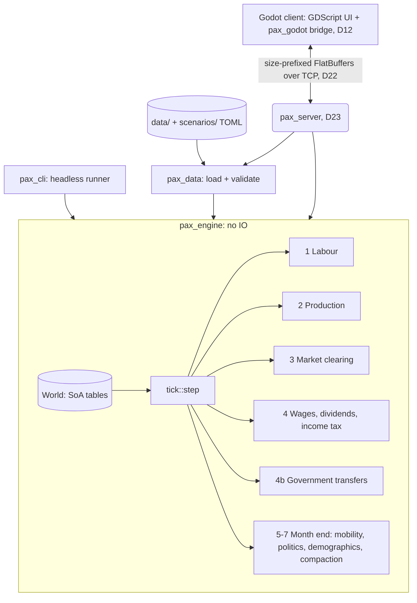
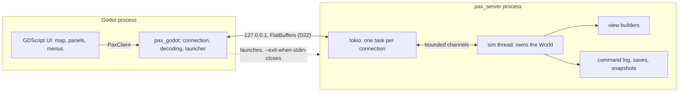
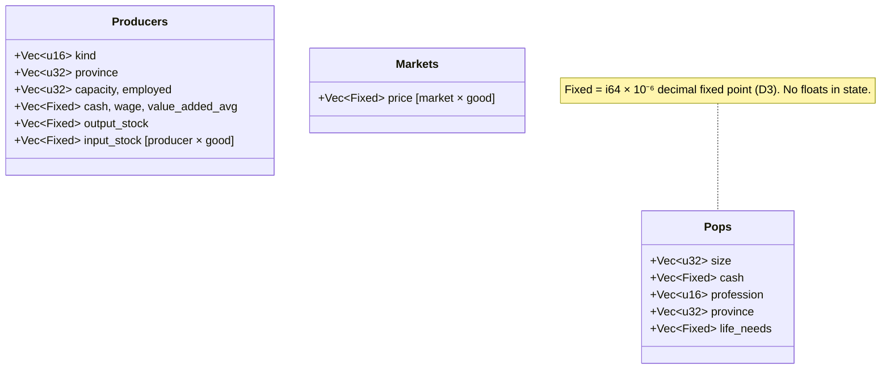

# System Architecture Overview

This document describes the high-level software architecture of the simulation engine. The binding decisions it summarises are in [DECISIONS.md](DECISIONS.md).

## 🏗️ High-Level Engine Architecture

## 🖥️ Processes and threads

- **Single player:** the client launches `pax_server` on a free local port and connects (NETWORK_PROTOCOL §6). The server stops when its player leaves.
- **Several players (M4):** the same server with `--players N`. Each session is a row in the sim thread's session table, with its own subscription, flow-control window and nation; the clock and the game are shared (M4-1, D24).
- **The sim thread** owns the `World`. It handles requests in arrival order, ticks at the chosen speed (rayon inside the tick), and builds each day's views once for every session. There are no locks around world state.
- **Network tasks** only frame, verify and decode. A full outbound queue closes its connection instead of growing memory.
- **The client** never simulates. The bridge does everything about the protocol: decoding, acknowledgements, keep-alive and argument checks. GDScript only draws.

## 🧱 Crates and boundaries

| Crate | Role | May depend on |
|---|---|---|
| `pax_engine` | state and systems, no IO | nothing in the workspace |
| `pax_data` | TOML loading and validation, saves, snapshots | engine, `pax_content`, `pax_map` |
| `pax_cli` | headless runner | engine, data |
| `pax_server` | the authoritative server, the only crate seeing engine and wire types | engine, data, protocol |
| `pax_protocol` | generated FlatBuffers code and framing | nothing in the workspace |
| `pax_godot` | the client's bridge (D12) | protocol, plus the side-neutral crates |
| `pax_content`, `pax_map` | side-neutral: the content-hash scheme and the province-map reader, shared by both sides | nothing with engine or wire types |

CI's crate-boundary step enforces these rules (dev dependencies included, for the client side).

## 🔄 The Game Loop

One tick is one day. Commands are applied first, in order (D21). Then systems run in a fixed order (D4). The order is part of the contract, because changing it changes results.

| # | System | Cadence | Module |
|---|--------|---------|--------|
| 1 | **Labour:** match producers' capacity to POPs of the worker profession in the same province | daily | `systems/labor.rs` |
| 2 | **Production:** Leontief recipes, limited by labour, inputs and inventory target | daily | `systems/production.rs` |
| 3 | **Market:** input orders and sell offers → POP aggregation (map) → price discovery (reduce) → settlement | daily | `systems/market.rs` |
| 4 | **Firms:** update value added, adjust sticky wages, pay wages and dividends, withhold income tax | daily | `systems/firms.rs` |
| 4b | **Government:** transfers from treasuries to POPs | daily | `systems/government.rs` |
| 5 | **Labour mobility:** unemployed workers move to vacancies in their province (D18), then migrate to other provinces of their market (D20), then to another profession's vacancies elsewhere in their market (D25) | month end | `systems/mobility.rs` |
| 6 | **Politics:** militancy (D19) | month end | `systems/politics.rs` |
| 7 | **Demographics:** births/deaths from life-needs satisfaction, then POP row compaction (D7) | month end | `systems/demographics.rs`, `World::compact_pops` |

Consumption, production and pricing all run daily: an economy where buyers appear only once a week cannot clear daily markets. Slow structural changes (mobility, demographics, politics) are batched.

After every tick, `step` asserts that total money is unchanged (D5).

## 🧩 Data-Oriented Design

The engine uses a hand-rolled Struct-of-Arrays layout rather than an ECS framework (D8). Each table is a set of equally long `Vec` columns, and an entity is a row index.

A wage pass touches only `cash` and `size`, so it streams through two contiguous arrays. Row order also fixes the iteration order, which determinism relies on.

## ⚡ Parallelism

POP passes use rayon's `fold`/`reduce`: each worker accumulates into its own buffer, and buffers are summed afterwards (Map-Reduce, AGENTS.md §3). Only integer (`Fixed`) sums are reduced, which are associative, so results are bit-identical at any thread count. A test checks 1, 2, 3 and 8 threads.

Markets discover prices independently and in parallel.

## 🧪 Strict Decoupling & Testability

`pax_engine` has no IO and no knowledge of files, sockets or rendering. Everything runs headlessly:

- `pax_cli run` prints daily market reports;
- `pax_cli verify` replays a scenario against pinned state hashes (D11);
- `pax_cli replay` replays a server save, verifying its checkpoints, and prints the final `state_hash` (D23, M3-9);
- `pax_cli bench` measures tick time at scale (D13).

Developers iterate on economic mechanics without a client.

## 🐳 Infrastructure & Environment

- **Development** happens in WSL/Linux with the toolchain pinned in `rust-toolchain.toml`.
- **CI** (`.github/workflows/ci.yml`) runs:
  - format, clippy and rustdoc, and the crate-boundary check;
  - the tests, in debug and release;
  - the determinism gate, on Linux at 1 and 4 threads, and on Windows and macOS;
  - the session replay through `pax_cli replay`, on all three platforms;
  - on PRs: the benchmark regression gate, the headless client smoke test (Godot), and 60 s of fuzzing.
- **Docker** is for dedicated multiplayer servers (M4-8): `docker compose up` runs `pax_server` with saves and its TLS certificate on volumes (`Dockerfile`, `docker/entrypoint.sh`). Single player (M3) runs `pax_server` directly, launched by the client, and the headless tools don't need a container.
