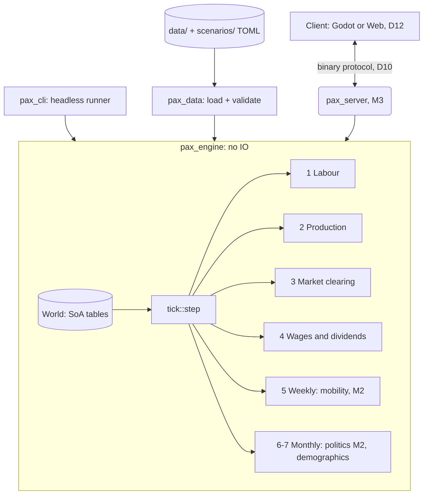
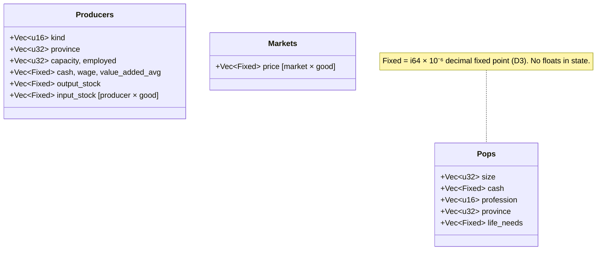

# System Architecture Overview

This document describes the high-level software architecture of the simulation engine. The binding decisions it summarises are in [DECISIONS.md](DECISIONS.md).

## 🏗️ High-Level Engine Architecture

## 🔄 The Game Loop

One tick is one day. Systems run in a fixed order (D4). The order is part of the contract, because changing it changes results.

| # | System | Cadence | Module |
|---|--------|---------|--------|
| 1 | **Labour:** match producers' capacity to POPs of the worker profession in the same province | daily | `systems/labor.rs` |
| 2 | **Production:** Leontief recipes, limited by labour, inputs and inventory target | daily | `systems/production.rs` |
| 3 | **Market:** input orders and sell offers → POP aggregation (map) → price discovery (reduce) → settlement | daily | `systems/market.rs` |
| 4 | **Firms:** update value added, adjust sticky wages, pay wages and dividends, withhold income tax | daily | `systems/firms.rs` |
| 4b | **Government:** transfers from treasuries to POPs | daily | `systems/government.rs` |
| 5 | **Labour mobility:** unemployed workers move to vacancies in their province (D18), then migrate to other provinces of their market (D20) | month end | `systems/mobility.rs` |
| 6 | **Politics:** militancy (D19) | month end | `systems/politics.rs` |
| 7 | **Demographics:** births/deaths from life-needs satisfaction, then POP row compaction (D7) | month end | `systems/demographics.rs`, `World::compact_pops` |

Consumption, production and pricing all run daily: an economy where buyers appear only once a week cannot clear daily markets. Slow structural changes (mobility, demographics, politics) are batched.

After every tick, `step` asserts that total money is unchanged (D5).

## 🧩 Data-Oriented Design

The engine uses a hand-rolled Struct-of-Arrays layout rather than an ECS framework (D8). Each table is a set of equally long `Vec` columns, and an entity is a row index.

A wage pass touches only `cash` and `size`, so it streams through two contiguous arrays. Row order also fixes the iteration order, which determinism relies on.

## ⚡ Parallelism

POP passes use rayon's `fold`/`reduce`: each worker accumulates into its own buffer, and buffers are summed afterwards (Map-Reduce, AGENTS.md §3). Only integer (`Fixed`) sums are reduced, which are associative, so results are bit-identical at any thread count. A test checks 1, 2, 3 and 8 threads.

Markets discover prices independently and in parallel.

## 🧪 Strict Decoupling & Testability

`pax_engine` has no IO and no knowledge of files, sockets or rendering. Everything runs headlessly:

- `pax_cli run` prints daily market reports;
- `pax_cli verify` replays a scenario against pinned state hashes (D11);
- `pax_cli bench` measures tick time at scale (D13).

Developers iterate on economic mechanics without a client.

## 🐳 Infrastructure & Environment

- **Development** happens in WSL/Linux with the toolchain pinned in `rust-toolchain.toml`.
- **CI** (`.github/workflows/ci.yml`) runs format, clippy, tests and the determinism gate. The gate runs on Linux at 1 and 4 threads, and on Windows and macOS to confirm cross-platform determinism.
- **Docker** is reserved for deploying `pax_server` from M3 (service isolation, identical server builds). The headless tools of M1/M2 don't need it.
