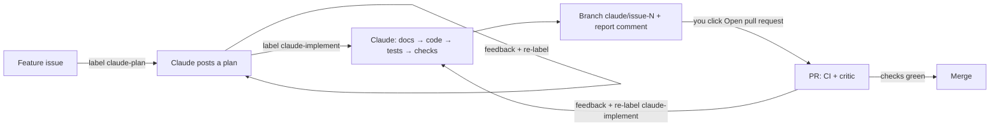

# Claude Feature Pipeline

`.github/workflows/claude-feature.yml` turns a GitHub issue into a plan, then into documentation and code on a branch, ready for a pull request. Humans approve at three points: the plan, the PR, and the merge.



## One-time setup

Done once by an admin, in addition to [REPO_SETUP.md](REPO_SETUP.md):

1. Merge the PR that adds this workflow. The Claude action only runs workflow files that are identical to the version on `main`.
2. Create the two labels:

   ```bash
   gh label create claude-plan --color 0E8A16 --description "Claude drafts an implementation plan"
   gh label create claude-implement --color 1D76DB --description "Claude implements the approved plan"
   ```

3. Nothing else: the workflow uses the existing `CLAUDE_CODE_OAUTH_TOKEN` secret and the Claude GitHub App.

## Using it

### 1. Write the request
**New issue → Feature request.** Fill in the summary and acceptance criteria. Concrete acceptance criteria produce concrete tests.

> Don't write `@claude` in the issue: that triggers the separate `claude.yml` assistant instead.

### 2. Get a plan
Add the label **`claude-plan`**. In 2–5 minutes Claude comments a plan with these sections:
- summary;
- fit with `DECISIONS.md`, including the full text of any proposed new `D#` entry;
- documentation changes;
- implementation steps;
- tests;
- golden-hash impact;
- risks and open questions;
- out of scope.

The label removes itself when the run finishes.

**Review the plan as you would a design doc.** In particular:
- Answer every open question in a comment.
- Check that any proposed decision agrees with the existing ones.
- Make sure any change to golden hashes is intended.

### 3. Revise (optional, repeatable)
Reply with feedback, then add `claude-plan` again. Claude revises the previous plan to address the feedback and posts a new one.

### 4. Build it
Add the label **`claude-implement`**. Claude works through the latest plan:
1. **Docs first:** `DECISIONS.md` and the affected system docs describe the intended behaviour.
2. **Code** following `AGENTS.md`: `Fixed` everywhere, conserved money, no IO in the engine, and rustdoc citing `D#`.
3. **Tests:** unit, conservation and determinism.
4. **Checks:** fmt, clippy, tests and the determinism gate. Golden hashes are re-recorded only if the plan intends results to change.

It pushes the branch `claude/issue-<n>` and comments with:
- a pass/fail table of the checks;
- the implementation summary;
- an **👉 Open pull request** link.

This takes 10–60 minutes depending on size.

### 5. Open the PR
Click **Open pull request**; title and body are pre-filled, and the body says `Closes #<n>`. The PR is opened by *you*, which is why CI and the critic run on it. (PRs opened by the workflow's own token would never start them.)

Review it like any PR. If it's over 200 lines, the critic reviews it too, and CRITICAL findings block the merge.

### 6. Iterate
To change the implementation, comment on the **issue** and re-add `claude-implement`. Claude continues on the same branch, and the open PR updates.

The workflow's pushes don't start new CI runs on the PR (the same token limitation). After an iteration, start the checks by pushing any commit yourself, or by closing and reopening the PR.

## Guard rails

| Risk | Protection |
|---|---|
| Strangers triggering paid runs | Only users with triage/write access can add labels, and the Claude action also checks the actor has write access |
| Prompt injection via issue text | Issue text is passed as a data file, never interpolated into the prompt or shell. The prompt puts `AGENTS.md`/`DECISIONS.md` above it. The label is a human checkpoint: only label issues you have read |
| Implementing an unapproved plan | `claude-implement` only uses plans posted by the pipeline itself (author `github-actions` plus a marker). User comments cannot pose as a plan |
| Weakening its own review | Changes under `.github/` and `.claude/` are never committed, even if made |
| Touching `main` | The workflow pushes only `claude/issue-<n>`. `main` remains protected by the ruleset |
| Bad code reaching `main` | You open the PR, then CI, the critic, and your merge decision |

## Cost and limits

- Runs use the `CLAUDE_CODE_OAUTH_TOKEN` subscription with `claude-opus-5-5`: up to 40 turns to plan and 150 to implement.
- Large features can hit subscription usage limits. If so, the "Explain Claude failure" step says so; re-run later.
- To change model or budget, edit `CLAUDE_MODEL` and `--max-turns` in the workflow.
- Keep features small. "Add income tax with treasury" works better than "implement M2". Split milestones into several issues.
