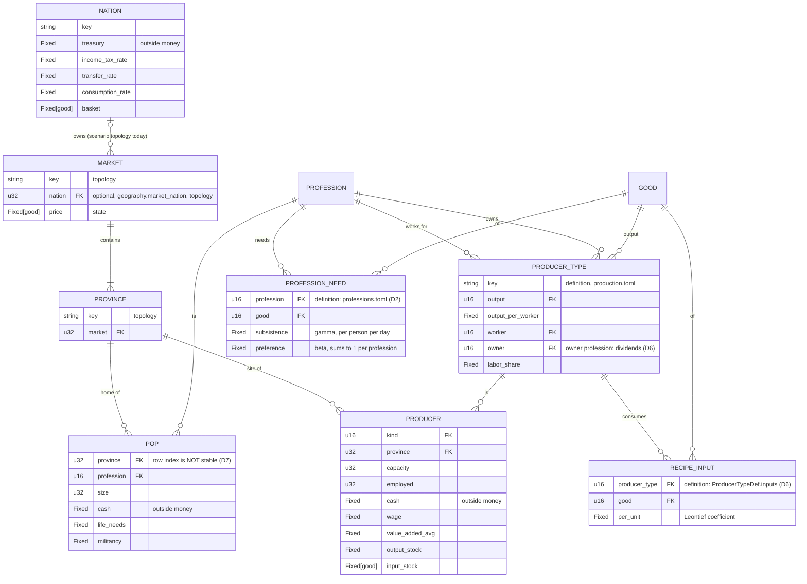
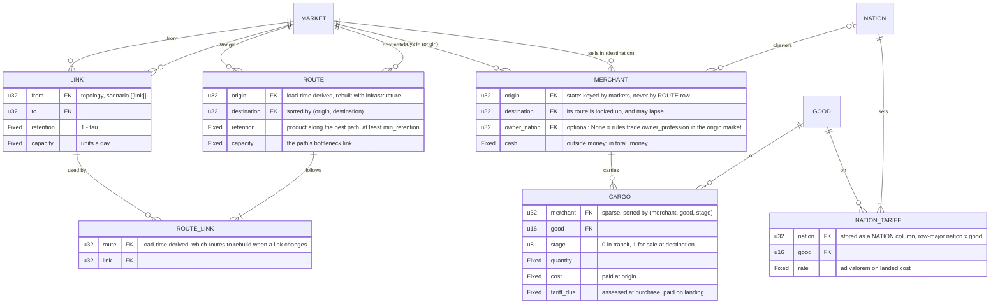
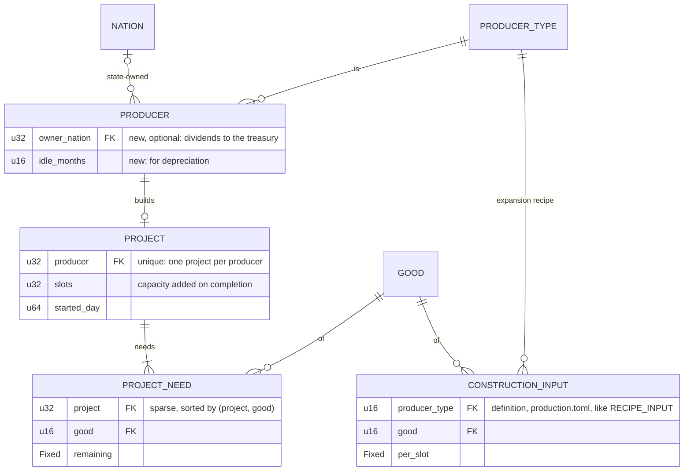
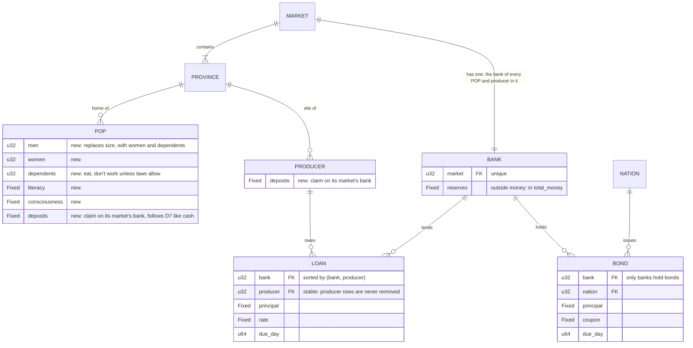
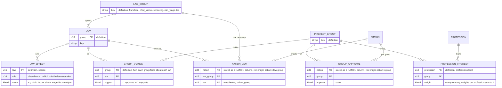
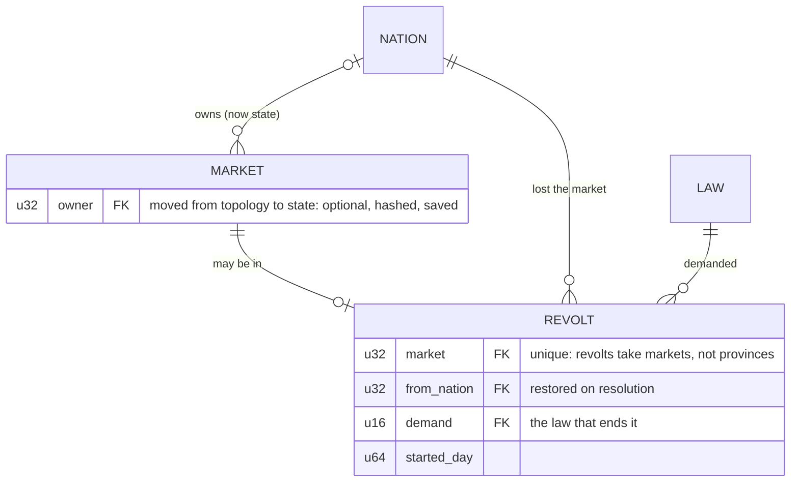
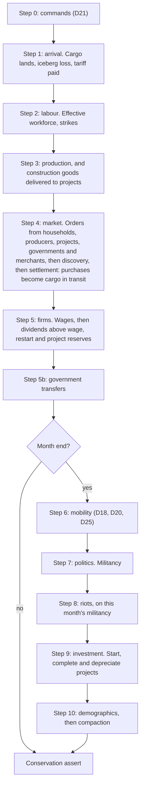
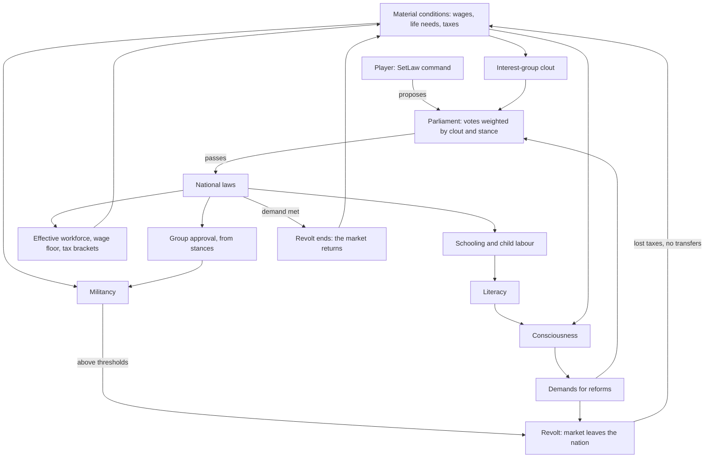

# Data Model for Milestones 5 and 6

> [!NOTE]
> **Status: proposed, for review with the Milestone 5 and Milestone 6 drafts** (`docs/MILESTONE_5.md`, `docs/MILESTONE_6.md`, not yet on `main`) and the decisions they propose, which they number 17 and 27 to 32. This document calls those **P17** and **P27–P32** until they are entries in DECISIONS.md. Nothing here is binding. Once accepted, each table moves into [BACKEND_SCHEMA.md](BACKEND_SCHEMA.md) and each rule into the decision it amends, and this document is deleted.

The milestone drafts describe their new tables in prose. Drawing them as entity–relationship diagrams shows nine defects: storage that grows as the matrix P17 avoids, references to unstable POP rows, money holders outside the conservation check, and a revolt rule that would make every later save refuse to load. This document gives the corrected model, the tick order and politics loop as connected diagrams, and the amendments each proposed decision needs.

## How to read the diagrams

Every entity is a Struct-of-Arrays table (D8): an entity is a row index, an attribute is a column, and a relationship is a column holding another table's row index (`FK`). `Fixed[good]` is a row-major per-good column, `rows × goods` long. An attribute marked *optional* is `Option<u32>`. A relation between two tables that is stored as a row-major column (a nation's tariff per good, its law per law group) is drawn as an association entity with both keys, and its comment says how it is stored.

Each table is one of four kinds, which decide whether it is hashed and saved:

| Kind | Lives in | In `state_hash` and the snapshot | Examples |
|---|---|---|---|
| **Definition** | `Defs`, from `data/` | No; the content hash covers it | goods, professions, producer types, laws |
| **Topology** | `Geography`, from the scenario | Checked equal to the scenario on load (`snapshot.rs`) | provinces, markets, links |
| **Load-time derived** | built at load, like the friction structure AGENTS.md §5 requires | No; rebuilt deterministically | routes |
| **State** | `World` | Yes | POPs, producers, merchants, claims |

## Rules the model follows

These come from the defects the drafts' prose hides. Each is a candidate for the decision that introduces the table.

1. **Per-good columns only on tables bounded by the world's size.** Tables that grow with routes or projects keep goods in a sparse child table (`CARGO`, `PROJECT_NEED`), sorted by key so iteration order is deterministic (D3). Dense `transit`, `stock` and `cost_basis` columns on merchants would cost 60,000 routes × 50 goods × 3 × 8 bytes = **72 MB** at 3,000 markets with 20 routes each. That is the dense matrix P17 sets out to avoid, hashed every day.
2. **Nothing in state references a row that can move.** POP rows move, and so do load-time derived rows such as routes, which are rebuilt when infrastructure changes.
   - **No POP row.** Compaction reorders and merges POP rows every month (D7). A POP's financial position is a POP column that follows D7's split, merge and heir rules. Every claim points at a stable table: banks, nations, producers.
   - **No route row.** A merchant is keyed by its two markets and looks its route up, so a rebuild can't leave it pointing at another route.
3. **Producer rows are never removed or reordered**, because loans and projects reference them. A closed producer has capacity 0.
4. **No new holder of outside money unless it must hold cash.** Every holder is in `World::total_money` and the state hash (D5). M5 adds `MERCHANT.cash` and M6 adds `BANK.reserves`. Construction projects and founding hold none: no "investment pool" entity.
5. **What a game can change is state, never topology.** Market ownership changes in M6 (revolts, later conquest), so it moves from `Geography` into `MARKET` state.
6. **Derived data is computed, not stored (D7).** Interest-group clout, effective workforce, credit limits and a project's cash reserve are derived each time they are needed.

## Baseline: the model today

Money holders: `POP.cash`, `PRODUCER.cash`, `NATION.treasury`.

## Milestone 5: trade and investment

**Trade:**

**Investment:**

What changes from the draft, and why:
- **`LINK` and `ROUTE` are separate.** Links are scenario data, the edges with `τ` and capacity. Routes are the trade horizon's paths, computed from links at load and rebuilt only when infrastructure changes (AGENTS.md §5). They are load-time derived, not state: never hashed or saved, as AGENTS.md §5 asks of the friction matrix. D14's capacity throttle needs a column, which the draft doesn't have. `ROUTE_LINK` records which links each route uses, so a changed link rebuilds only the routes through it, as MAP_AND_LOGISTICS asks.
- **A merchant is keyed by its origin and destination markets, not by a route row** (rule 2). Routes are rebuilt when infrastructure changes, and a rebuild reorders them and drops any whose retention falls below `min_retention`. A merchant whose route lapses keeps its cash and cargo, stops buying, and sells what it holds.
- **Goods in transit and for sale are `CARGO` rows** (rule 1). A merchant usually carries a few goods, so the table holds what is shipped, not merchants × goods.
- **The tariff is assessed when the merchant buys and paid when the goods land.** A merchant buys only what it can pay for including the tariff, so its cash always covers `Σ tariff_due`. In the draft, the merchant owes the tariff on landing from cash it may already have spent, and the only ways out create money or strand goods. Assessing at purchase also fixes the rate, so a tariff changed by a command overnight can't reprice goods already at sea. The importer is the destination market's owner; a stateless market levies nothing.
- **Tariffs are a `NATION` column per good**, like `basket`, drawn as `NATION_TARIFF`. `SetTariff { nation, good, rate }` changes only the commanding nation's own imports, so it needs no conflict rule under D24. Tariffs by trading partner (customs unions) can come later as a separate relation.
- **Ownership is one optional column, `owner_nation`, on both merchants and producers.** None means D6's rule: the owner profession in the market. Some means the treasury: chartered merchants and state-founded producers. This covers the draft's *Private* and *Chartered* kinds.
  - A producer's owner profession comes from its type. A merchant has no type, so its owner profession is a rule, `trade.owner_profession` in `rules.toml`, paid in the origin market. Without one, a private merchant's dividends have nowhere to go.
  - *Commercial* needs a merchant profession that doesn't exist yet. It can be data later: that rule pointing at it, or merchant types with an owner profession each.
- **No investment pool.** Founding creates a `PRODUCER` row with capacity 0 and a `PROJECT`, so founding and expansion are one mechanism. The founder's money moves into the new producer's cash once: from the market's owner-profession POPs, split by their cash with largest remainder, or from the treasury for `FoundProducer`. No new money holder is needed (rule 4).
- **A project's cash reserve is derived, not stored:** `Σ remaining × today's price`. The money stays in `PRODUCER.cash`, and D6's dividend rule pays out only what exceeds wages, the restart reserve and this reserve. The draft's `project_budget` column would be a second copy of money already in the producer's cash.
- **Construction recipes live in `production.toml`.** The draft's M5-6 names `producer_types.toml`, which doesn't exist.

Money holders after M5: the baseline's, plus `MERCHANT.cash`.

## Milestone 6: society, banking and politics

**Society and banking.** A POP's or producer's bank is the bank of its province's market. It is found, not stored, so there is no foreign key to draw:

**Laws and interest groups:**

**Revolts and market ownership:**

What changes from the draft, and why:
- **A POP's size is derived: `men + women + dependents`.** P29 adds the three columns without saying how they relate to `size`. Storing `size` too would be derived state (D7). Each decision that reads people must say which columns it reads:

  | Reader | Reads |
  |---|---|
  | Demand (D2), life needs, D7 cash splits | everyone: `men + women + dependents` |
  | Labour pools (D18, D20, D25), strikes (P28) | the *effective* workforce: `men`, plus `women` and `dependents` as the nation's laws allow; derived, never stored |
  | Births | add to `dependents`. Their cost in goods replaces D26's band-aid |
  | Ageing (new) | moves `⌊dependents × ageing_rate⌋` into `men` and `women` with largest remainder |
  | Mobility, migration, promotion | move a household: one count split across the three columns with largest remainder, so each column stays exact |
- **POPs hold deposits, not bonds** (rule 2). A per-POP bond holding would need an issuer per row. `POP.deposits` is a claim on the bank of the POP's own market. Provinces don't change market, and revolts and conquest change a market's owner, not its bank, so a claim never silently moves to another nation. A POP does change market when it migrates across markets (planned, after D14): the move must then take its deposits to the new bank, with the same amount of reserves, so both banks stay balanced. Capitalists' demand for bonds goes through their bank, which holds `BOND`s. This narrows M6's "capitalist POPs purchase bonds".
- **Loans and bonds are two tables, not one polymorphic `CLAIM`.** A `(kind, id)` reference can't be checked by `World::check_tables` the way a typed foreign key can, and the two have different rules: default, coupons, deficit financing.
- **One bank per market.** Its `reserves` are outside money. Inside money is `POP.deposits` and `PRODUCER.deposits` (bank liabilities) against `LOAN` and `BOND` (bank assets). D5's invariant becomes checkable per bank: `reserves + Σ loans + Σ bonds − Σ deposits = equity`. A negative result means the bank fails.
  - **A bank needs an owner.** Interest received less interest paid is profit, and the draft gives it nowhere to go. As with merchants, a rule in `rules.toml`, `banking.owner_profession`, names who is paid dividends in the bank's market, on D6's terms.
- **Cash stays the only means of payment in the tick** *(recommended; this is the central open decision)*. A loan credits the borrower's deposits, which is endogenous money (D5). Spending them converts deposits to cash from the bank's reserves, so a reserve ratio in `rules.toml` limits lending, and the market's hot loop keeps a single kind of money. The draft doesn't say which money buys goods.
- **A credit limit comes from cash flow, not net worth.** P30's "positive net worth" needs producer assets to be valued, and nothing values capacity. A limit of `k × value_added_avg` is derived from existing state.
- **Interest groups draw on professions through weights** (`PROFESSION_INTEREST`, many-to-many), as POP_SYSTEM describes, and clout is derived each month. The only new state is each nation's `approval` of each group.
  - **Groups need stances on laws** (`GROUP_STANCE`, a definition). Without them nothing says which reform placates which group and angers which other, so neither approval nor a parliamentary vote can be computed. The draft has no such table.
  - The draft's one-to-one table maps professions that don't exist: clergy, clerks, merchants. Its sixth group, Armed Forces, has no members until soldiers exist (M7). Adding professions is data, but it belongs in the task list.
- **Laws are definitions; a nation's choice is a column.** Reforms set it with `SetLaw { nation, group, law }`, checked in `World::validate` (D21). Each law's effects (`LAW_EFFECT`) override the rules other decisions read: the wage floor (D6), tax brackets (D15), labour participation (P29). The rule is a closed enum, so a law can't name a rule that doesn't exist, and one law can set several. Those effective rules are derived per nation, never copied.
- **Revolts take markets, and market ownership becomes state** (rule 5). P32 writes `market_nation = None` for a province, but `market_nation` is per market. The snapshot loader refuses a save whose geography differs from the scenario's (`pax_data::snapshot`), so as drafted, **every save after a revolt would refuse to load.**
  - `MARKET.owner` becomes hashed, saved state. The layout cache already fingerprints it (D7).
  - `REVOLT` remembers the nation to restore and the law that ends the revolt; the draft has nowhere to keep either.
  - Draw the RNG per market: `rng::Stream::REBELLION` keyed by `(seed, stream, day, market)`.

Money holders after M6: the M5 holders, plus `BANK.reserves`.

## Tick order (M5)

The draft's tick diagram has no edges, so the order isn't shown. It also leaves out commands, government transfers and the month-end systems, and it doesn't say whether riots read this month's militancy. Its labels also start with `1.`, `2.` and so on, which Mermaid 11 reads as Markdown lists and renders as "Unsupported markdown: list": write `Step 1:` instead, as below. D4 must be amended to this order or another the owner picks:

## The politics loop (M6)

In the draft's loop, `Clout` leads nowhere, `Revolt` has no consequence, `Literacy` has no input, and unmet demands aren't connected to material conditions. The player, who proposes reforms with `SetLaw`, isn't in it at all. Connected:

## Amendments each proposed decision needs

A proposed decision that changes an accepted one must amend it explicitly in the same change, or the critic reports decision drift.

| Proposed | Amends | What |
|---|---|---|
| P17 trade | D4 | Arrival step and merchant orders (tick order above) |
| | D14 rule 5 | Sparse routes from links, computed at load, instead of a dense matrix |
| | D5, D6 | `MERCHANT.cash` in `total_money`; merchant dividends to `owner_nation` or to `trade.owner_profession` in the origin market |
| | D21, D24 | `SetTariff` and its validation; no conflict rule needed, since it touches only one's own imports |
| P27 investment | D6 | Dividends only above the project reserve; `owner_nation` for state-founded producers; founding transfers from owner POPs |
| | D4 | The month-end investment step |
| | D21, D24 | `FoundProducer`: only in the commanding nation's own markets, paid from its treasury |
| P28 unrest | D6 | Striking workers' pay: the pool's wages split by working members, or strikes cost strikers nothing |
| | D19 | Whether a riot's transfer gives "militancy relief" directly. Today it would only act through life needs |
| | D4 | Riots after politics at month end |
| P29 workforce | D7, D2, D18, D20, D25 | The reader table above; split and merge across three columns |
| | D26 | Superseded by births into `dependents` |
| P30 banking | D5 | Means of payment, `BANK.reserves` in `total_money`, the per-bank invariant |
| | D7, D20 | `deposits` follow `cash`'s split, merge and heir rules; migration across markets moves deposits and reserves between banks |
| | D6 | Bank profits paid to `banking.owner_profession` in the bank's market |
| | D6 | Firm failure: loans first, then owners |
| | D15, D21 | Coupons, deficit financing, `IssueBonds` |
| P31 politics | D6, D15, D19 | Wage-floor and tax-bracket laws; consciousness beside militancy; approval's effect on militancy |
| | D21 | `SetLaw`, with the parliamentary check in `World::validate` |
| P32 revolutions | D15, D23 | Market ownership becomes state, hashed and saved; the snapshot's geography check no longer covers it |
| | D3 | The rebellion stream keyed by market |

## Open questions for the owner

1. **Route capacity:** each route takes its bottleneck link's capacity (simple), or routes share link capacity pro rata (D14 rule 3, a per-link pass each day)?
2. **Merchants per route:** one, or several sharing it (the draft's `capacity_share`)?
3. **Who funds founding:** the market's owner-profession POPs, by cash, or only the treasury in M5?
4. **Bank granularity:** one per market (proposed: a POP's bank never changes), or one per nation?
5. **Means of payment:** cash only, with deposits converted at the bank (proposed), or deposits spendable in the market?
6. **Bonds:** held by banks only (proposed), or by POPs directly, which needs a per-nation POP column?
7. **New professions** for M6 (clergy, clerks, perhaps merchants): which, and which interest groups they lean to.
