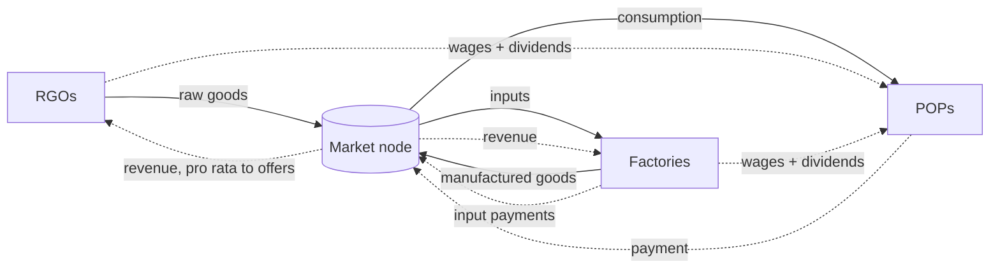
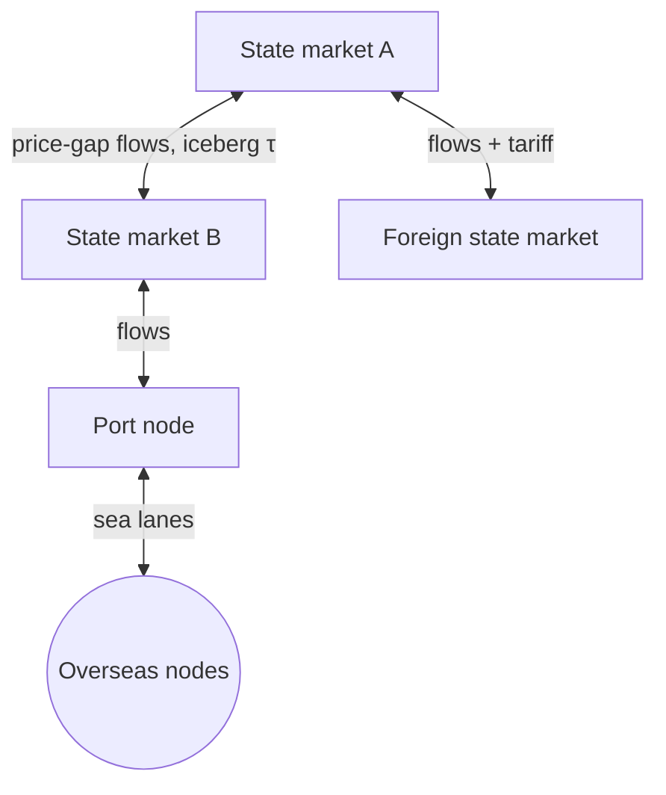

# Economy & Market Simulator

The economy is the beating heart of the game. It is a closed loop where goods are produced, sold, bought and consumed, and money only ever *moves* (D5). This page explains the mechanics. The binding rules are D1, D2, D4, D6 and D14 in [DECISIONS.md](DECISIONS.md), and the code is in `crates/pax_engine/src/systems/`.

## 🏭 Production Cycle

The economic actors are:

1. **RGOs** (farms, mines, camps): producer types with no inputs. They employ lower-strata professions, and their output is limited by labour and capacity.
2. **Factories**: producer types with inputs. They turn input goods into output with a fixed-coefficient (Leontief) recipe.
3. **Artisans** *(M2)*: POP-run production. They will be modelled as small producers owned and staffed by the same POP.

### Production rule (D6)

`output = min(E·π, minⱼ stockⱼ/aⱼ, T·E·π − unsold)`

- `E`: workers, `π`: output per worker, `aⱼ`: units of input `j` per unit of output, `T`: `target_stock_days`.
- Inputs consumed are `aⱼ × output`, rounded **up**, so rounding never creates goods.
- **Shutdown rule:** if the output price is at or below the per-unit input cost, the producer buys no inputs and idles.
- **Inventory targeting:** a producer whose goods don't sell stops adding to its stock instead of flooding the market.

### Wages and dividends (D6)

- Value added: `V = revenue − input purchases`, smoothed into `V̄`.
- Target wage: `w* = labor_share × max(V̄, 0) / E`. The wage moves `1/wage_stickiness_days` of the way there each day (wage stickiness; see [MACROECONOMICS.md §4](MACROECONOMICS.md#4-labor-market--wage-stickiness)).
- The wage bill (at most the cash on hand) is paid into the labour pool `(province, profession)` and split among its POPs by size.
- Cash above `reserve_days × wage bill` is paid as dividends, at `dividend_payout_rate` per day, to the owner profession in the same market.

## ⚖️ Price Discovery (D1)

Prices are not hard-coded and are not anchored to a base price. Every day, each market node:

1. **Collects demand and supply as functions of price.**
   - *POPs*: Stone-Geary/LES demand (below), aggregated per `(profession, regime)`.
   - *Factories*: `D(p) = min(need, budget/p)` for their inputs.
   - *Sellers*: `S(p) = stock × min(1, p/r)`, with cost-plus reservation price `r = Σ aⱼpⱼ + (w/π)/labor_share`.
2. **Iterates** `pᵢ ← pᵢ(1 + λₖ zᵢ)`.
   - `zᵢ = (Dᵢ − Sᵢ)/(Dᵢ + Sᵢ)` is always in `[−1, 1]` and is defined as 0 when both are 0.
   - `λₖ = λ·d/(d + k)` decays to damp oscillation.
   - It stops when every `|zᵢ| ≤ tolerance` or after `max_iterations`.
3. **Limits** the executed price to `±max_daily_change` of yesterday's. With no stock in the market at all, the price is held.
4. **Settles** at the executed price.
   - If demand exceeds supply, *every* buyer gets the same fraction `S/D` (pro-rata rationing).
   - Buyers pay `q × p`; the market's total receipts are split among sellers pro rata to what they offered (largest remainder).
   - Money paid equals money received, and goods delivered equal goods sold, exactly.

Tunables live in `data/rules.toml` under `[market]`.

### Consumer demand (D2)

A profession has subsistence needs `γ` per person per day (Victoria 2's *life needs*) and discretionary shares `β`. A POP with `N` people and daily budget `Y = cash × spend_rate`:

- if `Y ≥ N·C`, where `C = Σ pγ`: `xᵢ = Nγᵢ + βᵢ(Y − N·C)/pᵢ`;
- otherwise it is *deprived* and buys a scaled-down subsistence basket: `xᵢ = γᵢY/C`.

Everyday and luxury goods are goods with `β > 0`. Poor POPs barely buy them, rich POPs spend most of their surplus on them, and price elasticity emerges from income. Life-needs satisfaction (`minᵢ bought/needed`) is recorded per POP and drives demographics and, later, militancy.

## 🌍 Market Hierarchy and Trade (D14, M2)

M1 has independent market nodes (one per *state*). M2 links them, and these rules are binding:

1. Every node clears by itself using the method above.
2. Goods flow from node A to node B when `p_B·(1 − τ_AB) − tariff_AB > p_A`. Here `τ` is the iceberg transport loss ([MAP_AND_LOGISTICS.md](MAP_AND_LOGISTICS.md)). Flow is throttled by infrastructure capacity.
3. Scarce exports are allocated **pro rata** across importers. There is no priority by nation rank or table order, which fixes Victoria 2's great-power-first queue.
4. Tariffs are transfers to the importer's treasury; iceberg losses destroy goods, not money.

A "national market" or "global market" is not a separate clearing house that receives leftovers. It is the set of state nodes joined by low-friction links (customs unions remove tariffs, and infrastructure lowers `τ`).
