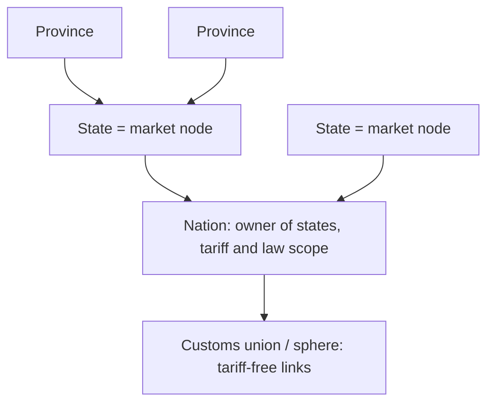

# Geography & Logistics

The simulation needs a geographical hierarchy to route goods and people. Transport is not instant: geography is a natural source of economic friction. Binding rules: D14 (inter-market trade) and D7 (derived location data) in [DECISIONS.md](DECISIONS.md). Provinces and markets are implemented; links between markets are planned (D14's principles; proposal in [#18](https://github.com/thomasclarkpersonal-sketch/Iron-and-Blood/pull/18)).

## 🗺️ The Geographical Hierarchy

1.  **Province:** the smallest unit. POPs and RGOs live here. Labour pools are per province. Adjacency matters for military movement and local migration.
2.  **State:** a group of provinces **and a market node**. Prices are discovered per state (D1), and factories are located here.
3.  **Nation:** owns states, sets tariffs, taxes and laws. It is *not* a separate clearing house (D14). Ownership is looked up from the province, so conquest never leaves stale `nation_id`s on POPs (D7).
4.  **Customs union / sphere:** nations whose links carry no tariffs.
5.  **"Global market":** the network of all market nodes linked by sea lanes and land routes. There is no single global order book.

## 🚂 Infrastructure and Friction

### Iceberg transport costs
Following Samuelson (1954), shipping is modelled as an "iceberg": a fraction `τ_AB` of every unit shipped from A to B melts away in transit.

*   *Example:* moving 100 coal from an inland state to a port node with `τ = 0.05` delivers 95. The 5 lost units are destroyed *goods*, which represent transport effort. No *money* is lost (D5).
*   Trade flows from A to B only when `p_B·(1 − τ_AB) − tariff_AB > p_A` (D14).

> [!TIP]
> **Pathfinding performance:** never run Dijkstra or A* during the tick. Pre-compute the friction matrix `τ` between all market nodes when the game loads, and rebuild only the affected rows when infrastructure changes. Route lookups during the tick are then O(1) (AGENTS.md §5). Military supply lines (vision, [MILITARY_SYSTEM.md](MILITARY_SYSTEM.md)) follow the same rule: their connectivity is rebuilt on discrete events (control changes, blockades, infrastructure), never per tick.

### Infrastructure types
Infrastructure lowers `τ` on the links it serves and raises their capacity (the maximum flow per day).

*   **Roads/trails:** high `τ`. Inland empires struggle to industrialise because bulk goods are expensive to move.
*   **Railways:** much lower overland `τ`.
*   **Ports:** connect a state to sea lanes; required to reach distant markets and colonies.

**Upkeep is separate from `τ`, so nothing is counted twice.** The iceberg loss is the per-shipment cost of moving goods. Railways and ports also have a *maintenance* demand (coal and machine parts; clipper or steamer convoys). Their owner, usually the state, buys that maintenance on the market like any other buyer. A network whose upkeep is not met degrades and its `τ` rises. That changes the friction matrix, so the matrix is recomputed only at that moment.

## 🚶‍♂️ Migration

POPs move according to push factors (low `life_needs`, unemployment) and pull factors (wages, jobs, free land). Migration is a deterministic flow `⌊N × rate⌋` that carries its share of cash (D7).

*   **Intra-state migration:** easy. Farmers moving from a rural province to an urban one in the same state.
*   **Within a state market:** implemented (D20, D25). Surplus workers move to provinces of the same market with vacancies in their profession (D20), or, failing that, with vacancies in another profession (D25).
*   **Inter-state migration:** moderate, within the same nation. Rate scaled down by `τ` between the states (after trade, D14).
*   **International migration:** hard (e.g. Europe to the Americas). Influenced by laws, available land, and same-culture POPs at the destination.
