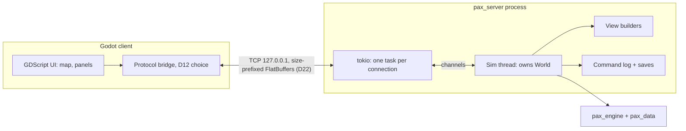

# Milestone 3: Playable Single Player (Server and Godot Client)

**Goal:** a person can play `two_states` in a Godot client, and the client never touches the engine directly. The client launches a local `pax_server`, shows the map and panels, lets the player pause, change speed and set policy, and saves and loads games.

M3 is **single player over a local connection** (D10). Multiplayer is [Milestone 4](MILESTONE_4.md). It reuses everything built here unchanged and adds sessions, authority and hosting.

Binding rules: D10, D12, D22, D23 in [DECISIONS.md](DECISIONS.md). The wire format is in [NETWORK_PROTOCOL.md](NETWORK_PROTOCOL.md).

## Decisions to make first

| # | Decision | Status | Blocks |
|---|---|---|---|
| 1 | **Client (D12):** Rust GDExtension bridge + GDScript UI; C# fallback if the M3-0 spike fails | ✅ Accepted | M3-8 |
| 2 | Wire protocol and sessions (D22), FlatBuffers kept (D10) | ✅ Accepted | M3-1 onwards |
| 3 | Server loop: pacing, flow control, saves (D23) | ✅ Accepted | M3-2, M3-5, M3-6 |
| 4 | Map data format (part of M3-7) | 📝 Proposed below | M3-7, M3-8 |

## Relation to Milestone 2

M3 can start while M2's design questions (trade, investment, rebellions) are open: the server and client only need the command set and `DayReport` that exist today. Each M2 feature that lands later adds to the protocol under its evolution rules (NETWORK_PROTOCOL §8): new summary fields, map modes and commands. The schema is versioned for exactly this. **Freeze nothing in the engine for M3.**

## Architecture

- **New crate `pax_protocol`:**
  - the generated FlatBuffers code;
  - framing (read and write size-prefixed frames with limits);
  - message helpers.

  It doesn't depend on `pax_engine`, so the client bridge never pulls in the simulation.
- **`pax_server`:**
  - the network tasks;
  - the sim thread, which owns `World` exclusively. Ticks run there with rayon inside, and there are no locks around the world;
  - the view builders (read-only over `World` and `DayReport`);
  - commands, pacing and saves.

  Engine ↔ wire conversion lives here, the only crate that sees both.
- **The engine changes only if a view needs data `DayReport` doesn't have.** Any such change goes through the normal rules (docs, `state_hash` if it's state).

## Tasks

| ID | Task | Depends on | Notes |
|---|---|---|---|
| M3-0 | **GDExtension spike** (D12): `crates/pax_godot` (gdext) decodes a real `Welcome` and `DayUpdate` from `pax_protocol` in Godot 4 and draws a coloured province map | M3-1 | Time-boxed. If gdext can't do it, switch D12 to the C# fallback before M3-8 |
| M3-1 | **`pax_protocol` crate:** schemas → generated Rust (flatc 24.3.25, checked in, CI drift check); frame reader/writer with size limits; round-trip tests for every message; size-budget test | M3-0 for client codegen | Replaces the stub generation in the Dockerfile. Allow generated-code lints locally (`#[allow]` on the module), not workspace-wide |
| M3-2 | **`pax_server` skeleton:** CLI (`--scenario`, `--bind`, `--port-file`, `--exit-when-idle`); sim thread + tokio network; `Hello`/`Welcome`/`Rejected`; one session at a time (a second gets `Rejected: server full`); `Ping`/`Pong`, 10 s silence timeout; `Goodbye` on protocol errors | M3-1 | Inherit workspace lints (`[lints] workspace = true`) and edition |
| M3-3 | **Views:** `WorldSummary`, `NationTable`, `MapView` (all `MapMode`s), `MarketDetail`, `ProvinceDetail`; `Subscribe` with an immediate refresh | M3-2 | Builders read `World` + `DayReport` only. Tests: values match `pax_cli report` for the same day |
| M3-4 | **Commands over the wire:** decode → permission (sandbox in M3) → `World::validate` → stamp → queue → `step_with`; `CommandResult`; command log of applied commands | M3-2 | Tests: rejected commands change nothing and aren't logged; order within a day is stamp order |
| M3-5 | **Pacing:** speeds 1–5 and pause (D23); `ServerState`; flow control (3-update window, coalescing with `skipped`) | M3-3 | Test with a client that never acks: the sim keeps running and the client gets the latest day after acking |
| M3-6 | **Saves:** `SaveGame`/`LoadGame`/`ListSaves`; save = scenario + content hash + command log + hash checkpoints (D23); load = replay, then verify checkpoints | M3-4 | Measure load time at D13 long-term scale. **If a 20-year save loads in more than 30 s, add binary checkpoints** (D10's open item) before M3 ends |
| M3-7 | **Map data:** province map image + definition file (format below); `pax_data` validates it against the scenario; a map for `two_states` | — | Can start immediately, in parallel with M3-1 |
| M3-8 | **Godot client:** launches the server (NETWORK_PROTOCOL §6); map with map modes (political, population, unemployment, life needs, militancy, price of a good); top bar (date, speed, pause); nation panel with the three policy sliders; market panel; province panel; save/load menu; connection-lost screen; debug overlay showing `state_hash` | M3-0, M3-3 to M3-7 | Map rendering: one province-ID texture plus a small per-province colour lookup texture updated from `MapView` (a shader), so a map-mode change rewrites one small texture |
| M3-9 | **Session replay test:** a scripted headless Rust client plays a session (commands on several days, speed changes, a save), then `pax_cli run` with the save's log must reproduce the server's final `state_hash` | M3-6 | Runs in CI. It is the determinism gate for the server |
| M3-10 | **Hostile input:** fuzz the frame reader and message handling; the server closes the session and never panics | M3-2 | `cargo fuzz` target, run in CI for a fixed budget |
| M3-11 | **Docs:** ARCHITECTURE (crates, processes), BACKEND_SCHEMA (API boundary), DATA_FORMAT (map files, save files), ONBOARDING (how to run the server and client), this file's status | all | Same PR as the code, per AGENTS.md §8 |

### Map data format (proposed for M3-7)

| File | Content |
|---|---|
| `data/map/provinces.png` | Every province is one unique RGB colour. Lossless, no anti-aliasing |
| `data/map/provinces.toml` | `[[province]] key = "...", color = [r, g, b], label = [x, y]`, one entry per province key in the scenario |

- `pax_data` checks it at load: every scenario province has exactly one colour, no colour is used twice, and every colour in the image is listed.
- The engine never reads the image. Adjacency, needed later for military movement and migration across markets, is **pre-computed** from the image by a tool and stored in `data/map/adjacency.toml` (AGENTS.md §5). It is not computed during the tick.
- The content hash in `Welcome` covers these files, so client and server always agree on the map.

## Definition of done

M3 is done when all of these hold. Each is checked by a test or a recorded measurement:

1. **Playable:** from the Godot client, a player can:
   - start `two_states`;
   - pause and change speed;
   - set an income tax rate and see the treasury and militancy respond in the nation panel;
   - inspect a province's POPs;
   - save, quit, relaunch, load, and continue.
2. **Server-authoritative:** the client contains no simulation code and depends on `pax_protocol` only.
3. **Deterministic:** the session replay test (M3-9) passes in CI on Linux, Windows and macOS.
4. **Budgets** at D13 long-term scale, measured and recorded in this file:
   - `DayUpdate` ≤ 16 KB summary-only and ≤ 128 KB with every view subscribed;
   - view building ≤ 5 ms per day;
   - the tick plus view building stays within the D13 tick budget plus 10%;
   - a command is acknowledged within one tick at speed 3.
5. **Robust:**
   - a second client is refused;
   - a silent client times out;
   - malformed input closes the session without a panic (fuzzed);
   - killing the client stops the server.
6. **Documented:** D12, D22 and D23 are accepted; the docs in M3-11 are updated.

## Out of scope for M3

Several clients, lobbies, nation assignment and permissions (all M4). Also out:
- TLS, passwords, a dedicated server, and Docker (M4);
- an AI for nations nobody plays;
- client-side prediction;
- a browser build;
- binary saves, unless M3-6's load-time measurement requires them;
- sound, localisation beyond English keys, and modding tools.

## Risks

| Risk | Mitigation |
|---|---|
| The client-language spike shows no good FlatBuffers path for Godot | M3-0 comes first and is time-boxed. The schema is language-neutral, and C# has an official library |
| Map art for many provinces is slow to produce | M3 needs only `two_states`'s map. Bigger maps are content work after M3 |
| Replay-based loading is too slow for long games | Measured in M3-6, with binary checkpoints as the planned fallback |
| M2 features change state the client shows | Protocol evolution rules (NETWORK_PROTOCOL §8); new data arrives as new fields and map modes |
