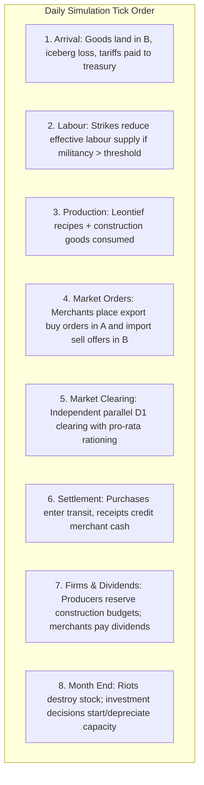

# Milestone 5: Trade, Investment and Economic Unrest

**Goal:** Turn isolated local economies into an interconnected world trading system, unleash industrial growth through capital investment so output can grow beyond the capacity a scenario starts with, introduce economic consequences for worker militancy (strikes and riots), and equip the Godot client with full trade, tariff, and construction controls.

Milestone 5 builds on the single-player and multiplayer foundation established in [Milestone 3](MILESTONE_3.md) and [Milestone 4](MILESTONE_4.md). Binding architectural rules follow [DECISIONS.md](DECISIONS.md) (in particular D1, D3, D5, D6, D13, D14, and proposed decisions D17, D27, D28).

---

## 🧭 Scope

### In Scope
1. **Inter-Market Trade and Logistics (D14, D17):**
   * Directed routes with Samuelson iceberg transport costs ($\tau$, destroying goods, never money).
   * A precomputed **trade horizon** using per-source Dijkstra on retention $\prod(1 - \tau) \ge \text{min\_retention}$, avoiding $O(N^3)$ matrix blowup at scale.
   * `Merchants` table buying in origin markets and selling in destination markets with price-gap arbitrage.
   * 1-day transit delay preserving independent parallel market clearing across markets without cross-market locks.
   * Ad-valorem tariffs on the origin price, paid from merchant cash directly into the importing nation's treasury.
   * Per-route tuning: each route sets its own profit margin and flow speed.
   * Dynamic merchant entry and exit, with starting merchants a scenario may seed per route.
   * Institutional diversity in merchants (`MerchantKind`: private exporter-owned, commercial merchant class, state-chartered monopoly).
2. **Capital Investment and Capacity Growth (D27):**
   * Existing producers expanding capacity from retained earnings when profitable, liquid, and labour is available.
   * Construction recipes demanding physical intermediate goods (tools, steel, timber) through standard D1 market buy orders.
   * Founding brand-new factory/RGO types in provinces funded by a Capitalist Investment Pool or the State Treasury.
   * Depreciation of idle plant capacity after prolonged downturns.
   * Growth in `two_states`: capacity and real GDP rise over 20 years, with unemployment within its band (about 0.8% since D25). Without investment, real GDP is flat at about 4,200 a day.
3. **Economic Feedback on Unrest (D28):**
   * **Strikes:** Deterministic, continuous reduction in effective labour supply when POP militancy exceeds `strike_threshold`.
   * **Riots:** Monthly deterministic inventory destruction and treasury security transfers when province militancy exceeds `riot_threshold`.
4. **Wire Protocol & Godot Client:**
   * Wire protocol additions: `TradeRouteView`, `InvestmentLedgerView`, `SetTariffCommand`, `FoundProducerCommand`.
   * Godot UI: Trade Route overview, tariff policy sliders, construction project queues, and trade flow map mode.
5. **Determinism and Performance Gates:**
   * Golden replays verified in CI, outside-money conservation invariant asserted daily, and tick execution within the 100 ms/day budget at 1M POP rows (D13).

### Out of Scope (Milestone 6 and Milestone 7)
* Political parties, interest groups, consciousness, and voting reforms ([Milestone 6](MILESTONE_6.md)).
* Banking, endogenous inside money, commercial loans, and sovereign debt ([Milestone 6](MILESTONE_6.md)).
* Armed rebellions, civil wars, and market secessions ([Milestone 6](MILESTONE_6.md)).
* Military regiments, standing armies, mobilization, frontlines, and combat ([Milestone 7](MILITARY_SYSTEM.md)).
* Colonization, foreign concessions, and imperialism ([Milestone 7](COLONIZATION_SYSTEM.md)).

---

## 🏛️ System Design & Decisions

### 1. Inter-Market Trade (D17, Proposed)
* **Merchants:** Stored in a dense SoA table `Merchants` with `route`, `cash`, `transit` (per good), `stock` (per good), and `cost_basis` (per good).
* **Price Gap Arbitrage:** At opening prices, merchants order volume $q^* = \text{capacity\_share} \times \min(1, \Delta p / (k \cdot p_A))$ if netback $p_B(1 - \tau) - t \cdot p_A > p_A(1 + \text{margin})$.
* **Preserving Parallelism:** A merchant purchases goods in Market $A$ on day $T$ and lands them in Market $B$ on day $T+1$. Because transactions are separated by a 1-day transit delay, Market $A$ and Market $B$ clear strictly independently during day $T$, maintaining full rayon parallelism and zero lock contention.
* **Pro-Rata Rationing:** Merchants place standard D1 `BuyOrder`s and `SellOffer`s. When supply in Market $A$ is scarce, exporters and local POPs are rationed by the exact same fraction $S/D$.
* **Merchant Institutional Kinds:**
  * `Private`: Owned by origin-market Capitalists; dividends paid into the origin market's capitalist owner pool.
  * `Commercial`: Owned by a specialized Merchant POP profession; profits accrue directly to merchant households.
  * `Chartered`: State-chartered company; profits pay directly into the national treasury.
* **Per-Route Tuning:** Each `[[route]]` sets its own `margin` and flow speed `k`.
* **Tariff Base:** Ad-valorem on the origin price (yesterday's price in market $A$), known when the goods are bought.
* **Entry and Exit:** Merchants are founded when a route's gap persists and its merchants' cash can't use its capacity (funded like new producers, D27; Chartered only by command), and wound up when loss-making. A scenario may seed starting merchants per route, so trade works from day 1.
* **Precomputed Trade Horizon:** Sparse route matrix computed via per-source Dijkstra over retention $\prod(1 - \tau) \ge \text{min\_retention}$. Avoids storing a dense $3000 \times 3000$ matrix ($72\text{ MB}$) in memory.

### 2. Capital Investment & Construction (D27, Proposed)
* **Decentralized Expansion:** Profitable producers reserve cash ahead of D6 dividend distribution to fund expansion projects of size `step` worker slots.
* **Three Gating Conditions:** Project initiates only when:
  1. *Profitable:* Smoothed value added $\bar{V}$ exceeds wage bill by required margin.
  2. *Labour Available:* Unemployed workforce in province labour pool $\ge \text{step}$.
  3. *Liquid:* Retained cash above restart and dividend reserves covers construction costs at current prices.
* **Physical Construction Demand:** Daily buy orders are placed for intermediate inputs (tools, timber, steel). Completed construction increases `capacity += step` and consumes the delivered goods.
* **Founding New Producers:** Provinces with persistent unemployment can establish unbuilt factory types using funds from the Capitalist Investment Pool (or state subsidies).
* **Depreciation:** Capacity unused for `idle_months_before_shrink` shrinks by `step` to prevent zombie factories.

### 3. Economic Unrest (D28, Proposed)
* **Strikes:** When POP militancy exceeds `strike_threshold`, effective labour supply is scaled down:
  $$\text{effective\_workers} = \text{size} \times (1 - \text{strike\_rate} \times (\text{militancy} - \text{threshold}))$$
  Reduces production volume and drives up prices, creating natural economic feedback before political institutions exist.
* **Riots:** If province-wide population-weighted militancy exceeds `riot_threshold` at month end:
  * A percentage of local producer output stock is destroyed (destroying goods, never money).
  * The national treasury pays an emergency security/repression transfer to local POPs, providing temporary militancy relief.

---

## 📋 Tasks

| ID | Task | Depends on | Notes |
|---|---|---|---|
| **M5-1** | **Route loader & precomputed trade horizon** | — | Scenario TOML `[[route]]` definitions, each with its own `margin` and `k`; per-source Dijkstra over retention $\prod(1 - \tau) \ge \text{min\_retention}$; deterministic tie-breaking. |
| **M5-2** | **`Merchants` table & arrival phase** | M5-1 | SoA columns (`route`, `cash`, `transit`, `stock`, `cost_basis`); arrival step destroys iceberg share $\tau$ and transfers ad-valorem tariff to destination treasury; stock-flow conservation tests. |
| **M5-3** | **Merchant market orders & arbitrage** | M5-2 | Export buy orders in $A$ and import sell offers in $B$ based on netback price gaps; pro-rata rationing naturally verified. |
| **M5-4** | **Merchant institutional types, dividends & exit** | M5-3 | `MerchantKind` (Private, Commercial, Chartered); net dividend distribution to origin capitalists, merchant POPs, or national treasuries; scenario-seeded merchants; winding up of loss-making merchants. |
| **M5-5** | **Trade balance & comparative advantage test** | M5-4 | Implement trade route in `two_states` between Lowland (cheap cloth, dear tools) and Highland (cheap tools, dear cloth); verify mutual real GDP growth and price convergence. |
| **M5-6** | **Construction recipes & project state** | — | Add `expansion` recipes in `producer_types.toml`; add SoA columns `project_remaining`, `project_budget`, `idle_months` on `Producers`. |
| **M5-7** | **Producer expansion & construction clearing** | M5-6 | Monthly evaluation gating on profit, labour, and liquidity; daily D1 buy orders for construction goods; capacity increase on completion. |
| **M5-8** | **Founding new producers & investment pool** | M5-7 | Mechanism to found new factory types in provinces with unemployed workers, financed by capitalist investment funds or state treasury commands. |
| **M5-9** | **Capacity depreciation & disinvestment** | M5-7 | Decommission capacity slots of chronically understaffed producers; verify inventory stability. |
| **M5-10** | **Growth verification** | M5-7, M5-8 | 20-year run of `two_states`: prove capacity and real GDP grow (from a flat ≈4,200/day without investment) while unemployment stays within its band (≈0.8% since D25). |
| **M5-11** | **Deterministic strikes** | — | Continuous reduction of effective labour supply above `strike_threshold`; test output drops, wage floor consistency, and money conservation. |
| **M5-12** | **Monthly riots and security transfers** | M5-11 | Output inventory destruction and security transfer from treasury to POP cash at month end above `riot_threshold`. |
| **M5-13** | **Wire protocol additions (`pax_protocol`)** | M5-5, M5-8 | Update FlatBuffers schemas with `TradeRouteView`, `InvestmentLedgerView`, `SetTariffCommand`, and `FoundProducerCommand`; regenerate protocol crate. |
| **M5-14** | **Godot client panels & map modes** | M5-13 | UI screens for trade routes, tariff sliders, construction queues, and trade flow map mode overlay in Godot. |
| **M5-15** | **Replay gate, benchmarks, and docs** | all | Golden hashes re-recorded for `two_states`; `session_replay.rs` covers trade and construction commands; benchmark within D13 budget (1M POPs $\le 100\text{ ms/day}$). |
| **M5-16** | **Dynamic merchant entry** | M5-4, M5-8 | Founding merchants on routes with a persistent gap and too little merchant cash, funded by the capitalist investment pool or merchant POPs (Chartered by command); lands after investment's funding rules (TRADE.md, "Entry and exit"). |

---

## 🎯 Definition of Done

1. **Trade Works and Arbitrages Prices:**
   * In `two_states`, opening trade between Lowland and Highland causes price gap to converge towards the transport friction margin.
   * Tariffs directly reduce traded volume and credit the importing treasury with 100% of tariff payments.
   * Merchants enter routes with a persistent price gap and exit when loss-making, with money conserved through both.
   * Total money invariant asserts on every tick with random trade routes and high trade volumes.
2. **Investment Grows the Economy:**
   * In `two_states` over 20 years, producer capacity and real GDP rise (versus a flat ≈4,200/day without investment), while unemployment stays within its band (≈0.8% since D25).
   * Expanding producers generate sustained market demand for construction inputs (tools, timber, steel).
3. **Economic Feedback on Discontent:**
   * High militancy above `strike_threshold` measurably reduces production output.
   * High militancy above `riot_threshold` triggers stock destruction and treasury repression payouts.
4. **Authoritative Client & Multiplayer Controls:**
   * Players can view active trade routes, adjust national tariff rates, inspect factory construction progress, and found new factories from the Godot client.
   * Commands are fully validated by `World::validate`, stamped in sequence, and replayed identically in `session_replay.rs`.
5. **Budgets & Determinism:**
   * Verification test passes across 1, 2, 3, and 8 threads with bit-identical results.
   * 1M POP rows scale ticks within the $\le 100\text{ ms/day}$ performance budget on 8 threads.
