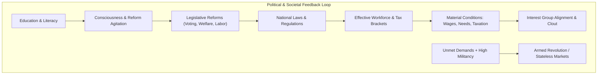

# Milestone 6: Politics, Society and Banking

> [!NOTE]
> **Status: planned, not started.** Its decisions D29–D32 are *Proposed* in [DECISIONS.md](DECISIONS.md), and [DATA_MODEL_M5_M6.md](DATA_MODEL_M5_M6.md) holds the corrected data model and the questions still open for the owner.

**Goal:** Transform the simulation into a dynamic historical society: model workforce composition and strata mobility, introduce endogenous inside money (banking, commercial credit, and sovereign debt), simulate interest groups with competing political clouts, establish a legislative reform system, and model ideological revolutions.

Milestone 6 builds directly on the global trade and industrial expansion delivered in [Milestone 5](MILESTONE_5.md). Binding architectural rules follow [DECISIONS.md](DECISIONS.md) (in particular D3, D5, D7, D13, and proposed decisions D29, D30, D31, D32).

---

## 🧭 Scope

### In Scope
1. **Workforce Demographics & Strata Mobility (D29):**
   * Splitting POP size into `workforce_male`, `workforce_female`, and `dependents` (state); `size` becomes their derived sum (D7, D29).
   * **Literacy & Education:** Literacy tracking driven by education access, funding, and child labor laws.
   * **Social Strata Mobility:** Deterministic fractional promotion and demotion (e.g. Labourers/Farmers $\to$ Craftsmen/Clerks $\to$ Capitalists/Officers) driven by literacy, wage differentials, and job vacancies.
   * **Labor Laws:** Child labor restrictions, female workforce participation, and compulsory schooling altering the effective workforce versus dependent ratios.
2. **Endogenous Inside Money & Sovereign Debt (D30):**
   * Double-entry banking system (`Banks` table) creating deposits (bank liability, depositor asset) and loans (bank asset, borrower liability) simultaneously.
   * Extended stock-flow consistency invariant: $\sum \text{financial assets} - \sum \text{financial liabilities} = \sum \text{outside money}$ asserted daily.
   * Sovereign debt: Treasuries issuing bonds to finance budget deficits without immediate currency minting. Who may hold bonds (banks only, or POPs too) is open (D30).
   * Commercial credit: Capitalists and producers borrowing to finance expansion projects.
   * Default mechanics: Insolvency write-offs destroy net wealth/claims, never outside cash.
3. **Interest Groups, Ideology & Political Reforms (D31):**
   * **Consciousness:** Separate from militancy; tracks political awareness and demand for reforms, driven by literacy and discretionary spending.
   * **Interest Groups:** Clout derived each month from POP profession, wealth, and literacy through profession weights in data (D31). The starting groups (Industrialists, Trade Unions, Landowners/Aristocrats, Devout, Intelligentsia; Armed Forces with the military in M7) are data.
   * **Legislative Reforms:** Player and parliament passing institutional reforms (voting franchise, minimum wage, pensions, compulsory schooling, progressive taxation brackets).
4. **Political Revolutions & Secessions (D32):**
   * Escalation of unrest beyond strikes and riots into armed revolutions.
   * Seeded stochastic revolts (`rng::Stream::REBELLION`) where markets break away, become stateless, and demand institutional reforms; market ownership becomes saved state (D32).
   * Resolution via legislative compromise or expiration timeout (ahead of full military suppression in Milestone 7).
5. **Wire Protocol & Godot Client UI:**
   * Wire protocol additions: `PoliticsSummary`, `InterestGroupTable`, `BankSummary`, `PassReformCommand`, `IssueBondsCommand`.
   * Godot UI: Parliament & Reform screen, Interest Group breakdown, National Debt & Banking ledger, and Ideology/Consciousness map modes.
6. **Determinism and Replay Gates:**
   * Replay verification in CI via `session_replay.rs`, conservation assertions, and performance benchmarking under D13.

### Out of Scope (Milestone 7)
* Military units, standing army regiments, and battle tactical simulation ([Milestone 7](MILITARY_SYSTEM.md)).
* Full wartime mobilization, conscript extraction, and wartime supply shortages ([Milestone 7](MILITARY_SYSTEM.md)).
* Military logistical supply networks, blockades, and frontline combat ([Milestone 7](MILITARY_SYSTEM.md)).
* Colonial scramble, overseas concessions, and imperialist resource extraction ([Milestone 7](COLONIZATION_SYSTEM.md)).

---

## 🏛️ System Design & Decisions

### 1. Workforce Structure & Strata Mobility (D29, Proposed)
* **Tripartite POP Split:** Each POP row tracks `workforce_male`, `workforce_female`, and `dependents`.
* **Labor Participation:** National laws determine what fraction of `dependents` (child labor) and `workforce_female` are available for employment.
* **Strata Promotion:** At month end, deterministic fractional promotion moves workers up or down the social ladder based on literacy thresholds and relative wage expectations:
  $$\text{promoted} = \lfloor \text{workforce} \times \text{promotion\_rate}(\text{literacy}, \Delta w) \rfloor$$
  Moving POP members carry their pro-rata share of cash under the D7 largest-remainder rule.

### 2. Endogenous Inside Money (D30, Proposed)
* **Double-Entry Balance Sheets:** Banks maintain deposit liabilities and loan assets.
* **Commercial Credit:** Expanding producers with positive net worth can borrow up to a credit limit to finance project construction.
* **Sovereign Debt:** When government spending exceeds revenue, the treasury issues bonds bearing a coupon interest rate. Who buys them, banks only or capitalist POPs too, is open (D30; DATA_MODEL_M5_M6.md, "Open questions").
* **Default:** If a nation or borrower defaults, the debt is written off: borrower liabilities drop and creditor assets drop by the exact same amount. Net worth is destroyed, but zero cash is deleted from the outside money supply (preserving D5).

### 3. Interest Groups & Reforms (D31, Proposed)
* **Clout Weighting:** POPs align with interest groups based on material status, through profession weights in data (D31). A starting mapping, which needs new professions (clergy, clerks, merchants; open in DATA_MODEL_M5_M6.md):
  * Capitalists & Merchants $\to$ **Industrialists**
  * Craftsmen & Labourers $\to$ **Trade Unions**
  * Aristocrats & Farmers $\to$ **Landowners / Agrarians**
  * Clergy $\to$ **The Devout**
  * Clerks & Literate POPs $\to$ **Intelligentsia**
* **Political Agitation:** Clout determines parliamentary voting power. High consciousness generates pressure for specific reforms (e.g. Trade Unions demanding minimum wage and 8-hour workdays; Intelligentsia demanding compulsory schooling).
* **Enacting Reforms:** Enacting reforms placates target interest groups and reduces consciousness/militancy, but angers opposing entrenched elites.

### 4. Revolutions & Secessions (D32, Proposed)
* **Rebellion Threshold:** When a market's militancy exceeds critical thresholds, a rebellion triggers probabilistically using `rng::Stream::REBELLION` keyed by `(seed, day, market)`. Revolts take whole markets, because nation ownership is per market (D15).
* **Breakaway Markets:** A revolting market becomes stateless, withholding all tax revenues from the central government. Market ownership becomes saved state, and a revolt record keeps the nation to restore and the demanded reform (D32).
* **Resolution:** Revolts stand down if the government enacts the demanded legislative reform, or expire after a protracted period of attrition (until direct military suppression in Milestone 7).

---

## 📋 Tasks

| ID | Task | Depends on | Notes |
|---|---|---|---|
| **M6-1** | **Workforce tripartite split** | — | Add `workforce_male`, `workforce_female`, `dependents` to `Pops`; update demand, demographics, and compaction algorithms. |
| **M6-2** | **Literacy tracking & compulsory education** | M6-1 | Per-POP literacy column; education funding and child labor laws drive literacy growth and dependent mortality. |
| **M6-3** | **Social strata promotion and demotion** | M6-2 | Deterministic fractional promotion (Labourers $\to$ Craftsmen/Clerks $\to$ Capitalists); pro-rata cash transfer via D7 largest-remainder allocation. |
| **M6-4** | **`Banks` table & commercial credit** | — | Bank SoA table; simultaneous asset/liability creation for loans and deposits; SFC balance sheet invariant tests. |
| **M6-5** | **Sovereign debt & treasury bonds** | M6-4 | Deficit financing via bond issuance; coupon interest payments to bondholders; debt ceiling validation. |
| **M6-6** | **Financial distress & default write-offs** | M6-5 | Debt default mechanics; symmetrical balance sheet write-downs; wealth destruction without cash destruction. |
| **M6-7** | **POP consciousness & interest group clout** | M6-1 | Add `consciousness` to `Pops`; calculate political clout across the 6 major interest groups from POP attributes. |
| **M6-8** | **Legislative reform system** | M6-7 | Voting franchise, labor laws, social welfare, and education laws; command `PassReform`; interest group approval and anger. |
| **M6-9** | **Stochastic rebellions & breakaway markets** | M6-8 | Probabilistic rebellion triggering via `rng::Stream::REBELLION`, keyed by market; market ownership as hashed, saved state with a revolt record (nation to restore, demanded reform); breakaway stateless markets; tax revenue cutoff and reconciliation. |
| **M6-10** | **Wire protocol additions (`pax_protocol`)** | M6-5, M6-8 | Add `PoliticsSummary`, `InterestGroupTable`, `BankSummary`, `PassReformCommand`, and `IssueBondsCommand` to FlatBuffers schemas. |
| **M6-11** | **Godot politics & parliament panels** | M6-10 | Parliament seating, interest group clout breakdown, reform enactment UI, and voting franchise controls. |
| **M6-12** | **Godot banking & sovereign debt panels** | M6-10 | Treasury balance sheet, bond issuance interface, banking reserves, and commercial debt summary. |
| **M6-13** | **Ideology & unrest map modes** | M6-11 | Godot shader map modes displaying dominant interest groups, literacy rates, and revolutionary risk. |
| **M6-14** | **Determinism gate, replay tests & docs** | all | 20-year multi-state replay verification; `session_replay.rs` covering political and financial commands; D13 performance budget compliance. |

---

## 🎯 Definition of Done

1. **Stock-Flow Consistent Inside Money:**
   * Commercial loans, bank deposits, and sovereign bonds maintain double-entry conservation on every tick:
     $$\sum \text{financial assets} - \sum \text{financial liabilities} = \sum \text{outside money}$$
   * Governments can finance sustained deficits through debt issuance, and debt default writes down claims without altering total outside money.
2. **Dynamic Social Mobility:**
   * POPs promote into literate and skilled professions (Craftsmen, Clerks, Capitalists) as literacy rises and factory wages provide an attractive premium.
   * Compulsory education laws measurably accelerate literacy growth at the cost of short-term child labor output shocks.
3. **Responsive Politics & Interest Groups:**
   * Industrialization organically shifts national political power from traditional Landowners towards rising Industrialists and Trade Unions.
   * Enacting social and political reforms appeases agitated interest groups, lowering national militancy and consciousness.
4. **Revolutionary Consequences:**
   * Extreme unrest triggers breakaway rebellions that deprive the national treasury of regional tax revenue until political settlement or timeout.
5. **Authoritative Client & Multiplayer Controls:**
   * Players can inspect parliamentary clout, enact legal reforms, issue treasury bonds, and monitor interest group sentiments from the Godot client.
6. **Budgets & Determinism:**
   * Multi-threaded verification tests pass across 1, 2, 3, and 8 threads with bit-identical outputs.
   * Full tick remains $\le 100\text{ ms/day}$ at 1M POP rows on 8 threads.
