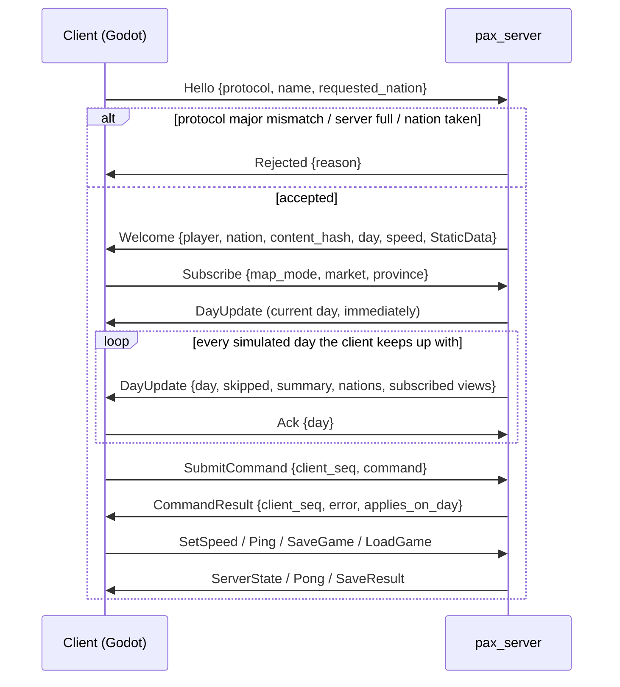

# Network Protocol

The binary protocol between `pax_server` and clients. Binding rules: D10 (server-authoritative model), D22 (wire protocol and sessions), D23 (pacing, flow control, saves), and for multiplayer D24 in [DECISIONS.md](DECISIONS.md).

The schemas are the source of truth: [`schemas/common.fbs`](../schemas/common.fbs), [`client.fbs`](../schemas/client.fbs) and [`server.fbs`](../schemas/server.fbs). This page explains how to use them; it doesn't repeat them.

## 1. Principles

1. **The client never simulates.** It shows what the server sends and asks the server to apply commands. Nothing on the client can drift from the server, so there is no client-side desync detection (D10).
2. **Views, not state.** The server sends a small daily summary plus the views the client subscribed to (a map mode, one market, one province). It never sends the full POP or producer tables. At the D13 long-term scale (1M+ POP rows) those are about 40 MB per day.
3. **The server decides the order.** The server stamps every command with the day it applies on, the player and a sequence number. Nothing the client sends affects the order commands are applied in.
4. **No floats on the wire.** Simulation values travel as `Fixed { raw: long }` (value × 10⁶, D3). Clients convert to float for display only.

## 2. Transport and framing

- **TCP.** In single player the server binds `127.0.0.1` on a port chosen by the client that launches it (§6). Multiplayer adds TLS (D24).
- **Message frame:** a 4-byte little-endian length, then one FlatBuffer. This is FlatBuffers' *size-prefixed* buffer: `finish_size_prefixed` to write, `size_prefixed_root_as_…` to read.
- **File identifiers:** `PAXC` for client→server (`ClientMessage`) and `PAXS` for server→client (`ServerMessage`). A buffer with the wrong identifier is a protocol error.
- **Limits:** client messages are at most 64 KiB and server messages at most 16 MiB. A frame over the limit is a protocol error, so the receiver never allocates for it.
- **Verification:** run the FlatBuffers verifier on every inbound buffer before reading it. The verifier guarantees that reads are memory-safe; it does **not** detect corrupted values. Integrity in transit is TCP's job (and TLS's in M4).
- **Protocol errors** end the session: the server sends `Goodbye` with the reason and closes the connection. It never guesses. They are:
  - a bad frame, a failed verification, or the wrong identifier;
  - anything before `Hello`, or a second `Hello`;
  - a `Subscribe` naming a good, market or province that doesn't exist.
- **Unknown enum values are not errors** (§8): a `Subscribe` with a map mode newer than the server simply gets no map.
- **A client that doesn't read** is disconnected. Each connection's outbound queue holds 256 frames; when it is full, the server closes the connection *without* a `Goodbye`, because the queue that would carry it is the one that's full. Requests waiting for the server are bounded too: a client that floods requests simply stops being read until there is room (TCP backpressure).

## 3. Session lifecycle

1. **Hello first.** The client sends `Hello` with `protocol_major` and `protocol_minor`. A different major version gets `Rejected`. A newer or older minor version is accepted, under the evolution rules in §8.
   - **Players (M4-1):** a server started with `--players N` (default 1) welcomes up to N clients at once; one more gets `Rejected: server full`. Each nation has one player, so `Hello` for a nation another player holds is `Rejected` too. Each player gets a distinct `Welcome.player` id, the lowest one free.
2. **Welcome** carries `StaticData`: the key tables (goods, professions, producer types, provinces, markets), the province→market map, and each nation with the markets it owns (a market no nation lists is stateless).
   - Every id in the protocol is an index into these tables, and the indices stay fixed for the whole session.
   - **Map check:** the client draws the map from its own copy of the scenario's map files, in the directory `StaticData.map_dir` names (relative to the scenario, checked by `pax_map::check_map_dir`; protocol 1.1). It hashes them with `pax_content::map_hash`, the same function the server uses, and compares the result with `StaticData.map_hash`. On a mismatch it shows an error rather than mislabelling provinces.
   - `content_hash` covers every file the scenario loader reads, maps included, each keyed by its role rather than its path. It identifies the game content in logs and saves (D23).
3. **Subscribe** replaces the whole subscription. The server immediately answers with a `DayUpdate` for the current day, even while paused, so a newly opened panel fills at once.
4. **Daily updates** follow the flow-control rule in §5.
5. **Keep-alive:** a session silent for `pax_protocol::IDLE_TIMEOUT` (10 seconds, D22) is closed, so the client sends `Ping` at least every fifth of that (2 seconds). Both sides take the value from that one constant. M4's lag rules are in D24.
6. **LoadGame** ends with a new `Welcome` to **every** player, because the scenario and its tables may differ. Each client must drop everything it holds from the old session, whether or not it asked for the load.
7. **Leaving:** when a player leaves, the others play on (D24). When the last one leaves, the game pauses, because D23 never runs a game nobody is watching.
8. **The lobby (M4-2, protocol 1.4):** a multiplayer server (`--players` above 1) starts in a lobby. Single player has none and never sends `LobbyState`.
   - `Hello`'s nation is the player's first claim. Without one, the player joins unclaimed (or as a sandbox seat on a `--sandbox` server).
   - Players `ClaimNation` and `SetReady`; every change goes to every player as a `LobbyState`. A refused request gets a `LobbyState` with a `notice`, to the asker only. A player must hold a nation to be ready, and changing a claim clears the ready mark.
   - The host's `StartGame` succeeds once every player is ready. Until then commands get `NotStarted` and the clock stays paused; after it, the host unpauses.
   - The scenario is the one the server was started with. Choosing a save in the lobby is M4-5, and rejoining after a drop is M4-4. After the start, a new `Hello` must name a free nation.

## 4. Messages

### Client → server (`ClientPayload`)

| Message | Purpose | Reply |
|---|---|---|
| `Hello` | Open the session; request a nation (absent = sandbox, only on a server run with `--sandbox`, D24) | `Welcome` or `Rejected` |
| `SubmitCommand` | One engine command (`SetIncomeTax`, `SetTransferRate`, `SetConsumptionRate`) with a client-chosen `client_seq` | exactly one `CommandResult` |
| `SetSpeed` | Pause, or set speed 1–5. Any player may pause; only the host sets a speed (D24). A refused change, or a speed the server doesn't know (D22), gets the unchanged `ServerState`, to the asker only | `ServerState` |
| `Subscribe` | Choose the map mode, market panel and province panel | a `DayUpdate` for the current day |
| `Ack` | Finished processing the `DayUpdate` for `day` | — |
| `Ping` | Keep-alive and round-trip measurement | `Pong` |
| `SaveGame`, `LoadGame`, `ListSaves` | Saves (D23). Only the host saves and loads (D24); anyone else gets a `SaveResult` with the error. Anyone may list | `SaveResult`, `Welcome`, `SaveList` |
| `Kick` | Host only (D24, protocol 1.3): end the session of player `player`, which gets `Goodbye: kicked by the host`. Ignored from anyone else, for the host itself, or for a player who isn't connected | — |
| `ClaimNation`, `SetReady` | Lobby (protocol 1.4, §3): claim a nation (absent: give up the claim); mark ready | `LobbyState` |
| `StartGame` | Lobby, host only: start once every player is ready | `LobbyState` with `started`, to everyone |

### Server → client (`ServerPayload`)

| Message | When |
|---|---|
| `Welcome`, `Rejected` | Reply to `Hello` (and `Welcome` again, to every player, after any player's `LoadGame`) |
| `DayUpdate` | After a simulated day, subject to flow control (§5) |
| `CommandResult` | Reply to `SubmitCommand` |
| `ServerState` | The speed changed (including pause and unpause) |
| `Pong`, `SaveResult`, `SaveList` | Replies |
| `Goodbye` | The server closes the connection; the reason says why |
| `LobbyState` | Multiplayer only (protocol 1.4): the players (id, name, nation, sandbox, ready, host) and whether the game started, whenever any of it changes; with a `notice`, to one client whose lobby request was refused |

### What a `DayUpdate` contains

| Part | Always? | Size at D13 long-term scale* |
|---|---|---|
| `day`, `speed`, `skipped`, `state_hash` | yes | bytes |
| `WorldSummary`: population, workforce, unemployed, spending, wages, taxes, transfers, deprived, mean life needs and militancy | yes | < 200 B |
| `NationTable`: treasury, the three policy rates, population and (from protocol 1.2) mean militancy, per nation | yes | ~10 KB for 200 nations |
| `MapView`: one value per province for the subscribed `MapMode` | if subscribed | ~80 KB for 10,000 provinces |
| `MarketDetail`: price, supply, demand and traded per good for one market | if subscribed | ~1.6 KB for 50 goods |
| `ProvinceDetail`: POPs, labour pools and producers of one province | if subscribed | ~1–3 KB |

\* Measured from the real schema with flatc 24.3.25: a summary-only update is 8.3 KB; with every view subscribed it is 91 KB. The budget is ≤ 16 KB summary-only and ≤ 128 KB with every view (M3 acceptance).

- **POP identity:** a POP is identified by `(province, profession)`, never by row index. Month-end compaction reorders and merges rows (D7). When culture and religion arrive, they join the identity.
- **`state_hash`** is `World::state_hash()` after the day. The client can't verify it, and doesn't need to. It is shown in the debug overlay and written into bug reports, so a report pins the exact state and the server's command log can replay to it (D23). The server computes it once per day and shares it among sessions.
- **Map modes:** `Nation` is drawn by the client from `StaticData`, so the server sends no values for it.
  - **Two moments of one day:** `WorldSummary.life_needs` and `.militancy` are the tick's own figures, weighted by the sizes the market saw. The map modes and the province panel use the POP table at the end of the day. Both use the same rules, so they agree except on month-end days, when demographics change sizes after the market.
  - **Provinces where nobody lives** carry 0 in every mode. For `LifeNeeds`, `Militancy` and `Unemployment`, the client must read that as *no data*, not as a real 0. It can tell from the `Population` map mode or the province panel. `Unemployment`, `LifeNeeds` and `Militancy` are fractions in [0, 1]. `Population` is a count of people. `Price` is the price of `map_good` in each province's market.

## 5. Commands, ordering and flow control

**Commands** (D22):
1. The client sends `SubmitCommand { client_seq, command }`. The command tables mirror `pax_engine::Command` field for field, with `nation` as an index.
2. The server checks it in order:
   - well-formed: every field present (otherwise `Malformed`);
   - permission (D24; M3 sandbox allows every nation);
   - `World::validate`, the single validity rule (D21).
3. If valid, the server stamps it `(day = next tick, player, sequence)`, queues it, and replies `CommandResult { error: None, applies_on_day }`. Otherwise it replies with the error, and nothing is queued.
   - **Keeping the wire and the engine in step:** the conversions between `pax_engine::Command`/`CommandError` and their wire forms (in `pax_server`) use exhaustive `match`es with no `_` arm, in both directions. A new engine command or error then fails to compile until the schema gains its wire form, under the rules in §8.
4. At the start of the tick, the scenario's scripted commands for the day apply first, then the queue in stamp order, through `pax_data::step_day`, the one day step shared with `pax_cli` and the tests (D23). Commands that applied successfully are appended to the session's command log (D23). Every command is re-validated as it applies; if a player's command fails at that point, a second `CommandResult` reports the error and the command is not logged. No current command can fail this way.

**Flow control** (D23):
- At most **3** `DayUpdate`s may be unacknowledged. When the window is full, the server stops sending to that client but keeps simulating. When an `Ack` frees the window, it sends only the latest day, with `skipped` set to the number of days skipped.
- The simulation never waits for a client in single player. A slow client sees fewer updates; it never sees stale ones.
- `ServerState`, `CommandResult` and replies bypass the window. They are small and must not wait behind updates.

## 6. Single player: how the client runs the server

- The client launches `pax_server` as a child process: `pax_server --scenario <dir> --bind 127.0.0.1:0 --port-file <tmp> --sandbox --exit-when-idle`. Single player plays sandbox, which a server allows only with `--sandbox` (D24). The server binds a free port and writes it to the port file (atomically, so a polling client never reads half a number). The client then connects.
- When the client exits, it closes the connection, and `--exit-when-idle` makes the server shut down once its player has gone.
- The client's bridge (`pax_godot::connection`) does this, and also what every client owes the server: it acknowledges each `DayUpdate` on the poll after the one that delivered it (§5), and sends a `Ping` after a fifth of `IDLE_TIMEOUT` (2 s) without sending anything. It also pairs each `SaveResult` and load `Welcome` with the request it answers, oldest first, because the server answers save requests in order. A `Welcome` nothing asked for is another player's load (§3), and replaces the session's tables all the same.
- There is no Docker and no separate install: the server binary ships next to the client.
- **Several players (M4-1, M4-3):** run the server yourself, for example `pax_server --scenario <dir> --bind 127.0.0.1:7777 --players 2`, and have each client connect to it.
  - **The host** is the first player to join. When the host leaves, the remaining player with the lowest id becomes host. On a dedicated server, `--admin NAME` makes the client named `NAME` the host instead, whenever it joins; while it is away there is no host (D24).
  - The lobby (M4-2) and the lag rules (M4-4) are still to come, and so are TLS and a server password (M4-6). D24 requires TLS off localhost, so until M4-6 the server refuses `--players` above 1 on any other address: multiplayer is for testing on one machine until then.

## 7. Conversions and units

| Wire | Meaning | Client display |
|---|---|---|
| `Fixed { raw }` | `raw / 1_000_000` | `float(raw) / 1e6`, display only |
| rates and fractions (`income_tax_rate`, `life_needs`, `militancy`, unemployment) | in [0, 1] | multiply by 100 for % |
| money (`treasury`, `cash`, spending) | currency units | — |
| `people`, `workforce`, `population` | whole people | — |
| ids | `uint` indices into `StaticData` (player ids `ushort`); "none" is an absent optional field, never `-1` | labels via the key → localisation table |

Clients **send** rates as `Fixed` too. A UI slider at 12.5% sends `raw = 125_000`. Round on the client to the slider's step, never via float arithmetic on the server.

## 8. Schema evolution

FlatBuffers stays compatible across versions only if changes follow these rules. CI enforces the generated-code check (M3-1); reviewers enforce the rest.

- **Add** new fields only at the **end** of a table. Never reorder or retype a field.
- **Never delete** a field; mark it `(deprecated)`.
- **Add union members and enum values only at the end.** Never renumber them. Receivers must ignore an unknown union member or enum value, not crash on it.
- A change that breaks these rules bumps `protocol_major`. A compatible addition bumps `protocol_minor`.
- A receiver treats a field added in a later minor version as *no data* when it is absent, never as an error: a newer client must still read an older server. History: 1.1 (M3) added `StaticData.map_dir`; 1.2 (M3) added `NationTable.militancy`; 1.3 (M4-3) added the `Kick` request; 1.4 (M4-2) added the lobby: `ClaimNation`, `SetReady`, `StartGame`, `LobbyState` and `CommandError.NotStarted`.
- Rust code is generated with **flatc 24.3.25**, matching the `flatbuffers` crate version, into the `pax_protocol` crate. It is checked in, and CI regenerates it and fails on any difference. Mismatched compiler and runtime versions produce code that doesn't compile.

## 9. Testing

- **Round trip:** every message type is built, framed, verified and read back in `pax_protocol`'s tests, including absent optional fields (a `Hello` without `requested_nation` is sandbox).
- **Size budgets:** a test builds a `DayUpdate` at the D13 long-term scale and asserts the §4 budgets.
- **Session replay (determinism, M3-9):** a scripted headless client connects, submits commands over several days for both nations, changes speed and subscription, saves, and disconnects. `pax_cli replay <save>` (`pax_data::save::load_by_replay`) must reproduce the server's final `state_hash` at 1 and 4 threads (`pax_server/tests/session_replay.rs`, run on Linux, Windows and macOS). A second test pins the server's day step to every scenario's `golden.hashes` (D11).
- **Hostile input (M3-10):** the server must close the session, never panic. Three layers check it:
  - seeded tests on stable Rust, run in every CI build:
    - `pax_protocol/tests/frames.rs`: chunking, oversized and empty lengths, noise;
    - `pax_server/src/hostile.rs`: noise, flipped bytes and truncation for every request type through the request decoder, and thousands of well-formed requests with hostile values sent to the sim thread from several sessions, with ticks, saves and loads in between;
    - `pax_server/tests/hostile.rs`: concurrent TCP connections sending damaged frames before and after `Hello`;
  - a coverage-guided `cargo fuzz` target, `fuzz/fuzz_targets/client_frames.rs`, which drives the connection task's own input side, `RequestReader` (framing, the request decoder and the `Hello` rules), with fuzzed chunk boundaries. `pax_server`'s `fuzzing` feature exposes it, so there is no copy to drift, and a required CI step type-checks that feature on stable. It needs nightly, and runs for 60 s on every pull request.
