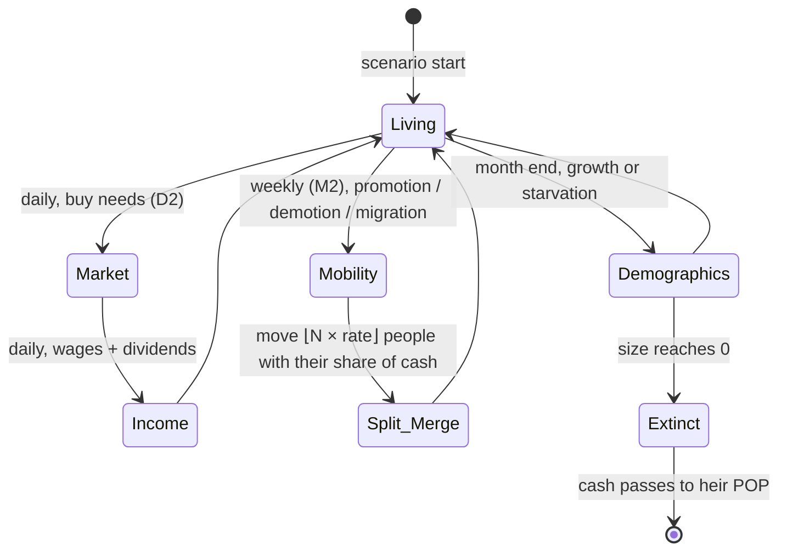
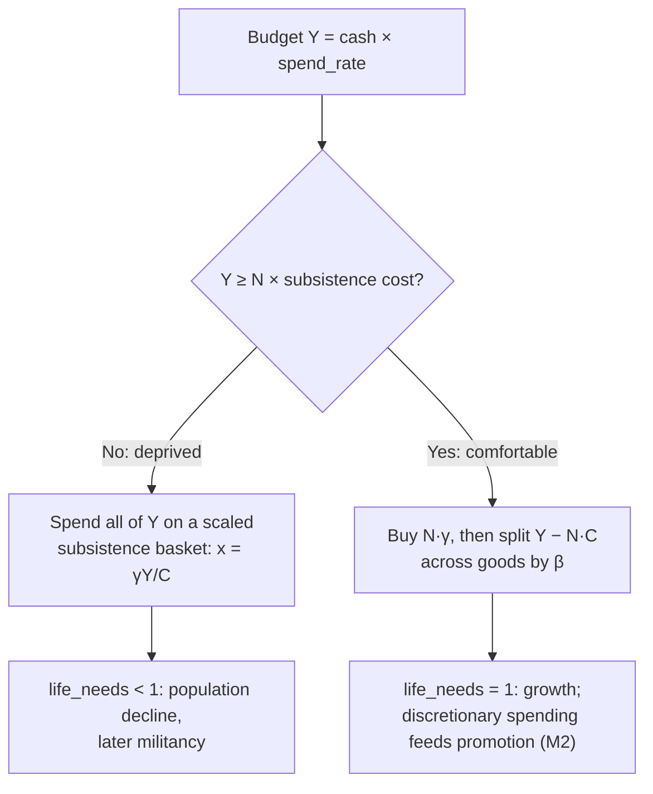

# The POP System (Population Dynamics)

POPs (Portions of Population) are the atomic unit of the simulation: a group of people in one province who share the same characteristics. Binding rules: D2 (demand) and D7 (POP accounting) in [DECISIONS.md](DECISIONS.md).

## 🧬 POP Data Structure

POPs are rows in the `Pops` table ([BACKEND_SCHEMA.md](BACKEND_SCHEMA.md#pops)).

**Identity (key):**
*   **Province.** The market, state and nation are *derived* from the province, never stored on the POP.
*   **Profession:** e.g. farmer, labourer, craftsman, clerk, capitalist, aristocrat, soldier.
*   **Culture** and **Religion** *(M2)*.

**State:**
*   **Size:** number of people.
*   **Cash:** the POP's **total** holdings, not per capita. Money stays with the survivors when size changes.
*   **Life needs:** subsistence satisfaction `[0, 1]` from the last market day.
*   *M2:* **Literacy** (promotion chance, research), **Militancy** (likelihood of rebelling) and **Consciousness** (demand for reforms). All are `Fixed`, never floats (D3).

## 🔄 POP Lifecycle

## 🛒 Needs System (D2)

Victoria 2's three tiers map onto a single Stone-Geary (Linear Expenditure System) demand function. They are no longer three separate shopping passes.

| Tier | In data | Behaviour |
|---|---|---|
| **Life needs** (grain, fish) | `subsistence` γ | Bought first. If the budget cannot cover them, the whole budget buys a scaled-down basket and `life_needs < 1`. |
| **Everyday needs** (clothes, furniture) | `preference` β on common goods | Bought from discretionary income `Y − N·C`. |
| **Luxury needs** (liquor, coffee, cars) | `preference` β on luxury goods | Same formula. Richer POPs have more discretionary income, so luxury demand rises with wealth automatically. |

### Consumption logic

If a market is short, every buyer receives the same fraction of what it asked for (D1), so `life_needs` reflects market scarcity as well as poverty.

## 📈 Demographics (month end)

- Rate: `+growth_rate` when `life_needs = 1`, otherwise `−starvation_rate × (1 − life_needs)`.
- `ΔN = ⌊N × rate⌋`, a deterministic flow with no dice rolls.
- Cash is unchanged: survivors inherit. If a POP dies out, its cash passes to the largest living POP in the same province, so money is never destroyed (D5).

## 🔀 Labour Mobility (D18)
Each month, within a province, unemployed workers move to professions with vacancies, taking their share of cash with them. See [DECISIONS.md D18](DECISIONS.md#d18-labour-mobility). Migration between provinces and promotion to higher strata come later.

## 🧮 Merging and Splitting (M2)

Merging and splitting keep the number of POP rows bounded:

*   **Splitting:** when `⌊N × rate⌋` people promote, migrate or are conscripted, they move to the POP with the target identity. A new row is created only if none exists; lookup goes through a sorted identity index, never a `HashMap` (D3). They take cash in proportion to their share of the POP, split by largest remainder.
*   **Merging:** below a size threshold (e.g. 50 people) a POP merges into the most similar POP in the province. Cash adds up. Literacy and militancy become size-weighted averages in `Fixed`.
*   Rows are compacted at month end so that row indices stay dense.
