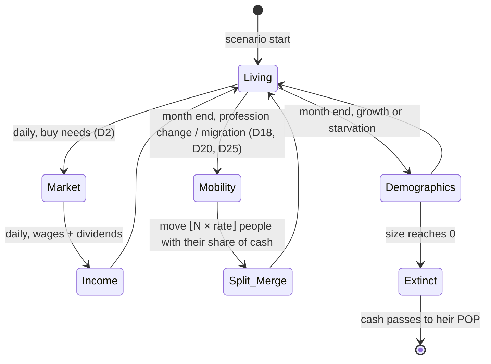
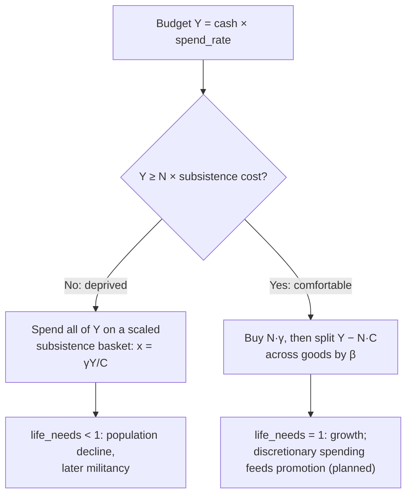

# The POP System (Population Dynamics)

POPs (Portions of Population) are the atomic unit of the simulation: a group of people in one province who share the same characteristics. Binding rules: D2 (demand) and D7 (POP accounting) in [DECISIONS.md](DECISIONS.md).

## 🧬 POP Data Structure

POPs are rows in the `Pops` table ([BACKEND_SCHEMA.md](BACKEND_SCHEMA.md#pops)).

**Identity (key):**
*   **Province.** The market, state and nation are *derived* from the province, never stored on the POP.
*   **Profession:** e.g. farmer, labourer, craftsman, clerk, capitalist, aristocrat, soldier.
*   **Culture** and **Religion** *(planned; needs a decision, none drafted)*.

**State:**
*   **Size:** number of people.
*   **Cash:** the POP's **total** holdings, not per capita. Money stays with the survivors when size changes.
*   **Life needs:** subsistence satisfaction `[0, 1]` from the last market day.
*   **Militancy:** `[0, 1]`, updated monthly from hunger and taxes (D19); no effects yet.
*   *Planned (needs a decision, none drafted):* **Literacy** (promotion chance, research) and **Consciousness** (demand for reforms).

Every one of these is `Fixed`, never a float (D3).

### 💼 Planned: Workforce Composition and Labor Laws

> [!NOTE]
> **Status: planned, not implemented.** Today a POP has one `size` (above), and D2, D7, D18, D20, D25 and D26 are defined on it. Before this is built it needs a decision (a new `D#`): how `size` relates to the columns below (for example `size = workforce_male + workforce_female + dependents`), which column D2's demand, D7's splits and merges, demographics and the D18/D20 labour pools each read, and how a law change moves people between columns under D7's largest-remainder rule. It must also say whether mobilization ([MILITARY_SYSTEM.md](MILITARY_SYSTEM.md)) draws conscripts only from `workforce_male`, and how the split POP's cash is shared when conscripts leave (D7).

The planned split of a POP's size:
*   `workforce_male`: Adult men available for employment or conscription.
*   `workforce_female`: Adult women available for employment (varies heavily by social laws).
*   `dependents`: Children, elderly, and non-working spouses. Dependents consume goods but do not work.

To maintain strict performance budgets (D13), we do not track separate POPs for children or working women. Instead, social dynamics are handled via **Effective Workforce** calculations based on national laws:

*   **Child Labor:** If legal, factories are permitted to hire a percentage of the `dependents` column. This artificially boosts the nation's industrial throughput and the POP's household income. However, during the demographic tick, working children incur a massive penalty to the POP's **Literacy** growth and a slight increase in dependent mortality. 
*   **The Reform Shock:** Passing "Compulsory Schooling" or outlawing child labor instantly removes those dependents from the effective workforce. This creates a fascinating historical dilemma: reforming labor laws causes a sudden, painful economic crash (labor shortages and lower household income) in exchange for the long-term technological dominance driven by high literacy.
*   **Women in the Workforce:** Similar to WW1 mobilization, laws can gradually shift people from the `dependents` pool into the `workforce_female` pool, unlocking massive industrial reserves when male workers are conscripted to the frontlines.

### Future: dependents and births (replaces D26)

> [!NOTE]
> **Status: planned, not implemented.** Today births are a flat `growth_rate` for any fed POP, with D26's band-aid scaling a worker POP's births by its pool's employed share. The owner's intent (2026-10-09) is that **people can't keep their children alive without the money to do so**, so births and child deaths should follow a household's income, not employment as such. This belongs with the `dependents` column above, and needs its own decision.

What it should do, as the owner described it:
*   **Births cost money.** A POP grows only out of income left after its life needs: each new dependent needs life-needs goods the household must be able to buy. A POP whose wages are spread thin (its pooled income barely covers the members it has) has no room for children, whatever its employment.
*   **Dependents die first.** When a POP can't meet its life needs, the shortfall kills dependents (children, the elderly) before workers, so the workforce falls only after them. Today starvation shrinks `size` as a whole, which empties a profession's workforce directly (the miners' year-1 famine in `two_states` lost about a third of them in a year).
*   **Dependents age into the workforce** over years, so a baby boom reaches the labour market later and a famine's missing children show up as a later labour shortage.
*   **Unemployed households** have only their savings and transfers (D15) for their dependents, so unemployment, not just low wages, limits births.

Open questions for its decision: how `size` splits into workers and dependents (the columns above), what a dependent consumes (a share of D2's subsistence?), the ageing rate, which column D18/D20/D25 move, how a POP's income is divided between its members' needs, and how D26 is retired (the bands in `pax_data/tests/economic_bands.rs` will move).

## 🔄 POP Lifecycle

## 🛒 Needs System (D2)

Victoria 2's three tiers map onto a single Stone-Geary (Linear Expenditure System) demand function. They are no longer three separate shopping passes.

| Tier | In data | Behaviour |
|---|---|---|
| **Life needs** (grain, fish) | `subsistence` γ | Bought first. If the budget cannot cover them, the whole budget buys a scaled-down basket and `life_needs < 1`. |
| **Everyday needs** (clothes, furniture) | `preference` β on common goods | Bought from discretionary income `Y − N·C`. |
| **Luxury needs** (liquor, coffee, cars) | `preference` β on luxury goods | Same formula. Richer POPs have more discretionary income, so luxury demand rises with wealth automatically. |

### Consumption logic

If a market is short, every buyer receives the same fraction of what it asked for (D1), so `life_needs` reflects market scarcity as well as poverty.

## 📈 Demographics (month end)

- Rate: `+growth_rate` when `life_needs = 1`, otherwise `−starvation_rate × (1 − life_needs)`.
- **Births band-aid (D26, temporary):** with `births_need_employment`, a worker POP's growth is scaled by its pool's employed share, `min(1, jobs ÷ workforce)`, so people without an income don't raise children. Owner professions and starvation are unchanged. It stands in for the dependents model below ("Future: dependents and births") and goes when that is built.
- `ΔN = ⌊N × rate⌋`, a deterministic flow with no dice rolls.
- Cash is unchanged: survivors inherit. If a POP dies out, its cash passes to the largest living POP in the same province, at that month end or the first one after anyone lives there, so money is never destroyed or frozen (D5, D7).

## 🔀 Labour Mobility (D18)
Each month, within a province, unemployed workers move to professions with vacancies (D18). Then surplus workers migrate to provinces of the same market that have vacancies in their profession (D20). Then any surplus still left moves to vacancies of another profession in another province of the market (D25), the case neither D18 nor D20 can reach. All three take their share of cash with them. Migration across markets and promotion to higher strata come later.

## 🧮 Merging and Splitting

Merging and splitting keep the number of POP rows bounded:

*   **Splitting:** when `⌊N × rate⌋` people promote, migrate or are conscripted, they move to the POP with the target identity. A new row is created only if none exists; lookup goes through a sorted identity index, never a `HashMap` (D3). They take cash in proportion to their share of the POP, split by largest remainder.
*   **Merging:** below a size threshold (e.g. 50 people) a POP merges into the most similar POP in the province. Cash adds up. Literacy and militancy become size-weighted averages in `Fixed`.
*   **Implemented:** rows are compacted at month end (`World::compact_pops`). Rows sharing `(province, profession)` merge and empty, cashless rows are dropped, so row indices stay dense.
*   **Planned (needs a decision, none drafted):** merging *small* POPs into the most similar identity (needs culture and religion columns).
