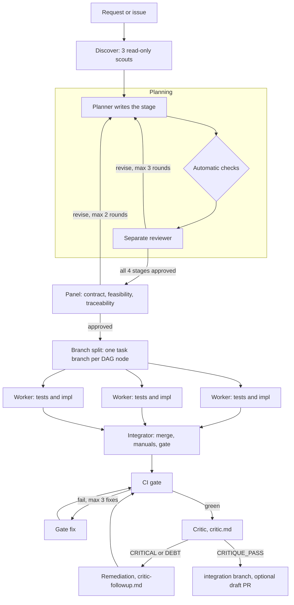
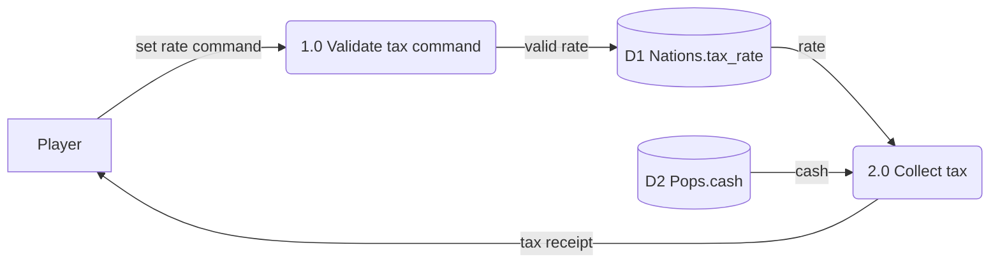
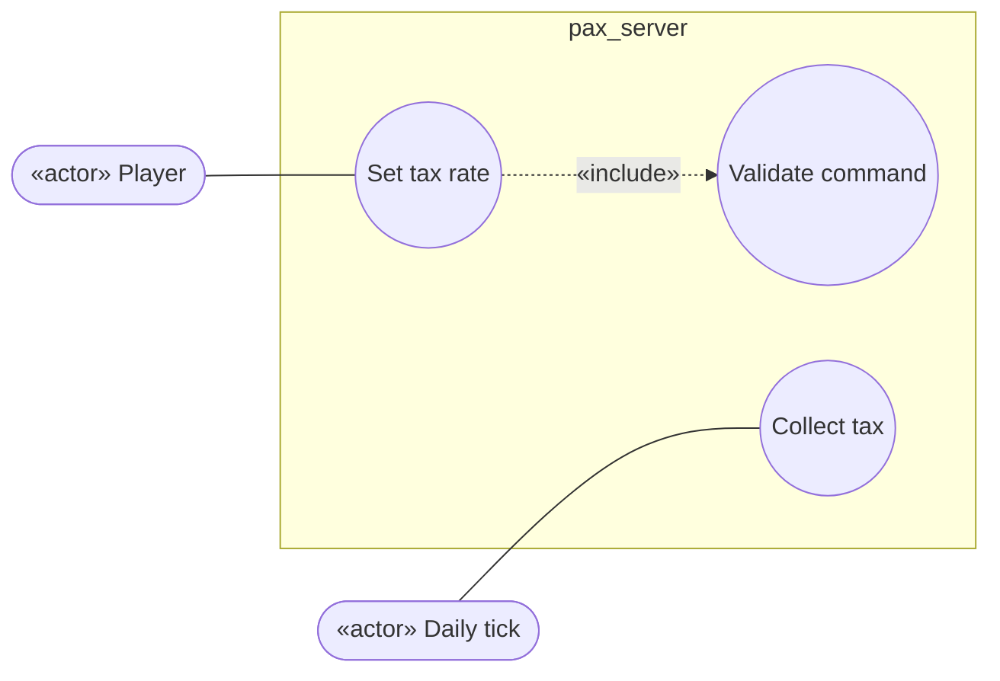
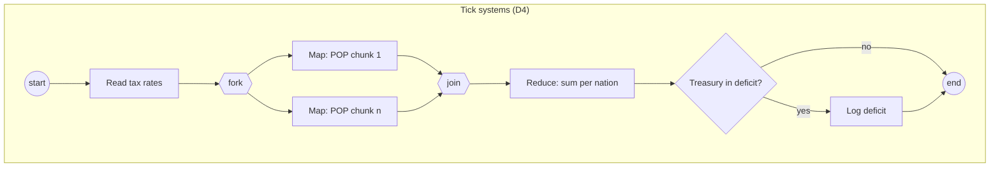
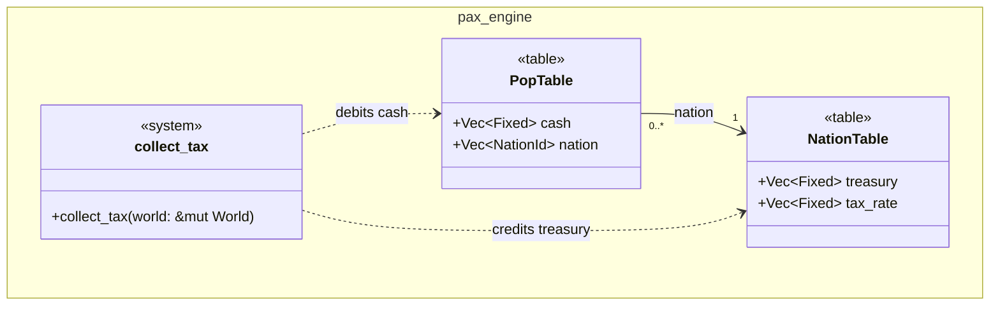
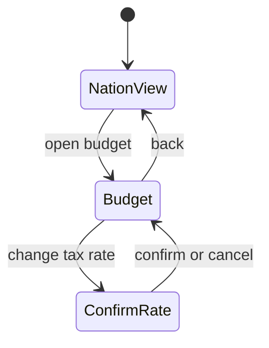
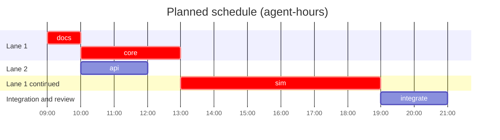
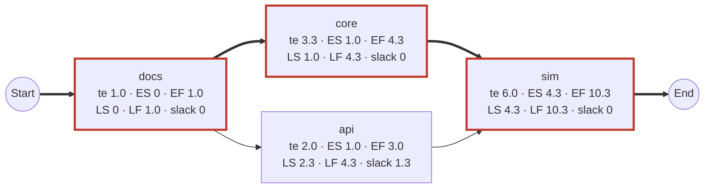

# SDLC Workflow

`.claude/workflows/sdlc-feature.js` is a Claude Code workflow that takes a feature from request to a reviewed integration branch. Most of its weight is on **planning**: a planner agent writes a full set of systems-analysis deliverables (service request, charter, requirements and system specifications, baseline project plan, and the standard diagrams). A **separate reviewer agent** gates every stage, and three more reviewers sign off on the whole plan. Only then do workers build the task DAG on parallel branches. An integrator merges their branches, a CI gate checks the result, and the [critic](../.claude/commands/critic.md) reviews it, with up to three remediation cycles.

It is the local, multi-agent counterpart of the [Claude Feature Pipeline](CLAUDE_FEATURE_PIPELINE.md). It never merges anything: the integration branch, or a draft PR, is where a human takes over.

## Running it

Ask Claude Code to run the `sdlc-feature` workflow with arguments, for example *run the sdlc-feature workflow with `{"issue": 71, "planOnly": true}`*. Workflows run in the background; `/workflows` shows progress.

| Argument | Default | Meaning |
|---|---|---|
| `request` or `issue` | (one required) | The request as text, or a GitHub issue number (read with `gh`, treated as data) |
| `slug` | `issue-<n>` | Names the branches and the workbook directory. Required with `request` |
| `planOnly` | `false` | Stop once the plan is approved, so a human can read it first |
| `fromPlan` | `false` | Skip planning and build the approved plan on `plan/<slug>` |
| `base` | `main` | Branch to plan from and to judge against |
| `maxPlanRounds` / `maxPanelRounds` | 3 / 2 | Planner–reviewer rounds per stage / for the whole-plan panel |
| `maxTasks` | 8 | Upper bound on the task DAG, which bounds the build's cost |
| `maxCycles` | 3 | Critic–remediation cycles |
| `push` / `pr` | `false` | Push the integration branch / also open a draft PR |

For anything non-trivial, run with `planOnly: true`, read the workbook on `plan/<slug>`, then run again with `fromPlan: true`. That is this workflow's version of the feature pipeline's plan-approval checkpoint.

## Planning

The planner writes the **Project Workbook** in `docs/workbooks/<slug>/` on branch `plan/<slug>`, one stage at a time. Each page carries a status banner: the workbook is a planning record, not a binding document. Rules move to [DECISIONS.md](DECISIONS.md) and mechanism to the system documents as the feature lands (one home per fact, [README.md](README.md)).

| Stage | Deliverables | Diagrams |
|---|---|---|
| 1. Initiation | `README.md`, the Project Workbook (deliverable register, correspondence log, change requests, review log, standards); `01-system-service-request.md` (requester, problem statement, service requirements, urgency, sponsorship); `02-project-charter.md` (objectives, scope, stakeholders, assumptions, target dates) | |
| 2. Analysis | `03-requirements-specification.md`: requirements `R-F`/`R-N`/`R-D` with priority and verification, data rules, process logic in `Fixed` terms | context and level-0 DFDs (level-1 where needed), use case, activity, ERD |
| 3. Design | `04-system-specification.md`: architecture, proposed decisions, physical data design, interface specifications, technology acquisition, test design | class, dialogue (or a stated reason it doesn't apply) |
| 4. Baseline plan | `05-baseline-project-plan.md` (scope statement, feasibility, management, resources, risks, work breakdown); `tasks.json`, the task DAG; `06-user-and-technical-documentation.md` (outline) | Gantt, PERT/CPM network |

Each stage runs as a loop:
1. **The planner** (maximum reasoning effort, briefed by three scouts on the contract, the code and the risks) writes the stage and commits.
2. **Automatic checks** run on the planner's returned data, in the workflow script, not by an agent:
   - every required diagram is reported;
   - requirement ids are well-formed and unique;
   - the task DAG is acyclic and its dependencies exist;
   - every task traces to requirements and has acceptance tests;
   - every must-have requirement is implemented by some task;
   - tasks that can run in parallel own disjoint files;
   - the critical path and expected duration match what the workflow recomputes from the PERT estimates.
3. **The reviewer** is a separate agent with no stake in the plan. It reads the files at that commit, checks every cited `file:line`, checks the plan against AGENTS.md and DECISIONS.md, renders the diagrams, and returns findings as blocking, major or minor.
4. The stage passes only with no automatic issue, no blocking or major finding, and no open question for a human. Otherwise the findings go back to the planner, who records in the workbook's review log how each one was handled.

When all four stages pass, a **panel** of three reviewers reads the whole plan, each through one lens: contract fit, feasibility and schedule, and traceability and completeness. All three must approve. A plan that is still rejected after the last round stops the workflow before any code is written, and the workflow returns the open findings.

## Diagram conventions

Every diagram is Mermaid in its own fenced block under its own heading, so GitHub renders it and `scripts/render-mermaid.sh` can check it. The examples below are minimal and render with the pinned mermaid-cli.

| Diagram | Mermaid type | Rules |
|---|---|---|
| Data flow (context, level 0, level 1) | `flowchart LR` | External entity `["name"]`, process `("1.0 name")`, data store `[("D1 table.column")]`. Every process has an input and an output; no flow joins two stores or two entities; every flow is labelled; levels balance |
| Use case | `flowchart LR` | Actor `(["«actor» name"])`, use case `(("name"))` inside a `subgraph` system boundary, include/extend as labelled dotted edges |
| Activity / BPMN | `flowchart TD` | Start and end `(( ))`, decision `{ }`, fork and join `{{ }}`, swimlanes as subgraphs |
| Entity–relationship | `erDiagram` | As in [DATA_MODEL_M5_M6.md](DATA_MODEL_M5_M6.md#how-to-read-the-diagrams): entities are struct-of-arrays tables (D8), relationships are row-index columns |
| Class | `classDiagram` | Tables `<<table>>` with `Vec` columns, systems `<<system>>` with their signature, crates as namespaces. No inheritance between simulation entities (D8) |
| Dialogue | `stateDiagram-v2` | Screens or prompts as states, user actions as transitions; an ASCII wireframe per screen beside it |
| Gantt | `gantt` | `dateFormat YYYY-MM-DD HH:mm`, hours, `after` for dependencies, `crit` on the critical path; the integrator adds an actual section |
| PERT/CPM | `flowchart LR` | Start and End nodes, one node per task with te, ES–EF, LS–LF and slack; critical edges `==>` and class `crit` |

## Build, integration and review

| Step | Branch | What happens |
|---|---|---|
| Workers | `task/<slug>/<id>` from `plan/<slug>` | A worker starts as soon as its own dependencies finish, and merges their branches first. It writes the contract's acceptance tests first, then the implementation, within the files it owns. It reports any departure from its contract as a change request. A failed task is retried once; tasks that depend on it are not started, and the workflow stops before integration |
| Integrator | `integration/<slug>` from `plan/<slug>` | Merges the task branches in dependency order and resolves conflicts by the interface specifications. It records the change requests, adds the actual schedule beside the planned Gantt chart, writes the user and technical documentation into their homes, runs the full gate and fixes failures. It re-records golden hashes only if the plan says results change |
| CI gate | integration | The commands of `.github/workflows/ci.yml` that run without Godot, the bench runner or nightly fuzzing, plus the Mermaid render. A separate agent runs them and reports; a fix agent repairs failures, at most 3 times |
| Critic | integration | `critic.md`, judged against the base branch's contract, scoped to `<base>...HEAD` |
| Remediation | integration | `critic-followup.md` from its triage step: fix CRITICAL, fix DEBT or leave it with a reason and a drafted waiver, apply cheap suggestions, re-run the gate. Then the critic reviews again, at most 3 cycles |

Every agent works in its own throwaway worktree; writers commit and then detach, so the next agent can check out the same branch. Builds share one cache in `target/sdlc`.

The workflow returns a `status`:
- `ready`: critic pass;
- `ready-needs-waiver`: only DEBT left, each with a reason and a drafted `critic-waive:` line;
- `plan-approved` (`planOnly`);
- `plan-not-approved`, `build-incomplete`, `integration-failed`, `gate-failed`, `critic-blocked`, `critical-disputed`: each comes with the findings or output to act on.

## Guard rails

| Risk | Protection |
|---|---|
| Building on a weak plan | Nothing is built until four stage reviews and a three-lens panel approve, and the script's own DAG, critical-path and traceability checks pass |
| Planner and reviewer agreeing too easily | They are separate agents. The reviewer gets the planner's summary as data, not evidence, and must check the files and cited code itself |
| Prompt injection via the issue or agents' output | Issue text, worker reports and critic reviews are passed as quoted data, never as instructions |
| Touching `main` or the user's checkout | Agents work in their own worktrees on `plan/`, `task/` and `integration/` branches. Nothing is merged, and nothing is pushed unless `push` or `pr` is set |
| The critic judging by rules the change itself edited | The critic reads `AGENTS.md`, `DECISIONS.md` and `critic.md` from the base branch. No waivers apply in a local run, and agents only draft them |

Leftover worktrees can be listed with `git worktree list` and removed with `git worktree remove <path>`; branches are deleted with `git branch -D plan/<slug> task/<slug>/<id> integration/<slug>` once merged or abandoned.
