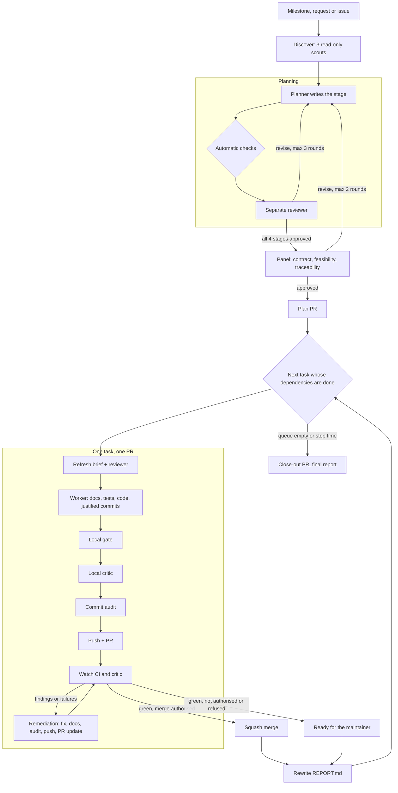
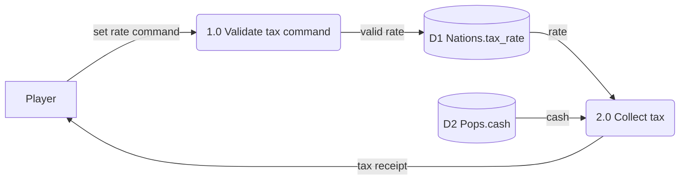
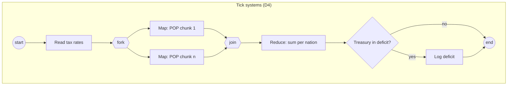
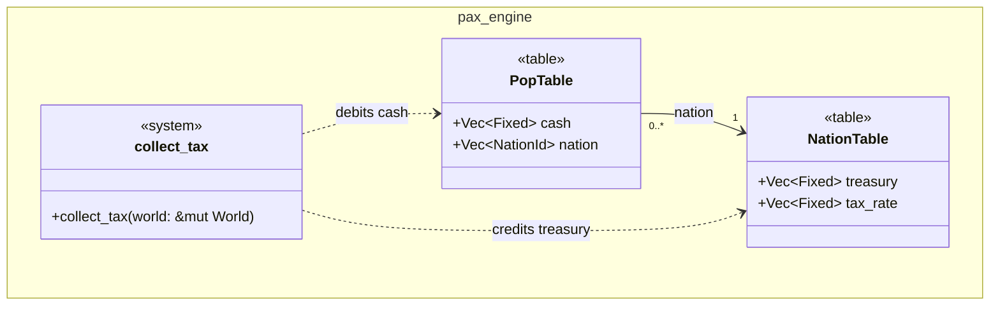
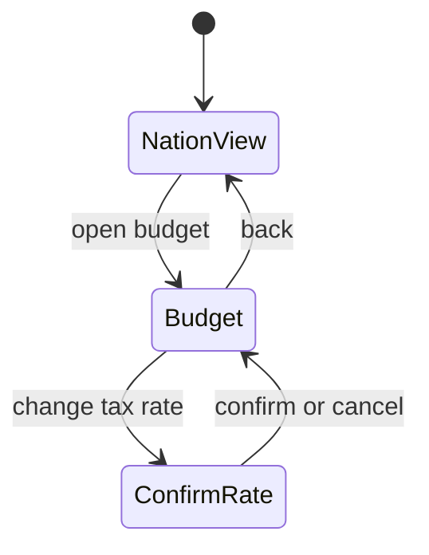
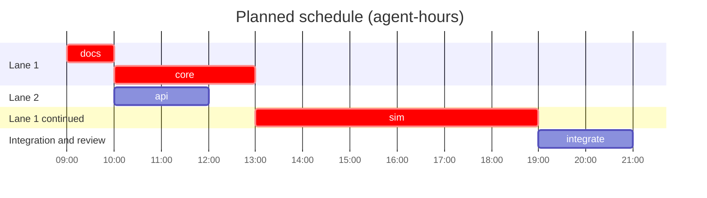
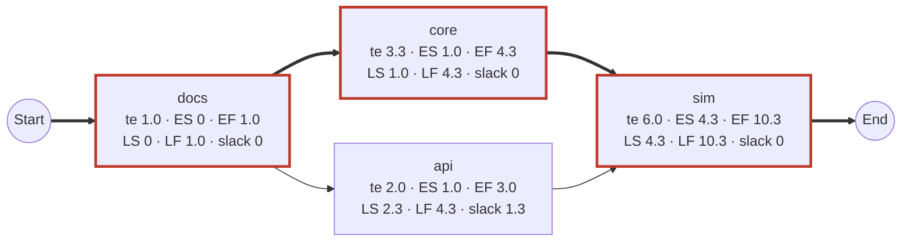

# SDLC Workflow

`.claude/workflows/sdlc-overnight.js` is a Claude Code workflow that runs a milestone unattended, the way the M3 and M4 overnight runs did. Agents carry out the whole software engineering cycle on their own:
1. They plan the run, and a separate reviewer approves the plan.
2. They build one pull request per task.
3. They pass the local gate, then CI and the [critic](../.claude/commands/critic.md), fixing what they find.
4. They merge when the maintainer has authorised it.

The documentation is updated at every step, every commit explains why it exists, and every pull request describes what it did and how it was reviewed. The run keeps a timestamped log and a morning report that is current at any moment.

Most of the weight is on **planning**:
- A planner agent writes a full set of systems-analysis deliverables (service request, charter, requirements and system specifications, baseline project plan, and the standard diagrams).
- A **separate reviewer agent** gates every stage, and three more reviewers sign off on the whole plan.
- The approved plan is the run's first pull request.
- Before each task is built, the planner refreshes its brief against the code as it then is, and the reviewer checks it again.

It is the local, multi-agent counterpart of the [Claude Feature Pipeline](CLAUDE_FEATURE_PIPELINE.md), and it follows the same [critic rules](../AGENTS.md#9-critic-feedback).



## Running it

Ask Claude Code to run the `sdlc-overnight` workflow with arguments, for example *run the sdlc-overnight workflow with `{"milestone": "docs/MILESTONE_5.md", "stopAt": "2026-10-11T07:00:00+08:00", "merge": true, "decisions": "the Proposed trade decision is accepted as written"}`*. Workflows run in the background; `/workflows` shows progress, and `out/<slug>-run/LOG.md` shows what the agents did.

| Argument | Default | Meaning |
|---|---|---|
| `milestone`, `request` or `issue` | (one required) | A milestone document (its task table becomes the queue), a request as text, or a GitHub issue number. Issue text is treated as data |
| `slug` | `m<n>` from the milestone, or `issue-<n>` | Names the branches (`<slug>/plan`, `<slug>/<task>`), the workbook and the run directory |
| `stopAt` | none | ISO 8601 with an offset. After it, nothing new starts; an in-flight PR gets one last check, then the final report |
| `merge` | `false` | The maintainer's authorisation to squash-merge a PR when every required check is green and the critic passes or skips |
| `decisions` | none | The maintainer's decisions for this run, quoted to every agent, for example a Proposed decision accepted for the night |
| `parallel` | 1 | PRs in flight at once. 1 is how the overnight runs worked |
| `planOnly` / `fromPlan` | `false` | Stop once the plan is approved / skip planning and run the approved plan (on `main` or `<slug>/plan`), skipping tasks already ticked |
| `localCritic` | `true` | Run `critic.md` locally before each push, as well as the CI critic |
| `maxPlanRounds` / `maxPanelRounds` / `maxReviewRounds` / `maxTasks` | 3 / 2 / 6 / 12 | Bounds on planning rounds, PR review rounds and the queue |
| `base` | `main` | Branch to build from and judge against |

**Merge authorisation.** Without `merge`, the run publishes the plan's PR and builds every task as a local branch stacked on it: gated and audited, but not pushed (the M3 rule: push only once the base has merged). Merge the plan PR in the morning, then run again with `fromPlan: true`. The auto-mode permission classifier has refused `gh pr merge` from Claude before. If it does, the merge agent reports the refusal, the PR is left ready, and dependent tasks stack on it. An allow rule for `gh pr merge` in the project's settings avoids this.

## Planning

The planner writes the **Project Workbook** in `docs/workbooks/<slug>/` on branch `<slug>/plan`, one stage at a time. Each page carries a status banner: the workbook is a planning record, not a binding document. Rules move to [DECISIONS.md](DECISIONS.md) and mechanism to the system documents as the work lands (one home per fact, [README.md](README.md)).

| Stage | Deliverables | Diagrams |
|---|---|---|
| 1. Initiation | `README.md`, the Project Workbook (deliverable register, correspondence log, change requests, review log, run rules); `01-system-service-request.md` (requester, problem statement, service requirements, urgency, sponsorship); `02-project-charter.md` (objectives, scope, stakeholders, assumptions, target dates, authorisation) | |
| 2. Analysis | `03-requirements-specification.md`: requirements `R-F`/`R-N`/`R-D` with priority and verification, data rules, process logic in `Fixed` terms | context and level-0 DFDs (level-1 where needed), use case, activity, ERD |
| 3. Design | `04-system-specification.md`: architecture, decisions (accepted, run decision, or blocking), physical data design, interface specifications, technology acquisition, test design | class, dialogue (or a stated reason it doesn't apply) |
| 4. Baseline plan | `05-baseline-project-plan.md` (scope statement, feasibility, management, resources, risks, work breakdown); `tasks.json`, the task queue, one PR per task; `06-user-and-technical-documentation.md` (outline) | Gantt, PERT/CPM network |

Each stage runs as a loop:
1. **The planner** (maximum reasoning effort, briefed by three scouts on the contract, the code, the risks and earlier runs' reports) writes the stage and commits.
2. **Automatic checks** run on the planner's returned data, in the workflow script, not by an agent:
   - every required diagram is reported;
   - requirement ids are well-formed and unique;
   - the task DAG is acyclic and its dependencies exist;
   - every task traces to requirements and has acceptance tests;
   - every must-have requirement is implemented by some task;
   - with `parallel` above 1, tasks that can run together own disjoint files;
   - the critical path and expected duration match what the workflow recomputes from the PERT estimates.
3. **The reviewer** is a separate agent with no stake in the plan. It reads the files at that commit, checks every cited `file:line`, checks the plan against AGENTS.md, DECISIONS.md and the run rules, renders the diagrams, and returns findings as blocking, major or minor.
4. The stage passes only with no automatic issue, no blocking or major finding, and no open question for the maintainer. Otherwise the findings go back to the planner, who records in the workbook's review log how each one was handled.

When all four stages pass, a **panel** of three reviewers reads the whole plan, each through one lens: contract fit, feasibility and schedule, and traceability and completeness. All three must approve. A plan that is still rejected stops the run before anything is published. Once approved, the planner marks the workbook approved, adds the design's proposed decisions to DECISIONS.md as *Proposed*, and writes the run's local `PLAN.md`.

## Diagram conventions

Every diagram is Mermaid in its own fenced block under its own heading, so GitHub renders it and `scripts/render-mermaid.sh` can check it. The examples below are minimal and render with the pinned mermaid-cli.

| Diagram | Mermaid type | Rules |
|---|---|---|
| Data flow (context, level 0, level 1) | `flowchart LR` | External entity `["name"]`, process `("1.0 name")`, data store `[("D1 table.column")]`. Every process has an input and an output; no flow joins two stores or two entities; every flow is labelled; levels balance |
| Use case | `flowchart LR` | Actor `(["«actor» name"])`, use case `(("name"))` inside a `subgraph` system boundary, include/extend as labelled dotted edges |
| Activity / BPMN | `flowchart TD` | Start and end `(( ))`, decision `{ }`, fork and join `{{ }}`, swimlanes as subgraphs |
| Entity–relationship | `erDiagram` | As in [DATA_MODEL_M5_M6.md](DATA_MODEL_M5_M6.md#how-to-read-the-diagrams): entities are struct-of-arrays tables (D8), relationships are row-index columns |
| Class | `classDiagram` | Tables `<<table>>` with `Vec` columns, systems `<<system>>` with their signature, crates as namespaces. No inheritance between simulation entities (D8) |
| Dialogue | `stateDiagram-v2` | Screens or prompts as states, user actions as transitions; an ASCII wireframe per screen beside it |
| Gantt | `gantt` | `dateFormat YYYY-MM-DD HH:mm`, hours, `after` for dependencies, `crit` on the critical path; the integrator adds an actual section |
| PERT/CPM | `flowchart LR` | Start and End nodes, one node per task with te, ES–EF, LS–LF and slack; critical edges `==>` and class `crit` |














## The task cycle

Tasks run in dependency order, each as soon as its dependencies allow:
- every dependency merged: the task branches from `origin/main` and becomes a PR;
- a dependency finished but unmerged (ready, waiting for a waiver, or in flight at the stop time): the task is built on top of it and kept local;
- a dependency failed, or the task needs a decision that is neither accepted nor among the maintainer's run decisions: the task is blocked.

| Step | Agent | What happens |
|---|---|---|
| Clock | clock | Nothing new starts after `stopAt` |
| Refresh | planner, then reviewer | The task's contract is checked against the code as it is now, earlier tasks having merged. A contract change becomes a change request in the workbook. Cheap critic suggestions queued by earlier PRs are adopted |
| Build | worker | The documentation duty and the commit rules below. A failed build is retried once |
| Gate | gate, gate-fix | The commands of `.github/workflows/ci.yml` that run without Godot, the bench runner or nightly fuzzing, plus the Mermaid render. A separate agent runs them; a fix agent repairs failures at their root cause, at most 3 times |
| Local critic | critic, remediation | `critic.md` against `origin/main...HEAD`, with stale documents and weak commit messages counting as debt; up to 2 rounds before the push |
| Commit audit | auditor, rewording | A separate agent copies every unpushed commit's fields verbatim; the script checks them (below). Failing messages are reworded before anything is pushed, at most twice; pushed commits are never rewritten |
| Publish | publish | Push, then `gh pr create` with the `critic` label, so the CI critic always reviews, and the description below |
| Watch | watcher | `gh pr checks` until settled (up to an hour per round), the failed logs, and the critic's comment for the current head |
| Remediate | remediation, auditor, push | `critic-followup.md` from its triage step, plus CI failures: fix CRITICAL, fix DEBT or leave it with a reason, apply cheap suggestions and queue the rest. Then the gate and the commit audit run, the fixes are pushed, the description's review rounds and evidence are updated, and a triage table is posted. At most 6 rounds |
| Merge | merge | Only with `merge`, every required check green and the critic passing or skipped: `gh pr merge --squash --delete-branch`. A branch behind `main` gets `main` merged in (never a rebase) and goes round again |
| Park | park | A PR the run can't finish gets a comment saying why and what would unblock it, and the `needs-human` or `needs-waiver` label |
| Report | reporter | `REPORT.md` is rewritten from the run state after every task |

After the queue, if anything merged and time remains, a **close-out** PR goes through the same cycle, as M4-10 and #62 did. It brings the milestone status up to date against the definition of done, makes the workbook final (register, actual Gantt bars with PR numbers, review log), finishes the user and technical documentation in their homes, and applies cheap leftover suggestions.

### Documentation duty

The documents describe the system at every commit, not at the end:
1. **Before code:** the documents that describe the intended behaviour (system document, BACKEND_SCHEMA.md, DATA_FORMAT.md, NETWORK_PROTOCOL.md, an accepted decision's text) are updated and committed first.
2. **With code:** rustdoc on every new or changed public item, with the why, the mathematics and its D#.
3. **At the end of the task:**
   - the task's row in the milestone document is ticked with a sentence or two ([README.md](README.md#milestone-lifecycle));
   - the workbook gets a correspondence-log entry, any change request, and the task's actual bar in the schedule.
4. **On every fix:** every document the fix makes stale is updated, and the round goes into the workbook's review log.

### Commit rules

Each commit is one logical step that builds and passes its own tests: documents first, then tests with the code that makes them pass. Every message has this shape:

```text
<area>: <imperative summary, at most 72 characters, no full stop>

Why: <the task id, requirement ids, decisions, or the critic finding it answers>
What: <what changed, by file or module, and how>
Evidence: <tests added or run and their result; gate commands; measurements>
Docs: <documents updated, or "none, because <reason>">
Decisions: <choices made within the contract for the maintainer to check, or "none">

Co-Authored-By: ...
```

The script rejects a commit that:
- misses a field, or has an over-long subject or no `<area>:` prefix;
- has a `Why:` that cites no task, requirement, decision or finding;
- says `Docs: none` without a reason;
- changes code without documentation and gives no reason;
- has no attribution trailer.

### Pull-request description

The sections are Summary, Why, What changed, Documentation updated, Test evidence (the gate as a table), Golden hashes, Decisions made within the contract (please check), and Review rounds (one line per round: CI result, critic verdict, what was fixed or left and why). Every push after review updates the description.

### The run directory

`out/<slug>-run/` in the maintainer's checkout is git-ignored, as in the M3 and M4 runs:
- `PLAN.md`: the run rules, stop time, authorisation, run decisions and queue, written when the plan is approved;
- `LOG.md`: one timestamped line per event, appended by every agent;
- `REPORT.md`: the morning report, rewritten after every task and finalised at the end. Its sections:
  - what was delivered, with PRs;
  - decisions made within the contract (please check);
  - the definition of done;
  - measurements;
  - what remains for the maintainer: PRs to merge, waive or unblock; decisions needed; stacked branches and the commands to finish them; drafted waivers;
  - open suggestions, each with a recommendation.

The workflow returns a `status` (`complete`, `finished-with-open-items`, `plan-approved`, `plan-not-approved`) together with every task's outcome:
- `merged`;
- `ready`: green, waiting for the maintainer to merge;
- `stacked`: built locally on an unmerged base;
- `needs-waiver` or `needs-human`: the PR is labelled and the reason commented;
- `blocked` or `blocked-on-decision`;
- `in-flight` (at the stop time), `not-started` or `failed`.

## Guard rails

| Risk | Protection |
|---|---|
| Building on a weak plan | Nothing is published until four stage reviews and a three-lens panel approve, and the script's own DAG, critical-path and traceability checks pass. Each task's brief is refreshed and reviewed again before it is built |
| Planner and reviewer agreeing too easily | They are separate agents. The reviewer gets the planner's summary as data, not evidence, and must check the files and cited code itself |
| Unexplained changes | The commit auditor and the script gate every push on the commit shape; PR descriptions and the review log record every round |
| Stale documentation | The documentation duty at every step; the local critic counts stale documents as debt; `check_docs.py` and the Mermaid render are in the gate |
| An agent granting itself an exception | The run rules of the M3 and M4 runs are in every writer's prompt. Never `--admin` or a bypass, a push to `main`, a force-push, a rewritten pushed commit, an edit to `critic.yml` or `critic.md`, or the `contract-change` label. Agents act through the maintainer's account, so no agent writes a line starting with `critic-waive` on GitHub; drafted waivers go only into `REPORT.md` |
| Decisions made behind the maintainer's back | Work that needs an unaccepted decision is blocked, not guessed. Choices within the contract are listed for checking in every commit, PR and the report |
| Prompt injection via issues, CI logs or reviews | Issue text, worker reports, CI output and critic reviews are passed as quoted data, never as instructions |
| Touching the maintainer's checkout | Every agent works in its own worktree; the only writes to the checkout are `out/<slug>-run/`. Paths are staged explicitly, never `git add -A` |
| Running past the morning | `stopAt` is checked before every task and every review round |

Leftover worktrees can be listed with `git worktree list` and removed with `git worktree remove <path>`; local branches are `<slug>/*`.
