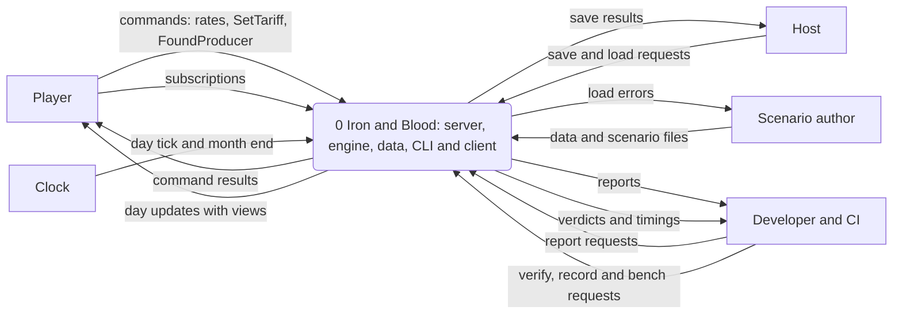
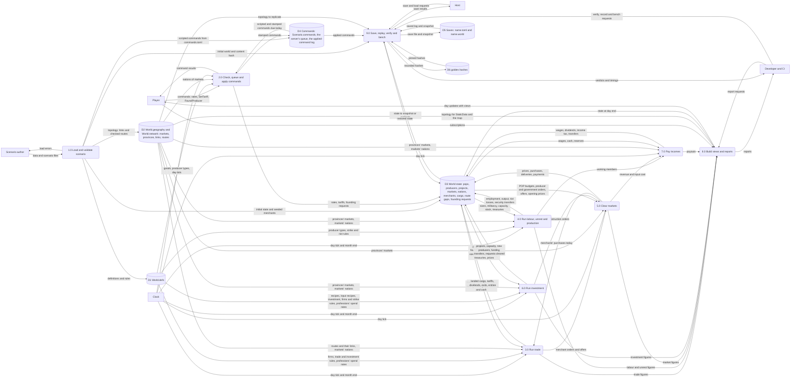
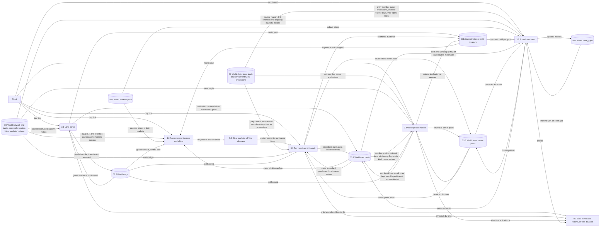
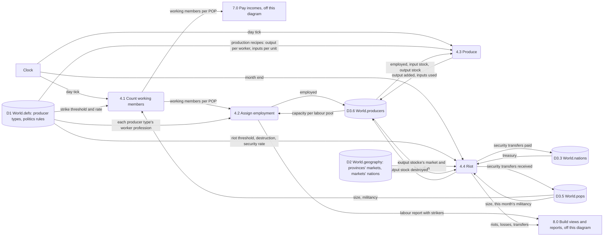
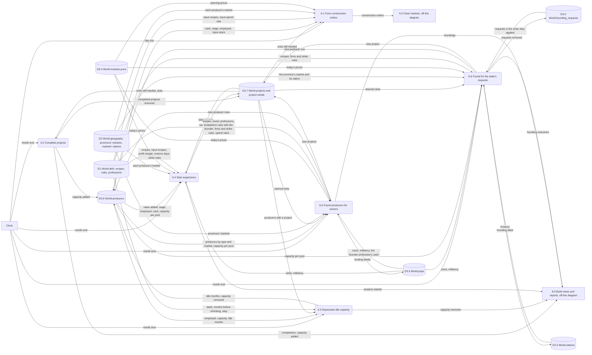
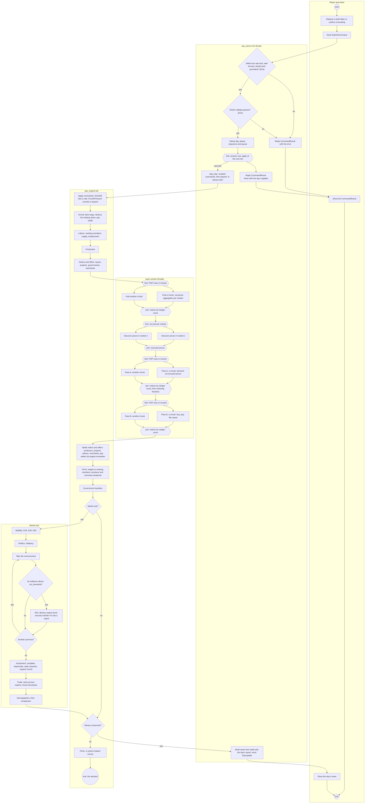
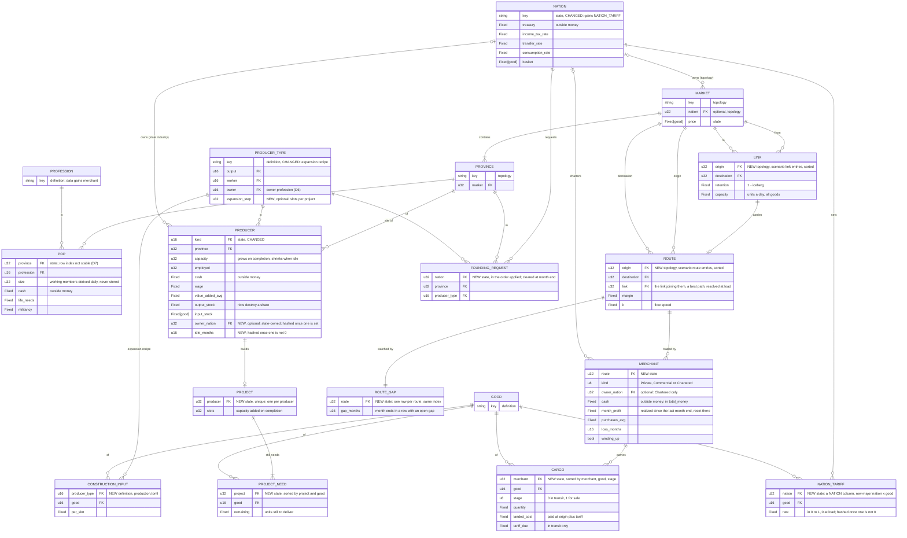

# Requirements Specification: Milestone 5

> [!NOTE]
> **Status: planning record** for the "m5" run, kept by the SDLC workflow (docs/SDLC_WORKFLOW.md). Not binding: the contract wins, and each fact moves to its home as the work lands.

What Milestone 5 must do, not yet how: the Analysis stage of the [Project Workbook](README.md). It turns the [System Service Request](01-system-service-request.md#service-requirements)'s SR-1 to SR-13 and the [charter](02-project-charter.md)'s objectives into testable requirements, gives the rules they need as process logic in `Fixed` terms, and draws the system's data flows, use cases, main activity and data model. Code is cited at `aa2133a`, which the plan's commits don't change; documents are cited as they stand on `m5/plan` at this page's commit. Measurements are from a release build of `aa2133a` on the run's machine (32 cores, `bench` at 8 threads). The month-end day's own time was measured with an uncommitted probe of R-F56's print: `pax_cli` built outside the worktree from `m5/plan`, whose engine is `aa2133a`'s, timing each day of `bench`'s loop ([README](README.md#correspondence-log), 04:21).

This is round 3 of the stage. How each finding of rounds 1 and 2 was handled is in the workbook's review log ([round 1](README.md#analysis-round-1-findings), [round 2](README.md#analysis-round-2-findings)). Round 3 was approved with six minor findings, and Design round 1 corrected this page for them ([round 3](README.md#analysis-round-3-minor-findings)): R-F5, R-F56, R-N26, C29, PL-3 and the level-0 DFD. Design round 2 corrected it for two of the design review's findings ([Design round 1](README.md#design-round-1-findings), 1 and 7): PL-3's "Rows" paragraph, the `D2` store of the level-0 and 3.0 DFDs, and the name `route_gaps`. The whole-plan revision, round 2, corrected it for four of the three-lens panel's findings ([panel, round 1](README.md#whole-plan-panel-round-1-findings), 1, 2, 8 and 9): C14, R-F28, R-D5 and PL-12 now read D27's founders as the market's capitalists, founding only the types they own; C17, R-F38, PL-16 and UC16 split the riot security budget once by `allocate`; R-F31 and R-F35 gain the milestone's inventory-stability and wage-floor checks; and R-N17's crafted-row refusals are listed by task in the design. No requirement was added or renumbered: the workflow checks every task against the requirements approved at Analysis.

## How to read this page

- **Ids:** `R-F<n>` functional, `R-N<n>` non-functional, `R-D<n>` data rules. Each has a testable "shall", its rationale, its source (an SSR row, a milestone task, a decision, a run decision or the charter), a MoSCoW priority and its verification. Ids are stable across rounds: none is renumbered, and those added in round 2 (R-F63 to R-F67, R-N25 to R-N27) follow the last, in the section they belong to. Round 3 adds none; it makes R-F56 a *must* and moves it to M5-1.
- **Priorities:** *must*: the definition of done, a decision or a run decision needs it; *should*: the milestone asks for it, its definition of done doesn't; *won't*: out of this run, listed so nobody builds it.
- **Verification:** T, an automated test, named, and *planned* unless it exists; M, a measurement with its command; I, inspection of code or documents; D, a demonstration such as CI's headless client smoke test. Test names are this stage's, and the Design stage's test design may rename them while keeping the requirement.
- **Names:** tables, columns, rules and messages that M5 adds are named here so the next stages can trace them, in the style of [DATA_MODEL_M5_M6.md](../../DATA_MODEL_M5_M6.md). The Design stage fixes their Rust and schema spelling.
- **Rules are linked, not restated:** a requirement says what the system does and links the decision whose rule it implements. The run decisions are the maintainer's answers of 2026-10-10, quoted in the workbook's [run rules](README.md#run-rules) and recorded in [D17](../../DECISIONS.md#d17-inter-market-trade-routes-merchants-and-tariffs) and [D28](../../DECISIONS.md#d28-economic-unrest-strikes-and-riots).
- **Tasks:** each requirement is traced to the milestone task that builds it ([Traceability](#traceability)). Where several tasks share one, each builds the part it names.

## Choices this page makes within the contract

The decisions and the run decisions leave these points to mechanism ([SSR](01-system-service-request.md#initial-assessment), items 1 and 2). Each is a choice within [D17](../../DECISIONS.md#d17-inter-market-trade-routes-merchants-and-tariffs), [D27](../../DECISIONS.md#d27-capital-investment-and-capacity-expansion), [D28](../../DECISIONS.md#d28-economic-unrest-strikes-and-riots) and the run decisions, for the maintainer to check. None needs a new or amended decision.

| # | Choice | Left open by | Why | Requirements |
|---|---|---|---|---|
| C1 | **Links and one-link routes.** A scenario declares directed `[[link]]`s, each with `τ` and a capacity, and directed `[[route]]`s, each with its `margin` and `k`. Every M5 route is one link: a link joins its two markets in its direction, and the route ships over it, taking its retention and its whole capacity. When a scenario loads, the trade horizon is computed over all links, a route is refused unless its markets are a horizon pair whose best path is its own link, and the horizon is then dropped. Merchants trade only on routes | D17 makes routes the horizon's pairs, each with its own margin and flow speed and no global value, and nothing says where those are written; `TRADE.md:111` puts merchants on direct routes first and multi-hop merchants on horizon pairs after; the SSR asked whether M5's direct routes are exactly one link each (item 1) | A pair needs a declaration to have a margin and `k` without a global value. One link per route keeps the charter's exclusion of multi-hop merchants ([out of scope](02-project-charter.md#out-of-scope)). Requiring the link to be a best path keeps D17's meaning, a route with its horizon pair's retention, exactly. Run decision 2 holds: a one-link route's bottleneck is its link, and since links and routes are each unique in a direction, no two routes share a link, so none shares its capacity. The rule starts to bite with multi-link routes, the follow-up | R-F1 to R-F4, R-F61, R-D2, R-D14, R-N20 |
| C2 | **A tariff rate per importing nation and good**, set by `SetTariff { nation, good, rate }`, every rate 0 at load | D17 says what a tariff is charged on, not what a rate is set per (SSR item 1, its table) | The SSR's lean: the data model's choice (`DATA_MODEL_M5_M6.md:166`); rates per partner belong with the customs unions that come later (`TRADE.md:114`) | R-F17, R-F18 |
| C3 | **A tariff is assessed at purchase and paid on landing:** fixed at settlement on day T, at the rate in force that day, on the units that will land times day T's executed price in the origin market (on landing day T+1 that is "yesterday's price in the exporting market", D17), and paid at arrival | `TRADE.md:49` charges it at arrival; `DATA_MODEL_M5_M6.md:165` assesses it at purchase | The merchant budgets for it, so its cash always covers it (R-D9), and a rate a command changes overnight can't reprice goods at sea | R-F9, R-F10 |
| C4 | **Merchants' goods are rows of a sparse `Cargo` table** (merchant, good, stage, quantity, landed cost, tariff owed), not per-good columns on `Merchants` | M5-2 (`MILESTONE_5.md:65`) lists `transit`, `stock` and `cost_basis` columns; `DATA_MODEL_M5_M6.md:25` (rule 1) keeps them sparse | Per-good columns on a table that grows with routes cost 72 MB at D13's long-term scale, the matrix D17 avoids | R-F5, R-N19 |
| C5 | **The flow rule's gap is the netback's excess over `p_A × (1 + margin)`**, per unit bought, and the flow fraction is `min(1, gap ÷ p_A ÷ k)`: zero at the margin, the whole capacity share once the relative gap reaches `k` | `TRADE.md:54` doesn't define `gap` (SSR item 2) | Continuous at the threshold, where the other reading jumps to `margin ÷ k` of capacity; it gives the charter's O3b its tolerance (R-F21) | R-F7, R-F21 |
| C6 | **A merchant's reserve is the tariffs it owes plus `firms.reserve_days` of its smoothed daily purchases;** it pays `firms.dividend_payout_rate` of its cash above that, and smooths over `firms.revenue_smoothing_days` | `TRADE.md:61` names "a working-capital reserve" and no rule | D6's reserve is days of the bill a producer pays (wages); a merchant's bill is its purchases. No new rule | R-F14 |
| C7 | **Merchant dividends are paid gross:** no income tax is withheld from them | `TRADE.md:61` asks for "the same income tax (D15)", but D15 withholds tax from producers' payments, and D17's Amends line doesn't list D15 | Extending D15 is an amendment no decision makes; the run builds only on accepted decisions. `TRADE.md:61` is marked *planned: needs D15 amended, none drafted* when trade lands | R-F62 |
| C8 | **Merchant owners by rule:** `trade.private_owner` (`capitalist` in `data/`) and `trade.commercial_owner` (a new `merchant` profession), each paid as the owner pool `(origin market, profession)` | D17 names "the origin market's capitalists" and "a merchant profession"; `data/professions.toml` has none (SSR item 1); `TRADE.md:74` says origin province, but owner pools are per market (`layout.rs:58-62`) | A merchant has no producer type to name an owner profession; a rule keeps profession keys out of the engine | R-F14, R-F57 |
| C9 | **Entry.** A route's gap "persists" when it is open at `trade.entry_months` consecutive month ends, counted in one state column per route. The new merchant's capital is the shortfall to one day of the route's capacity at that day's prices, Private first, then Commercial | D17 ("a route's price gap persists and its merchants' cash can't use its capacity") and `TRADE.md:82` ("smoothed price gap") give no measure | A smoothed gap per route and good would be the dense routes × goods state that rule 1 forbids. The shortfall makes entry gradual, as `TRADE.md:82` wants | R-F16 |
| C10 | **Winding up:** a flag; no purchases; goods offered at any price; cash above the tariffs owed returned at each month end; the row kept | D17 says only that a loss-making merchant is wound up and its cash returns to the owner | Selling off takes days, and returning cash monthly needs no new state | R-F15, R-D15 |
| C11 | **Project state:** no `project_budget` column (the reserve is derived, D7), recipes in `production.toml`, ownership in `owner_nation`, projects and their needs as sparse rows | M5-6 (`MILESTONE_5.md:69`) and `INVESTMENT.md:76-85` name `project_budget`, `producer_types.toml` and `state_owned`; `DATA_MODEL_M5_M6.md:167-170` corrects them | `project_budget` would be a second copy of money in the producer's cash, and `producer_types.toml` doesn't exist | R-F22, R-F23 |
| C12 | **A project's reserve** is its construction goods still needed at today's prices, rounded up, plus `firms.reserve_days` × wage × its slots. **The founding cost** is the same reserve at the D6 wage floor | D27: "its cash covers the project above its reserves", with nothing on a new producer's working capital | Without the wage part a founded producer would pay out its working capital as dividends before it can hire (its wage bill is 0 while it builds), and could never buy its first inputs | R-F23, R-F24, R-F27 to R-F29 |
| C13 | **Construction goods are consumed at settlement, and a project completes at the month-end investment step** | D27: "capacity grows only when they are delivered"; `DATA_MODEL_M5_M6.md:315` labels delivery under production | Delivered goods have nowhere else to go; capacity changing only at month end keeps a month's labour assignment stable. The order of systems is the data model's | R-F25, R-F26, R-F41 |
| C14 | **"The market's capitalists" who found producers (D27) are the market's POPs of one profession, named by the required rule `investment.founder` (`capitalist` in `data/` and in `mini_valley`'s frozen rules), and they found only producer types whose owner profession is that one**, so they are also the new producer's owner pool, which receives its dividends (D6). Each may give its cash above `investment.investor_reserve_days` of its consumption budget, and the cost is split in proportion to what each may give (PL-8). A type owned by another profession (in `data/`, the aristocrats' farms, cotton plantations, vineyards, fisheries and lumber camps, `data/production.toml:8-40`) grows only by expansion from its own retained earnings (PL-9), or by the state's `FoundProducer`. *Restated in the whole-plan revision, round 2* ([panel finding 2](README.md#whole-plan-panel-round-1-findings)): the earlier reading funded every type from its own owner profession, which read "the market's capitalists" more broadly than D27's words | D27: "funded by the market's capitalists or, by command, by the state's treasury"; MILESTONE_5's M5-8 row says the same; profession keys are data, so the engine needs a rule to name the capitalists, as C8 does for merchants | D27's words read literally, in the style of C8's `trade.private_owner`. Funders and dividend recipients stay the same people, as `INVESTMENT.md`'s funder table has it: the market's capitalist owner POPs fund, and the capitalist owner pool receives. Measured on `aa2133a`'s engine with Design 3.7's values ([README](README.md#correspondence-log), 08:36): the highland capitalists can give about 960 to 1,010 and the lowland ones 80 to 140, against founding costs of 84 to 293 for the types they own; the farms that the broader reading would have founded pass PL-9's expansion test themselves (1.25 times their wage bill, 7,120 and 4,785 free above their reserves, 880 and 740 farmers waiting), so R-F33's growth keeps its source | R-F28, R-D5 |
| C15 | **`FoundProducer`** is valid on definitions and topology only (R-D13). Applied, it only records a founding request. At the next month end the investment step takes the requests in the order they applied, before any other founding: one founds a state-owned producer if the treasury covers the founding cost, the pool has `step` unclaimed unemployed workers (PL-8, D27's "a province with unemployed workers") and the province has had no founding that month; otherwise it is dropped and the day's report says why. The state passes no profit test. **It needs no D24 conflict rule:** outside sandbox a nation has one session (D24, Permissions; the lobby refuses a nation another player holds), and a request touches only that nation's treasury and the workers of one of its own provinces, so no other player's command can conflict with it. Sandbox seats command any nation by design, and their requests apply in D24's stamp order, as today's rate commands do: the first founds, and a later one for the same province that month is dropped and reported | D21 checks logged commands against the initial world, so validity can't read the treasury (SSR item 2); D21 keeps checks out of `World::apply`; D24's Order bullet asks a command that "can conflict with another player's" for a conflict rule in its decision, and D27 gives none | Validity that read state would let a command valid in play make its save unloadable (`save.rs:251-266`). The conditions are the month-end founding rule's (`INVESTMENT.md:65-72`), so `apply` checks nothing, and a request waits at most a month. The SSR made the same case for `SetTariff` (Initial assessment, item 1) | R-F29, R-D13, R-D16 |
| C16 | **Strikers, the unemployed and available workers.** A POP's working members are `⌊size × (1 − s)⌋` (PL-15); the rest strike, withholding their labour. A pool's supply is its working members, its employed are `min(supply, jobs)`, and its unemployed are the working members without a job, so its people split into strikers, employed and unemployed. Wages are split by working members. D18 moves the unemployed, who exclude strikers. D27's "unemployed workers" for a new project or producer are the pool's working members beyond its jobs and the slots projects already claim (PL-8), counted when the month-end step runs, after mobility and politics. D20, D25 and D26 keep counting pools by size | Run decision 3 doesn't say who counts as working in a pool with both strikers and unemployed (SSR item 2); D27 says "unemployed workers" | Strikers aren't seeking work, so neither D18 nor investment treats them as unemployed: a project built for them would stand idle while they strike. D20 ("a province whose workforce exceeds its jobs"), D25 (the same) and D26 ("`jobs ÷ workforce`") count people, and D28 amends none of them. With no strike every figure is today's | R-F24, R-F28, R-F29, R-F34 to R-F36, R-F46 |
| C17 | **The riot security transfer** is a rioting province's part of its nation's security budget `B_n = T₀_n.mul(politics.riot_security_rate)`, `T₀_n` being the treasury before any province is paid: `B_n` is split once by `allocate` over every province whose market belongs to the nation, by its people, in province order, as D16 splits a treasury budget across markets by population (`crates/pax_engine/src/systems/market.rs:441-447`). Each rioting province receives its part; the parts of provinces that don't riot stay in the treasury (PL-16). *Restated in the whole-plan revision, round 2* ([panel finding 1](README.md#whole-plan-panel-round-1-findings)): each province's part was a separate rounded-down product, a split of a total without the largest-remainder method that D3 and AGENTS.md §6 require | D28 and `REBELLIONS.md:63` name no size | The parts sum exactly to `B_n` (D3; AGENTS.md §6), so when every province of a nation riots the treasury pays exactly `B_n`, and in any case never more | R-F38 |
| C18 | **Depreciation** never cuts capacity below employment, skips a producer with a project, and reads the month-end day's employment | D27: "capacity in use does not wear out" | "Capacity in use never does" (`INVESTMENT.md:93`) holds by construction | R-F31 |
| C19 | **Month-end step 9 runs:** complete projects, depreciate, found for the state's requests, start expansions, found for owners, wind up merchants, found merchants. Merchant exit and entry run there because entry uses investment's funding rule | `DATA_MODEL_M5_M6.md:324` places investment, not trade's monthly steps | One fixed order; a player's request before the automatic decisions that compete for the same workers, and producer founding before merchant entry when both draw on the same POPs | R-F41 |
| C20 | **New rules are required keys** of `rules.toml`, and `mini_valley`'s frozen `defs/` sets each mechanism off, as D18, D20, D25 and D26 did. Investment gets an `enabled` switch for its automatic decisions (expansion, founding for owners, depreciation); running projects and the state's requests proceed either way | `schema.rs:100-108` refuses unknown fields and has no defaults for sections | The charter's O4 baseline is "investment switched off by its rules", and `mini_valley` must not change (charter A4) | R-F57, R-F59, R-D4 to R-D6 |
| C21 | **Wire names follow the schema's convention:** command tables `SetTariff` and `FoundProducer`, one per engine variant (`common.fbs:47`), for the milestone's `SetTariffCommand` and `FoundProducerCommand` (`MILESTONE_5.md:34`) | The milestone names them in passing | One table per engine command, named after it | R-F44 |
| C22 | **Per-good tariffs reach the client in `TradeRouteView`**, not in the always-sent `NationTable` | `server.fbs:86` sends `NationTable` on every update | 200 nations (the view budget test's, `view.rs:561`) × 50 goods × 8 bytes is 80 KB, five times the 16 KB summary-only budget (D22) | R-F45, R-N14 |
| C23 | **No producer ids on the wire:** a project is shown by its province and producer type; routes get ids in `StaticData`, which is fixed per session (`server.fbs:19-21`) | Founding adds producer rows mid-session, and `StaticData` has no producer table | D22: every id indexes a `StaticData` table fixed for the session | R-F44 to R-F46 |
| C24 | **Construction spends only cash above today's needs:** a project's daily budget is at most the producer's cash less its input orders' budgets, its D6 restart reserve and today's wage bill, at the opening prices (PL-10) | D27 says the cash covers the project above its reserves when it starts, and nothing about the days after; D6's liquidity rule protects inputs from wages, not from construction | Prices can rise after a project starts; with this bound construction slows instead of leaving the producer unable to buy inputs or pay today's wages. D6's dividend reserve, `firms.reserve_days` of wages, is not kept back: dividends already wait until cash exceeds it and the project reserve (PL-11), which is how D27's "reserved before dividends" works | R-F25, R-F27 |
| C25 | **New state is hashed only where it holds something:** each new state table only when it has rows, each new column of an existing table only when a row differs from its default, each behind its own tag; the snapshot carries all of them always (PL-18) | D11 pins golden hashes, and nothing says how new state enters `state_hash`; the charter keeps `mini_valley`'s hashes (A4) | A world without M5's content hashes exactly as before, as a world without nations does (`world.rs:633-641`), so `mini_valley`'s golden file stays valid, and so does `two_states`' until a task changes its results. The rule reads only the state, so a restored snapshot's hash still matches | R-N8, R-N16 |
| C26 | **How this run checks D13:** every task that adds daily or month-end work measures it on one machine before and after its change, beside `aa2133a`'s time there; the cold 29-day window as PERFORMANCE.md measures it, the 30 days through the first month end with that day's own time as R-F56 prints it (C29), and a warmed-up world in which projects run | D13 sets budgets for worlds, not a method; PERFORMANCE.md's command stops before the first month end, and the scaled `two_states` starts no project before it | A task that breaks the budget is caught when it lands, not at M5-15. Only a warm-up can time construction at 1M rows: `--scale`'s copies merge at the first month end (`crates/pax_data/src/bench.rs:8-11`) | R-F56, R-N10, R-N12, R-N25 to R-N27 |
| C27 | **Each command's wire form lands with its engine command:** `SetTariff`'s table, union member, error value, server checks and log and save fields in M5-3, `FoundProducer`'s in M5-8. M5-13 keeps the views, `StaticData.routes` and the subscriptions, and `protocol_minor` rises by one in each pull request that changes the schema | M5-13 lists both commands with the views (`MILESTONE_5.md:76`) | D22: `SubmitCommand` mirrors `pax_engine::Command`. `pax_server` converts commands and errors with exhaustive matches over the engine's enums (`crates/pax_server/src/commands.rs:1-7`, `:32-47`; NETWORK_PROTOCOL §5), and `pax_data` describes every engine command for logs and saves (`crates/pax_data/src/lib.rs:202-211`), so an engine command without its wire and file forms doesn't compile. Holding the engine commands back to M5-13 instead would leave the tariff column and the founding requests writable only by tests until then. M4 raised the minor version once per schema-changing task (NETWORK_PROTOCOL §8's history) | R-F42 to R-F44, R-N15 |
| C28 | **A merchant's loss is its realized profit over the month, summed exactly:** each sale adds its receipts less the landed cost of the units sold, a cargo row written off at arrival subtracts its cost, and at each month end the sum is tested (below 0 is a month of loss) and reset to 0. No smoothed profit is kept | D17 winds merchants up "when loss-making" with no measure; `TRADE.md:83` tests a "smoothed profit" and `TRADE.md:42` keeps a `profit_avg` column, with no rounding rule | A smoothed average stepped by `div_int`, which rounds toward −∞ (`crates/pax_engine/src/fixed.rs:130-134`), never climbs back to 0 from fewer than `revenue_smoothing_days` ulps below it: a merchant whose last trades lost money and that then stopped trading would keep an average a few ulps below 0 for ever, count as loss-making at every month end, and be wound up for rounding alone (round 2, finding 5). A sum of `Fixed` profits rounds nothing, so a month without trade is exactly 0 and never a loss. The losses it counts are real: D1's supply `S(p) = stock × min(1, p/r)` (`crates/pax_engine/src/systems/market.rs:200-217`) sells part of a merchant's stock below its reservation price, and below its landed cost once the destination's price has fallen that far. M5-4 updates `TRADE.md`'s exit bullet and column (R-N23) | R-F5, R-F15 |
| C29 | **The month-end print lands first:** R-F56 is M5-1's first commit, which changes only `pax_cli`, and M5-1 records the baseline at that commit with R-N26's command, so the baseline times `aa2133a`'s engine. The baseline plan makes M5-7 and M5-12 depend on M5-1, so every task that adds month-end work (M5-4, M5-7 to M5-9, M5-12, M5-16) lands after it. Design round 1 makes every other task depend on M5-1 too, directly or through others (Design S8): the baseline times `aa2133a`'s engine only if no engine change lands before it, and M5-6 and M5-11 had no edge to it | No milestone task prints the month-end day; M5-15, which holds the benchmarks, depends on every task (`MILESTONE_5.md:78`) | Deriving that day from the 29- and 30-day means multiplies their run-to-run noise about 40 times, so it can't see a month-end regression of 30 ms (round 2, finding 1). M5-1 depends on nothing and is first in the milestone's table; M5-4 and M5-16 follow it already, and M5-8 and M5-9 follow M5-7. The two new edges only order the queue, which has one pull request in flight at a time (the workflow's `parallel` setting, 1 by default) | R-F56, R-N26 |

## Requirements

### Functional: routes and the trade horizon

| Id | Requirement | Rationale | Source | Priority | Verification |
|---|---|---|---|---|---|
| R-F1 | The loader shall read the scenario's `[[link]]` entries as directed links between markets, each with an iceberg share `τ` and a capacity in units a day, an entry with `both_ways = true` also giving the reverse link the same values. | Run decision 2 presupposes links distinct from routes; today `ScenarioFile` can't describe a connection (`schema.rs:156-179`) | M5-1; [D17](../../DECISIONS.md#d17-inter-market-trade-routes-merchants-and-tariffs) (Routes, Route capacity); C1 | must | T: `crates/pax_data/tests/validation.rs` (planned `links_load_both_ways`, and R-D1's refusals) |
| R-F2 | The loader shall read the scenario's `[[route]]` entries as directed routes between markets, each with its own `margin` and flow speed `k`, an entry with `both_ways = true` also giving the reverse route the same values; no global margin or flow speed shall exist. | D17's per-route tuning | M5-1; D17 (Per-route tuning); C1 | must | T: `validation.rs` (planned `routes_load_with_their_tuning`); I: no `margin` or `k` in `rules.toml` |
| R-F3 | When a scenario loads, the system shall compute the trade horizon by a Dijkstra search from every market over the links, keeping for each source the markets whose best retention `Π(1 − τ)` is at least `trade.min_retention`, with that retention, as a sparse per-market list, and shall check every route against it (R-D2); it shall build no market × market matrix and keep no horizon in the `World`, and no tick system shall search paths. | D14 rule 5 as D17 amends it; AGENTS.md §5 forbids path searches in the tick; in M5 nothing after loading reads the horizon (C1), and derived data isn't kept without a reader (D7) | M5-1; D17 (Routes); [D14](../../DECISIONS.md#d14-market-hierarchy-and-inter-market-trade) rule 5; [AGENTS.md §5](../../../AGENTS.md#5-performance-over-flexibility); [D7](../../DECISIONS.md#d7-pop-accounting); PL-1; C1 | must | T: `crates/pax_engine/tests/trade.rs` (planned `horizon_matches_a_hand_computed_one`, with a two-link path and a pair dropped below `min_retention`; `horizon_is_independent_of_link_order`); I: no search in `tick.rs`'s systems and no horizon in `World` |
| R-F4 | Each route shall ship over the link that joins its markets in its direction, taking that link's retention and its whole capacity; since links and routes are each unique in a direction, no two routes share a link, and no route shares a link's capacity. | Run decision 2: a one-link route's bottleneck is its link (C1) | M5-1; D17 (Route capacity); PL-1; C1 | must | T: `trade.rs` (planned `a_route_takes_its_links_retention_and_whole_capacity`) |

### Functional: merchants

| Id | Requirement | Rationale | Source | Priority | Verification |
|---|---|---|---|---|---|
| R-F5 | The world shall hold a `Merchants` table (one row per merchant: route, `MerchantKind` Private, Commercial or Chartered, owner nation for Chartered, cash, the month's realized profit so far, smoothed purchases, months of loss, winding-up flag) and a `Cargo` table (one row per merchant, good and stage, in transit or for sale: quantity, landed cost, tariff owed). | Merchants hold money (D5) and goods in transit; D17's invariants | M5-2, M5-4; D17 (Owners, Invariants); [D8](../../DECISIONS.md#d8-ecs-hand-rolled-struct-of-arrays); C4, C28 | must | I: `BACKEND_SCHEMA.md` and `World::check_tables`; T: `trade.rs` (planned `merchant_tables_keep_their_invariants`). M5-2 adds both tables with the route, cash and cargo columns; M5-4 adds the kind, owner nation, month's profit, smoothed purchases, months of loss and winding-up flag, which its dividends and exit use, with the month's profit's two hooks: the sale in settlement's hand-off (`trade::book_sales`) and the write-off at arrival (`trade::land_cargo`), both in `trade.rs` (Design S6) |
| R-F6 | The loader shall seed merchants from the scenario's `[[merchant]]` entries, each naming its route by its two markets, its kind and its starting cash; a Chartered merchant is owned by its origin market's nation. | "A scenario may seed starting merchants" (D17); the only source of Chartered merchants in this run (SSR item 3) | M5-4; D17 (Entry and exit); `TRADE.md:75`, `:84-91` | must | T: `validation.rs` (planned `merchants_seed_by_route_and_kind`, and R-D3's refusals) |
| R-F7 | Each day, each merchant not winding up shall place in its route's origin market one D1 buy order for each good whose gap is positive, wanting its share of the route's capacity scaled by the flow rule and budgeted so that the purchase and the tariff it will owe never exceed its cash (PL-2). | D17: merchants are ordinary D1 buyers; D14 rule 2: the flow grows with the gap and is throttled by capacity | M5-3; D17 (Rule); D14 rules 2-3; C5 | must | T: `trade.rs` (planned `export_orders_follow_the_flow_rule`, `a_merchant_never_owes_more_than_its_cash`) |
| R-F8 | Each day, each merchant shall offer its goods for sale in its route's destination market as D1 sell offers, at a reservation price of their landed cost per unit times `1 + margin`, or at any price while it winds up (PL-3). | D17: merchants are ordinary D1 sellers in the destination | M5-3; D17 (Rule); `TRADE.md:56` | must | T: `trade.rs` (planned `imports_are_offered_at_landed_cost_plus_margin`) |
| R-F9 | Settlement shall put the goods a merchant buys in transit with the tariff owed on them, debit their cost from its cash, and on a sale credit the receipts to its cash and remove the goods sold and their share of landed cost from its stock (PL-3). | Today a buyer is a producer or a nation and every seller a producer (`market.rs:175-181`, `:202-208`, `:791-803`, `:809-830`) | M5-3; D17 (Tariffs, Invariants); C3 | must | T: `trade.rs` (planned `settlement_books_purchases_and_sales`); R-N4 |
| R-F10 | At the start of each day, after commands and before labour, all goods in transit shall land in their route's destination: the retained share, rounded down, joins the merchant's goods for sale, the rest is destroyed as iceberg loss, and the tariff owed is paid from the merchant's cash to the destination market's nation (PL-4). | D17: one day of transit, iceberg loss destroys goods never money, tariffs go to the importing treasury | M5-2; D17 (One day of transit, Iceberg loss, Tariffs); C3 | must | T: `trade.rs` (planned `cargo_lands_next_day_less_the_iceberg_share`, `tariffs_reach_the_importing_treasury`), reading R-F54's figures |
| R-F11 | Merchants' buy orders and sell offers shall clear in the same D1 discovery and settlement as everyone else's, so where their demand and local demand together exceed supply, every buyer receives the same fraction. | D14 rule 3: scarce exports are shared pro rata | M5-3; D14 rule 3; [D1](../../DECISIONS.md#d1-market-clearing-bounded-tâtonnement-with-pro-rata-rationing) step 4; `TRADE.md:138` (test 5) | must | T: `trade.rs` (planned `exporters_and_locals_get_the_same_fraction`) |
| R-F12 | The units a route's merchants buy on a day shall never exceed the route's capacity, however many merchants share it. | D14 rule 2: the flow is throttled by capacity | M5-3; `TRADE.md:137` (test 4) | must | T: `trade.rs` (planned `capacity_binds_however_many_merchants`) |
| R-F13 | When no good's gap is positive on a route, its merchants shall place no buy orders, and no merchant shall be founded on it. | No churn without a gap | M5-3, M5-16; `TRADE.md:135` (test 2) | must | T: `trade.rs` (planned `equal_prices_mean_no_trade_and_no_entry`): M5-3 asserts no orders, and M5-16 no entry |
| R-F14 | Each day in the firms step, a merchant shall pay `firms.dividend_payout_rate` of its cash above its reserve (the tariffs it owes plus `firms.reserve_days` of its smoothed purchases) to its owner: a Private merchant to the origin market's POPs of profession `trade.private_owner`, a Commercial one to those of `trade.commercial_owner`, split by size, and a Chartered one to its nation's treasury; with no living owner POPs it keeps the dividend (PL-5). | D17: dividends follow the owner; D6's dividend rule, which D17 amends for merchants | M5-4; D17 (Owners); [D6](../../DECISIONS.md#d6-firms-production-wages-ownership) (Dividends); C6, C7, C8 | must | T: `trade.rs` (planned `each_kind_pays_its_owner`, `TRADE.md:140`'s test 7) |
| R-F15 | A merchant whose realized profit over the month (its sales' receipts less the landed cost of the units sold, less the cost of cargo written off) has been below 0 at `trade.exit_months` consecutive month ends shall wind up: it places no more buy orders, offers its goods at any price, and at each month end pays its cash above the tariffs it owes to its owner as R-F14 routes dividends (PL-6). A month in which it sold nothing and wrote nothing off has a profit of exactly 0, so a merchant that stops trading is never wound up for it. | D17: wound up when loss-making, its cash returning to the owner; an exact monthly sum, so rounding can't make a loss (C28) | M5-4; D17 (Entry and exit); C10, C28 | must | T: `trade.rs` (planned `a_loss_maker_winds_up_and_returns_its_cash`; `an_idle_merchant_is_never_wound_up`: with `trade.exit_months` of 2 or more, a merchant whose last month lost one ulp and that then trades nothing for `trade.exit_months` + 1 month ends is still active, its months of loss back to 0 at the first idle month end); R-N3 |
| R-F16 | At each month end, the system shall found at most one merchant on each route whose gap has been open at `trade.entry_months` consecutive month ends and whose active merchants' cash is below the cost of one day of its capacity at that day's prices, funded with the shortfall by one transfer from the origin market's private-owner POPs, or else its commercial-owner POPs, taking routes by largest relative gap, then lowest route; it shall never found a Chartered merchant (PL-7). | D17: founded when the gap persists and cash can't use the capacity, by a one-time transfer from the owner; Chartered "by command only", and no such command is in scope (SSR item 3; M5-16's row text, `MILESTONE_5.md:79`, is reworded when it is ticked) | M5-16; D17 (Entry and exit); [D27](../../DECISIONS.md#d27-capital-investment-and-capacity-expansion) (funding); C9 | must | T: `trade.rs` (planned `a_persistent_gap_founds_a_merchant`, `entry_never_charters`, `TRADE.md:139`'s test 6); R-N3 |

### Functional: tariffs

| Id | Requirement | Rationale | Source | Priority | Verification |
|---|---|---|---|---|---|
| R-F17 | Each nation shall have one ad valorem tariff rate per good, starting at 0, charged on goods landing in its markets from a market of another nation or a stateless market, never on trade within one nation or into a stateless market. | D17 charges the tariff on the origin price to the importing treasury; trade within a nation is untaxed and a stateless market has no treasury (`TRADE.md:113-114`) | M5-3; D17 (Tariffs); D14 rule 4; C2 | must | T: `trade.rs` (planned `tariffs_apply_only_between_nations`) |
| R-F18 | The engine shall accept `Command::SetTariff { nation, good, rate }`, valid exactly when the nation and the good exist and the rate is in [0, 1], which sets that nation's tariff on that good for purchases from that day on. | The player's tariff control (DoD 4); validity only in `World::validate` (D21) | DoD 4; M5-3; D17 (Amends D21, D24); [D21](../../DECISIONS.md#d21-commands-and-command-logs); C2 | must | T: `crates/pax_engine/tests/commands.rs` (planned `set_tariff_is_validated`) |
| R-F19 | Raising a nation's tariff on a good shall reduce the units of it landing in its markets, and its treasury shall receive exactly the tariffs merchants pay. | DoD 1's second bullet | DoD 1; M5-3; `TRADE.md:136` (test 3); charter O3d | must | T: `trade.rs` (planned `a_higher_tariff_cuts_the_flow_and_the_treasury_gets_it_all`), reading R-F54's figures |

### Functional: trade outcomes

| Id | Requirement | Rationale | Source | Priority | Verification |
|---|---|---|---|---|---|
| R-F20 | In `two_states` with M5-5's link, routes both ways and one Private merchant each way, over the 20th year: every good whose autarky gap `G` exceeds the friction band `(1 + margin + t·(1 − τ)) ÷ (1 − τ)` of its route from the cheaper market (`t` the importer's tariff on it) shall have a smaller `G` than in the autarky run, each market's real GDP shall exceed the autarky run's, and each market shall export. | DoD 1's first bullet and M5-5's mutual gain, restated on the measured goods: cloth, steel, tools and six raw goods are cheaper in Highland, clothes, furniture and wine in Lowland ([SSR](01-system-service-request.md#what-happens-today)) | M5-5; DoD 1; charter [O3a, O3c](02-project-charter.md#o3-trade-works-and-arbitrages-prices); SSR's [gap statistic](01-system-service-request.md#the-gap-statistic) | must | T (release only): `crates/pax_data/tests/trade_two_states.rs` (planned `trade_narrows_gaps_and_both_markets_gain`), against an autarky run of the same build without the link, routes and merchants. A market's real GDP is O3c's: its own C+G over the window (R-F64) deflated by a Laspeyres index of its prices weighted by the autarky run's day-1 traded quantities there, the same weights in both runs. The test computes it from the day reports; `pax_cli report --market` (R-F55) is a different measure |
| R-F21 | In a test world with one route, no tariff and capacity not binding, each traded good's mean price ratio, destination over origin, shall settle between `(1 + margin) ÷ (1 − τ)` and `(1 + margin + k) ÷ (1 − τ)`. | A flow below capacity needs a gap below `k` (C5), which bounds the ratio | M5-3; `TRADE.md:134` (test 1); charter O3b | must | T: `trade.rs` (planned `prices_converge_to_the_friction_band`) |

### Functional: investment

| Id | Requirement | Rationale | Source | Priority | Verification |
|---|---|---|---|---|---|
| R-F22 | A producer type in `production.toml` may give an expansion recipe, `expansion = { inputs = { <good> = <units per slot> }, step = <slots> }`; only a type with one can expand, be founded or shrink. | D27: projects buy real construction goods; a type can't say what more capacity costs today (`defs.rs:65-80`, `schema.rs:85-98`) | M5-6; D27 (Rule, construction); `INVESTMENT.md:28-37`; C11 | must | T: `validation.rs` (planned `expansion_recipes_load`, and R-D7's refusals) |
| R-F23 | A producer shall have at most one construction project, which holds the slots it will add and, for each construction good, the units it still needs; a project holds no cash, and its reserve is computed from those units at today's prices whenever needed, never stored (PL-10, PL-11). | D27: a project holds no cash; D7: derived values are not state | M5-6; D27 (Invariants); D7; C11, C12 | must | I: `BACKEND_SCHEMA.md`; T: `crates/pax_engine/tests/investment.rs` (planned `one_project_per_producer`) |
| R-F24 | At each month end with `investment.enabled`, a producer with an expansion recipe and no project shall start a project of `step` slots exactly when it is profitable (smoothed value added above its wage bill times `1 + investment.profit_margin`), its labour pool has at least `step` unclaimed unemployed workers (PL-8: working members beyond the pool's jobs and the slots projects claim, so strikers never count), and its cash above its restart and dividend reserves covers the project's reserve (PL-9). | D27's three conditions, the budget reserved before dividends | M5-7; D27 (Rule, expansion); `INVESTMENT.md:39-45`; C12, C16 | must | T: `investment.rs` (planned `no_project_without_profit`, `no_project_without_spare_workers`, `no_project_for_strikers`, `no_project_without_cash`, `a_project_starts_when_all_hold`: `INVESTMENT.md:91`'s test 3, each condition alone) |
| R-F25 | Each day, a producer with a project shall place D1 buy orders for the construction goods its project still needs, budgeted from its cash above its input orders' budgets, its restart reserve and today's wage bill, so that construction never takes the money for today's inputs and wages; goods delivered at settlement are consumed by the project (PL-10). | D27: real goods through ordinary D1 orders, consumed; a producer must never overspend (`market.rs:794`); D6's liquidity rule keeps the restart reserve | M5-7; D27 (Rule, construction); D6 (Liquidity rule); C13, C24 | must | T: `investment.rs` (planned `a_project_orders_every_day_until_delivered`: `INVESTMENT.md:90`'s test 2; `construction_leaves_inputs_and_wages`) |
| R-F26 | At each month end, a project whose goods have all been delivered shall complete: its producer's capacity rises by the project's slots, and the project closes. | D27: capacity grows only once the goods are delivered | M5-7; D27 (Rule, construction); C13 | must | T: `investment.rs` (planned `delivery_then_month_end_adds_capacity`) |
| R-F27 | A producer shall pay dividends only from cash above its D6 dividend reserve and its project's reserve (PL-11). | D27 amends D6: dividends only above the project reserve | M5-7; D27 (Amends D6); D6 (Dividends); C12, C24 | must | T: `investment.rs` (planned `dividends_leave_the_project_reserve`) |
| R-F28 | At each month end with `investment.enabled`, the system shall found producers where workers are unemployed: for each province and producer type whose owner profession is `investment.founder`, the market's capitalists (C14), whose worker pool there has at least `step` unclaimed unemployed workers (PL-8) and which passes the profit test in that market, taken by largest unemployment, then lowest province, then lowest type, at most one per province a month, a producer with capacity 0 and a project of `step` slots is founded when the market's `investment.founder` POPs can fund its founding cost, by one transfer split by largest remainder (PL-8, PL-12). A type owned by another profession is never founded by owners; it grows by expansion (R-F24) or by `FoundProducer` (R-F29). | D27: a province with unemployed workers may get a new producer "funded by the market's capitalists"; founding and expansion are one mechanism (`DATA_MODEL_M5_M6.md:168`) | M5-8; D27 (Rule, founding); `MILESTONE_5.md`'s M5-8 row; `INVESTMENT.md:63-74`; C12, C14, C16 | must | T: `investment.rs` (planned `owners_found_a_producer_where_workers_wait`, `founding_moves_exactly_its_cost`: `INVESTMENT.md:92`'s test 4; `owners_found_only_the_types_they_own`); R-N3 |
| R-F29 | The engine shall accept `Command::FoundProducer { nation, province, producer_type }`, valid exactly when the three exist, the province's market belongs to the nation and the type has an expansion recipe, and applied it shall record a founding request; at the next month end, before any other founding, each request in the order it applied shall found a state-owned producer with a project of `step` slots, funded by one transfer of the founding cost from the treasury, if the treasury covers that cost, the province's pool has at least `step` unclaimed unemployed workers (PL-8) and the province has had no founding that month, and shall otherwise be dropped with its reason reported (PL-13). | D27: state industry by command, only in the commanding nation's own markets; D21: validity only in `World::validate`; no D24 conflict rule is needed (C15) | DoD 4; M5-8; D27 (Rule, founding; Amends D21, D24); D21; C15, C16 | must | T: `commands.rs` (planned `found_producer_is_validated`); `investment.rs` (planned `a_request_founds_at_the_month_end_when_funded`, `an_unfunded_request_is_dropped`) |
| R-F30 | A state-founded producer's dividends shall go to its nation's treasury. | D27; D15's withholding still applies, and both parts reach the same treasury because the producer is in that nation's market (R-D12) | M5-8; D27 (Rule, founding); [D15](../../DECISIONS.md#d15-nations-treasuries-income-tax-and-transfers) | must | T: `investment.rs` (planned `state_producers_pay_their_treasury`); R-N3 |
| R-F31 | At each month end with `investment.enabled`, a producer with an expansion recipe and no project whose employment has been below its capacity × `(1 − investment.slack)` at `investment.idle_months_before_shrink` consecutive month ends shall lose up to `step` capacity, never going below its employment (PL-14). Its inventories shall stay stable through the shrink: the step changes no producer's output stock, input stocks or employment, and afterwards its output stock stays within D6's target of `target_stock_days` of output at its new capacity and each input stock within one day's need there, or within what it held at the shrink if that was more (`crates/pax_engine/src/systems/production.rs:22-44`, `:53-62`). | D27: idle capacity shrinks; capacity in use doesn't wear out. The milestone's M5-9 row asks to "verify inventory stability": production and input orders follow employment, not capacity, so a shrink that never cuts below employment leaves both as they were (C18) | M5-9; `MILESTONE_5.md`'s M5-9 row; D27 (Rule, depreciation); D6 (Inventory targeting); `INVESTMENT.md:59-61`; C18 | must | T: `investment.rs` (planned `idle_capacity_shrinks`, `capacity_in_use_never_does`: `INVESTMENT.md:93`'s test 5; `a_shrink_leaves_stocks_stable`) |
| R-F32 | Producer rows shall never be removed or reordered: founding appends a row, and a closed producer keeps its row with capacity 0. | D27's invariant: projects, and later loans, reference producer rows | M5-6 to M5-9; D27 (Invariants) | must | T: `investment.rs` (planned `producer_rows_are_stable`); I: no producer row is removed in any system |
| R-F33 | In `two_states` over 20 years, total capacity on day 7200 shall exceed 253,500 worker slots, real GDP over years 16-20 shall be at least 0.1% above the same build's with `investment.enabled = false`, the quantities of tools, timber and steel traded over the 20 years shall each exceed that run's, and unemployment on day 7200 shall be at most 2%. | DoD 2, measured against the same build, so trade's gains don't count as growth | M5-10; DoD 2; charter [O4a to O4d](02-project-charter.md#o4-investment-grows-the-economy) | must | T (release only): `crates/pax_data/tests/growth.rs` (planned `investment_grows_two_states`), which computes `pax_cli report`'s real GDP (`crates/pax_cli/src/report.rs:7-11`) from the day reports, as R-F20's test does |

### Functional: strikes and riots

| Id | Requirement | Rationale | Source | Priority | Verification |
|---|---|---|---|---|---|
| R-F34 | Each day, a POP whose militancy exceeds `politics.strike_threshold` shall supply only its working members, `⌊size × (1 − min(1, strike_rate × (militancy − strike_threshold)))⌋`, to its labour pool, the others striking; strikers are computed each day, never stored (PL-15). | D28's strike rule; today a pool supplies its whole size (`labor.rs:57`) | M5-11; [D28](../../DECISIONS.md#d28-economic-unrest-strikes-and-riots) (Rule, strikes); D7; C16 | must | T: `crates/pax_engine/tests/unrest.rs` (planned `strikes_cut_labour_and_output`: `REBELLIONS.md:69`'s test 1) |
| R-F35 | A labour pool's wages shall be split by largest remainder among its POPs in proportion to their working members, so strikers receive none (PL-15). D6's wage rule shall stay consistent with its floor while workers strike: each producer's wage moves toward `max(labor_share × value_added_avg ÷ employed, the wage floor)` with `employed` its working employed workers, which exclude strikers, so at unchanged prices a strike never takes a wage that is at or above the floor below it, and a producer with nobody employed keeps its wage and pays none (`crates/pax_engine/src/systems/firms.rs:84-96`). | Run decision 3; today the split is by size (`firms.rs:131-139`, `world.rs:382-389`). The milestone's M5-11 row asks to test "wage floor consistency": strikes change who is employed, never the floor (`firms.rs:85`), and the sticky wage closes its gap towards a target that is never below it | M5-11; `MILESTONE_5.md`'s M5-11 row; D28 (Striking workers' pay); D6 as D28 amends it; C16 | must | T: `unrest.rs` (planned `strikers_get_no_wage`: a pool whose one POP strikes wholly gets the whole wage split among the others; `wages_keep_their_floor_while_workers_strike`) |
| R-F36 | The daily labour report shall count each pool's strikers, and its unemployed shall be its workforce less its strikers and its employed; month-end labour mobility (D18) and every unemployment report shall use that figure. | Strikers withhold their labour and aren't seeking work, so D18 must move only the unemployed (`mobility.rs:56-57`); D20, D25 and D26 count people by size, as their rules say (C16) | M5-11; [D18](../../DECISIONS.md#d18-labour-mobility); C16 | must | T: `crates/pax_engine/tests/labour_report.rs` (planned `strikers_are_neither_employed_nor_unemployed`) |
| R-F37 | At each month end, after militancy is updated, each province whose population-weighted militancy exceeds `politics.riot_threshold` shall riot: each of its producers loses `riot_destruction` of its output stock, rounded down, which is destroyed (PL-16). | D28's riot rule and order: after politics, on this month's militancy | M5-12; D28 (Rule, riots; Order) | must | T: `unrest.rs` (planned `riots_destroy_output_stock_never_money`: `REBELLIONS.md:70`'s test 2) |
| R-F38 | A rioting province whose market has a nation shall receive from that nation's treasury a security transfer, its part of the nation's security budget `riot_security_rate` × the treasury before any province is paid: the budget is split once, by largest remainder, over every province of the nation by its people (PL-16, C17), and the parts of provinces that don't riot stay in the treasury. The transfer is split among the province's POPs by size; a stateless province riots without one. | D28: the treasury pays a security transfer automatically; M5 has no repression command; D3 and AGENTS.md §6: a split of a total uses `alloc::allocate` | M5-12; D28 (Rule, riots); `REBELLIONS.md:33`; C17 | must | T: `unrest.rs` (planned `the_security_transfer_is_exactly_what_the_treasury_pays`, `a_stateless_province_riots_without_a_transfer`, `when_every_province_riots_the_treasury_pays_the_whole_budget`); R-N3 |
| R-F39 | The riot step shall leave every POP's militancy unchanged: the security transfer can lower militancy only through the life needs its money buys, under D19's unchanged monthly update. | Run decision 4: no direct relief; D19 unchanged | M5-12; D28 (Riot relief); [D19](../../DECISIONS.md#d19-militancy) | must | T: `unrest.rs` (planned `the_riot_transfer_has_no_direct_relief`: militancy is identical after the riot step, and, for POPs already fully fed, identical a month later to a run with `riot_security_rate = 0`) |
| R-F40 | In `two_states`, with its own command log plus both nations' income tax set to 40% on day 1080 and back to 12% on day 1800, some province shall have strikers and some province shall riot before day 1800, and no province shall riot at any month end from day 2520 to day 2880. | `REBELLIONS.md:71`'s policy response: discontent costs output and stock, and policy ends it. Two years each way leaves room for the thresholds: at 40% D19's equilibrium for a fed POP is 0.4, and from today's 0.12 militancy closes all but 0.022 of that gap in two years. R-N6 runs this same world | M5-11, M5-12; DoD 3; `REBELLIONS.md:71` (test 3); charter O5 | must | T (release only): `crates/pax_data/tests/unrest_two_states.rs` (planned `a_high_tax_causes_riots_that_end_when_it_falls`), reading R-F36's strikers and R-F66's riots; M5-11 asserts the strikers, and M5-12 the riots and their end |

### Functional: the tick

| Id | Requirement | Rationale | Source | Priority | Verification |
|---|---|---|---|---|---|
| R-F41 | Each tick shall run in this order: commands; arrival; labour with strikes; production; market (orders from households, producers' inputs, projects, governments and merchants, then discovery, then settlement); firms (wages, producer dividends, merchant dividends); government transfers; then at month end mobility (D18, D20, D25), politics, riots, investment and trade (complete projects, depreciate, found for the state's requests, start expansions, found for owners, wind up merchants, found merchants), demographics and compaction; and last the money assert. | D17, D27 and D28 amend D4 to the data model's order; today's is `tick.rs:84-136` | [D4](../../DECISIONS.md#d4-tick-schedule-and-goods-persistence) as D17, D27 and D28 amend it; `DATA_MODEL_M5_M6.md:307-327`; C13, C19 | must | I: `tick.rs`, D4's table and `ARCHITECTURE.md`'s game loop agree; T: the R-F tests that depend on the order (arrival before labour, riots after politics) |

### Functional: commands, logs and saves

| Id | Requirement | Rationale | Source | Priority | Verification |
|---|---|---|---|---|---|
| R-F42 | Command logs (`commands.toml`) and saves shall record `set_tariff` (nation, good, rate) and `found_producer` (nation, province, producer type) commands by key, each from the task that adds the command, and loaders shall check each against the scenario's initial world with `World::validate`. | Logs and saves record only `type`, `nation` and `rate` today (`schema.rs:243-253`, `save.rs:127-134`, `:192-201`), and `describe_command` matches every engine command (`crates/pax_data/src/lib.rs:202-211`), so a new command doesn't compile until the files can express it; D21: loaders validate against the initial world | DoD 4; M5-3, M5-8; D21; [D23](../../DECISIONS.md#d23-server-loop-pacing-flow-control-and-saves); R-D13; C27 | must | T: `crates/pax_data/tests/saves.rs` (planned `new_commands_round_trip_through_a_save`, created by M5-3 with `set_tariff`, extended by M5-8 with `found_producer`); `crates/pax_data/tests/validation.rs` (planned `command_logs_take_the_new_commands`, created by M5-3 with `set_tariff` and extended by M5-8 with `found_producer`: an entry with its type's fields loads as its command, and one missing a field its type takes, or carrying one it doesn't, is refused with an error naming the field). *Restated in the whole-plan revision, round 3*, which named the task that builds each part |
| R-F43 | `pax_server` shall accept `SetTariff` and `FoundProducer` in `SubmitCommand`, each from the task that adds the command, answering a missing field with `Malformed`, another nation's command with `NotPermitted` (D24) and an invalid one with its validation error, and shall stamp, queue, log and save the accepted ones as it does today's commands. | D22's order of checks; D24's permission check through `commands.rs::nation_of` (`crates/pax_server/src/commands.rs:32-38`), which, like the error conversion, matches every engine command and error with no `_` arm (`:1-7`) | DoD 4; M5-3, M5-8; [D22](../../DECISIONS.md#d22-wire-protocol-and-client-sessions); [D24](../../DECISIONS.md#d24-multiplayer-authority) (Permissions); `NETWORK_PROTOCOL.md` §5; C27 | must | T: `crates/pax_server/tests/session.rs` (planned `new_commands_are_checked_in_order`); `session_replay.rs` (R-N7) |

### Functional: protocol and client

| Id | Requirement | Rationale | Source | Priority | Verification |
|---|---|---|---|---|---|
| R-F44 | The wire protocol shall gain, by appending only, with `protocol_minor` raised by one in each pull request that changes the schema: the `SetTariff` command table, `Command` union member and `CommandError` value with the engine command (M5-3); the `FoundProducer` ones with its engine command (M5-8); `StaticData.routes`, and `TradeRouteView` and `InvestmentLedgerView` in `DayUpdate` with the `Subscribe` fields that request them (M5-13); and the `TradeFlow` map mode (M5-14). | The milestone's wire additions; the union and errors are append-only (`common.fbs:29-44`, `:65-69`); today's version is 1.6 (`crates/pax_protocol/src/lib.rs:74-76`), and M4 raised it once per schema-changing task (`NETWORK_PROTOCOL.md` §8) | M5-3, M5-8, M5-13, M5-14; `MILESTONE_5.md:34-35`; D22 (Versioning); C21, C23, C27 | must | T: `crates/pax_protocol/tests/roundtrip.rs` (planned cases for each new message); I: `scripts/gen-protocol.sh` output checked in, CI's regeneration check |
| R-F45 | `TradeRouteView` shall carry, for a subscribed market, the routes into or out of it, by their `StaticData.routes` id, the most traded first, each with its merchants' number and cash by kind and, per good, the day's units bought, landed and lost and, in money, the cost of the units bought and the tariffs paid (R-F54's route figures); and, for a subscribed nation, that nation's tariff on each good. Its lists are capped, at 20 routes and 10 goods a route, each with the count it leaves out, so that the update keeps R-N14's budgets ([Design S28](04-system-specification.md#24-choices-this-design-makes-within-the-contract)). | DoD 4: players view active trade routes and set tariffs; the tariff panel subscribes its own nation whatever market the trade panel shows; D22 builds views from state and the day's report | M5-13; DoD 4; C22, C23 | must | T: `crates/pax_server/tests/views.rs` (planned `trade_route_view_matches_the_day`) |
| R-F46 | `InvestmentLedgerView`, for one subscribed province, shall carry its projects (producer type, slots, state or private owner, units still needed per good), for each producer type with an expansion recipe its founding cost at today's prices and the unclaimed unemployed workers of its worker profession there (PL-8), the state's pending founding requests there, and the outcome of any founding there that day (R-F65). The projects, requests and outcomes are capped at 16 each, with the count each leaves out (Design S28). | DoD 4: players inspect construction progress and found factories, which needs the cost and the workers before sending | M5-13; DoD 4; C16, C23 | must | T: `views.rs` (planned `investment_ledger_view_matches_the_world`) |
| R-F47 | The protocol shall append a `TradeFlow` map mode that gives each province its market's net imports for the day by value, a signed `Fixed` amount of money: the receipts of merchants' sales in that market less the cost of their purchases there (R-F54's market figures), positive where the market imports more than it exports. | The milestone's trade flow map mode; a map mode is one value per province (`common.fbs:71-80`), sent as `[Fixed]` (`server.fbs:99-104`); units of different goods can't be summed, money can | M5-14; `MILESTONE_5.md:35` | should | T: `crates/pax_server/src/view.rs` tests (planned case in `every_map_mode_has_one_value_per_province`, and `trade_flow_is_sales_less_purchases_by_value`) |
| R-F48 | `pax_godot` shall encode `SetTariff` and `FoundProducer` and decode the new views, still depending on no engine crate. | D12: the bridge links `pax_protocol` and the side-neutral crates only | M5-13; [D12](../../DECISIONS.md#d12-frontend-godot-with-a-rust-gdextension-bridge) | must | T: `crates/pax_godot/tests/client.rs` (planned cases); CI's crate-boundary step |
| R-F49 | The client shall show a trade panel for the selected market, listing its routes with their flows, merchants and tariffs. | DoD 4: view active trade routes | M5-14; DoD 4 | must | D: the client smoke test (R-F53) and a manual look in the morning |
| R-F50 | The client shall show the player's nation's tariff on each good as a slider in per mille, sending `SetTariff` when the player releases it and otherwise following the server's rate, as the nation panel's sliders do. | DoD 4: adjust national tariff rates; the nation panel's pattern (`client/ui/nation_panel.gd:1-11`, `:20-25`) | M5-14; DoD 4; C2 | must | D: R-F53 |
| R-F51 | The client shall show a construction panel for the selected province, listing its projects with their progress, and let the player found a producer of a chosen type there, showing the founding cost and the workers available before it sends `FoundProducer`. | DoD 4: inspect construction progress and found new factories | M5-14; DoD 4 | must | D: R-F53 |
| R-F52 | The client shall offer the `TradeFlow` map mode. | The milestone's trade flow map mode | M5-14; `MILESTONE_5.md:35` | should | D: a manual look in the morning |
| R-F53 | The headless client smoke test shall subscribe to both new views, set a tariff and found a producer, and fail unless both commands are accepted and both views arrive. | DoD 4 checked by CI's client smoke test (`client/smoke.gd:1-7`) | M5-14; DoD 4; charter O6 | must | D: CI's `client-smoke` job |

### Functional: reports

Each figure is reported by the task that adds its flow, so the tests of that task can read it. Today the engine reports spending only as world totals (`tick.rs:39-41`, `:52-53`).

| Id | Requirement | Rationale | Source | Priority | Verification |
|---|---|---|---|---|---|
| R-F54 | `DayReport` shall report the day's trade: for each route and good with any flow, in units the quantities bought, landed and lost, and in money the cost of the units bought and the tariff paid on landing; and for each market, in money only, the cost of merchants' purchases there, the receipts of their sales there and the tariffs paid on goods landing there. Arrival's figures come with arrival (M5-2), and purchases and sales with merchant orders (M5-3). | The tests of R-F10, R-F19 and R-F20 and the views of R-F45 and R-F47 need them; D22 builds views from the day's report; a market's figures sum over goods, which only money can | SR-12; DoD 1; M5-2, M5-3 | must | T: the tests named in R-F10 and R-F19 read them, and a unit test that each market's purchase cost is the sum of the costs of the routes leaving it and its tariffs the sum of the tariffs of the routes entering it; I: `BACKEND_SCHEMA.md`'s `DayReport` |
| R-F63 | `DayReport` shall report merchants' dividends by kind, the merchants that started winding up and the cash they returned (M5-4), and the merchants founded, each with its route, kind and capital (M5-16). | DoD 1's entry and exit, and SR-3's owners, are checked on these | SR-12; DoD 1; M5-4, M5-16 | must | T: the tests named in R-F14 to R-F16 read them |
| R-F64 | `DayReport` shall report household and government spending by market, beside today's world totals, which keep their meaning. | O3c's per-market real GDP (R-F20) needs each market's own C+G | SR-12; M5-5; charter O3c | must | T: R-F20's test; a unit test that the market figures sum to the world totals |
| R-F65 | `DayReport` shall report construction spending by market and the projects started and completed with the capacity they add (M5-7); the foundings, each with its province, producer type, funder (owners or nation), cost and outcome, including requests dropped and why (M5-8); and the capacity removed by depreciation (M5-9). | DoD 2's construction demand and growth, and R-F46's founding outcome, are read from these | SR-12; DoD 2; M5-7, M5-8, M5-9 | must | T: the tests named in R-F24 to R-F31 and R-F33 read them |
| R-F66 | `DayReport` shall report, at each month end, the provinces that rioted, the units of each good destroyed there and the security transfer each received; strikers are in the labour report (R-F36). | DoD 3's riots are checked on these | SR-12; DoD 3; M5-12 | must | T: the tests named in R-F37, R-F38 and R-F40 read them |
| R-F55 | `pax_cli report --market KEY` shall print that market's own C+G (R-F64), its Laspeyres price index and its real GDP from its own day-1 basket, as an informational measure: O3c's measure, which weights both runs by the autarky run's basket, is computed by R-F20's test. | SR-12: new figures beside today's measures, never folded into them (`report.rs:7-11`) | SR-12; M5-5 | should | T: `crates/pax_cli/src/report.rs` tests (planned `report_shows_a_market_on_its_own`) |
| R-F67 | `pax_cli report` shall print each new world figure of R-F36, R-F54, R-F63, R-F65 and R-F66 in columns after today's, which keep their definitions, each added by the task that adds the figure: arrival's units landed and lost and tariffs paid by M5-2, purchases and sales by M5-3. | SR-12: report what the milestone adds beside today's measures (`report.rs:7-11`) | SR-12; M5-2, M5-3, M5-4, M5-7 to M5-9, M5-11, M5-12, M5-16 | should | T: `report.rs` tests (planned `new_columns_follow_todays`); I: the columns |
| R-F56 | `pax_cli bench` shall print, beside its mean over the run, the slowest day with its time and, when the run reaches a month end, the first month-end day's own time and the mean of the days before it; the POP rows it prints shall be the replicated world's, before any month-end compaction; and today's summary line shall stay the only line with a time in ms/day, which CI's regression gate reads (`scripts/bench-compare.sh:19-21`): the new figures go on lines of their own and in ms, never ms/day, so the gate's pattern matches exactly one line (Design S9). | The month-end systems can only be measured by timing that day: `bench` times its whole loop (`crates/pax_cli/src/main.rs:292-296`), and deriving the day from two means multiplies their noise about 40 times (C29). With `--days 30` one run then gives R-N10's 29-day mean and R-N26's figures. Today the printed rows are counted after the loop (`:297-303`), so a run through the month end reports the 18,000 rows compaction leaves of 990,000 | M5-1 (its first commit, C29); charter O7; C26 | must | T: `crates/pax_cli/src/main.rs` tests (planned `bench_times_the_first_month_end_day`: over 31 days of `two_states` unscaled, the summary's month-end day is the one `days_until_month_end` names, and its slowest day is one of the 31); M: R-N26's commands, and `scripts/bench-compare.sh` with the new binary on both sides, which must read one time per run |

### Functional: data and scenarios

| Id | Requirement | Rationale | Source | Priority | Verification |
|---|---|---|---|---|---|
| R-F57 | `data/` shall gain a `merchant` profession appended to `professions.toml` (M5-4), an expansion recipe for every producer type in `production.toml` (M5-6), and `rules.toml`'s `[trade]` and `[investment]` sections and new `[politics]` keys, each key from the task that first reads it (R-D4 to R-D6), with values under which `two_states` meets the bands clause. | The mechanisms need data; appending the profession keeps every existing id | M5-1, M5-4, M5-6 to M5-9, M5-11, M5-12, M5-16; C8, C20; charter [bands clause](02-project-charter.md#the-bands-clause) | must | T: `validation.rs` loads `data/`; R-N22 |
| R-F58 | `two_states` shall gain one link between `lowland` and `highland` both ways, routes both ways, and one seeded Private merchant each way. | M5-5's comparative-advantage scenario; `scenario.toml:3` says the markets don't trade | M5-5; `TRADE.md:142` (test 9) | must | I: `scenarios/two_states/scenario.toml`; R-N9 |
| R-F59 | `mini_valley`'s frozen `defs/` shall switch every new mechanism off: no expansion recipes, `investment.enabled = false`, `trade.entry_months = 0`, and strike and riot thresholds of 1. | The fixture's frozen definitions switch new mechanisms off (`scenarios/mini_valley/defs/rules.toml:26-29`); militancy never exceeds 1 | Charter A4; C20 | must | T: `pax_cli verify scenarios/mini_valley` (R-N8) |

### Won't have in this run

| Id | Requirement | Rationale | Source | Priority | Verification |
|---|---|---|---|---|---|
| R-F60 | A player shall charter a state merchant by command. | Not in the milestone's wire additions, DoD 4 or D17's Amends line; Chartered merchants come only from seeding (R-F6) | SSR [item 3](01-system-service-request.md#initial-assessment); charter [out of scope](02-project-charter.md#out-of-scope) | wont | I: no such command in `command.rs` or `common.fbs` |
| R-F61 | Merchants shall trade over paths of several links, or between markets that no `[[route]]` entry connects. | Multi-hop merchants on horizon pairs are a follow-up (`TRADE.md:111`) and out of the charter's scope; M5's routes are one link each (C1) | Charter out of scope; C1 | wont | I: a route's markets are joined by its own link (R-D2) |
| R-F62 | Merchant dividends paid to POPs shall have income tax withheld. | D15 withholds tax from producers' payments; extending it to merchants amends D15, which no decision does (C7) | D15; D17 (Amends) | wont | I: `TRADE.md:61` marked planned when trade lands |

### Non-functional

| Id | Requirement | Rationale | Source | Priority | Verification |
|---|---|---|---|---|---|
| R-N1 | Total money, the sum of POP cash, producer cash, treasuries and merchant cash, shall be unchanged by every tick, and `World::total_money` and `tick::step`'s assert shall include merchant cash. | D5; D17's invariant; today the total has three terms (`world.rs:597-602`) and the assert is `tick.rs:111-112` | [D5](../../DECISIONS.md#d5-money-model-and-stock-flow-consistency); D17 (Invariants); [AGENTS.md §6](../../../AGENTS.md#6-economic-integrity-d5) | must | T: every tick's assert; `crates/pax_engine/tests/conservation.rs` (R-N3) |
| R-N2 | Every new money movement shall debit one holder and credit another by the same amount, and every split of an amount among recipients (capacity among goods and merchants, budgets among goods, founding funds among POPs, dividends and transfers among POPs, landed cost between goods kept and sold) shall use `alloc::allocate` or `allocate_raw`. | D5; AGENTS.md §6 | D5; AGENTS.md §6 | must | I: review of each task; T: R-N3 |
| R-N3 | `crates/pax_engine/tests/conservation.rs` shall gain a case for each new money flow (merchant purchases and sales, tariffs, merchant dividends by kind, merchant founding and wind-up, construction purchases, founding by owners and by command, state-owned dividends, riot transfers, wages among working members), each driving the shared `random_world`, extended with links, routes, merchants, recipes and unrest rules, and asserting the worlds exercise its flow. | AGENTS.md §6 asks for a case per new flow, through the one generator (`crates/pax_engine/tests/common/mod.rs:75-155`) | AGENTS.md §6; charter O3f | must | T: the planned cases `money_conserved_through_trade`, `money_conserved_through_investment`, `money_conserved_through_unrest`, each with a counter that must end above 0, as `money_conserved_through_occupational_migration` does (`conservation.rs:30-43`) |
| R-N4 | Goods shall be accounted exactly every day: merchants' goods in transit and for sale change by purchases less sales less iceberg loss, a project's needed units fall by exactly the units delivered to it, and riots destroy exactly the units reported; debug builds shall check each daily. | D17's goods invariant; `INVESTMENT.md:94`'s project ledger | D17 (Invariants); D27; `INVESTMENT.md:94` (test 6) | must | T: debug assertions in the tick, run by every test; `conservation.rs` (planned `goods_are_accounted_exactly`). M5-2 checks merchants' goods through arrival and M5-3 through purchases and sales, M5-7 projects' goods and M5-12 riots' |
| R-N5 | New state and everything feeding it shall be `Fixed` or integers, with no floats, no `HashMap`/`HashSet` iteration, no randomness, parallel reductions that only sum integers, and every ordering (paths, routes, merchants, candidates for founding and entry, cargo and project rows) fixed by explicit tie-breaks. | D3; strikes and riots are deterministic (D28) | [D3](../../DECISIONS.md#d3-determinism-fixed-point-everything); D28; [AGENTS.md §3](../../../AGENTS.md#3-concurrency-mitigation), [§4](../../../AGENTS.md#4-strict-determinism-d3) | must | I: review, clippy's `float_arithmetic` lint; T: R-N6 |
| R-N6 | R-F40's world and command log, run through day 1800, shall give identical state hashes on every day at 1, 2, 3 and 8 threads, and the run shall see merchant purchases, a running construction project, strikers and a riot. | Today the thread-count test runs `mini_valley` only (`crates/pax_data/tests/determinism.rs:12-14`, `:30-36`); running R-F40's own world means data that meets R-F40 sees strikers and a riot here too | D3; [D11](../../DECISIONS.md#d11-determinism-harness-and-golden-files); DoD 5; charter O7 | must | T (release only): `determinism.rs` (planned `a_world_that_trades_invests_and_riots_is_independent_of_thread_count`), created by M5-12, which the baseline plan's chain puts before M5-5, asserting strikers and a riot, and extended by M5-5 with merchant purchases; M5-15 asserts all four, adding a `FoundProducer` to the log if the data starts no project by day 1800 |
| R-N7 | `pax_cli verify` shall pass for both scenarios, and the session replay test shall reach the server's final state hash, on Linux, Windows and macOS, the replayed session setting a tariff (M5-3), founding a producer (M5-8) and raising a tax enough to cause strikes and riots (M5-15). | CI verifies both scenarios and replays a session on all three systems (`.github/workflows/ci.yml:112-117`, `:179-187`); today's session sends income-tax commands only (`session_replay.rs:24-37`) | D11; DoD 4-5; charter O6-O7 | must | T: `crates/pax_server/tests/session_replay.rs` (extended); CI's determinism jobs |
| R-N8 | `mini_valley`'s golden hashes shall not change: `World::state_hash` shall hash each new state table (route gaps, merchants, cargo, projects and their needs, founding requests) only when it has rows, and each new column of an existing table (`PRODUCER.owner_nation`, `PRODUCER.idle_months`, `NATION.tariff`) only when some row differs from its default (`None`, 0, 0), each behind a tag naming it, so a world whose new content is empty or default hashes exactly as before (PL-18). | Charter A4; nations are hashed only when present (`world.rs:633-641`); `mini_valley` has producers but no nations, routes or recipes | D11; charter A4; C25 | must | T: `pax_cli verify scenarios/mini_valley` in CI, with `scenarios/mini_valley/golden.hashes` unchanged; `world.rs` tests (planned `a_new_column_is_hashed_once_it_differs`: one producer's `idle_months` set to 1 changes the hash, and set back to 0 restores it) |
| R-N9 | `two_states`' golden hashes shall change only in a pull request that changes its results on purpose, re-recorded with `pax_cli record` and the reason given. | D11; AGENTS.md §7 | D11; [AGENTS.md §7](../../../AGENTS.md#7-determinism-gate-d11) | must | I: each pull request's description and commit `Evidence:` |
| R-N10 | `two_states` with its M5 content, replicated to about 1M POP rows on 8 threads, shall average at most 100 ms a day over the 29 days before its first month end; every task that adds work to the daily tick shall measure it before and after its change on one machine, beside `aa2133a`'s time there, and M5-15 shall record the result in PERFORMANCE.md. | D13's M2-content budget. PERFORMANCE.md has about 91 ms at M4-11; on the run's machine `aa2133a` measured 69.0 and 70.2 ms in two 29-day runs, and its 29 days before the month end a median of 71.5 ms in eight 30-day runs (69.7 to 74.2). Daily work lands in M5-2 (arrival), M5-3 (merchant orders), M5-4 (merchant dividends), M5-5 (`two_states` trades), M5-7 (construction orders, timed by R-N27) and M5-11 (strikes) | [D13](../../DECISIONS.md#d13-performance-budget); DoD 5; charter O7; C26 | must | M: `pax_cli bench scenarios/two_states --scale 55 --regions 1500 --threads 8` (29 days by default), or the mean before the month end that R-F56 prints in R-N26's runs, in each of those tasks' commit `Evidence:` |
| R-N26 | The same world run through its first month end (`--days 30`) shall average at most 100 ms a day over those 30 days. Every task that adds month-end work shall run it five times before its change and five times after, on one machine, and record the first month-end day's own time as R-F56 prints it, the median of each five with their range, beside the baseline: `aa2133a`'s engine measured the same way at M5-1's first commit (C29). A task whose median after exceeds its median before by more than 20%, or exceeds the baseline's median by more than 20% (a cumulative check, so many small rises can't add up unremarked: Design S9), shall say why in its pull request. M5-15 shall record the last figures in PERFORMANCE.md. | The charter's O7 asks for the month-end systems to be measured; only timing the day itself can (C29). On the run's machine, timed directly at `aa2133a` with a probe of R-F56's print, the first month-end day took 102.2 to 118.4 ms in eight runs, median 105.7, against a median 71.5 ms/day for the 29 days before it; its month-end systems took about 36 ms (medians of five instrumented runs: mobility 14.5, politics 3.7, demographics 6.8 and compaction 11.2). Under `--scale` that compaction merges the 55 copies of every POP into one (`crates/pax_data/src/bench.rs:8-11`); in a world of that size without copies it merges nothing, since mobility appends a row only for an identity that has none (`crates/pax_engine/src/systems/mobility.rs:107-111`), drops only emptied rows, and returns before rebuilding the columns when it removes none (`crates/pax_engine/src/world.rs:327-330`), so the figure is an upper bound. D13's budget is a day's mean, as PERFORMANCE.md measures it: the 30-day mean was 72.7 ms. Five runs, because single runs of that day spread over 16 ms; 20% is D13's regression ratio. Month-end work lands in M5-4 (exit), M5-7 (expansion), M5-8 (founding), M5-9 (depreciation), M5-12 (riots) and M5-16 (entry) | D13; charter O7; C26, C29 | must | M: `pax_cli bench scenarios/two_states --scale 55 --regions 1500 --threads 8 --days 30`, five runs before and five after, with the printed month-end-day times, their medians and the 30-day means in each of those tasks' commit `Evidence:`; M5-1 records the baseline the same way |
| R-N27 | With R-N25's warm-up long enough that the base world has a running construction project when timing starts, the replicated world shall average at most 100 ms a day over the days to its next month end, measured by M5-7 and M5-15 and recorded with the warm-up used. | Construction orders start only after a month end, which the cold window never reaches; a warmed world also times merchants holding cargo at settled prices | D13; charter O7; C26 | must | M: `pax_cli bench scenarios/two_states --warmup DAYS --scale 55 --regions 1500 --threads 8` (R-N25's flag) |
| R-N11 | No pull request shall make CI's Benchmark regression job more than 20% slower than its base. | D13's regression gate (`ci.yml:154-163`) | D13 | must | M: CI's `Benchmark regression` check |
| R-N12 | `pax_data::bench::replicate_with_nations` shall copy into every region each table and column that M5 adds, with every column as it stands in the base world, each in the task that adds it: links and routes (M5-1); merchants and their cargo (M5-2), with the columns M5-4 adds; nations' tariffs (M5-3); projects and their needs (M5-6); producers' owner nation and the founding requests (M5-8); producers' idle months (M5-9); and route gaps (M5-16). The D13 benchmark and CI's Benchmark regression job then time trade once `two_states` has it, and a replica of a warmed world (R-N25) carries the new state. | Today it copies geography, nations, POPs and producers only (`crates/pax_data/src/bench.rs:50-107`), and CI's `two_states` comparison runs `bench --scale 2000 --days 35` (`ci.yml:154-163`, `scripts/bench-compare.sh:19-21`), which replicates | D13; charter O7; C26 | must | T: `bench.rs` tests (planned `replicas_copy_the_trade_and_investment_tables`, which each of those tasks extends with its own table or column) |
| R-N25 | `pax_data::bench` shall replicate a world that has already run: besides R-N12's tables and columns, the replica copies every state column that today's replicate leaves at its load-time value (the day, prices, POPs' life needs and militancy, producers' employment, value added and input stock), and `pax_cli bench --warmup DAYS` (planned) shall run the scenario that many days before replicating it. M5-7 adds both; every task that adds a state table or column after M5-7 has landed extends the copy's test with it. | Today's replicate copies what a scenario loads and starts at day 0 (`bench.rs:66-105`), so it can't time a world in which projects run. Its test catches a missing column only where the warmed world holds something other than the default, so the test puts it there | D13; charter O7; C26 | must | T: `bench.rs` tests (planned `a_replica_of_one_region_hashes_like_its_base`: after the test gives every M5 table and column that exists a row or value other than its default where the warm-up left none, `replicate(&warm, 1, 1)` has the warmed world's state hash, which covers every state column and no keys, `world.rs:611-642`). M5-8 adds a producer's owner nation and a founding request to it, M5-9 an `idle_months` of 1, M5-16 a route's `gap_months` of 1, and M5-4, which the baseline plan's chain puts after M5-7, its six merchant columns; M5-2's and M5-3's merchants, cargo and tariffs land before M5-7, which sets them itself |
| R-N13 | Building the trade horizon for 3,000 markets with 20 links each shall take under 1 second on 1 thread, with memory proportional to the pairs kept. | D17's sparse horizon, at D13's long-term scale; it runs at every scenario load | D17 (Routes); AGENTS.md §5 | should | M: an ignored benchmark test in `trade.rs` (planned `horizon_build_at_scale`), recorded in PERFORMANCE.md |
| R-N14 | A `DayUpdate` at D13's long-term scale shall stay within 16 KB with no view subscribed and within 128 KB with every view subscribed, the new ones included; and a remote client at speed 3 with every view subscribed, under D24's default update cap and map refresh, shall receive at most 100 KB a second (100,000 bytes, as M4's test counts). | D22's budgets; M4's remote-client target, measured at 53.5 KB/s ([PERFORMANCE.md](../../PERFORMANCE.md#views-and-bandwidth-d22-d24)) | D22 (Views, not state); D24 (Lag); `MILESTONE_4.md:70`, `:111` (DoD 5); C22 | must | T: `crates/pax_protocol/tests/size_budget.rs` and `view.rs`'s `view_building_budget`, with the new views at their caps; `crates/pax_server/src/game.rs`'s `remote_bandwidth_budget`, with both new views subscribed at their caps ([Design 8.4](04-system-specification.md#84-performance-d13)) |
| R-N15 | Each protocol change shall only append fields, union members and enum values, renumbering none, and a 1.6 client shall still play against the server of every later minor version. | D22's versioning rules | D22 (Versioning); `NETWORK_PROTOCOL.md` §8; C27 | must | I: the schema diff; T: `roundtrip.rs` (planned `a_1_6_client_reads_every_later_update`) |
| R-N16 | Every pull request that changes the snapshot's or the save's layout shall raise `SNAPSHOT_FORMAT` or `SAVE_FORMAT` by one, and a file of any other format shall be refused with an error naming its format, which the reader checks before it interprets anything else, never misread. | Both are 1 today (`crates/pax_data/src/snapshot.rs:44`, `save.rs:63`); the snapshot checks its format first (`snapshot.rs:217-219`), but the save parses the whole file before checking (`save.rs:231-237`), so a later save's new fields would fail as a parse error; SR-11 | [D10](../../DECISIONS.md#d10-network-model-server-authoritative-deterministic-core); D23 | must | T: `crates/pax_data/tests/saves.rs` (planned `another_format_is_refused_by_name`, M5-3) and a `crates/pax_data/src/snapshot.rs` unit test (planned `a_snapshot_of_another_format_is_refused_by_name`, M5-2), each kept green by every later task that raises its format. *Restated in the whole-plan revision, round 3:* the snapshot test had no task, and now has its own name |
| R-N17 | A restored snapshot shall pass `World::check_tables` extended to every new table (lengths, row references in range, sorted unique keys, signs, rates, one project per producer, owner nations), and its links and routes shall be the scenario's. | D10: a crafted file is refused, never trusted (`snapshot.rs:271-273`, `:283`); links and routes are scenario topology, covered by the content hash (`crates/pax_data/src/lib.rs:219-221`) | D10; D23 | must | T: `snapshot.rs` tests (planned `crafted_merchants_and_projects_are_refused`, `a_restored_world_has_the_scenarios_routes`) |
| R-N18 | `pax_engine` shall stay free of IO, all new file parsing shall be in `pax_data`, the protocol code shall come from `scripts/gen-protocol.sh`, never edited by hand, and `pax_godot` shall depend on no engine crate. | Crate purity | [AGENTS.md §2](../../../AGENTS.md#2-strict-decoupling); [D9](../../DECISIONS.md#d9-data-format-toml); D12; D22 | must | I: review; CI's crate-boundary and generated-code checks |
| R-N19 | Every new table shall be a struct of arrays whose columns are pushed together, and every new state table shall be hashed in `World::state_hash`; the trade topology (links and routes) is excepted as `Geography` is, being fixed for the game, read from the scenario and covered by its content hash ([Design S3](04-system-specification.md#24-choices-this-design-makes-within-the-contract)). No table that grows with routes, merchants or projects shall hold a per-good column, and no new state shall reference a POP row. | AGENTS.md §1; D8; D7's unstable POP rows; the data model's rules 1 and 2; `state_hash` covers mutable state and excludes static definitions (`world.rs:609-610`) | [AGENTS.md §1](../../../AGENTS.md#1-core-architecture-rust--data-oriented-design); D8; D7; D22 (content hashes); [DATA_MODEL_M5_M6.md](../../DATA_MODEL_M5_M6.md#rules-the-model-follows); C4 | must | I: review; `check_tables` destructures every table without `..` (`world.rs:484-486`) |
| R-N20 | Strikers, available workers, labour supply, project reserves, unclaimed unemployment and founding costs shall be computed when needed, never stored; the trade horizon shall be computed when a scenario loads, used there to check the routes, and not kept, so M5 stores no derived data and adds no cache; a route shall refer to its link by row, topology that, like the link, never changes in a game. | D7: derived values aren't state, and the only cache is the self-validating `World::layout` (AGENTS.md §1). D17's Routes bullet has routes precomputed at load and when infrastructure changes, as D14 rule 5 and AGENTS.md §5 want friction data; M5 changes no infrastructure, and a milestone that does rebuilds links and routes together | D7; D14 rule 5; D17 (Routes); AGENTS.md §1, §5; C1 | must | I: review: no derived column or cache in `World`; T: R-N17's `a_restored_world_has_the_scenarios_routes` |
| R-N21 | The server shall never panic on new commands or subscriptions with hostile values, and the hostile-input tests shall send them; an out-of-range id in a new `Subscribe` field (the nation of R-F45) shall close the session with `Goodbye`, as an out-of-range market or province does today. | D22: any protocol error closes the session with `Goodbye`; today `Subscription::checked` refuses an out-of-range market or province (`crates/pax_server/src/view.rs:106-121`) and the server says goodbye (`crates/pax_server/src/sim.rs:340-344`) | D22; `NETWORK_PROTOCOL.md` §9 | must | T: `crates/pax_server/src/hostile.rs` and `crates/pax_server/tests/hostile.rs`, extended; `sim.rs` tests (planned `a_subscribe_naming_no_nation_says_goodbye`) |
| R-N22 | Every pull request that changes `two_states`' results shall keep each `economic_bands.rs` assertion or move it in the same pull request with its reason. | The test's own rule (`crates/pax_data/tests/economic_bands.rs:6-8`) | Charter [bands clause](02-project-charter.md#the-bands-clause) | must | T: `economic_bands.rs` (release, CI) |
| R-N23 | Each pull request shall update in the same change the documents it makes stale: DECISIONS.md where it implements an Amends line (D4, D5, D6, D14 rule 5, D21, D24), the system and design documents, BACKEND_SCHEMA.md, DATA_FORMAT.md, NETWORK_PROTOCOL.md, ARCHITECTURE.md's game loop and its milestone task row; `scripts/check_docs.py` shall pass. | One home per fact, kept true at every merge | [AGENTS.md §8](../../../AGENTS.md#8-documentation-maintenance); [docs/README.md](../../README.md#milestone-lifecycle); SR-13 | must | I: the critic and the local gate; `python3 scripts/check_docs.py` |
| R-N24 | Overflow shall still panic: no new code shall switch to wrapping or saturating arithmetic to avoid a panic, and a product that can exceed `Fixed`'s range shall use `mul_div` or a 128-bit intermediate. | D3: overflow panics, in release too | D3 (Overflow); AGENTS.md §4 | must | I: review; T: `crates/pax_engine/tests/extremes.rs` (planned cases at the price ceiling with large capacities) |

### Data rules

| Id | Requirement | Rationale | Source | Priority | Verification |
|---|---|---|---|---|---|
| R-D1 | A link shall join two different known markets with `iceberg` in [0, 1) and `capacity` > 0, and no two links shall share an origin and a destination. | A link with `τ = 1` delivers nothing, and parallel links would make a route's link ambiguous | D17; C1 | must | T: `validation.rs` (planned `bad_links_are_refused`) |
| R-D2 | A route shall join two different known markets that a link joins in the route's direction, with `margin` ≥ 0 and `k` > 0, at most once in each direction; its markets shall be a pair of the trade horizon, and its link a best path of that pair: the link's retention equals the pair's best retention (PL-1). | `k` divides the gap (PL-2); one-link routes (C1) keep D17's meaning only where the link is a best path, and a route whose link a longer path beats waits for multi-link routes (R-F61) | D17 (Routes); C1, C5 | must | T: `validation.rs` (planned `bad_routes_are_refused`, including a route without a link, one below `min_retention`, and one whose link a two-link path beats) |
| R-D3 | A seeded merchant shall name the markets of a route, a kind of `private`, `commercial` or `chartered`, and cash ≥ 0, and a chartered merchant's origin market shall belong to a nation. | A chartered merchant pays its nation's treasury | D17 (Owners) | must | T: `validation.rs` (planned `bad_merchants_are_refused`) |
| R-D4 | `rules.toml`'s `[trade]` shall hold `min_retention` in (0, 1] (M5-1), `private_owner` and `commercial_owner` naming known professions and `exit_months` ≥ 1 (M5-4), and `entry_months` ≥ 0, where 0 means no dynamic entry (M5-16). | The trade rules C1, C8 and C9 need | D17; C20 | must | T: `validation.rs` (planned `trade_rules_are_checked`) |
| R-D5 | `rules.toml`'s `[investment]` shall hold `enabled` and `profit_margin` ≥ 0 (M5-7), `investor_reserve_days` ≥ 0 and `founder` naming a known profession (M5-8), and `slack` in [0, 1] and `idle_months_before_shrink` ≥ 1 (M5-9). | `INVESTMENT.md:85`'s rules, the switch the O4 baseline needs, and the profession of D27's "market's capitalists" (C14) | D27; C14, C20 | must | T: `validation.rs` (planned `investment_rules_are_checked`) |
| R-D6 | `rules.toml`'s `[politics]` shall add `strike_threshold` in [0, 1] and `strike_rate` ≥ 0 with `strike_rate × (1 − strike_threshold)` ≤ 1 (M5-11), and `riot_threshold`, `riot_destruction` and `riot_security_rate` in [0, 1] (M5-12). | Keeps the strike factor in [0, 1] for any militancy in [0, 1] (SSR item 2) | D28; `REBELLIONS.md:63`; C17 | must | T: `validation.rs` (planned `unrest_rules_are_checked`) |
| R-D7 | An expansion recipe shall have `step` ≥ 1 and at least one input, each a known good with units per slot > 0. | A project must buy something to complete | D27 (Rule, construction) | must | T: `validation.rs` (planned `bad_recipes_are_refused`) |
| R-D8 | Every tariff rate shall be in [0, 1], one per nation and good. | `SetTariff`'s range, like the other rate commands' | D17; D21 | must | T: `commands.rs`; `check_tables` |
| R-D9 | A merchant's cash shall never be negative, and after each day's settlement shall be at least the tariffs its goods in transit owe; its owner nation shall be set exactly when it is Chartered. | The tariff is paid on landing from cash (C3) | D5; D17 | must | T: an assertion in settlement, exercised by R-N3's cases; `check_tables` |
| R-D10 | Cargo rows shall be sorted and unique by merchant, good and stage, with quantity, landed cost and tariff owed ≥ 0; only goods in transit owe a tariff, and goods are in transit only between a day's settlement and the next day's arrival. | Deterministic iteration (D3) and one-day transit (D17) | D3; D17; C4 | must | T: `check_tables` tests in `trade.rs` |
| R-D11 | A project shall belong to exactly one producer whose type has an expansion recipe, with slots > 0 and each needed quantity ≥ 0, project rows unique by producer and need rows sorted and unique by project and good. | One project per producer (D27); deterministic iteration (D3) | D27; D3; C11 | must | T: `check_tables` tests in `investment.rs` |
| R-D12 | A producer's capacity shall be at least its employment, and its owner nation, when set, shall be the nation of the producer's market. | Today's rule (`world.rs:525-527`); D27: state founding only in the nation's own markets | D27 (Amends D24) | must | T: `check_tables` tests |
| R-D13 | The validity of `SetTariff` and `FoundProducer` shall depend only on definitions and topology, never on treasuries, prices, populations or other state, so that a command valid when played is valid against the scenario's initial world. | D21: loaders validate logged commands against the initial world, which is exact today only because no command reads state (`crates/pax_data/src/lib.rs:183-186`) | D21; D23; C15 | must | T: `saves.rs` (planned `a_founding_logged_with_a_full_treasury_loads`) |
| R-D14 | Route rows shall be sorted by origin and destination and fixed for a game, each with the row of its link; merchants refer to routes by row, and nothing refers to the trade horizon after loading. | Declared routes and links are topology; the horizon isn't kept (R-N20) | D17; D7; C1 | must | T: `check_tables` tests in `trade.rs` |
| R-D15 | Merchant rows shall never be removed or reordered; a merchant that has wound up keeps its row and places no further orders. | `Cargo` refers to merchants by row | D17; C10 | must | T: `trade.rs` (planned `merchant_rows_are_stable`) |
| R-D16 | A founding request shall name an existing nation, province and producer type with an expansion recipe, the province in one of the nation's markets, and every request shall be removed at the month end that follows it. | The rules `World::validate` applied to the command still hold for a restored request, and a request is answered within a month | D27; D21; C15 | must | T: `check_tables` tests in `investment.rs`; `investment.rs` (planned `requests_are_answered_at_the_month_end`) |

## Process logic

The rules above, as structured English and decision tables, with every operation's type and rounding. Data stores are the `World`'s tables and columns, named as in the [entity-relationship diagram](#entity-relationship-diagram), and the rules in `data/rules.toml`.

### Notation

| Notation | Meaning |
|---|---|
| `a.mul(b)`, `a.div(b)` | `Fixed` product and quotient, rounded down (`crates/pax_engine/src/fixed.rs:17-22`) |
| `a.mul_ceil(b)` | Product rounded up, where rounding down would let an agent use more than it has (AGENTS.md §4) |
| `a.mul_div(b, c)` | `a × b ÷ c` with one rounding, down, through a 128-bit intermediate |
| `a.mul_int(n)`, `a.div_int(n)` | Exact product with an integer; quotient by a positive integer, rounded down |
| `⌊x⌋` of a `Fixed` | `floor_int`, its integer part |
| `allocate(T, w)` | Largest-remainder split of `T` in proportion to `w`, ties to the lower index (`alloc.rs:23-82`); `None` when every weight is 0 |
| `p(m, g)` | `world.markets.price` of good `g` in market `m` when the step runs: the opening price (yesterday's executed price) while orders form and at the start of a tick, today's executed price in settlement and at month end |
| `ONE` | `Fixed::ONE` |

Quantities are goods units, prices money per unit, capacities units a day, rates and shares unitless `Fixed`, sizes, slots and worker counts `u32` people summed in `u64`.

### PL-1. The trade horizon and routes

When a scenario loads, from the `Link` rows (origin, destination, retention `r = ONE − τ`, capacity), sorted by origin then destination, and `ρ = rules.trade.min_retention`:

For each source market `s`, in market order:
1. `best(s) = ONE`; every other market is unreached.
2. Repeat until no reached market is unsettled: settle the unsettled reached market `u` with the highest `best(u)`, ties to the lower market. For each link `u → v` in link order with `v` unsettled: `cand = best(u).mul(r)`, rounded down so a path's retention is never overstated. If `cand ≥ ρ` and (`v` is unreached or `cand > best(v)`), then `best(v) = cand`.
3. The horizon of `s` is every settled `v ≠ s`, in market order, with `best(v)`.

Every `r ≤ ONE`, and `x.mul(r)` never decreases as `x` grows, so extending a path never raises its retention and settling in descending order is exact: `best(v)` is the largest retention over all paths from `s`, each path's product rounded down link by link from the source. The result doesn't depend on how ties are broken; the tie-break only fixes the order of the work.

Then each `Route` row `o → d`, in route order:

| Condition | 1 | 2 | 3 | 4 |
|---|---|---|---|---|
| A link `o → d` exists | N | Y | Y | Y |
| `d` is in `o`'s horizon | — | N | Y | Y |
| `best(d)` equals that link's retention | — | — | N | Y |
| **Action** | refuse: no link joins them | refuse: below `min_retention` | refuse: a path of several links retains more (R-F61) | the route ships over that link: its `link` is the link's row, its retention and capacity the link's |

Every error is listed together with the loader's others. The horizon is then dropped (R-N20).

### PL-2. Merchant buy orders

During order formation, for each route `A → B` (its link's retention `r` and capacity `C`, its `margin` `m` and flow speed `k`), with the opening prices:
1. **Tariff:** for each good `g`, `t_g = world.nations.tariff[n_B, g]` if `B`'s market has a nation `n_B` and `A`'s market doesn't belong to `n_B`; otherwise `t_g = 0`.
2. **Gap per unit bought:** `gap_g = r.mul(p(B, g)) − p(A, g).mul(ONE + m) − t_g.mul(r.mul(p(A, g)))`, a signed `Fixed`. The open goods are those with `gap_g > 0`; with none, the route places no orders (R-F13).
3. **Capacity across goods:** `C_g = allocate(C, [gap_g of the open goods])`.
4. **Flow fraction:** `rel_g = gap_g.div(p(A, g))`; `f_g = ONE` if `rel_g ≥ k`, else `rel_g.div(k)`.
5. **Across merchants:** the route's merchants not winding up and with cash > 0, in row order, get `C_{g,j} = allocate(C_g, [cash_j])`, and want `q_{g,j} = C_{g,j}.mul(f_g)` units.
6. **Budget:** merchant `j` splits its whole cash, `b_{g,j} = allocate(cash_j, [q_{g,j}.mul(p(A, g))])`, and leaves room for the tariff: `b'_{g,j} = b_{g,j}.div(ONE + t_g.mul_ceil(r))`.
7. **Order:** a `BuyOrder` in `A` for `g` with `need = q_{g,j}` and `budget = b'_{g,j}`, when both are positive. Its demand is D1's `min(need, budget ÷ p)`.

Why the budget holds: the units bought `q` satisfy `q × p ≤ b'`, the tariff (PL-3) is at most `t × r × q × p`, so cost plus tariff is at most `b' × (1 + t × r rounded up) ≤ b`, and the budgets sum to the merchant's cash (R-D9). The units wanted on a route sum to at most `C`, since each `q_{g,j} ≤ C_{g,j}` and those sum to `C` (R-F12).

### PL-3. Merchant settlement and sell offers

**Sell offers,** during order formation: for each `Cargo` row of stage *for sale* with `quantity ≥ market.min_stock`, a `SellOffer` in the route's destination with `stock = quantity` and `reservation = landed_cost.mul_div(ONE + m, quantity)`, or `reservation = 0` while the merchant winds up, so D1's supply is the whole stock at any price.

**Purchases,** in settlement at today's executed price `p*` of the origin market: the units bought `q = wanted.mul(ration)` and cost `q.mul(p*)` as for every buyer (`market.rs:785-806`). Then:
- `merchant.cash −= cost`;
- the landing units `L = q.mul(r)` and the tariff owed `due = t_g.mul(L.mul(p*))`, with `t_g` as in PL-2;
- the *in transit* row `(merchant, g)` gains `quantity += q`, `landed_cost += cost`, `tariff_due += due`;
- the merchant's `purchases` for the day, a figure the step passes to the firms step as it passes producers' input cost (`market.rs:782`), never stored, gains `cost + due`;
- after the merchant's last purchase of the day, `merchant.cash ≥ Σ tariff_due` is asserted (R-D9);
- the day's report adds `q` and `cost` to the route's figures for `g` (R-F54).

**Sales:** sellers are paid pro rata to the quantity offered (`market.rs:809-830`). A merchant's row selling `s` of its `Q` units at receipts `R` gives `merchant.cash += R`, and `allocate(landed_cost, [Q − s, s])` splits the landed cost into the part kept and the part sold, `cost_sold`; the row keeps `quantity = Q − s` and its part. The merchant's `month_profit` gains `R − cost_sold`, a signed sum that rounds nothing (C28). It falls below 0 when the destination's price is below the row's landed cost per unit: D1's supply sells `stock × p ÷ reservation` of a row whose reservation is above the price `p` (`market.rs:200-217`); `r` is the route's retention throughout this page.

**Rows:** a purchase is booked on the in-transit row of its key `(merchant, g)`, and a sale on the for-sale row of its key, never on a row found by position: a merchant that buys `g` in its origin and sells `g` in its destination on the same day has both rows, and the purchases' rows are merged into the sorted table (R-D10), which moves the rows after them (Design S5).

### PL-4. Arrival

At the start of each day, after commands: for each *in transit* `Cargo` row (merchant `j` on route `A → B`, good `g`, `q`, `landed_cost K`, `due`), in row order:
1. `L = q.mul(r)`, the same units as at purchase; `lost = q − L`, destroyed and reported as iceberg loss.
2. If `due > 0`: `merchant.cash −= due` and `world.nations.treasury[n_B] += due`, `n_B` being the nation of `B`'s market.
3. The *for sale* row `(j, g)` gains `quantity += L` and `landed_cost += K + due`; the transit row is removed. If the for-sale row then holds 0 units, its landed cost is subtracted from the merchant's `month_profit`, a loss, and the row is removed.
4. The day's report adds `L`, `lost` and `due` to the route's figures for `g` (R-F54).

### PL-5. Merchant dividends

In the firms step, for each merchant `j`, with `h = firms.revenue_smoothing_days`:
1. `purchases_avg += (purchases − purchases_avg).div_int(h)`, from the day's `purchases` (PL-3). It never goes below 0 and falls to exactly 0 once the merchant stops buying, since `div_int` rounds toward −∞ (`fixed.rs:130-134`): a positive average falls by at least one ulp a day.
2. `reserve = Σ tariff_due + purchases_avg.mul_int(firms.reserve_days)`; `surplus = cash − reserve`.
3. If `surplus > 0` and the owner can receive (PL-17): `D = surplus.mul(firms.dividend_payout_rate)`; `cash −= D`; the owner receives `D`, a POP owner pool split by size with `allocate`, untaxed (C7).

### PL-6. Merchant exit and winding up

At month end, for each merchant in row order, with `month_profit` its realized profit since the last month end (PL-3, PL-4):

| Condition | 1 | 2 | 3 | 4 |
|---|---|---|---|---|
| Winding up already | N | N | N | Y |
| `month_profit < 0` | N | Y | Y | — |
| `loss_months + 1 ≥ trade.exit_months` | — | N | Y | — |
| **Action** | `loss_months = 0` | `loss_months += 1` | `loss_months += 1`; start winding up | — |
| **Then, if winding up** | — | — | return | return |

*Return:* `R = cash − Σ tariff_due`; if `R > 0` and the owner can receive (PL-17), `cash −= R` and the owner receives `R`, split as dividends are. A merchant winding up places no buy orders (PL-2) and offers its goods at any price (PL-3).

Then every merchant's `month_profit = 0`. A month without sales or write-offs leaves it exactly 0, so a merchant that has stopped trading takes column 1 and its `loss_months` returns to 0: rounding never counts as a loss (C28).

### PL-7. Merchant entry

At month end, after exits, with today's executed prices:
1. **Gap months:** for each route, `open` if any good's `gap_g > 0` (PL-2, steps 1-2); its `route_gaps.gap_months = min(gap_months + 1, trade.entry_months)` if open, else 0.
2. **Candidates:** routes with `trade.entry_months > 0` and `gap_months ≥ trade.entry_months`, whose active merchants' cash `S = Σ cash_j` is below the value of a day's capacity `V = Σ_g C_g.mul_ceil(p(A, g))`, with `C_g` from PL-2 step 3. The shortfall is `K = V − S`.
3. **Order:** by the route's largest `rel_g` (PL-2 step 4), descending, then by route row.
4. **For each candidate:**

| Condition | 1 | 2 | 3 |
|---|---|---|---|
| Origin market's `trade.private_owner` POPs can give `K` (PL-8) | Y | N | N |
| Its `trade.commercial_owner` POPs can give `K` | — | Y | N |
| **Action** | found a Private merchant | found a Commercial merchant | none |

Founding takes `K` from the funders as PL-8 does and appends a merchant on the route with `cash = K`, its kind, no owner nation, and every other column 0 or false. At most one per route a month; never a Chartered one.

### PL-8. Shared counts: available workers, unclaimed unemployment and owner funds

For a labour pool `(province, profession)`, when a step needs it:
- **Available workers** `A = Σ working_i` over the pool's POPs, with `working_i` by PL-15 from each POP's `size` and `militancy` as they stand when the step runs. In the daily labour step that is the pool's supply. The month-end investment step runs after mobility (D18, D20, D25), which moved people, and after politics, which updated militancy (R-F41), so there `A` counts the people and the militancy that the next days' labour will use.
- **Jobs** `J = Σ capacity` of the producers hiring from the pool, as `labor::Pools::count` counts them (`labor.rs:119-123`).
- **Claimed slots** `claimed = Σ slots` of the running projects of producers hiring from the pool. Each project started or producer founded during the step adds its slots to `claimed` at once.
- **Unclaimed unemployment** `U = max(0, A − J − claimed)`, in `u64`. Strikers, `size − working`, never count, so a pool whose missing workers are on strike gets no new project.

On a day without a month end, sizes, militancy and capacity are what the labour step saw, so `U = max(0, unemployed − claimed)` with `unemployed` the labour report's (R-F36); on a month-end day `U` also reflects the month-end flows. Example: a pool of 100 people with 80 jobs and 30 striking has `A = 70`, so `U = 0` whatever is claimed, and the labour report has 70 employed, 0 unemployed and 30 striking.

**Owner funds** of the POPs of profession `c` with people in market `M` (the owner pool, `layout.rs:58-62`): each may give `a_i = max(0, cash_i − cash_i.mul(spend_rate_c).mul_int(investment.investor_reserve_days))`, its cash above that many days of its D2 budget. They can give an amount `X` when `Σ a_i ≥ X`; then each pays `allocate(X, [a_i])_i`, at most its `a_i`, and the parts sum to `X` exactly.

### PL-9. Starting an expansion

At month end, for each producer `i` in row order, with `S` and `per_slot_g` its type's recipe, `bill = wage.mul_int(employed)`, and today's executed prices in its market:
- **Profitable:** `value_added_avg > bill.mul(ONE + investment.profit_margin)`.
- **Workers:** `U ≥ S` for its pool (PL-8).
- **Liquid:** `cash − restart − bill.mul_int(firms.reserve_days) ≥ reserve₀`, where `restart` is the cost of the inputs still missing for a day's output (`production::input_requirements`, priced with `mul_ceil` as `firms.rs:72-73` does), and `reserve₀ = Σ_g need_g.mul_ceil(p_g) + wage.mul_int(S).mul_int(firms.reserve_days)` with `need_g = per_slot_g.mul_ceil(Fixed::from_int(S))`.

| Condition | 1 | 2 | 3 | 4 | 5 | 6 |
|---|---|---|---|---|---|---|
| `investment.enabled` | N | Y | Y | Y | Y | Y |
| Recipe, and no project running | — | N | Y | Y | Y | Y |
| Profitable | — | — | N | Y | Y | Y |
| Workers | — | — | — | N | Y | Y |
| Liquid | — | — | — | — | N | Y |
| **Action** | none | none | none | none | none | start a project: `slots = S`, `remaining_g = need_g` |

### PL-10. Construction orders, delivery and completion

- **Orders,** daily, for producer `i` with a project, at the opening prices `p_g` of its market:
  - `I` is the sum of the budgets of its input orders today (`market.rs:401-421`: `cash.mul(input_spend_rate)` split over the inputs it plans; 0 if it plans none);
  - `R` is its D6 restart reserve, `Σ need.mul_ceil(p_g)` over `production::input_requirements` (`firms.rs:72-73`'s formula at the opening prices);
  - `W = wage.mul_int(employed)`, today's wage bill at today's employment;
  - `budget = min(Σ_g remaining_g.mul_ceil(p_g), max(0, cash − I − R − W))`, split `allocate(budget, [remaining_g.mul_ceil(p_g)])` over the goods still needed, each a `BuyOrder` with `need = remaining_g`.

  Input and construction budgets together never exceed the cash, so `market.rs:794`'s assertion holds, and after settlement at least `R + W` is left at the opening prices for tomorrow's inputs and today's wages (C24).
- **Delivery,** in settlement: `cash −= cost`; `remaining_g −= q`, never below 0. The goods are consumed; the cost is construction spending (R-F65).
- **Completion,** at month end, first in step 9: a project whose every `remaining_g` is 0 adds its `slots` to the producer's `capacity` and is removed.
- **Reserve,** whenever needed: `Σ_g remaining_g.mul_ceil(p_g) + wage.mul_int(slots).mul_int(firms.reserve_days)`, at the prices of the moment.

### PL-11. Producer dividends

In the firms step, after wages (`firms.rs:91-104`), unchanged except for the reserve: `surplus = cash − bill.mul_int(firms.reserve_days) − project_reserve`, with `project_reserve` from PL-10, or 0 without a project. If `surplus > 0` and the owner can receive (PL-17), the dividend is `surplus.mul(firms.dividend_payout_rate)`, with D15's tax withheld as today. A producer without a project pays exactly today's dividend.

### PL-12. Founding by owners

At month end, after the state's requests (PL-13) and expansions (PL-9), with today's executed prices, when `investment.enabled`, with `c = investment.founder`, the market's capitalists (C14):
1. **Candidates:** every pair (province `p`, producer type `t` with a recipe and `owner_t = c`) with `U ≥ S_t` for pool `(p, worker_t)` (PL-8), and passing the profit test in `p`'s market `M`; a type owned by another profession is never a candidate:
   - if `M` has producers of type `t` with employment: `Σ value_added_avg > (Σ bill).mul(ONE + investment.profit_margin)` over them;
   - otherwise, a worker's value added at today's prices, `output_per_worker_t.mul(p(M, output_t) − Σ_j a_j.mul_ceil(p(M, j)))`, exceeds `w₀.mul(ONE + investment.profit_margin)`, with `w₀ = firms.subsistence_wage_multiple.mul(subsistence_cost(worker_t, M))`, D6's wage floor (`firms.rs:85`).
2. **Order:** by `U` descending, then province, then type; skip a province that has founded this month, a state request included, and recheck `U` as `claimed` grows.
3. **Funding:** the founding cost `F = Σ_g need_g.mul_ceil(p(M, g)) + w₀.mul_int(S_t).mul_int(firms.reserve_days)`. If the market's owner pool of `c`, which is `owner_t`'s, can give `F` (PL-8), take it and append a producer: type `t`, province `p`, capacity 0, cash `F`, wage `w₀`, output stock 0, no owner nation, with a project of `S_t` slots and `remaining_g = need_g`.

### PL-13. SetTariff and FoundProducer

**Validation** (`World::validate`, D21), in this order, each failure a `CommandError`; nothing else is read (R-D13):
- `SetTariff`: the nation exists (`UnknownNation`); the good exists (`UnknownGood`, new); the rate is in [0, 1] (`RateOutOfRange`).
- `FoundProducer`: the nation exists (`UnknownNation`); the province exists (`UnknownProvince`, new); the producer type exists (`UnknownProducerType`, new); the province's market belongs to the nation (`ForeignProvince`, new); the type has a recipe (`NoExpansionRecipe`, new).

Each new error gets the next wire value after `NotStarted = 7` in the pull request that adds it, appended in the order the pull requests land (R-F44, C27).

**`SetTariff` applied** sets `world.nations.tariff[nation, good] = rate`; that day's merchant orders and purchases use it (PL-2, PL-3).

**`FoundProducer` applied** appends a row `(nation, province, producer_type)` to `world.founding_requests`, and does nothing else.

**Requests at month end,** in step 9 after depreciation and before expansions, with today's executed prices of the province's market and `F` and `w₀` as in PL-12: each request in row order, and then every request is removed.

| Condition | 1 | 2 | 3 | 4 |
|---|---|---|---|---|
| Province has had no founding this month | N | Y | Y | Y |
| `treasury ≥ F` | — | N | Y | Y |
| `U ≥ S_t` (PL-8) | — | — | N | Y |
| **Action** | drop; report "province already founded" | drop; report "unfunded" | drop; report "no workers" | `treasury −= F`; append the producer as in PL-12 step 3, with the nation as owner; the province has now founded |

### PL-14. Depreciation

At month end, after completions, for each producer with a recipe and no project, when `investment.enabled`: `T = ⌊Fixed::from_int(capacity).mul(ONE − investment.slack)⌋`; idle when `employed < T`, using the month-end day's employment. `idle_months += 1` if idle, else `idle_months = 0`. When `idle_months ≥ investment.idle_months_before_shrink`: `capacity = max(capacity − S, employed)`, computed in `i64`, and `idle_months = 0`. The step touches no stock and no `employed`: production and input orders follow `employed` (`production.rs:22-44`, `:53-62`), which the new capacity never falls below, so the shrink day's stocks are unchanged, and afterwards they stay within D6's bounds at the new capacity (R-F31).

### PL-15. Strikes and the wage split

- **Working members,** in the labour step, for each POP: `s = 0` if `militancy ≤ politics.strike_threshold`, else `min(ONE, politics.strike_rate.mul(militancy − strike_threshold))`; `working = ⌊Fixed::from_int(size).mul(ONE − s)⌋`, at most `size`.
- **Supply:** a pool supplies its available workers `A = Σ working` (PL-8) instead of `Σ size` (`labor.rs:57`); employment is then assigned as today (`labor.rs:65-76`), so `employed = min(A, jobs)`.
- **Report:** `LabourReport` keeps `workforce = Σ size` and gains `striking = Σ (size − working)`; `unemployed() = workforce − striking − employed`. D18's sources use `unemployed()`; its vacancies (`jobs − workforce`, `mobility.rs:53-54`) and the `labor::Pools` counts of D20, D25 and D26 stay by size (C16).
- **Wages:** each pool's net wage income is split `allocate(income, [working_i])` over its POPs, instead of by size (`firms.rs:122`); dividends and transfers are still split by size. A pool with wage income has employed workers, so some `working_i > 0`. With no POP above the threshold, `working = size` everywhere, and every number is today's.
- **The wage rule:** each producer's wage still moves towards `max(labor_share × value_added_avg ÷ employed, floor)` (`firms.rs:84-89`) with its `employed`, which counts working members only; the floor, `subsistence_wage_multiple` × the worker's subsistence cost, doesn't depend on who strikes. A producer with `employed = 0` keeps its wage and pays a bill of 0 (R-F35).

### PL-16. Riots

At month end, after the militancy update, with the POP table as it stands then:
1. **The security budget,** for each nation `n` before any province riots: `B_n = T₀_n.mul(politics.riot_security_rate)`, with `T₀_n` its treasury, split once into parts `A = allocate(B_n, [N_p for every province p whose market belongs to n, in province order])`, `N_p` the province's people. This is D16's split of a treasury budget by population (`crates/pax_engine/src/systems/market.rs:441-447`). With no people in the nation, `allocate` returns `None` and every part is 0; nobody there can riot either.
2. For each province `p` in order: its people and their population-weighted militancy `μ_p` (`MilitancySummary::record` and `mean`, `market.rs:101-113`). If `μ_p > politics.riot_threshold`, it riots:
   - each producer in `p`: `destroyed = output_stock.mul(politics.riot_destruction)`; `output_stock −= destroyed`;
   - if `p`'s market has nation `n`: the province's POPs are credited its part `A_p` by size (`world.rs:382-389`), and only if they were, `treasury_n −= A_p`;
   - the day's report records the province, the units destroyed per good and the transfer paid, `A_p` or 0 (R-F66).
3. No POP's militancy changes (R-F39). The parts of provinces that didn't riot stay in the treasury. Since the parts sum exactly to `B_n` and `B_n ≤ T₀_n`, the rioting provinces of `n` take at most `B_n`, and exactly `B_n` when all of its provinces riot.

### PL-17. Owners

| Holder | Owner | Receives dividends and returns as |
|---|---|---|
| Producer without owner nation | Its type's owner profession in its market (D6) | The owner pool, by size; with no living POPs the producer keeps the dividend (`firms.rs:74`) |
| Producer with owner nation `n` | Nation `n` | `treasury_n`, after D15's withholding to the same treasury |
| Private merchant | `trade.private_owner` in the origin market | That owner pool, by size; with no living POPs the merchant keeps it |
| Commercial merchant | `trade.commercial_owner` in the origin market | As Private |
| Chartered merchant | Its owner nation | That treasury |

### PL-18. Hashing and snapshotting new state

`World::state_hash` keeps today's sequence (`world.rs:611-642`), with `NATION.tariff` inside the nations block, after `basket`. After the sequence come, in this fixed order, `PRODUCER.owner_nation`, `PRODUCER.idle_months`, and the tables `ROUTE_GAP`, `MERCHANT`, `CARGO`, `PROJECT`, `PROJECT_NEED` and `FOUNDING_REQUEST`. Each new column and table follows this rule:

| Condition | 1 | 2 |
|---|---|---|
| A new table has rows, or a new column of an existing table has a row that differs from its default (`owner_nation` `None`, `idle_months` 0, `tariff` 0) | N | Y |
| **Action** | nothing is hashed | its tag (a `u64` constant naming it), then its columns, each length-prefixed (`hash.rs:35-54`); an optional column as a present flag and a value per row |

The rule reads only the state, never its history, so a world whose M5 content is empty or default hashes as before (R-N8). The snapshot writes every new column and table whatever its content, after today's blocks (`snapshot.rs:4-21`), in a format raised by one (R-N16); links and routes aren't written, since a restored world takes them from the scenario, whose content hash covers them (R-N17). The reader's hash check (`snapshot.rs:284-289`) holds because the hash rule is the same on both sides.

## Data flow diagrams

The system is the M5 game: `pax_server` with `pax_engine` and `pax_data`, `pax_cli`, and the Godot client with `pax_godot`. Stores are the `World`'s tables and the files the system keeps.

### Context diagram

### Level-0 DFD

Balanced with the context diagram: the Player's commands and subscriptions go to 2.0 and 8.0, and its results and updates come from them; the host's requests and results are 9.0's; the author's files and errors are 1.0's; the developer's report requests go to 8.0 and its verify, record and bench requests to 9.0; the clock drives 2.0 to 7.0. Three kinds of flow are internal. 1.0 to 9.0: a load checks every logged command against the scenario's initial world (D21, D23) and the save's content hash against the scenario's, and a restored world takes its definitions, links and routes from it. 1.0 to `D4`: the scenario's command log (`commands.toml`), which `pax_data::step_day` applies first on each day, before the players' commands in stamp order (`crates/pax_data/src/lib.rs:615-624`; the server's `Game::step`, `crates/pax_server/src/game.rs:95-111`). 5.0 to 3.0 and 7.0: the day's figures settlement hands to the firms step, merchants' purchases (PL-3) as producers' revenue and input cost are today.

The level-1 diagrams below split `D3` into its tables: `D3.1 World.merchants`, `D3.2 World.cargo`, `D3.3 World.nations`, `D3.4 World.markets.price`, `D3.5 World.pops`, `D3.6 World.producers`, `D3.7 World.projects` with their needs, `D3.8 World.route_gaps` and `D3.9 World.founding_requests`. A level-0 process that a level-1 diagram's flows reach is drawn there as a box marked "off this diagram", not as one of its processes; its own flows are in the level-0 diagram.

### Level-1 DFD: 3.0 Run trade

Settlement, which puts purchases in transit and books sales, is 5.0's: it reads the merchants' orders and offers from 3.2, writes `D3.1` and `D3.2` (level 0's "prices, purchases, deliveries, payments"), adding each sale's profit to the merchant's `month_profit` (PL-3), and hands 3.3 each merchant's purchases for the day.

### Level-1 DFD: 4.0 Run labour, unrest and production

### Level-1 DFD: 6.0 Run investment

Delivery of construction goods is 5.0's settlement, which lowers `D3.7`'s needed units (level 0's "deliveries"). The POPs' sizes and militancy and the strike rules feed 6.4 to 6.6 because their unclaimed unemployment counts only working members (PL-8). The geography gives each producer and province its market, whose prices and owner pools the steps read, and the nation a state's request must belong to.

## Use case diagram

### Use case descriptions

| Use case | Actor and trigger | Preconditions | Main flow | Alternative flows | Postconditions | Requirements |
|---|---|---|---|---|---|---|
| UC1 View trade routes | Player; opens the trade panel on a market | A session that has a `Welcome` | The client subscribes to that market's `TradeRouteView`; the server answers at once with an update carrying it; the panel lists the routes, their merchants, flows and tariffs, refreshed by each update | A market with no routes shows an empty list. An out-of-range market id, or nation id in the new field, closes the session with `Goodbye`, as an out-of-range id in `Subscribe` does today (`Subscription::checked`, `crates/pax_server/src/view.rs:106-121`, refused at `crates/pax_server/src/sim.rs:340-344`; D22: any protocol error closes the session) | The subscription holds until replaced; leaving the Trade tab replaces it with one without the view (Design S30) | R-F44, R-F45, R-F49, R-N14, R-N21 |
| UC2 Set tariff | Player; releases a tariff slider | The session commands the nation, or is a sandbox seat | The client sends `SetTariff`; UC5; the server stamps it for the next tick and answers `None` with the day it applies; it applies at the start of that tick, and that day's merchant orders use it | UC5 refuses it, and the slider returns to the server's rate | The nation's rate on the good is set, logged and saved | R-F17, R-F18, R-F42, R-F43, R-F50 |
| UC3 Inspect construction | Player; opens the construction panel on a province | A session | The client subscribes to the province's `InvestmentLedgerView` when the province is selected, whatever the tab (Design S30); the panel shows its projects with the units still needed, and per producer type the founding cost and the unclaimed unemployed workers | A province with no projects shows only the founding options. An out-of-range province id closes the session with `Goodbye`, as today (`view.rs:112-115`, `sim.rs:340-344`) | The subscription holds until replaced | R-F46, R-F51, R-N21 |
| UC4 Found producer | Player; picks a producer type and confirms | The province's market is the player's nation's; the panel shows the cost covered and the workers available | The client sends `FoundProducer`; UC5; the next tick records the request, and the ledger shows it pending; at the month end the treasury pays the founding cost, and a producer with capacity 0 and a project appears in the ledger | UC5 refuses it; or at the month end the treasury no longer covers the cost, the workers have gone (or strike) or the province has already founded, so the request is dropped and the ledger says why | The state owns a new producer with a project; the command is logged and saved | R-F29, R-F42, R-F43, R-F51, R-D13 |
| UC5 Check and validate command | (included) | A `SubmitCommand` arrived | Well-formed, then permitted (D24), then `World::validate` (D21); stamp `(day, player, sequence)`; queue; answer one `CommandResult` | `Malformed`, `NotPermitted`, `NotStarted`, `RateLimited` or the validation error, and nothing is queued | A valid command is queued | R-F43, R-D13, R-N21 |
| UC6 Save and load a game | Host; saves or loads | A started game, or the lobby for a load | Saving writes the log, with the new commands' fields, and a snapshot in the current format; loading checks the format first, then the content hash, every logged command against the initial world, the checkpoints, and the snapshot's tables | A file of another format, changed content or a crafted snapshot is refused, and the running game is untouched | The game resumes paused at the saved day, with the scenario's links and routes | R-F42, R-N16, R-N17 |
| UC7 Load a scenario with trade and investment | Scenario author; starts the server or `pax_cli` on a scenario | The files exist | Parse and check links, routes, merchants, recipes and rules; build the world; compute the trade horizon and check each route against it, then drop it; seed merchants | Every error is listed together, and nothing runs | A world whose routes and merchants are ready for day 0 | R-F1 to R-F6, R-F22, R-F57, R-D1 to R-D7 |
| UC8 Report, verify and benchmark | Developer or CI | A built `pax_cli` | `report` prints today's columns, the new figures, and a market on its own; `verify` compares golden hashes; `bench` times the tick cold, through the month end, printing that day's own time and the slowest day's, and after a warm-up | A hash mismatch fails `verify` | Measurements recorded | R-F55, R-F56, R-F67, R-N6 to R-N12, R-N25 to R-N27 |
| UC9 Trade between markets | Daily tick | Routes with merchants | Arrival lands cargo and pays tariffs; merchants form orders and offers; markets clear; settlement books purchases and sales; merchants pay dividends; the day's report carries the flows | No open gap: no orders | Goods moved, money conserved | R-F7 to R-F14, R-F17, R-F54, R-N1, R-N4 |
| UC10 Strike | Daily tick | POPs above the strike threshold | Working members are counted; pools supply only them; wages are split among them; the labour report counts strikers apart | No POP above the threshold: today's numbers | Output falls where workers strike | R-F34 to R-F36 |
| UC11 Build projects | Daily tick | Producers with projects | Construction orders join the market, from cash above the day's input budgets, restart reserve and wages; delivered goods are consumed | No cash above those: no order that day | Needed units fall | R-F25 |
| UC12 Invest at month end | Month end | `investment.enabled` | Complete projects; depreciate idle capacity; found for the state's requests; start expansions; found for owners, including UC15 | No candidate passes, or the missing workers are on strike: nothing changes | Capacity follows profit and idle labour | R-F24, R-F26, R-F28, R-F31, R-F65 |
| UC13 Riot | Month end, after politics | A province above the riot threshold | Its producers' output stock is cut; UC16 extends it when its market has a nation | A stateless province riots without UC16 | Goods destroyed, never money; militancy untouched | R-F37, R-F39, R-F66 |
| UC14 Wind up and found merchants | Month end | Routes with merchants or open gaps | Loss-makers start winding up, and those winding up return their cash; routes with persistent gaps and too little cash get a merchant, including UC15 | No owner can fund the shortfall: no entry | Trading capital follows the gaps | R-F15, R-F16, R-F63 |
| UC15 Fund from owners | (included) | An owner pool with people | Each POP's available funds; the cost split in proportion to them; one transfer into the new holder's cash | The pool can't give the cost: no founding | Money moved, never created | R-F16, R-F28, R-N2 |
| UC16 Pay security transfer | (extends UC13 at "the province's market has a nation") | A riot in such a province | The province's part of its nation's security budget, split once by largest remainder over the nation's provinces by people (PL-16), is credited to its POPs by size and debited from the treasury | Nobody lives there: nothing is paid | The treasury pays exactly what the POPs receive | R-F38 |

## Activity diagram

One day of an M5 game in the server: a command on its way in, the tick with its parallel phases, and the views on their way out. Lanes are the player's client (`pax_godot`), the server's sim thread, the engine's tick and its month-end systems, which run on that thread, and rayon's worker threads.

The server's fork after queuing is D22's order: a valid command is stamped and queued and answered with one `CommandResult` of `None` at once, carrying the day of the tick that will apply it (`crates/pax_server/src/sim.rs:387-388`, `:354-357`), while the command itself waits for that tick; every other path answers with its error and queues nothing. The four forks in the rayon lane are today's parallel passes, which M5 keeps: consumer aggregation (`market.rs:502-530`), price discovery (`:307-318`), and settlement's passes A and B (`:683-701`, `:722-770`). The three POP passes join by summing integers only (AGENTS.md §3), and discovery's jobs are independent markets, so the result is the same at any thread count. Merchants' and projects' orders join the order list that discovery and the sequential settlement read; they add no parallel pass.

## Entity-relationship diagram

M5's data model, after [DATA_MODEL_M5_M6.md](../../DATA_MODEL_M5_M6.md#how-to-read-the-diagrams)'s conventions: every entity is a struct-of-arrays table (D8), an attribute a column, a relationship a column holding another table's row index (`FK`), `Fixed[good]` a row-major per-good column, and an *optional* attribute an `Option<u32>`. The first attribute's comment gives the table's kind and marks it **NEW** or **CHANGED** in M5; unmarked tables are unchanged. Tables M5 doesn't touch (`GOOD` and `PROFESSION` keep only their keys here) are drawn for their relationships.

Money holders after M5: `POP.cash`, `PRODUCER.cash`, `NATION.treasury` and `MERCHANT.cash`, all four summed by `World::total_money` (R-N1).

### Business rules

1. Every table is a struct of arrays (D8): its columns have one length, rows are added only through its `push_*` method, and every state column is in `World::state_hash` and the snapshot (AGENTS.md §1), new ones under PL-18's rule (R-N8).
2. **Kinds:** definitions (`GOOD`, `PROFESSION`, `PRODUCER_TYPE`, `CONSTRUCTION_INPUT`) come from `data/` and the content hash covers them; topology (`MARKET`'s keys and nation, `PROVINCE`, `LINK`, `ROUTE` with its link) comes from the scenario, and a restored world's is the scenario's: the snapshot carries provinces and markets to compare, as today, and a restored world takes links and routes from the scenario (PL-18); everything else is state. M5 adds no load-time derived table: the trade horizon is computed when a scenario loads, checks the routes and is dropped (R-F3, R-N20).
3. The money holders are exactly the four above. A transfer between them debits and credits the same amount; splits use `alloc::allocate` (D5, R-N2).
4. Nothing references a `POP` row (D7): owners are reached through owner pools `(market, profession)` and nations, never a row.
5. `PRODUCER` and `MERCHANT` rows are never removed or reordered (D27; R-F32, R-D15): `PROJECT`, `CARGO` and later loans refer to them by row.
6. A producer has at most one `PROJECT`; a project has one `PROJECT_NEED` row per construction good of its type's recipe, and closes when every `remaining` is 0 (R-D11).
7. Tables that grow with routes, merchants or projects hold no per-good column: per-good data is in `CARGO` and `PROJECT_NEED`, sorted by key (R-N19).
8. `ROUTE` rows are sorted by origin and destination and fixed for a game; a `MERCHANT` refers to a route by row, and nothing refers to the horizon after loading (R-D14).
9. A `ROUTE` is one `LINK`: the link joining its markets in its direction, a best path of their horizon pair; the route takes the link's retention and its whole capacity, and a link carries at most one route (C1; run decision 2; R-F4, R-D2).
10. A `MERCHANT`'s `owner_nation` is set exactly when its kind is Chartered; a `PRODUCER`'s `owner_nation`, when set, is the nation of its own market (R-D9, R-D12).
11. `CARGO` owes a tariff only in transit; a merchant's cash covers what its cargo owes after every settlement (R-D9, R-D10).
12. Every `NATION_TARIFF` rate is in [0, 1] and starts at 0; it applies to goods landing from another nation's or a stateless market (R-F17).
13. A `PRODUCER`'s `capacity` is at least its `employed` (R-D12); depreciation never cuts below it (R-F31).
14. `ROUTE_GAP` has one row per `ROUTE`, in the same order (R-F16).
15. A `FOUNDING_REQUEST` lives from the `FoundProducer` that records it to the next month end, which answers and removes it; it satisfies the rules `World::validate` applied to the command (R-D16).
16. A `MERCHANT`'s `month_profit` holds only the current month's realized profit: every month end tests it and sets it back to 0 (R-F15, C28).

## Traceability

**Service requirements to requirements:**

| SR | Requirements |
|---|---|
| SR-1 | R-F1 to R-F13, R-F20, R-F21, R-F41, R-F54, R-F57, R-F58, R-F61, R-F64, R-D1, R-D2, R-D4, R-D14 |
| SR-2 | R-F17 to R-F19, R-D8 |
| SR-3 | R-F6, R-F14 to R-F16, R-F60, R-F62, R-F63, R-D3, R-D4, R-D15 |
| SR-4 | R-F22 to R-F32, R-F57, R-F65, R-D5, R-D7, R-D11, R-D12 |
| SR-5 | R-F33, R-N22 |
| SR-6 | R-F34 to R-F40, R-F57, R-F66, R-D6 |
| SR-7 | R-F18, R-F29, R-F42 to R-F53, R-N21, R-D13, R-D16 |
| SR-8 | R-N1 to R-N4, R-D9, R-D10 |
| SR-9 | R-F59, R-N5 to R-N9 |
| SR-10 | R-F56, R-N10 to R-N14, R-N25 to R-N27 |
| SR-11 | R-N15 to R-N17 |
| SR-12 | R-F54 to R-F56, R-F63 to R-F67 |
| SR-13 | R-N23 |
| None: the contract's own rules (AGENTS.md §1, §2 and §4; D3, D7, D8) | R-N18 to R-N20, R-N24 |

**Milestone tasks to requirements** (the baseline plan's task queue traces back through these). Where a requirement appears under several tasks, each builds or checks the part its row in the requirement names:

| Task | Requirements |
|---|---|
| M5-1 | R-F1 to R-F4, R-F56 (its first commit), R-F57, R-F61, R-N12, R-N13, R-N26 (the baseline), R-D1, R-D2, R-D4, R-D14 |
| M5-2 | R-F5, R-F10, R-F54, R-F67, R-N1, R-N4, R-N10, R-N12, R-D9, R-D10, R-D15 |
| M5-3 | R-F7 to R-F9, R-F11 to R-F13, R-F17 to R-F19, R-F21, R-F42 to R-F44, R-F54, R-F67, R-N4, R-N7, R-N10, R-N12, R-N15, R-N21, R-D8, R-D9, R-D13 |
| M5-4 | R-F5, R-F6, R-F14, R-F15, R-F57, R-F62, R-F63, R-F67, R-N10, R-N12, R-N25 (it lands after M5-7), R-N26, R-D3, R-D4, R-D9, R-D15 |
| M5-5 | R-F20, R-F55, R-F58, R-F64, R-N6, R-N10, R-N22 |
| M5-6 | R-F22, R-F23, R-F32, R-F57, R-N12, R-D7, R-D11 |
| M5-7 | R-F24 to R-F27, R-F32, R-F57, R-F65, R-F67, R-N4, R-N10, R-N25 to R-N27, R-D5 |
| M5-8 | R-F28 to R-F30, R-F32, R-F42 to R-F44, R-F57, R-F65, R-F67, R-N7, R-N12, R-N15, R-N21, R-N25, R-N26, R-D5, R-D12, R-D13, R-D16 |
| M5-9 | R-F31, R-F32, R-F57, R-F65, R-F67, R-N12, R-N25, R-N26, R-D5, R-D12 |
| M5-10 | R-F33 |
| M5-11 | R-F34 to R-F36, R-F40, R-F57, R-F67, R-N10, R-D6 |
| M5-12 | R-F37 to R-F40, R-F57, R-F66, R-F67, R-N4, R-N6, R-N26, R-D6 |
| M5-13 | R-F44 to R-F46, R-F48, R-N14, R-N15, R-N21 |
| M5-14 | R-F44, R-F47, R-F49 to R-F53, R-N15 |
| M5-15 | R-N6, R-N7, R-N10, R-N26, R-N27 |
| M5-16 | R-F13, R-F16, R-F57, R-F60, R-F63, R-F67, R-N12, R-N25, R-N26, R-D4 |
| Every task | R-F41, R-F59, R-N2, R-N3, R-N5, R-N8, R-N9, R-N11, R-N16 to R-N20, R-N22 to R-N24 |

**Charter objectives to requirements:** O3 (a to g): R-F20, R-F21, R-F19, R-F15, R-F16, R-N3, R-N22, measured on R-F54 and R-F64. O4 (a to e): R-F33, R-F25, R-N22, measured on R-F65. O5: R-F34 to R-F40, R-F66. O6: R-F42 to R-F53, R-N7. O7: R-F56, R-N5 to R-N12, R-N25 to R-N27. O8 and O9: R-N9, R-N23.
