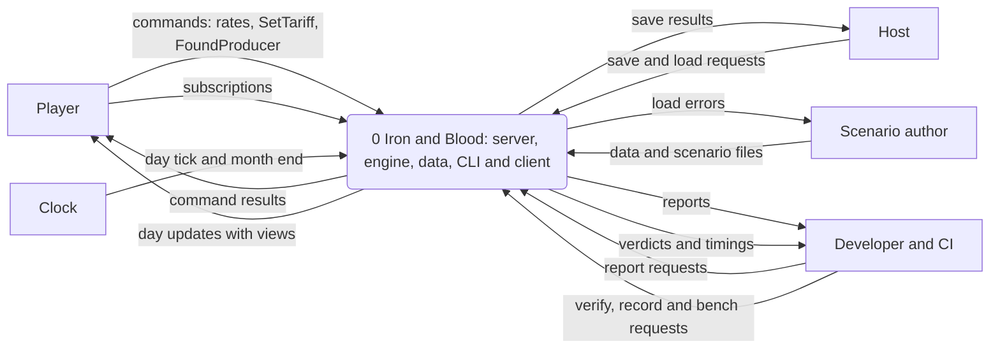
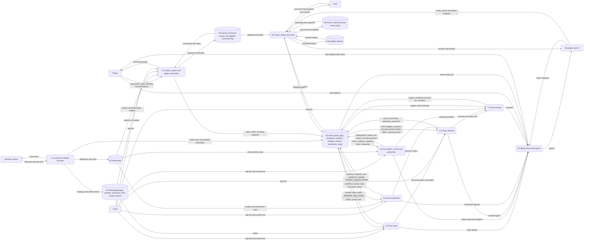
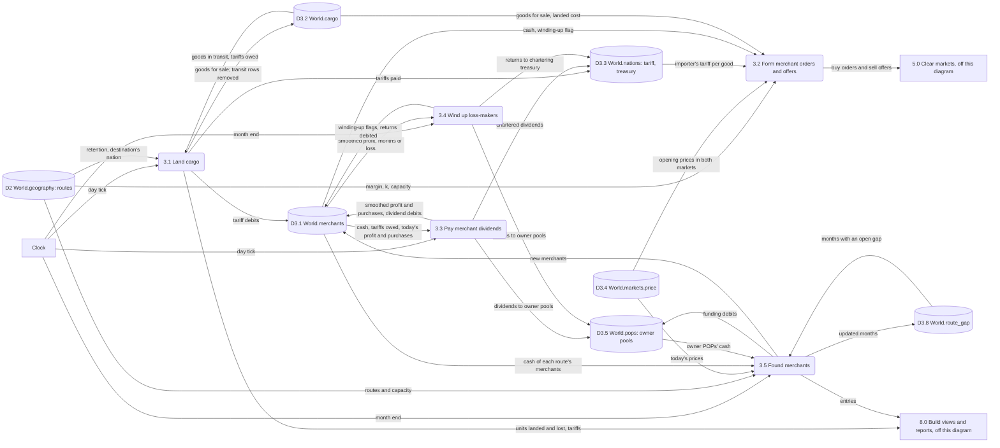
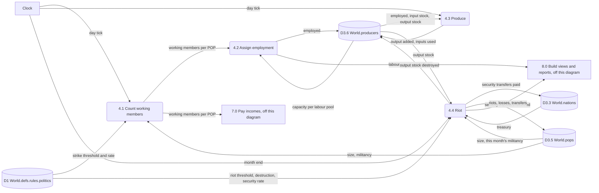
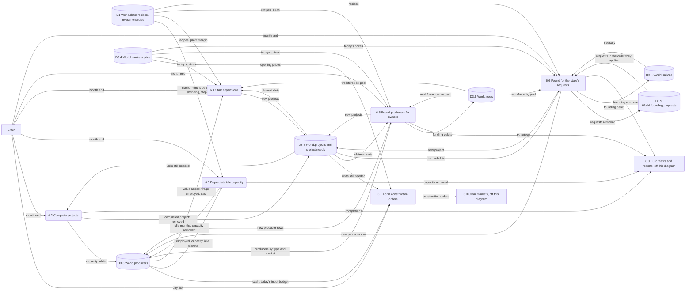
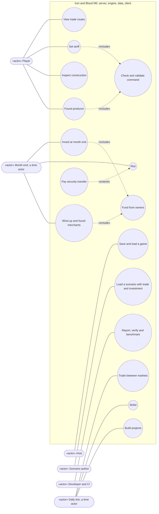
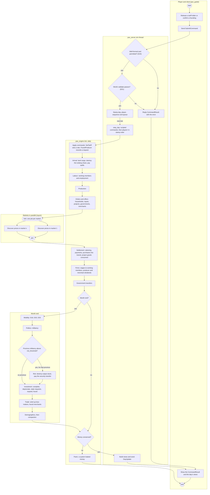

# Requirements Specification: Milestone 5

> [!NOTE]
> **Status: planning record** for the "m5" run, kept by the SDLC workflow (docs/SDLC_WORKFLOW.md). Not binding: the contract wins, and each fact moves to its home as the work lands.

What Milestone 5 must do, not yet how: the Analysis stage of the [Project Workbook](README.md). It turns the [System Service Request](01-system-service-request.md#service-requirements)'s SR-1 to SR-13 and the [charter](02-project-charter.md)'s objectives into testable requirements, gives the rules they need as process logic in `Fixed` terms, and draws the system's data flows, use cases, main activity and data model. Code is cited at `aa2133a`, which the plan's commits don't change; documents are cited as they stand on `m5/plan` at this page's commit.

## How to read this page

- **Ids:** `R-F<n>` functional, `R-N<n>` non-functional, `R-D<n>` data rules. Each has a testable "shall", its rationale, its source (an SSR row, a milestone task, a decision, a run decision or the charter), a MoSCoW priority and its verification.
- **Priorities:** *must*: the definition of done, a decision or a run decision needs it; *should*: the milestone asks for it, its definition of done doesn't; *won't*: out of this run, listed so nobody builds it.
- **Verification:** T, an automated test, named, and *planned* unless it exists; M, a measurement with its command; I, inspection of code or documents; D, a demonstration such as CI's headless client smoke test. Test names are this stage's, and the Design stage's test design may rename them while keeping the requirement.
- **Names:** tables, columns, rules and messages that M5 adds are named here so the next stages can trace them, in the style of [DATA_MODEL_M5_M6.md](../../DATA_MODEL_M5_M6.md). The Design stage fixes their Rust and schema spelling.
- **Rules are linked, not restated:** a requirement says what the system does and links the decision whose rule it implements. The run decisions are the maintainer's answers of 2026-10-10, quoted in the workbook's [run rules](README.md#run-rules) and recorded in [D17](../../DECISIONS.md#d17-inter-market-trade-routes-merchants-and-tariffs) and [D28](../../DECISIONS.md#d28-economic-unrest-strikes-and-riots).

## Choices this page makes within the contract

The decisions and the run decisions leave these points to mechanism ([SSR](01-system-service-request.md#initial-assessment), items 1 and 2). Each is a choice within [D17](../../DECISIONS.md#d17-inter-market-trade-routes-merchants-and-tariffs), [D27](../../DECISIONS.md#d27-capital-investment-and-capacity-expansion), [D28](../../DECISIONS.md#d28-economic-unrest-strikes-and-riots) and the run decisions, for the maintainer to check. None needs a new or amended decision.

| # | Choice | Left open by | Why | Requirements |
|---|---|---|---|---|
| C1 | **Links and declared routes.** A scenario declares directed `[[link]]`s, each with `τ` and a capacity, and directed `[[route]]`s, each with its `margin` and `k`. A route takes its retention and capacity from the trade horizon's best path between its two markets, which may cross several links. Merchants trade only on declared routes | D17 makes routes the horizon's pairs, each with its own margin and flow speed and no global value; run decision 2 speaks of a route's bottleneck link; nothing says where a route's margin and `k` are written (SSR item 1) | A pair needs a declaration to have a margin and `k` without a global value. Taking the path from the horizon gives run decision 2 its meaning. `TRADE.md:111` leaves merchants on undeclared pairs to a follow-up | R-F1 to R-F4, R-F61 |
| C2 | **A tariff rate per importing nation and good**, set by `SetTariff { nation, good, rate }`, every rate 0 at load | D17 says what a tariff is charged on, not what a rate is set per (SSR item 1, its table) | The SSR's lean: the data model's choice (`DATA_MODEL_M5_M6.md:166`); rates per partner belong with the customs unions that come later (`TRADE.md:114`) | R-F17, R-F18 |
| C3 | **A tariff is assessed at purchase and paid on landing:** fixed at settlement on day T, at the rate in force that day, on the units that will land times day T's executed price in the origin market (on landing day T+1 that is "yesterday's price in the exporting market", D17), and paid at arrival | `TRADE.md:49` charges it at arrival; `DATA_MODEL_M5_M6.md:165` assesses it at purchase | The merchant budgets for it, so its cash always covers it (R-D9), and a rate a command changes overnight can't reprice goods at sea | R-F9, R-F10 |
| C4 | **Merchants' goods are rows of a sparse `Cargo` table** (merchant, good, stage, quantity, landed cost, tariff owed), not per-good columns on `Merchants` | M5-2 (`MILESTONE_5.md:65`) lists `transit`, `stock` and `cost_basis` columns; `DATA_MODEL_M5_M6.md:25` (rule 1) keeps them sparse | Per-good columns on a table that grows with routes cost 72 MB at D13's long-term scale, the matrix D17 avoids | R-F5, R-N19 |
| C5 | **The flow rule's gap is the netback's excess over `p_A × (1 + margin)`**, per unit bought, and the flow fraction is `min(1, gap ÷ p_A ÷ k)`: zero at the margin, the whole capacity share once the relative gap reaches `k` | `TRADE.md:54` doesn't define `gap` (SSR item 2) | Continuous at the threshold, where the other reading jumps to `margin ÷ k` of capacity; it gives the charter's O3b its tolerance (R-F21) | R-F7, R-F21 |
| C6 | **A merchant's reserve is the tariffs it owes plus `firms.reserve_days` of its smoothed daily purchases;** it pays `firms.dividend_payout_rate` of its cash above that, and smooths over `firms.revenue_smoothing_days` | `TRADE.md:61` names "a working-capital reserve" and no rule | D6's reserve is days of the bill a producer pays (wages); a merchant's bill is its purchases. No new rule | R-F14 |
| C7 | **Merchant dividends are paid gross:** no income tax is withheld from them | `TRADE.md:61` asks for "the same income tax (D15)", but D15 withholds tax from producers' payments, and D17's Amends line doesn't list D15 | Extending D15 is an amendment no decision makes; the run builds only on accepted decisions. `TRADE.md:61` is marked *planned: needs D15 amended, none drafted* when trade lands | R-F62 |
| C8 | **Merchant owners by rule:** `trade.private_owner` (`capitalist` in `data/`) and `trade.commercial_owner` (a new `merchant` profession), each paid as the owner pool `(origin market, profession)` | D17 names "the origin market's capitalists" and "a merchant profession"; `data/professions.toml` has none (SSR item 1); `TRADE.md:74` says origin province, but owner pools are per market (`layout.rs:58-62`) | A merchant has no producer type to name an owner profession; a rule keeps profession keys out of the engine | R-F14, R-F57 |
| C9 | **Entry.** A route's gap "persists" when it is open at `trade.entry_months` consecutive month ends, counted in one state column per route. The new merchant's capital is the shortfall to one day of the route's capacity at that day's prices, Private first, then Commercial | D17 ("a route's price gap persists and its merchants' cash can't use its capacity") and `TRADE.md:82` ("smoothed price gap") give no measure | A smoothed gap per route and good would be the dense routes × goods state that rule 1 forbids. The shortfall makes entry gradual, as `TRADE.md:82` wants | R-F16 |
| C10 | **Winding up:** a flag; no purchases; goods offered at any price; cash above the tariffs owed returned at each month end; the row kept | D17 says only that a loss-making merchant is wound up and its cash returns to the owner | Selling off takes days, and returning cash monthly needs no new state | R-F15, R-D15 |
| C11 | **Project state:** no `project_budget` column (the reserve is derived, D7), recipes in `production.toml`, ownership in `owner_nation`, projects and their needs as sparse rows | M5-6 (`MILESTONE_5.md:69`) and `INVESTMENT.md:76-85` name `project_budget`, `producer_types.toml` and `state_owned`; `DATA_MODEL_M5_M6.md:167-170` corrects them | `project_budget` would be a second copy of money in the producer's cash, and `producer_types.toml` doesn't exist | R-F22, R-F23 |
| C12 | **A project's reserve** is its construction goods still needed at today's prices, rounded up, plus `firms.reserve_days` × wage × its slots. **The founding cost** is the same reserve at the D6 wage floor | D27: "its cash covers the project above its reserves", with nothing on a new producer's working capital | Without the wage part a founded producer would pay out its working capital as dividends before it can hire (its wage bill is 0 while it builds), and could never buy its first inputs | R-F23, R-F24, R-F27 to R-F29 |
| C13 | **Construction goods are consumed at settlement, and a project completes at the month-end investment step** | D27: "capacity grows only when they are delivered"; `DATA_MODEL_M5_M6.md:315` labels delivery under production | Delivered goods have nowhere else to go; capacity changing only at month end keeps a month's labour assignment stable. The order of systems is the data model's | R-F25, R-F26, R-F41 |
| C14 | **"The market's capitalists" who found a producer are the market's POPs of that producer type's owner profession** (D6's owner pool), the ones who will receive its dividends. Each may give its cash above `investment.investor_reserve_days` of its consumption budget, and the cost is split in proportion to what each may give | D27 says "the market's capitalists"; farms are owned by aristocrats (`data/production.toml:8`) | Funders and dividend recipients stay the same people; `INVESTMENT.md:69` reads "as the producer type's data says" | R-F28 |
| C15 | **`FoundProducer`** is valid on definitions and topology only (R-D13). Applied, it only records a founding request. At the next month end the investment step takes the requests in the order they applied, before any other founding: one founds a state-owned producer if the treasury covers the founding cost, the pool has `step` unclaimed unemployed workers (D27's "a province with unemployed workers") and the province has had no founding that month; otherwise it is dropped and the day's report says why. The state passes no profit test | D21 checks logged commands against the initial world, so validity can't read the treasury (SSR item 2); D21 keeps checks out of `World::apply` | Validity that read state would let a command valid in play make its save unloadable (`save.rs:251-266`). The conditions are the month-end founding rule's (`INVESTMENT.md:65-72`), so `apply` checks nothing, and a request waits at most a month | R-F29, R-D13, R-D16 |
| C16 | **Strikers and working members.** A POP's working members are `⌊size × (1 − s)⌋`; a pool's wages are split by working members, so unemployment is shared among the non-strikers as today (`labor.rs:8-9`); the labour report counts strikers apart, and its unemployed excludes them. D20, D25 and D26 still count pools by size | Run decision 3 doesn't say who counts as working in a pool with both strikers and unemployed (SSR item 2) | Strikers have jobs they refuse, so D18 must not move them as unemployed; with no strike every figure is today's | R-F34 to R-F36 |
| C17 | **The riot security transfer** is `politics.riot_security_rate` × the treasury × the rioting province's share of its nation's people, from the treasury as it stands before any province is paid | D28 and `REBELLIONS.md:63` name no size | Rioting provinces together never take more than that share of the treasury, in any order | R-F38 |
| C18 | **Depreciation** never cuts capacity below employment, skips a producer with a project, and reads the month-end day's employment | D27: "capacity in use does not wear out" | "Capacity in use never does" (`INVESTMENT.md:93`) holds by construction | R-F31 |
| C19 | **Month-end step 9 runs:** complete projects, depreciate, found for the state's requests, start expansions, found for owners, wind up merchants, found merchants. Merchant exit and entry run there because entry uses investment's funding rule | `DATA_MODEL_M5_M6.md:324` places investment, not trade's monthly steps | One fixed order; a player's request before the automatic decisions that compete for the same workers, and producer founding before merchant entry when both draw on the same POPs | R-F41 |
| C20 | **New rules are required keys** of `rules.toml`, and `mini_valley`'s frozen `defs/` sets each mechanism off, as D18, D20, D25 and D26 did. Investment gets an `enabled` switch for its automatic decisions (expansion, founding for owners, depreciation); running projects and the state's requests proceed either way | `schema.rs:100-108` refuses unknown fields and has no defaults for sections | The charter's O4 baseline is "investment switched off by its rules", and `mini_valley` must not change (charter A4) | R-F57, R-F59, R-D4 to R-D6 |
| C21 | **Wire names follow the schema's convention:** command tables `SetTariff` and `FoundProducer`, one per engine variant (`common.fbs:47`), for the milestone's `SetTariffCommand` and `FoundProducerCommand` (`MILESTONE_5.md:34`) | The milestone names them in passing | One table per engine command, named after it | R-F44 |
| C22 | **Per-good tariffs reach the client in `TradeRouteView`**, not in the always-sent `NationTable` | `server.fbs:86` sends `NationTable` on every update | 200 nations (the view budget test's, `view.rs:561`) × 50 goods × 8 bytes is 80 KB, five times the 16 KB summary-only budget (D22) | R-F45, R-N14 |
| C23 | **No producer ids on the wire:** a project is shown by its province and producer type; routes get ids in `StaticData`, which is fixed per session (`server.fbs:19-21`) | Founding adds producer rows mid-session, and `StaticData` has no producer table | D22: every id indexes a `StaticData` table fixed for the session | R-F44 to R-F46 |

## Requirements

### Functional: routes and the trade horizon

| Id | Requirement | Rationale | Source | Priority | Verification |
|---|---|---|---|---|---|
| R-F1 | The loader shall read the scenario's `[[link]]` entries as directed links between markets, each with an iceberg share `τ` and a capacity in units a day, an entry with `both_ways = true` also giving the reverse link the same values. | Run decision 2 presupposes links distinct from routes; today `ScenarioFile` can't describe a connection (`schema.rs:156-179`) | M5-1; [D17](../../DECISIONS.md#d17-inter-market-trade-routes-merchants-and-tariffs) (Routes, Route capacity); C1 | must | T: `crates/pax_data/tests/validation.rs` (planned `links_load_both_ways`, and R-D1's refusals) |
| R-F2 | The loader shall read the scenario's `[[route]]` entries as directed routes between markets, each with its own `margin` and flow speed `k`, an entry with `both_ways = true` also giving the reverse route the same values; no global margin or flow speed shall exist. | D17's per-route tuning | M5-1; D17 (Per-route tuning); C1 | must | T: `validation.rs` (planned `routes_load_with_their_tuning`); I: no `margin` or `k` in `rules.toml` |
| R-F3 | When a world is built, the system shall compute the trade horizon by a Dijkstra search from every market over the links, keeping for each source the markets whose best retention `Π(1 − τ)` is at least `trade.min_retention`, with that path's retention and bottleneck capacity, as a sparse per-market list; it shall build no market × market matrix, and no tick system shall search paths. | D14 rule 5 as D17 amends it; AGENTS.md §5 forbids path searches in the tick | M5-1; D17 (Routes); [D14](../../DECISIONS.md#d14-market-hierarchy-and-inter-market-trade) rule 5; [AGENTS.md §5](../../../AGENTS.md#5-performance-over-flexibility); PL-1 | must | T: `crates/pax_engine/tests/trade.rs` (planned `horizon_matches_a_hand_computed_one`, with a two-link path and a pair dropped below `min_retention`; `horizon_ties_break_by_hops_then_market`); I: no search in `tick.rs`'s systems |
| R-F4 | Each route shall take its retention and capacity from its markets' horizon pair: the best path's retention, and the capacity of that path's bottleneck link, which every route through the link takes whole. | Run decision 2 | M5-1; D17 (Route capacity); PL-1 | must | T: `trade.rs` (planned `routes_through_one_link_each_take_its_whole_capacity`) |

### Functional: merchants

| Id | Requirement | Rationale | Source | Priority | Verification |
|---|---|---|---|---|---|
| R-F5 | The world shall hold a `Merchants` table (one row per merchant: route, `MerchantKind` Private, Commercial or Chartered, owner nation for Chartered, cash, smoothed profit, smoothed purchases, months of loss, winding-up flag) and a `Cargo` table (one row per merchant, good and stage, in transit or for sale: quantity, landed cost, tariff owed). | Merchants hold money (D5) and goods in transit; D17's invariants | M5-2, M5-4; D17 (Owners, Invariants); [D8](../../DECISIONS.md#d8-ecs-hand-rolled-struct-of-arrays); C4 | must | I: `BACKEND_SCHEMA.md` and `World::check_tables`; T: `trade.rs` (planned `merchant_tables_keep_their_invariants`) |
| R-F6 | The loader shall seed merchants from the scenario's `[[merchant]]` entries, each naming its route by its two markets, its kind and its starting cash; a Chartered merchant is owned by its origin market's nation. | "A scenario may seed starting merchants" (D17); the only source of Chartered merchants in this run (SSR item 3) | M5-4; D17 (Entry and exit); `TRADE.md:75`, `:84-91` | must | T: `validation.rs` (planned `merchants_seed_by_route_and_kind`, and R-D3's refusals) |
| R-F7 | Each day, each merchant not winding up shall place in its route's origin market one D1 buy order for each good whose gap is positive, wanting its share of the route's capacity scaled by the flow rule and budgeted so that the purchase and the tariff it will owe never exceed its cash (PL-2). | D17: merchants are ordinary D1 buyers; D14 rule 2: the flow grows with the gap and is throttled by capacity | M5-3; D17 (Rule); D14 rules 2-3; C5 | must | T: `trade.rs` (planned `export_orders_follow_the_flow_rule`, `a_merchant_never_owes_more_than_its_cash`) |
| R-F8 | Each day, each merchant shall offer its goods for sale in its route's destination market as D1 sell offers, at a reservation price of their landed cost per unit times `1 + margin`, or at any price while it winds up (PL-3). | D17: merchants are ordinary D1 sellers in the destination | M5-3; D17 (Rule); `TRADE.md:56` | must | T: `trade.rs` (planned `imports_are_offered_at_landed_cost_plus_margin`) |
| R-F9 | Settlement shall put the goods a merchant buys in transit with the tariff owed on them, debit their cost from its cash, and on a sale credit the receipts to its cash and remove the goods sold and their share of landed cost from its stock (PL-3). | Today a buyer is a producer or a nation and every seller a producer (`market.rs:175-181`, `:202-208`, `:791-803`, `:809-830`) | M5-2, M5-3; D17 (Tariffs, Invariants); C3 | must | T: `trade.rs` (planned `settlement_books_purchases_and_sales`); R-N4 |
| R-F10 | At the start of each day, after commands and before labour, all goods in transit shall land in their route's destination: the retained share, rounded down, joins the merchant's goods for sale, the rest is destroyed as iceberg loss, and the tariff owed is paid from the merchant's cash to the destination market's nation (PL-4). | D17: one day of transit, iceberg loss destroys goods never money, tariffs go to the importing treasury | M5-2; D17 (One day of transit, Iceberg loss, Tariffs); C3 | must | T: `trade.rs` (planned `cargo_lands_next_day_less_the_iceberg_share`, `tariffs_reach_the_importing_treasury`) |
| R-F11 | Merchants' buy orders and sell offers shall clear in the same D1 discovery and settlement as everyone else's, so where their demand and local demand together exceed supply, every buyer receives the same fraction. | D14 rule 3: scarce exports are shared pro rata | M5-3; D14 rule 3; [D1](../../DECISIONS.md#d1-market-clearing-bounded-tâtonnement-with-pro-rata-rationing) step 4; `TRADE.md:138` (test 5) | must | T: `trade.rs` (planned `exporters_and_locals_get_the_same_fraction`) |
| R-F12 | The units a route's merchants buy on a day shall never exceed the route's capacity, however many merchants share it. | D14 rule 2: the flow is throttled by capacity | M5-3; `TRADE.md:137` (test 4) | must | T: `trade.rs` (planned `capacity_binds_however_many_merchants`) |
| R-F13 | When no good's gap is positive on a route, its merchants shall place no buy orders, and no merchant shall be founded on it. | No churn without a gap | M5-3, M5-16; `TRADE.md:135` (test 2) | must | T: `trade.rs` (planned `equal_prices_mean_no_trade_and_no_entry`) |
| R-F14 | Each day in the firms step, a merchant shall pay `firms.dividend_payout_rate` of its cash above its reserve (the tariffs it owes plus `firms.reserve_days` of its smoothed purchases) to its owner: a Private merchant to the origin market's POPs of profession `trade.private_owner`, a Commercial one to those of `trade.commercial_owner`, split by size, and a Chartered one to its nation's treasury; with no living owner POPs it keeps the dividend (PL-5). | D17: dividends follow the owner; D6's dividend rule, which D17 amends for merchants | M5-4; D17 (Owners); [D6](../../DECISIONS.md#d6-firms-production-wages-ownership) (Dividends); C6, C7, C8 | must | T: `trade.rs` (planned `each_kind_pays_its_owner`, `TRADE.md:140`'s test 7) |
| R-F15 | A merchant whose smoothed profit has been negative at `trade.exit_months` consecutive month ends shall wind up: it places no more buy orders, offers its goods at any price, and at each month end pays its cash above the tariffs it owes to its owner as R-F14 routes dividends (PL-6). | D17: wound up when loss-making, its cash returning to the owner | M5-4; D17 (Entry and exit); C10 | must | T: `trade.rs` (planned `a_loss_maker_winds_up_and_returns_its_cash`); R-N3 |
| R-F16 | At each month end, the system shall found at most one merchant on each route whose gap has been open at `trade.entry_months` consecutive month ends and whose active merchants' cash is below the cost of one day of its capacity at that day's prices, funded with the shortfall by one transfer from the origin market's private-owner POPs, or else its commercial-owner POPs, taking routes by largest relative gap, then lowest route; it shall never found a Chartered merchant (PL-7). | D17: founded when the gap persists and cash can't use the capacity, by a one-time transfer from the owner; Chartered "by command only", and no such command is in scope (SSR item 3; M5-16's row text, `MILESTONE_5.md:79`, is reworded when it is ticked) | M5-16; D17 (Entry and exit); [D27](../../DECISIONS.md#d27-capital-investment-and-capacity-expansion) (funding); C9 | must | T: `trade.rs` (planned `a_persistent_gap_founds_a_merchant`, `entry_never_charters`, `TRADE.md:139`'s test 6); R-N3 |

### Functional: tariffs

| Id | Requirement | Rationale | Source | Priority | Verification |
|---|---|---|---|---|---|
| R-F17 | Each nation shall have one ad valorem tariff rate per good, starting at 0, charged on goods landing in its markets from a market of another nation or a stateless market, never on trade within one nation or into a stateless market. | D17 charges the tariff on the origin price to the importing treasury; trade within a nation is untaxed and a stateless market has no treasury (`TRADE.md:113-114`) | D17 (Tariffs); [D14](../../DECISIONS.md#d14-market-hierarchy-and-inter-market-trade) rule 4; C2 | must | T: `trade.rs` (planned `tariffs_apply_only_between_nations`) |
| R-F18 | The engine shall accept `Command::SetTariff { nation, good, rate }`, valid exactly when the nation and the good exist and the rate is in [0, 1], which sets that nation's tariff on that good for purchases from that day on. | The player's tariff control (DoD 4); validity only in `World::validate` (D21) | DoD 4; M5-3, M5-13; D17 (Amends D21, D24); [D21](../../DECISIONS.md#d21-commands-and-command-logs); C2 | must | T: `crates/pax_engine/tests/commands.rs` (planned `set_tariff_is_validated`) |
| R-F19 | Raising a nation's tariff on a good shall reduce the units of it landing in its markets, and its treasury shall receive exactly the tariffs merchants pay. | DoD 1's second bullet | DoD 1; `TRADE.md:136` (test 3); charter O3d | must | T: `trade.rs` (planned `a_higher_tariff_cuts_the_flow_and_the_treasury_gets_it_all`) |

### Functional: trade outcomes

| Id | Requirement | Rationale | Source | Priority | Verification |
|---|---|---|---|---|---|
| R-F20 | In `two_states` with M5-5's link, routes both ways and one Private merchant each way, over the 20th year: every good whose autarky gap `G` exceeds the friction band `(1 + margin + t·(1 − τ)) ÷ (1 − τ)` of its route from the cheaper market (`t` the importer's tariff on it) shall have a smaller `G` than in the autarky run, each market's real GDP shall exceed the autarky run's, and each market shall export. | DoD 1's first bullet and M5-5's mutual gain, restated on the measured goods: cloth, steel, tools and six raw goods are cheaper in Highland, clothes, furniture and wine in Lowland ([SSR](01-system-service-request.md#what-happens-today)) | M5-5; DoD 1; charter [O3a, O3c](02-project-charter.md#o3-trade-works-and-arbitrages-prices); SSR's [gap statistic](01-system-service-request.md#the-gap-statistic) | must | T (release only): `crates/pax_data/tests/trade_two_states.rs` (planned `trade_narrows_gaps_and_both_markets_gain`), against an autarky run of the same build without the link, routes and merchants. A market's real GDP is its own C+G over the window deflated by its prices weighted by the autarky run's day-1 traded quantities there (R-F54) |
| R-F21 | In a test world with one route, no tariff and capacity not binding, each traded good's mean price ratio, destination over origin, shall settle between `(1 + margin) ÷ (1 − τ)` and `(1 + margin + k) ÷ (1 − τ)`. | A flow below capacity needs a gap below `k` (C5), which bounds the ratio | `TRADE.md:134` (test 1); charter O3b | must | T: `trade.rs` (planned `prices_converge_to_the_friction_band`) |

### Functional: investment

| Id | Requirement | Rationale | Source | Priority | Verification |
|---|---|---|---|---|---|
| R-F22 | A producer type in `production.toml` may give an expansion recipe, `expansion = { inputs = { <good> = <units per slot> }, step = <slots> }`; only a type with one can expand, be founded or shrink. | D27: projects buy real construction goods; a type can't say what more capacity costs today (`defs.rs:65-80`, `schema.rs:85-98`) | M5-6; D27 (Rule, construction); `INVESTMENT.md:28-37`; C11 | must | T: `validation.rs` (planned `expansion_recipes_load`, and R-D7's refusals) |
| R-F23 | A producer shall have at most one construction project, which holds the slots it will add and, for each construction good, the units it still needs; a project holds no cash, and its reserve is computed from those units at today's prices whenever needed, never stored (PL-10, PL-11). | D27: a project holds no cash; D7: derived values are not state | M5-6; D27 (Invariants); [D7](../../DECISIONS.md#d7-pop-accounting); C11, C12 | must | I: `BACKEND_SCHEMA.md`; T: `crates/pax_engine/tests/investment.rs` (planned `one_project_per_producer`) |
| R-F24 | At each month end with `investment.enabled`, a producer with an expansion recipe and no project shall start a project of `step` slots exactly when it is profitable (smoothed value added above its wage bill times `1 + investment.profit_margin`), its labour pool has at least `step` unemployed workers no other project claims, and its cash above its restart and dividend reserves covers the project's reserve (PL-9). | D27's three conditions, the budget reserved before dividends | M5-7; D27 (Rule, expansion); `INVESTMENT.md:39-45`; C12 | must | T: `investment.rs` (planned `no_project_without_profit`, `no_project_without_spare_workers`, `no_project_without_cash`, `a_project_starts_when_all_hold`: `INVESTMENT.md:91`'s test 3, each condition alone) |
| R-F25 | Each day, a producer with a project shall place D1 buy orders for the construction goods its project still needs, budgeted from its cash left after its input orders so that the two never exceed its cash; goods delivered at settlement are consumed by the project (PL-10). | D27: real goods through ordinary D1 orders, consumed; a producer must never overspend (`market.rs:794`) | M5-7; D27 (Rule, construction); C13 | must | T: `investment.rs` (planned `a_project_orders_every_day_until_delivered`: `INVESTMENT.md:90`'s test 2) |
| R-F26 | At each month end, a project whose goods have all been delivered shall complete: its producer's capacity rises by the project's slots, and the project closes. | D27: capacity grows only once the goods are delivered | M5-7; D27 (Rule, construction); C13 | must | T: `investment.rs` (planned `delivery_then_month_end_adds_capacity`) |
| R-F27 | A producer shall pay dividends only from cash above its D6 dividend reserve and its project's reserve (PL-11). | D27 amends D6: dividends only above the project reserve | M5-7; D27 (Amends D6); D6 (Dividends); C12 | must | T: `investment.rs` (planned `dividends_leave_the_project_reserve`) |
| R-F28 | At each month end with `investment.enabled`, the system shall found producers where workers are unemployed: for each province and producer type whose worker pool there has at least `step` unclaimed unemployed workers and which passes the profit test in that market, taken by largest unemployment, then lowest province, then lowest type, at most one per province a month, a producer with capacity 0 and a project of `step` slots is founded when the market's POPs of the type's owner profession can fund its founding cost, by one transfer split by largest remainder (PL-8, PL-12). | D27: a province with unemployed workers may get a new producer funded by the market's capitalists; founding and expansion are one mechanism (`DATA_MODEL_M5_M6.md:168`) | M5-8; D27 (Rule, founding); `INVESTMENT.md:63-74`; C12, C14 | must | T: `investment.rs` (planned `owners_found_a_producer_where_workers_wait`, `founding_moves_exactly_its_cost`: `INVESTMENT.md:92`'s test 4); R-N3 |
| R-F29 | The engine shall accept `Command::FoundProducer { nation, province, producer_type }`, valid exactly when the three exist, the province's market belongs to the nation and the type has an expansion recipe, and applied it shall record a founding request; at the next month end, before any other founding, each request in the order it applied shall found a state-owned producer with a project of `step` slots, funded by one transfer of the founding cost from the treasury, if the treasury covers that cost, the province's pool has at least `step` unclaimed unemployed workers and the province has had no founding that month, and shall otherwise be dropped with its reason reported (PL-13). | D27: state industry by command, only in the commanding nation's own markets; D21: validity only in `World::validate` | DoD 4; M5-8; D27 (Rule, founding; Amends D21, D24); D21; C15 | must | T: `commands.rs` (planned `found_producer_is_validated`); `investment.rs` (planned `a_request_founds_at_the_month_end_when_funded`, `an_unfunded_request_is_dropped`) |
| R-F30 | A state-founded producer's dividends shall go to its nation's treasury. | D27; D15's withholding still applies, and both parts reach the same treasury because the producer is in that nation's market (R-D12) | M5-8; D27 (Rule, founding); [D15](../../DECISIONS.md#d15-nations-treasuries-income-tax-and-transfers) | must | T: `investment.rs` (planned `state_producers_pay_their_treasury`); R-N3 |
| R-F31 | At each month end with `investment.enabled`, a producer with an expansion recipe and no project whose employment has been below its capacity × `(1 − investment.slack)` at `investment.idle_months_before_shrink` consecutive month ends shall lose up to `step` capacity, never going below its employment (PL-14). | D27: idle capacity shrinks; capacity in use doesn't wear out | M5-9; D27 (Rule, depreciation); `INVESTMENT.md:59-61`; C18 | must | T: `investment.rs` (planned `idle_capacity_shrinks`, `capacity_in_use_never_does`: `INVESTMENT.md:93`'s test 5) |
| R-F32 | Producer rows shall never be removed or reordered: founding appends a row, and a closed producer keeps its row with capacity 0. | D27's invariant: projects, and later loans, reference producer rows | M5-6 to M5-9; D27 (Invariants) | must | T: `investment.rs` (planned `producer_rows_are_stable`); I: no producer row is removed in any system |
| R-F33 | In `two_states` over 20 years, total capacity on day 7200 shall exceed 253,500 worker slots, real GDP over years 16-20 shall be at least 0.1% above the same build's with `investment.enabled = false`, the quantities of tools, timber and steel traded over the 20 years shall each exceed that run's, and unemployment on day 7200 shall be at most 2%. | DoD 2, measured against the same build, so trade's gains don't count as growth | M5-10; DoD 2; charter [O4a to O4d](02-project-charter.md#o4-investment-grows-the-economy) | must | T (release only): `crates/pax_data/tests/growth.rs` (planned `investment_grows_two_states`); real GDP is `pax_cli report`'s measure (`crates/pax_cli/src/report.rs:7-11`) |

### Functional: strikes and riots

| Id | Requirement | Rationale | Source | Priority | Verification |
|---|---|---|---|---|---|
| R-F34 | Each day, a POP whose militancy exceeds `politics.strike_threshold` shall supply only its working members, `⌊size × (1 − min(1, strike_rate × (militancy − strike_threshold)))⌋`, to its labour pool, the others striking; strikers are computed each day, never stored (PL-15). | D28's strike rule; today a pool supplies its whole size (`labor.rs:57`) | M5-11; [D28](../../DECISIONS.md#d28-economic-unrest-strikes-and-riots) (Rule, strikes); D7; C16 | must | T: `crates/pax_engine/tests/unrest.rs` (planned `strikes_cut_labour_and_output`: `REBELLIONS.md:69`'s test 1) |
| R-F35 | A labour pool's wages shall be split by largest remainder among its POPs in proportion to their working members, so strikers receive none (PL-15). | Run decision 3; today the split is by size (`firms.rs:131-139`, `world.rs:382-389`) | M5-11; D28 (Striking workers' pay); D6 as D28 amends it; C16 | must | T: `unrest.rs` (planned `strikers_get_no_wage`: a pool whose one POP strikes wholly gets the whole wage split among the others) |
| R-F36 | The daily labour report shall count each pool's strikers, and its unemployed shall be its workforce less its strikers and its employed, the figure month-end labour mobility (D18) and every unemployment report use. | Strikers hold jobs; D18 must move only the unemployed (`mobility.rs:56-57`) | M5-11; [D18](../../DECISIONS.md#d18-labour-mobility); C16 | must | T: `crates/pax_engine/tests/labour_report.rs` (planned `strikers_are_neither_employed_nor_unemployed`) |
| R-F37 | At each month end, after militancy is updated, each province whose population-weighted militancy exceeds `politics.riot_threshold` shall riot: each of its producers loses `riot_destruction` of its output stock, rounded down, which is destroyed (PL-16). | D28's riot rule and order: after politics, on this month's militancy | M5-12; D28 (Rule, riots; Order) | must | T: `unrest.rs` (planned `riots_destroy_output_stock_never_money`: `REBELLIONS.md:70`'s test 2) |
| R-F38 | A rioting province whose market has a nation shall receive from that nation's treasury a security transfer of `riot_security_rate` × the treasury × the province's share of the nation's people, rounded down, the treasury taken before any province is paid, split among the province's POPs by size; a stateless province riots without one (PL-16). | D28: the treasury pays a security transfer automatically; M5 has no repression command | M5-12; D28 (Rule, riots); `REBELLIONS.md:33`; C17 | must | T: `unrest.rs` (planned `the_security_transfer_is_exactly_what_the_treasury_pays`, `a_stateless_province_riots_without_a_transfer`); R-N3 |
| R-F39 | The riot step shall leave every POP's militancy unchanged: the security transfer can lower militancy only through the life needs its money buys, under D19's unchanged monthly update. | Run decision 4: no direct relief; D19 unchanged | M5-12; D28 (Riot relief); [D19](../../DECISIONS.md#d19-militancy) | must | T: `unrest.rs` (planned `the_riot_transfer_has_no_direct_relief`: militancy is identical after the riot step, and, for POPs already fully fed, identical a month later to a run with `riot_security_rate = 0`) |
| R-F40 | In `two_states`, a command log raising both nations' income tax to 40% shall make some province strike and riot within three years, and lowering it back to 12% shall end the riots within two years. | `REBELLIONS.md:71`'s policy response: discontent costs output and stock, and policy can end it | M5-11, M5-12; DoD 3; `REBELLIONS.md:71` (test 3); charter O5 | must | T (release only): `crates/pax_data/tests/unrest_two_states.rs` (planned `a_high_tax_causes_riots_that_end_when_it_falls`) |

### Functional: the tick

| Id | Requirement | Rationale | Source | Priority | Verification |
|---|---|---|---|---|---|
| R-F41 | Each tick shall run in this order: commands; arrival; labour with strikes; production; market (orders from households, producers' inputs, projects, governments and merchants, then discovery, then settlement); firms (wages, producer dividends, merchant dividends); government transfers; then at month end mobility (D18, D20, D25), politics, riots, investment and trade (complete projects, depreciate, found for the state's requests, start expansions, found for owners, wind up merchants, found merchants), demographics and compaction; and last the money assert. | D17, D27 and D28 amend D4 to the data model's order; today's is `tick.rs:84-136` | [D4](../../DECISIONS.md#d4-tick-schedule-and-goods-persistence) as D17, D27 and D28 amend it; `DATA_MODEL_M5_M6.md:307-327`; C13, C19 | must | I: `tick.rs`, D4's table and `ARCHITECTURE.md`'s game loop agree; T: the R-F tests that depend on the order (arrival before labour, riots after politics) |

### Functional: commands, logs and saves

| Id | Requirement | Rationale | Source | Priority | Verification |
|---|---|---|---|---|---|
| R-F42 | Command logs (`commands.toml`) and saves shall record `set_tariff` (nation, good, rate) and `found_producer` (nation, province, producer type) commands by key, and loaders shall check each against the scenario's initial world with `World::validate`. | Logs and saves record only `type`, `nation` and `rate` today (`schema.rs:243-253`, `save.rs:127-134`, `:192-201`); D21: loaders validate against the initial world | DoD 4; [D21](../../DECISIONS.md#d21-commands-and-command-logs); [D23](../../DECISIONS.md#d23-server-loop-pacing-flow-control-and-saves); R-D13 | must | T: `crates/pax_data/tests/saves.rs` (planned `new_commands_round_trip_through_a_save`); `validation.rs` (planned `command_logs_take_the_new_commands`) |
| R-F43 | `pax_server` shall accept `SetTariff` and `FoundProducer` in `SubmitCommand`, answering a missing field with `Malformed`, another nation's command with `NotPermitted` (D24) and an invalid one with its validation error, and shall stamp, queue, log and save the accepted ones as it does today's commands. | D22's order of checks; D24's permission check, through `commands.rs::nation_of` (`crates/pax_server/src/commands.rs:32-38`) | DoD 4; [D22](../../DECISIONS.md#d22-wire-protocol-and-client-sessions); [D24](../../DECISIONS.md#d24-multiplayer-authority) (Permissions); `NETWORK_PROTOCOL.md` §5 | must | T: `crates/pax_server/tests/session.rs` (planned `new_commands_are_checked_in_order`); `session_replay.rs` (R-N7) |

### Functional: protocol and client

| Id | Requirement | Rationale | Source | Priority | Verification |
|---|---|---|---|---|---|
| R-F44 | The wire protocol shall become version 1.7 by appending only: the `SetTariff` and `FoundProducer` command tables and `Command` union members; a `CommandError` value for each new engine error; `StaticData.routes`; and `TradeRouteView` and `InvestmentLedgerView` in `DayUpdate`, with the `Subscribe` fields that request them. | The milestone's wire additions; the union and errors are append-only (`common.fbs:29-44`, `:65-69`); today's version is 1.6 (`crates/pax_protocol/src/lib.rs:74-76`) | M5-13; `MILESTONE_5.md:34`; D22 (Versioning); C21, C23 | must | T: `crates/pax_protocol/tests/roundtrip.rs` (planned cases for each new message); I: `scripts/gen-protocol.sh` output checked in, CI's regeneration check |
| R-F45 | `TradeRouteView` shall carry, for a subscribed market, each route into or out of it, by its `StaticData.routes` id, with its merchants' number and cash by kind and the day's units bought, landed and lost and the tariffs paid per good; and, for a subscribed nation, that nation's tariff on each good. | DoD 4: players view active trade routes and set tariffs; the tariff panel subscribes its own nation whatever market the trade panel shows | M5-13; DoD 4; C22, C23 | must | T: `crates/pax_server/tests/views.rs` (planned `trade_route_view_matches_the_day`) |
| R-F46 | `InvestmentLedgerView`, for one subscribed province, shall carry each project there (producer type, slots, state or private owner, units still needed per good), for each producer type with an expansion recipe its founding cost at today's prices and the unclaimed unemployed workers of its worker profession there, the state's pending founding requests there, and the outcome of any founding there that day. | DoD 4: players inspect construction progress and found factories, which needs the cost and the workers before sending | M5-13; DoD 4; C23 | must | T: `views.rs` (planned `investment_ledger_view_matches_the_world`) |
| R-F47 | The protocol shall append a `TradeFlow` map mode that gives each province its market's net imports for the day: merchants' sales there less their purchases there. | The milestone's trade flow map mode; a map mode is one value per province (`common.fbs:71-80`) | M5-14; `MILESTONE_5.md:35` | should | T: `crates/pax_server/src/view.rs` tests (planned case in `every_map_mode_has_one_value_per_province`) |
| R-F48 | `pax_godot` shall encode `SetTariff` and `FoundProducer` and decode the new views, still depending on no engine crate. | D12: the bridge links `pax_protocol` and the side-neutral crates only | M5-13, M5-14; [D12](../../DECISIONS.md#d12-frontend-godot-with-a-rust-gdextension-bridge) | must | T: `crates/pax_godot/tests/client.rs` (planned cases); CI's crate-boundary step |
| R-F49 | The client shall show a trade panel for the selected market, listing its routes with their flows, merchants and tariffs. | DoD 4: view active trade routes | M5-14; DoD 4 | must | D: the client smoke test (R-F53) and a manual look in the morning |
| R-F50 | The client shall show the player's nation's tariff on each good as a slider in per mille, sending `SetTariff` when the player releases it and otherwise following the server's rate, as the nation panel's sliders do. | DoD 4: adjust national tariff rates; the nation panel's pattern (`client/ui/nation_panel.gd:1-11`, `:20-25`) | M5-14; DoD 4; C2 | must | D: R-F53 |
| R-F51 | The client shall show a construction panel for the selected province, listing its projects with their progress, and let the player found a producer of a chosen type there, showing the founding cost and the workers available before it sends `FoundProducer`. | DoD 4: inspect construction progress and found new factories | M5-14; DoD 4 | must | D: R-F53 |
| R-F52 | The client shall offer the `TradeFlow` map mode. | The milestone's trade flow map mode | M5-14; `MILESTONE_5.md:35` | should | D: a manual look in the morning |
| R-F53 | The headless client smoke test shall subscribe to both new views, set a tariff and found a producer, and fail unless both commands are accepted and both views arrive. | DoD 4 checked by CI's client smoke test (`client/smoke.gd:1-7`) | M5-14; DoD 4; charter O6 | must | D: CI's `client-smoke` job |

### Functional: reports

| Id | Requirement | Rationale | Source | Priority | Verification |
|---|---|---|---|---|---|
| R-F54 | `DayReport` shall report, beside today's fields and without changing their meaning: investment spending; merchants' purchases and sales and the tariffs paid, by market; iceberg loss; capacity added and removed; projects started and completed; foundings with their funder and outcome; strikers; rioting provinces, goods destroyed and security transfers; and household and government spending by market. | The tests of R-F19, R-F20, R-F33 and R-F40 need these figures, and today the engine reports spending as world totals only (`tick.rs:39-41`, `:52-53`) | SR-12; DoD 1-3 | must | T: the tests named in R-F19, R-F20, R-F33, R-F38 and R-F40 read them; I: `BACKEND_SCHEMA.md`'s `DayReport` |
| R-F55 | `pax_cli report` shall print the new figures in columns after today's, which keep their definitions, and with `--market KEY` that market's own C+G, price index and real GDP from its own day-1 basket. | SR-12: new figures beside today's measures, never folded into them (`report.rs:7-11`) | SR-12 | should | T: `crates/pax_cli/src/report.rs` tests (planned `report_shows_a_market_on_its_own`) |
| R-F56 | `pax_cli bench` shall print the slowest day's time and, when the run reaches one, the first month-end day's time beside the mean. | With `--scale`, `bench` stops before the first month end by default (`crates/pax_cli/src/main.rs:279-290`), so the month-end systems go unmeasured | M5-15; charter O7; R-N10 | should | M: R-N10's commands |

### Functional: data and scenarios

| Id | Requirement | Rationale | Source | Priority | Verification |
|---|---|---|---|---|---|
| R-F57 | `data/` shall gain a `merchant` profession appended to `professions.toml`, an expansion recipe for every producer type in `production.toml`, and `rules.toml`'s `[trade]` and `[investment]` sections and new `[politics]` keys, with values under which `two_states` meets the bands clause. | The mechanisms need data; appending the profession keeps every existing id | M5-4, M5-6, M5-11, M5-12; C8, C20; charter [bands clause](02-project-charter.md#the-bands-clause) | must | T: `validation.rs` loads `data/`; R-N22 |
| R-F58 | `two_states` shall gain one link between `lowland` and `highland` both ways, routes both ways, and one seeded Private merchant each way. | M5-5's comparative-advantage scenario; `scenario.toml:3` says the markets don't trade | M5-5; `TRADE.md:142` (test 9) | must | I: `scenarios/two_states/scenario.toml`; R-N9 |
| R-F59 | `mini_valley`'s frozen `defs/` shall switch every new mechanism off: no expansion recipes, `investment.enabled = false`, `trade.entry_months = 0`, and strike and riot thresholds of 1. | The fixture's frozen definitions switch new mechanisms off (`scenarios/mini_valley/defs/rules.toml:26-29`); militancy never exceeds 1 | Charter A4; C20 | must | T: `pax_cli verify scenarios/mini_valley` (R-N8) |

### Won't have in this run

| Id | Requirement | Rationale | Source | Priority | Verification |
|---|---|---|---|---|---|
| R-F60 | A player shall charter a state merchant by command. | Not in the milestone's wire additions, DoD 4 or D17's Amends line; Chartered merchants come only from seeding (R-F6) | SSR [item 3](01-system-service-request.md#initial-assessment); charter [out of scope](02-project-charter.md#out-of-scope) | wont | I: no such command in `command.rs` or `common.fbs` |
| R-F61 | Merchants shall trade between markets that no `[[route]]` entry connects. | Multi-hop merchants on horizon pairs are a follow-up (`TRADE.md:111`), and such pairs have no margin or `k` (C1) | Charter out of scope | wont | I: merchants reference declared routes only (R-D14) |
| R-F62 | Merchant dividends paid to POPs shall have income tax withheld. | D15 withholds tax from producers' payments; extending it to merchants amends D15, which no decision does (C7) | D15; D17 (Amends) | wont | I: `TRADE.md:61` marked planned when trade lands |

### Non-functional

| Id | Requirement | Rationale | Source | Priority | Verification |
|---|---|---|---|---|---|
| R-N1 | Total money, the sum of POP cash, producer cash, treasuries and merchant cash, shall be unchanged by every tick, and `World::total_money` and `tick::step`'s assert shall include merchant cash. | D5; D17's invariant; today the total has three terms (`world.rs:597-602`) and the assert is `tick.rs:111-112` | [D5](../../DECISIONS.md#d5-money-model-and-stock-flow-consistency); D17 (Invariants); [AGENTS.md §6](../../../AGENTS.md#6-economic-integrity-d5) | must | T: every tick's assert; `crates/pax_engine/tests/conservation.rs` (R-N3) |
| R-N2 | Every new money movement shall debit one holder and credit another by the same amount, and every split of an amount among recipients (capacity among goods and merchants, budgets among goods, founding funds among POPs, dividends and transfers among POPs, landed cost between goods kept and sold) shall use `alloc::allocate` or `allocate_raw`. | D5; AGENTS.md §6 | D5; AGENTS.md §6 | must | I: review of each task; T: R-N3 |
| R-N3 | `crates/pax_engine/tests/conservation.rs` shall gain a case for each new money flow (merchant purchases and sales, tariffs, merchant dividends by kind, merchant founding and wind-up, construction purchases, founding by owners and by command, state-owned dividends, riot transfers, wages among working members), each driving the shared `random_world`, extended with links, routes, merchants, recipes and unrest rules, and asserting the worlds exercise its flow. | AGENTS.md §6 asks for a case per new flow, through the one generator (`crates/pax_engine/tests/common/mod.rs:75-155`) | AGENTS.md §6; charter O3f | must | T: the planned cases `money_conserved_through_trade`, `money_conserved_through_investment`, `money_conserved_through_unrest`, each with a counter that must end above 0, as `money_conserved_through_occupational_migration` does (`conservation.rs:30-43`) |
| R-N4 | Goods shall be accounted exactly every day: merchants' goods in transit and for sale change by purchases less sales less iceberg loss, a project's needed units fall by exactly the units delivered to it, and riots destroy exactly the units reported; debug builds shall check each daily. | D17's goods invariant; `INVESTMENT.md:94`'s project ledger | D17 (Invariants); D27; `INVESTMENT.md:94` (test 6) | must | T: debug assertions in the tick, run by every test; `conservation.rs` (planned `goods_are_accounted_exactly`) |
| R-N5 | New state and everything feeding it shall be `Fixed` or integers, with no floats, no `HashMap`/`HashSet` iteration, no randomness, parallel reductions that only sum integers, and every ordering (paths, routes, merchants, candidates for founding and entry, cargo and project rows) fixed by explicit tie-breaks. | D3; strikes and riots are deterministic (D28) | [D3](../../DECISIONS.md#d3-determinism-fixed-point-everything); D28; [AGENTS.md §3](../../../AGENTS.md#3-concurrency-mitigation), [§4](../../../AGENTS.md#4-strict-determinism-d3) | must | I: review, clippy's `float_arithmetic` lint; T: R-N6 |
| R-N6 | A `two_states` world with income tax at 40% from day 0, so that it trades, invests, strikes and riots, shall give identical state hashes at 1, 2, 3 and 8 threads over 720 days. | Today the thread-count test runs `mini_valley` only (`crates/pax_data/tests/determinism.rs:12-14`, `:30-36`) | D3; [D11](../../DECISIONS.md#d11-determinism-harness-and-golden-files); DoD 5; charter O7 | must | T: `determinism.rs` (planned `a_world_that_trades_invests_and_riots_is_independent_of_thread_count`, asserting it saw strikers and a riot) |
| R-N7 | `pax_cli verify` shall pass for both scenarios, and the session replay test shall reach the server's final state hash, on Linux, Windows and macOS, the replayed session setting a tariff, founding a producer and raising a tax enough to cause strikes and riots. | CI verifies both scenarios and replays a session on all three systems (`.github/workflows/ci.yml:112-117`, `:179-187`); today's session sends income-tax commands only (`session_replay.rs:24-37`) | D11; DoD 4-5; charter O6-O7 | must | T: `crates/pax_server/tests/session_replay.rs` (extended); CI's determinism jobs |
| R-N8 | `mini_valley`'s golden hashes shall not change: each new table or column shall be hashed and snapshotted so that a world without its content hashes exactly as before, as nations are today. | Charter A4; nations are hashed only when present (`world.rs:633-641`) | D11; charter A4 | must | T: `pax_cli verify scenarios/mini_valley` in CI, unchanged `scenarios/mini_valley/golden.hashes` |
| R-N9 | `two_states`' golden hashes shall change only in a pull request that changes its results on purpose, re-recorded with `pax_cli record` and the reason given. | D11; AGENTS.md §7 | D11; [AGENTS.md §7](../../../AGENTS.md#7-determinism-gate-d11) | must | I: each pull request's description and commit `Evidence:` |
| R-N10 | `two_states` replicated to about 1M POP rows on 8 threads, with its routes, merchants, recipes and unrest rules, shall average at most 100 ms a day over the 29 days before the first month end and over the 30 days through it, with the month-end day's time recorded in PERFORMANCE.md. | D13's M2-content budget; today about 91 ms a day ([PERFORMANCE.md](../../PERFORMANCE.md#tick-d13)), measured before the first month end | [D13](../../DECISIONS.md#d13-performance-budget); DoD 5; charter O7 | must | M: `pax_cli bench scenarios/two_states --scale 55 --regions 1500 --threads 8` (29 days by default), then the same with `--days 30`, whose last day is the month end; R-F56 prints its time |
| R-N11 | No pull request shall make CI's Benchmark regression job more than 20% slower than its base. | D13's regression gate (`ci.yml:154-163`) | D13 | must | M: CI's `Benchmark regression` check |
| R-N12 | `pax_data::bench::replicate_with_nations` shall copy each region's links, routes and seeded merchants, so the D13 benchmark measures trade. | Today it copies geography, nations, POPs and producers only (`crates/pax_data/src/bench.rs:50-107`) | D13; charter O7 | must | T: `bench.rs` tests (planned `replicas_trade`) |
| R-N13 | Building the trade horizon for 3,000 markets with 20 links each shall take under 1 second on 1 thread, with memory proportional to the pairs kept. | D17's sparse horizon, at D13's long-term scale | D17 (Routes); AGENTS.md §5 | should | M: an ignored benchmark test in `trade.rs` (planned `horizon_build_at_scale`), recorded in PERFORMANCE.md |
| R-N14 | A `DayUpdate` at D13's long-term scale shall stay within 16 KB with no view subscribed and within 128 KB with every view subscribed, the new ones included. | D22's budgets | D22 (Views, not state); C22 | must | T: `crates/pax_protocol/tests/size_budget.rs` and `view.rs`'s `view_building_budget`, extended with the new views |
| R-N15 | Protocol 1.7 shall only append fields, union members and enum values, renumbering none, and a 1.6 client shall still play against a 1.7 server. | D22's versioning rules | D22 (Versioning); `NETWORK_PROTOCOL.md` §8 | must | I: the schema diff; T: `roundtrip.rs` (planned `a_1_6_client_reads_a_1_7_update`) |
| R-N16 | `SNAPSHOT_FORMAT` and `SAVE_FORMAT` shall each become 2 and carry the new state and command fields, and a format-1 file shall be refused with an error naming its format, never misread. | Both are 1 today (`crates/pax_data/src/snapshot.rs:44`, `save.rs:63`); SR-11 | [D10](../../DECISIONS.md#d10-network-model-server-authoritative-deterministic-core); D23 | must | T: `saves.rs` and `snapshot.rs` tests (planned `format_1_is_refused`) |
| R-N17 | A restored snapshot shall pass `World::check_tables` extended to every new table (lengths, row references in range, sorted unique keys, signs, rates, one project per producer, owner nations), and its links and routes shall equal the scenario's. | D10: a crafted file is refused, never trusted (`snapshot.rs:271-273`, `:283`) | D10; D23 | must | T: `snapshot.rs` tests (planned `crafted_merchants_and_projects_are_refused`) |
| R-N18 | `pax_engine` shall stay free of IO, all new file parsing shall be in `pax_data`, the protocol code shall come from `scripts/gen-protocol.sh`, never edited by hand, and `pax_godot` shall depend on no engine crate. | Crate purity | [AGENTS.md §2](../../../AGENTS.md#2-strict-decoupling); [D9](../../DECISIONS.md#d9-data-format-toml); D12; D22 | must | I: review; CI's crate-boundary and generated-code checks |
| R-N19 | Every new table shall be a struct of arrays whose columns are pushed together and hashed in `World::state_hash`; no table that grows with routes, merchants or projects shall hold a per-good column; and no new state shall reference a POP row. | AGENTS.md §1; D8; D7's unstable POP rows; the data model's rules 1 and 2 | [AGENTS.md §1](../../../AGENTS.md#1-core-architecture-rust--data-oriented-design); D8; D7; [DATA_MODEL_M5_M6.md](../../DATA_MODEL_M5_M6.md#rules-the-model-follows); C4 | must | I: review; `check_tables` destructures every table without `..` (`world.rs:484-486`) |
| R-N20 | Strikers, labour supply, project reserves, unclaimed unemployment and founding costs shall be computed when needed, never stored; the trade horizon and route attributes shall be computed from the scenario's links when a world is built or restored, never hashed, and never changed during a game. | D7: derived values aren't state; D14 rule 5 and AGENTS.md §5 require friction data precomputed at load, and nothing in M5 changes infrastructure | D7; D14 rule 5; D17 (Routes); AGENTS.md §1, §5 | must | I: review; T: `snapshot.rs` (planned `a_restored_world_has_the_scenarios_routes`) |
| R-N21 | The server shall never panic on new commands or subscriptions with hostile values, and the hostile-input tests shall send them. | D22: a protocol error closes the session; the server never panics | D22; `NETWORK_PROTOCOL.md` §9 | must | T: `crates/pax_server/src/hostile.rs` and `crates/pax_server/tests/hostile.rs`, extended |
| R-N22 | Every pull request that changes `two_states`' results shall keep each `economic_bands.rs` assertion or move it in the same pull request with its reason. | The test's own rule (`crates/pax_data/tests/economic_bands.rs:6-8`) | Charter [bands clause](02-project-charter.md#the-bands-clause) | must | T: `economic_bands.rs` (release, CI) |
| R-N23 | Each pull request shall update in the same change the documents it makes stale: DECISIONS.md where it implements an Amends line (D4, D5, D6, D14 rule 5, D21, D24), the system and design documents, BACKEND_SCHEMA.md, DATA_FORMAT.md, NETWORK_PROTOCOL.md, ARCHITECTURE.md's game loop and its milestone task row; `scripts/check_docs.py` shall pass. | One home per fact, kept true at every merge | [AGENTS.md §8](../../../AGENTS.md#8-documentation-maintenance); [docs/README.md](../../README.md#milestone-lifecycle); SR-13 | must | I: the critic and the local gate; `python3 scripts/check_docs.py` |
| R-N24 | Overflow shall still panic: no new code shall switch to wrapping or saturating arithmetic to avoid a panic, and a product that can exceed `Fixed`'s range shall use `mul_div` or a 128-bit intermediate. | D3: overflow panics, in release too | D3 (Overflow); AGENTS.md §4 | must | I: review; T: `crates/pax_engine/tests/extremes.rs` (planned cases at the price ceiling with large capacities) |

### Data rules

| Id | Requirement | Rationale | Source | Priority | Verification |
|---|---|---|---|---|---|
| R-D1 | A link shall join two different known markets with `iceberg` in [0, 1) and `capacity` > 0, and no two links shall share an origin and a destination. | A link with `τ = 1` delivers nothing, and parallel links would make the horizon's choice depend on file order | D17; C1 | must | T: `validation.rs` (planned `bad_links_are_refused`) |
| R-D2 | A route shall join two different known markets with `margin` ≥ 0 and `k` > 0, at most once in each direction, and its destination shall be in its origin's trade horizon. | `k` divides the gap (PL-2); a route needs a path | D17; C1, C5 | must | T: `validation.rs` (planned `bad_routes_are_refused`) |
| R-D3 | A seeded merchant shall name the markets of a route, a kind of `private`, `commercial` or `chartered`, and cash ≥ 0, and a chartered merchant's origin market shall belong to a nation. | A chartered merchant pays its nation's treasury | D17 (Owners) | must | T: `validation.rs` (planned `bad_merchants_are_refused`) |
| R-D4 | `rules.toml`'s `[trade]` shall hold `min_retention` in (0, 1], `private_owner` and `commercial_owner` naming known professions, `exit_months` ≥ 1 and `entry_months` ≥ 0, where 0 means no dynamic entry. | The trade rules C1, C8 and C9 need | D17; C20 | must | T: `validation.rs` (planned `trade_rules_are_checked`) |
| R-D5 | `rules.toml`'s `[investment]` shall hold `enabled`, `profit_margin` ≥ 0, `slack` in [0, 1], `idle_months_before_shrink` ≥ 1 and `investor_reserve_days` ≥ 0. | `INVESTMENT.md:85`'s rules, and the switch the O4 baseline needs | D27; C14, C20 | must | T: `validation.rs` (planned `investment_rules_are_checked`) |
| R-D6 | `rules.toml`'s `[politics]` shall add `strike_threshold` and `riot_threshold` in [0, 1], `strike_rate` ≥ 0 with `strike_rate × (1 − strike_threshold)` ≤ 1, and `riot_destruction` and `riot_security_rate` in [0, 1]. | Keeps the strike factor in [0, 1] for any militancy in [0, 1] (SSR item 2) | D28; `REBELLIONS.md:63`; C17 | must | T: `validation.rs` (planned `unrest_rules_are_checked`) |
| R-D7 | An expansion recipe shall have `step` ≥ 1 and at least one input, each a known good with units per slot > 0. | A project must buy something to complete | D27 (Rule, construction) | must | T: `validation.rs` (planned `bad_recipes_are_refused`) |
| R-D8 | Every tariff rate shall be in [0, 1], one per nation and good. | `SetTariff`'s range, like the other rate commands' | D17; D21 | must | T: `commands.rs`; `check_tables` |
| R-D9 | A merchant's cash shall never be negative, and after each day's settlement shall be at least the tariffs its goods in transit owe; its owner nation shall be set exactly when it is Chartered. | The tariff is paid on landing from cash (C3) | D5; D17 | must | T: an assertion in settlement, exercised by R-N3's cases; `check_tables` |
| R-D10 | Cargo rows shall be sorted and unique by merchant, good and stage, with quantity, landed cost and tariff owed ≥ 0; only goods in transit owe a tariff, and goods are in transit only between a day's settlement and the next day's arrival. | Deterministic iteration (D3) and one-day transit (D17) | D3; D17; C4 | must | T: `check_tables` tests in `trade.rs` |
| R-D11 | A project shall belong to exactly one producer whose type has an expansion recipe, with slots > 0 and each needed quantity ≥ 0, project rows unique by producer and need rows sorted and unique by project and good. | One project per producer (D27); deterministic iteration (D3) | D27; D3; C11 | must | T: `check_tables` tests in `investment.rs` |
| R-D12 | A producer's capacity shall be at least its employment, and its owner nation, when set, shall be the nation of the producer's market. | Today's rule (`world.rs:525-527`); D27: state founding only in the nation's own markets | D27 (Amends D24) | must | T: `check_tables` tests |
| R-D13 | The validity of `SetTariff` and `FoundProducer` shall depend only on definitions and topology, never on treasuries, prices, populations or other state, so that a command valid when played is valid against the scenario's initial world. | D21: loaders validate logged commands against the initial world, which is exact today only because no command reads state (`crates/pax_data/src/lib.rs:183-186`) | D21; D23; C15 | must | T: `saves.rs` (planned `a_founding_logged_with_a_full_treasury_loads`) |
| R-D14 | Route rows shall be sorted by origin and destination and fixed for a game; merchants refer to routes by row, and no state refers to a horizon pair. | Declared routes are topology; horizon pairs are derived | D17; D7; C1 | must | T: `check_tables` tests in `trade.rs` |
| R-D15 | Merchant rows shall never be removed or reordered; a merchant that has wound up keeps its row and places no further orders. | `Cargo` refers to merchants by row | D17; C10 | must | T: `trade.rs` (planned `merchant_rows_are_stable`) |
| R-D16 | A founding request shall name an existing nation, province and producer type with an expansion recipe, the province in one of the nation's markets, and every request shall be removed at the month end that follows it. | The rules `World::validate` applied to the command still hold for a restored request, and a request is answered within a month | D27; D21; C15 | must | T: `check_tables` tests in `investment.rs`; `investment.rs` (planned `requests_are_answered_at_the_month_end`) |

## Process logic

The rules above, as structured English and decision tables, with every operation's type and rounding. Data stores are the `World`'s tables and columns, named as in the [entity-relationship diagram](#entity-relationship-diagram), and the rules in `data/rules.toml`.

### Notation

| Notation | Meaning |
|---|---|
| `a.mul(b)`, `a.div(b)` | `Fixed` product and quotient, rounded down (`crates/pax_engine/src/fixed.rs:17-22`) |
| `a.mul_ceil(b)` | Product rounded up, where rounding down would let an agent use more than it has (AGENTS.md §4) |
| `a.mul_div(b, c)` | `a × b ÷ c` with one rounding, down, through a 128-bit intermediate |
| `a.mul_int(n)` | Exact product with an integer |
| `⌊x⌋` of a `Fixed` | `floor_int`, its integer part |
| `allocate(T, w)` | Largest-remainder split of `T` in proportion to `w`, ties to the lower index (`alloc.rs:23-82`); `None` when every weight is 0 |
| `p(m, g)` | `world.markets.price` of good `g` in market `m` when the step runs: the opening price (yesterday's executed price) while orders form and at the start of a tick, today's executed price in settlement and at month end |
| `ONE` | `Fixed::ONE` |

Quantities are goods units, prices money per unit, capacities units a day, rates and shares unitless `Fixed`, sizes and slots `u32` people.

### PL-1. The trade horizon and route attributes

When a world is built or restored, from the `Link` rows (origin, destination, retention `r = ONE − τ`, capacity `c`), sorted by origin then destination, and `ρ = rules.trade.min_retention`:

For each source market `s`, in market order:
1. `best(s) = ONE`, `cap(s) = Fixed::MAX`, `hops(s) = 0`; every other market is unreached.
2. Repeat until no reached market is unsettled: settle the unsettled reached market `u` with the highest `best(u)`, ties to fewer hops, then the lower market. For each link `u → v` in link order with `v` unsettled: `cand = best(u).mul(r)` (rounded down, so a path's retention is never overstated and no goods are created). If `cand ≥ ρ` and (`v` is unreached, or `cand > best(v)`, or `cand = best(v)` and `hops(u) + 1 < hops(v)`), then `best(v) = cand`, `cap(v) = min(cap(u), c)`, `hops(v) = hops(u) + 1`.
3. The horizon of `s` is every settled `v ≠ s`, in market order, with `(best(v), cap(v))`.

Every `r ≤ ONE`, so extending a path never raises its retention, and settling in descending retention is exact. Then each `Route` row `o → d` takes `retention = best` and `capacity = cap` from `d`'s entry in `o`'s horizon; a route whose destination isn't there is a load error (R-D2).

### PL-2. Merchant buy orders

During order formation, for each route `A → B` (retention `r`, capacity `C`, `margin` `m`, flow speed `k`), with the opening prices:
1. **Tariff:** for each good `g`, `t_g = world.nations.tariff[n_B, g]` if `B`'s market has a nation `n_B` and `A`'s market doesn't belong to `n_B`; otherwise `t_g = 0`.
2. **Gap per unit bought:** `gap_g = r.mul(p(B, g)) − p(A, g).mul(ONE + m) − t_g.mul(r.mul(p(A, g)))`, a signed `Fixed`. The open goods are those with `gap_g > 0`; with none, the route places no orders (R-F13).
3. **Capacity across goods:** `C_g = allocate(C, [gap_g of the open goods])`.
4. **Flow fraction:** `rel_g = gap_g.div(p(A, g))`; `f_g = ONE` if `rel_g ≥ k`, else `rel_g.div(k)`.
5. **Across merchants:** the route's merchants not winding up and with cash > 0, in row order, get `C_{g,j} = allocate(C_g, [cash_j])`, and want `q_{g,j} = C_{g,j}.mul(f_g)` units.
6. **Budget:** merchant `j` splits its whole cash, `b_{g,j} = allocate(cash_j, [q_{g,j}.mul(p(A, g))])`, and leaves room for the tariff: `b'_{g,j} = b_{g,j}.div(ONE + t_g.mul_ceil(r))`.
7. **Order:** a `BuyOrder` in `A` for `g` with `need = q_{g,j}` and `budget = b'_{g,j}`, when both are positive. Its demand is D1's `min(need, budget ÷ p)`.

Why the budget holds: the units bought `q` satisfy `q × p ≤ b'`, the tariff (PL-3) is at most `t × r × q × p`, so cost plus tariff is at most `b' × (1 + t × r rounded up) ≤ b`, and the budgets sum to the merchant's cash (R-D9). The units wanted on a route sum to at most `C`, since each `q_{g,j} ≤ C_{g,j}` and those sum to `C` (R-F12).

### PL-3. Merchant settlement and sell offers

**Sell offers,** during order formation: for each `Cargo` row of stage *for sale* with `quantity ≥ market.min_stock`, a `SellOffer` in the route's destination with `stock = quantity` and `reservation = landed_cost.mul_div(ONE + m, quantity)`, or `reservation = 0` while the merchant winds up, so D1's supply is the whole stock at any price.

**Purchases,** in settlement at today's executed price `p*` of the origin market: the units bought `q = wanted.mul(ration)` and cost `q.mul(p*)` as for every buyer (`market.rs:785-806`). Then:
- `merchant.cash −= cost`;
- the landing units `L = q.mul(r)` and the tariff owed `due = t_g.mul(L.mul(p*))`, with `t_g` as in PL-2;
- the *in transit* row `(merchant, g)` gains `quantity += q`, `landed_cost += cost`, `tariff_due += due`;
- after the merchant's last purchase of the day, `merchant.cash ≥ Σ tariff_due` is asserted (R-D9).

**Sales:** sellers are paid pro rata to the quantity offered (`market.rs:809-830`). A merchant's row selling `s` of its `Q` units at receipts `R` gives `merchant.cash += R`, and `allocate(landed_cost, [Q − s, s])` splits the landed cost into the part kept and the part sold, `cost_sold`; the row keeps `quantity = Q − s` and its part. The day's `profit` of the merchant gains `R − cost_sold`, and its `purchases` gains each purchase's `cost + due`.

### PL-4. Arrival

At the start of each day, after commands: for each *in transit* `Cargo` row (merchant `j` on route `A → B`, good `g`, `q`, `landed_cost K`, `due`), in row order:
1. `L = q.mul(r)`, the same units as at purchase; `lost = q − L`, destroyed and reported as iceberg loss.
2. If `due > 0`: `merchant.cash −= due` and `world.nations.treasury[n_B] += due`, `n_B` being the nation of `B`'s market.
3. The *for sale* row `(j, g)` gains `quantity += L` and `landed_cost += K + due`; the transit row is removed. If the for-sale row then holds 0 units, its landed cost is charged to the day's profit as a loss, and the row is removed.

### PL-5. Merchant dividends

In the firms step, for each merchant `j`, with `h = firms.revenue_smoothing_days`:
1. `profit_avg += (profit − profit_avg).div_int(h)`, and `purchases_avg += (purchases − purchases_avg).div_int(h)`, from today's `profit` and `purchases` (PL-3, PL-4).
2. `reserve = Σ tariff_due + purchases_avg.mul_int(firms.reserve_days)`; `surplus = cash − reserve`.
3. If `surplus > 0` and the owner can receive (PL-17): `D = surplus.mul(firms.dividend_payout_rate)`; `cash −= D`; the owner receives `D`, a POP owner pool split by size with `allocate`, untaxed (C7).

### PL-6. Merchant exit and winding up

At month end, for each merchant in row order:

| Condition | 1 | 2 | 3 | 4 |
|---|---|---|---|---|
| Winding up already | N | N | N | Y |
| `profit_avg < 0` | N | Y | Y | — |
| `loss_months + 1 ≥ trade.exit_months` | — | N | Y | — |
| **Action** | `loss_months = 0` | `loss_months += 1` | `loss_months += 1`; start winding up | — |
| **Then, if winding up** | — | — | return | return |

*Return:* `R = cash − Σ tariff_due`; if `R > 0` and the owner can receive (PL-17), `cash −= R` and the owner receives `R`, split as dividends are. A merchant winding up places no buy orders (PL-2) and offers its goods at any price (PL-3).

### PL-7. Merchant entry

At month end, after exits, with today's executed prices:
1. **Gap months:** for each route, `open` if any good's `gap_g > 0` (PL-2, steps 1-2); its `route_gap.gap_months = min(gap_months + 1, trade.entry_months)` if open, else 0.
2. **Candidates:** routes with `trade.entry_months > 0` and `gap_months ≥ trade.entry_months`, whose active merchants' cash `S = Σ cash_j` is below the value of a day's capacity `V = Σ_g C_g.mul_ceil(p(A, g))`, with `C_g` from PL-2 step 3. The shortfall is `K = V − S`.
3. **Order:** by the route's largest `rel_g` (PL-2 step 4), descending, then by route row.
4. **For each candidate:**

| Condition | 1 | 2 | 3 |
|---|---|---|---|
| Origin market's `trade.private_owner` POPs can give `K` (PL-8) | Y | N | N |
| Its `trade.commercial_owner` POPs can give `K` | — | Y | N |
| **Action** | found a Private merchant | found a Commercial merchant | none |

Founding takes `K` from the funders as PL-8 does and appends a merchant on the route with `cash = K`, its kind, no owner nation, and every other column 0 or false. At most one per route a month; never a Chartered one.

### PL-8. Shared counts: unclaimed unemployment and owner funds

- **Unclaimed unemployment** of pool `(province, profession)`, when a step needs it: `U = max(0, workforce − jobs) − claimed`, where `workforce` and `jobs` are `labor::Pools::count`'s, by size and capacity (`labor.rs:113-125`), and `claimed` is the slots of every running project of a producer in that pool; 0 if negative. Each project started or founding made during the step adds its slots to `claimed` at once.
- **Owner funds** of the POPs of profession `c` with people in market `M` (the owner pool, `layout.rs:58-62`): each may give `a_i = max(0, cash_i − cash_i.mul(spend_rate_c).mul_int(investment.investor_reserve_days))`, its cash above that many days of its D2 budget. They can give `K` when `Σ a_i ≥ K`; then each pays `allocate(K, [a_i])_i`, at most its `a_i`, and the parts sum to `K` exactly.

### PL-9. Starting an expansion

At month end, for each producer `i` in row order, with `S` and `per_slot_g` its type's recipe, `bill = wage.mul_int(employed)`, and today's executed prices in its market:
- **Profitable:** `value_added_avg > bill.mul(ONE + investment.profit_margin)`.
- **Workers:** `U ≥ S` for its pool (PL-8).
- **Liquid:** `cash − restart − bill.mul_int(firms.reserve_days) ≥ reserve₀`, where `restart` is the cost of the inputs still missing for a day's output (`production::input_requirements`, priced with `mul_ceil` as `firms.rs:72-73` does), and `reserve₀ = Σ_g need_g.mul_ceil(p_g) + wage.mul_int(S).mul_int(firms.reserve_days)` with `need_g = per_slot_g.mul_ceil(Fixed::from_int(S))`.

| Condition | 1 | 2 | 3 | 4 | 5 | 6 |
|---|---|---|---|---|---|---|
| `investment.enabled` | N | Y | Y | Y | Y | Y |
| Recipe, and no project running | — | N | Y | Y | Y | Y |
| Profitable | — | — | N | Y | Y | Y |
| Workers | — | — | — | N | Y | Y |
| Liquid | — | — | — | — | N | Y |
| **Action** | none | none | none | none | none | start a project: `slots = S`, `remaining_g = need_g` |

### PL-10. Construction orders, delivery and completion

- **Orders,** daily: for producer `i` with a project, `I` is the sum of the budgets of its input orders today (`market.rs:401-421`; 0 if it places none). `budget = min(Σ_g remaining_g.mul_ceil(p_g), max(0, cash − I))`, split `allocate(budget, [remaining_g.mul_ceil(p_g)])` over the goods still needed, each a `BuyOrder` with `need = remaining_g`. Input and construction budgets together never exceed the cash (`market.rs:794`'s assertion holds).
- **Delivery,** in settlement: `cash −= cost`; `remaining_g −= q`, never below 0. The goods are consumed; the cost is investment spending.
- **Completion,** at month end, first in step 9: a project whose every `remaining_g` is 0 adds its `slots` to the producer's `capacity` and is removed.
- **Reserve,** whenever needed: `Σ_g remaining_g.mul_ceil(p_g) + wage.mul_int(slots).mul_int(firms.reserve_days)`, at the prices of the moment.

### PL-11. Producer dividends

In the firms step, after wages (`firms.rs:91-104`), unchanged except for the reserve: `surplus = cash − bill.mul_int(firms.reserve_days) − project_reserve`, with `project_reserve` from PL-10, or 0 without a project. If `surplus > 0` and the owner can receive (PL-17), the dividend is `surplus.mul(firms.dividend_payout_rate)`, with D15's tax withheld as today. A producer without a project pays exactly today's dividend.

### PL-12. Founding by owners

At month end, after the state's requests (PL-13) and expansions (PL-9), with today's executed prices, when `investment.enabled`:
1. **Candidates:** every pair (province `p`, producer type `t` with a recipe) with `U ≥ S_t` for pool `(p, worker_t)` (PL-8), and passing the profit test in `p`'s market `M`:
   - if `M` has producers of type `t` with employment: `Σ value_added_avg > (Σ bill).mul(ONE + investment.profit_margin)` over them;
   - otherwise, a worker's value added at today's prices, `output_per_worker_t.mul(p(M, output_t) − Σ_j a_j.mul_ceil(p(M, j)))`, exceeds `w₀.mul(ONE + investment.profit_margin)`, with `w₀ = firms.subsistence_wage_multiple.mul(subsistence_cost(worker_t, M))`, D6's wage floor (`firms.rs:85`).
2. **Order:** by `U` descending, then province, then type; skip a province that has founded this month, a state request included, and recheck `U` against `claimed` as it grows.
3. **Funding:** the founding cost `F = Σ_g need_g.mul_ceil(p(M, g)) + w₀.mul_int(S_t).mul_int(firms.reserve_days)`. If the market's owner pool of `owner_t` can give `F` (PL-8), take it and append a producer: type `t`, province `p`, capacity 0, cash `F`, wage `w₀`, output stock 0, no owner nation, with a project of `S_t` slots and `remaining_g = need_g`.

### PL-13. SetTariff and FoundProducer

**Validation** (`World::validate`, D21), in this order, each failure a `CommandError`; nothing else is read (R-D13):
- `SetTariff`: the nation exists (`UnknownNation`); the good exists (`UnknownGood`, new); the rate is in [0, 1] (`RateOutOfRange`).
- `FoundProducer`: the nation exists (`UnknownNation`); the province exists (`UnknownProvince`, new); the producer type exists (`UnknownProducerType`, new); the province's market belongs to the nation (`ForeignProvince`, new); the type has a recipe (`NoExpansionRecipe`, new).

The five new errors get wire values after `NotStarted = 7`, in this order (R-F44).

**`SetTariff` applied** sets `world.nations.tariff[nation, good] = rate`; that day's merchant orders and purchases use it (PL-2, PL-3).

**`FoundProducer` applied** appends a row `(nation, province, producer_type)` to `world.founding_requests`, and does nothing else.

**Requests at month end,** in step 9 after depreciation and before expansions, with today's executed prices of the province's market and `F` and `w₀` as in PL-12: each request in row order, and then every request is removed.

| Condition | 1 | 2 | 3 | 4 |
|---|---|---|---|---|
| Province has had no founding this month | N | Y | Y | Y |
| `treasury ≥ F` | — | N | Y | Y |
| `U ≥ S_t` (PL-8) | — | — | N | Y |
| **Action** | drop; report "province already founded" | drop; report "unfunded" | drop; report "no workers" | `treasury −= F`; append the producer as in PL-12 step 3, with the nation as owner; the province has now founded |

### PL-14. Depreciation

At month end, after completions, for each producer with a recipe and no project, when `investment.enabled`: `T = ⌊Fixed::from_int(capacity).mul(ONE − investment.slack)⌋`; idle when `employed < T`, using the month-end day's employment. `idle_months += 1` if idle, else `idle_months = 0`. When `idle_months ≥ investment.idle_months_before_shrink`: `capacity = max(capacity − S, employed)`, computed in `i64`, and `idle_months = 0`.

### PL-15. Strikes and the wage split

- **Working members,** in the labour step, for each POP: `s = 0` if `militancy ≤ politics.strike_threshold`, else `min(ONE, politics.strike_rate.mul(militancy − strike_threshold))`; `working = ⌊Fixed::from_int(size).mul(ONE − s)⌋`, at most `size`.
- **Supply:** a pool supplies `Σ working` instead of `Σ size` (`labor.rs:57`); employment is then assigned as today (`labor.rs:65-76`).
- **Report:** a pool's `striking = Σ (size − working)`; `unemployed = workforce − striking − employed`.
- **Wages:** each pool's net wage income is split `allocate(income, [working_i])` over its POPs, instead of by size (`firms.rs:122`); dividends and transfers are still split by size. With no POP above the threshold, `working = size` everywhere, and every number is today's.

### PL-16. Riots

At month end, after the militancy update, with the POP table as it stands then:
1. For each nation, its treasury `T₀` and its people `N_n` before any province riots.
2. For each province `p` in order: its people and their population-weighted militancy `μ_p` (`MilitancySummary::record` and `mean`, `market.rs:101-113`). If `μ_p > politics.riot_threshold`, it riots:
   - each producer in `p`: `destroyed = output_stock.mul(politics.riot_destruction)`; `output_stock −= destroyed`;
   - if `p`'s market has nation `n`: `A_p = T₀_n.mul(politics.riot_security_rate).mul_div(Fixed::from_int(N_p), Fixed::from_int(N_n))`; the province's POPs are credited `A_p` by size (`world.rs:382-389`), and only if they were, `treasury_n −= A_p`.
3. No POP's militancy changes (R-F39). Together the rioting provinces of `n` take at most `T₀_n × riot_security_rate`.

### PL-17. Owners

| Holder | Owner | Receives dividends and returns as |
|---|---|---|
| Producer without owner nation | Its type's owner profession in its market (D6) | The owner pool, by size; with no living POPs the producer keeps the dividend (`firms.rs:74`) |
| Producer with owner nation `n` | Nation `n` | `treasury_n`, after D15's withholding to the same treasury |
| Private merchant | `trade.private_owner` in the origin market | That owner pool, by size; with no living POPs the merchant keeps it |
| Commercial merchant | `trade.commercial_owner` in the origin market | As Private |
| Chartered merchant | Its owner nation | That treasury |

## Data flow diagrams

The system is the M5 game: `pax_server` with `pax_engine` and `pax_data`, `pax_cli`, and the Godot client with `pax_godot`. Stores are the `World`'s tables and the files the system keeps.

### Context diagram

### Level-0 DFD

Balanced with the context diagram: the Player's commands and subscriptions go to 2.0 and 8.0, and its results and updates come from them; the host's requests and results are 9.0's; the author's files and errors are 1.0's; the developer's report requests go to 8.0 and its verify, record and bench requests to 9.0; the clock drives 2.0 to 7.0.

The level-1 diagrams below split `D3` into its tables: `D3.1 World.merchants`, `D3.2 World.cargo`, `D3.3 World.nations`, `D3.4 World.markets.price`, `D3.5 World.pops`, `D3.6 World.producers`, `D3.7 World.projects` with their needs, `D3.8 World.route_gap` and `D3.9 World.founding_requests`. A level-0 process that a level-1 diagram's flows reach is drawn there as a box marked "off this diagram", not as one of its processes; its own flows are in the level-0 diagram.

### Level-1 DFD: 3.0 Run trade

Settlement, which puts purchases in transit and books sales, is 5.0's: it reads the merchants' orders and offers from 3.2 and writes `D3.1` and `D3.2` (level 0's "prices, purchases, deliveries, payments").

### Level-1 DFD: 4.0 Run labour, unrest and production

### Level-1 DFD: 6.0 Run investment

Delivery of construction goods is 5.0's settlement, which lowers `D3.7`'s needed units (level 0's "deliveries").

## Use case diagram

### Use case descriptions

| Use case | Actor and trigger | Preconditions | Main flow | Alternative flows | Postconditions | Requirements |
|---|---|---|---|---|---|---|
| UC1 View trade routes | Player; opens the trade panel on a market | A session that has a `Welcome` | The client subscribes to that market's `TradeRouteView`; the server answers at once with an update carrying it; the panel lists the routes, their merchants, flows and tariffs, refreshed by each update | A market with no routes shows an empty list; a market id the session doesn't have is refused and no view comes | The subscription holds until replaced | R-F44, R-F45, R-F49, R-N14 |
| UC2 Set tariff | Player; releases a tariff slider | The session commands the nation, or is a sandbox seat | The client sends `SetTariff`; UC5; the server stamps it for the next tick and answers `None` with the day it applies; it applies at the start of that tick, and that day's merchant orders use it | UC5 refuses it, and the slider returns to the server's rate | The nation's rate on the good is set, logged and saved | R-F17, R-F18, R-F42, R-F43, R-F50 |
| UC3 Inspect construction | Player; opens the construction panel on a province | A session | The client subscribes to the province's `InvestmentLedgerView`; the panel shows its projects with the units still needed, and per producer type the founding cost and the workers available | A province with no projects shows only the founding options | The subscription holds | R-F46, R-F51 |
| UC4 Found producer | Player; picks a producer type and confirms | The province's market is the player's nation's; the panel shows the cost covered and the workers available | The client sends `FoundProducer`; UC5; the next tick records the request, and the ledger shows it pending; at the month end the treasury pays the founding cost, and a producer with capacity 0 and a project appears in the ledger | UC5 refuses it; or at the month end the treasury no longer covers the cost, the workers have gone or the province has already founded, so the request is dropped and the ledger says why | The state owns a new producer with a project; the command is logged and saved | R-F29, R-F42, R-F43, R-F51, R-D13 |
| UC5 Check and validate command | (included) | A `SubmitCommand` arrived | Well-formed, then permitted (D24), then `World::validate` (D21); stamp `(day, player, sequence)`; queue; answer one `CommandResult` | `Malformed`, `NotPermitted`, `NotStarted`, `RateLimited` or the validation error, and nothing is queued | A valid command is queued | R-F43, R-D13, R-N21 |
| UC6 Save and load a game | Host; saves or loads | A started game, or the lobby for a load | Saving writes the log, with the new commands' fields, and a format-2 snapshot; loading checks the content hash, every logged command against the initial world, the checkpoints, and the snapshot's tables, links and routes | A format-1 file, changed content or a crafted snapshot is refused, and the running game is untouched | The game resumes paused at the saved day | R-F42, R-N16, R-N17 |
| UC7 Load a scenario with trade and investment | Scenario author; starts the server or `pax_cli` on a scenario | The files exist | Parse and check links, routes, merchants, recipes and rules; build the world; compute the horizon and the routes' attributes; seed merchants | Every error is listed together, and nothing runs | A world whose routes and merchants are ready for day 0 | R-F1 to R-F6, R-F22, R-F57, R-D1 to R-D7 |
| UC8 Report, verify and benchmark | Developer or CI | A built `pax_cli` | `report` prints today's columns, the new figures, and a market on its own; `verify` compares golden hashes; `bench` times the tick, with the slowest and month-end days | A hash mismatch fails `verify` | Measurements recorded | R-F55, R-F56, R-N6 to R-N11 |
| UC9 Trade between markets | Daily tick | Routes with merchants | Arrival lands cargo and pays tariffs; merchants form orders and offers; markets clear; settlement books purchases and sales; merchants pay dividends | No open gap: no orders | Goods moved, money conserved | R-F7 to R-F14, R-F17, R-N1, R-N4 |
| UC10 Strike | Daily tick | POPs above the strike threshold | Working members are counted; pools supply only them; wages are split among them | No POP above the threshold: today's numbers | Output falls where workers strike | R-F34 to R-F36 |
| UC11 Build projects | Daily tick | Producers with projects | Construction orders join the market; delivered goods are consumed | No cash left after inputs: no order that day | Needed units fall | R-F25 |
| UC12 Invest at month end | Month end | `investment.enabled` | Complete projects; depreciate idle capacity; found for the state's requests; start expansions; found for owners, including UC15 | No candidate passes: nothing changes | Capacity follows profit and idle labour | R-F24, R-F26, R-F28, R-F31 |
| UC13 Riot | Month end, after politics | A province above the riot threshold | Its producers' output stock is cut; UC16 extends it when its market has a nation | A stateless province riots without UC16 | Goods destroyed, never money; militancy untouched | R-F37, R-F39 |
| UC14 Wind up and found merchants | Month end | Routes with merchants or open gaps | Loss-makers start winding up, and those winding up return their cash; routes with persistent gaps and too little cash get a merchant, including UC15 | No owner can fund the shortfall: no entry | Trading capital follows the gaps | R-F15, R-F16 |
| UC15 Fund from owners | (included) | An owner pool with people | Each POP's available funds; the cost split in proportion to them; one transfer into the new holder's cash | The pool can't give the cost: no founding | Money moved, never created | R-F16, R-F28, R-N2 |
| UC16 Pay security transfer | (extends UC13 at "the province's market has a nation") | A riot in such a province | The treasury's share for the province is credited to its POPs by size and debited from the treasury | Nobody lives there: nothing is paid | The treasury pays exactly what the POPs receive | R-F38 |

## Activity diagram

One day of an M5 game in the server: a command on its way in, the tick, and the views on their way out.

## Entity-relationship diagram

```mermaid
erDiagram
    NATION |o--o{ MARKET : "owns (topology)"
    MARKET ||--|{ PROVINCE : contains
    PROVINCE ||--o{ POP : "home of"
    PROVINCE ||--o{ PRODUCER : "site of"
    PROFESSION ||--o{ POP : "is"
    PRODUCER_TYPE ||--o{ PRODUCER : "is"
    PRODUCER_TYPE ||--o{ CONSTRUCTION_INPUT : "expansion recipe"
    GOOD ||--o{ CONSTRUCTION_INPUT : "of"
    PRODUCER ||--o| PROJECT : "builds"
    PROJECT ||--|{ PROJECT_NEED : "still needs"
    GOOD ||--o{ PROJECT_NEED : "of"
    NATION |o--o{ PRODUCER : "owns (state industry)"
    MARKET ||--o{ LINK : "from"
    MARKET ||--o{ LINK : "to"
    MARKET ||--o{ HORIZON_PAIR : "source"
    MARKET ||--o{ HORIZON_PAIR : "reachable"
    MARKET ||--o{ ROUTE : "origin"
    MARKET ||--o{ ROUTE : "destination"
    ROUTE ||--|| ROUTE_GAP : "watched by"
    ROUTE ||--o{ MERCHANT : "traded by"
    NATION |o--o{ MERCHANT : "charters"
    MERCHANT ||--o{ CARGO : carries
    GOOD ||--o{ CARGO : "of"
    NATION ||--o{ NATION_TARIFF : "sets"
    GOOD ||--o{ NATION_TARIFF : "on"
    NATION ||--o{ FOUNDING_REQUEST : "requests"
    PROVINCE ||--o{ FOUNDING_REQUEST : "in"
    PRODUCER_TYPE ||--o{ FOUNDING_REQUEST : "of"

    NATION {
        string key "state, CHANGED: gains NATION_TARIFF"
        Fixed treasury "outside money"
        Fixed income_tax_rate
        Fixed transfer_rate
        Fixed consumption_rate
        Fixed[good] basket
    }
    NATION_TARIFF {
        u32 nation FK "NEW state: a NATION column, row-major nation x good"
        u16 good FK
        Fixed rate "in 0 to 1, 0 at load"
    }
    MARKET {
        string key "topology"
        u32 nation FK "optional, topology"
        Fixed[good] price "state"
    }
    PROVINCE {
        string key "topology"
        u32 market FK
    }
    POP {
        u32 province FK "state; row index not stable (D7)"
        u16 profession FK
        u32 size "working members derived daily, never stored"
        Fixed cash "outside money"
        Fixed life_needs
        Fixed militancy
    }
    PROFESSION {
        string key "definition; data gains merchant"
    }
    GOOD {
        string key "definition"
    }
    PRODUCER_TYPE {
        string key "definition, CHANGED: expansion recipe"
        u16 output FK
        u16 worker FK
        u16 owner FK "owner profession (D6)"
        u32 expansion_step "NEW, optional: slots per project"
    }
    CONSTRUCTION_INPUT {
        u16 producer_type FK "NEW definition, production.toml"
        u16 good FK
        Fixed per_slot
    }
    PRODUCER {
        u16 kind FK "state, CHANGED"
        u32 province FK
        u32 capacity "grows on completion, shrinks when idle"
        u32 employed
        Fixed cash "outside money"
        Fixed wage
        Fixed value_added_avg
        Fixed output_stock "riots destroy a share"
        Fixed[good] input_stock
        u32 owner_nation FK "NEW, optional: state-owned"
        u16 idle_months "NEW"
    }
    PROJECT {
        u32 producer FK "NEW state, unique: one per producer"
        u32 slots "capacity added on completion"
    }
    PROJECT_NEED {
        u32 project FK "NEW state, sorted by project and good"
        u16 good FK
        Fixed remaining "units still to deliver"
    }
    LINK {
        u32 origin FK "NEW topology, scenario link entries"
        u32 destination FK
        Fixed retention "1 - iceberg"
        Fixed capacity "units a day"
    }
    HORIZON_PAIR {
        u32 source FK "NEW load-time derived, sparse per source"
        u32 destination FK
        Fixed retention "best path, at least min_retention"
        Fixed capacity "the path's bottleneck link"
    }
    ROUTE {
        u32 origin FK "NEW topology, scenario route entries, sorted"
        u32 destination FK
        Fixed margin
        Fixed k "flow speed"
        Fixed retention "load-time derived from its horizon pair"
        Fixed capacity "load-time derived: bottleneck link"
    }
    ROUTE_GAP {
        u32 route FK "NEW state: one row per route, same index"
        u16 gap_months "month ends in a row with an open gap"
    }
    MERCHANT {
        u32 route FK "NEW state"
        u8 kind "Private, Commercial or Chartered"
        u32 owner_nation FK "optional: Chartered only"
        Fixed cash "outside money: in total_money"
        Fixed profit_avg
        Fixed purchases_avg
        u16 loss_months
        bool winding_up
    }
    CARGO {
        u32 merchant FK "NEW state, sorted by merchant, good, stage"
        u16 good FK
        u8 stage "0 in transit, 1 for sale"
        Fixed quantity
        Fixed landed_cost "paid at origin plus tariff"
        Fixed tariff_due "in transit only"
    }
    FOUNDING_REQUEST {
        u32 nation FK "NEW state, in the order applied; cleared at month end"
        u32 province FK
        u16 producer_type FK
    }
```

M5's data model, after [DATA_MODEL_M5_M6.md](../../DATA_MODEL_M5_M6.md#how-to-read-the-diagrams)'s conventions: every entity is a struct-of-arrays table (D8), an attribute a column, a relationship a column holding another table's row index (`FK`), `Fixed[good]` a row-major per-good column, and an *optional* attribute an `Option<u32>`. The first attribute's comment gives the table's kind and marks it **NEW** or **CHANGED** in M5; unmarked tables are unchanged. Tables M5 doesn't touch (`GOOD` and `PROFESSION` keep only their keys here) are drawn for their relationships.

Money holders after M5: `POP.cash`, `PRODUCER.cash`, `NATION.treasury` and `MERCHANT.cash`, all four summed by `World::total_money` (R-N1).

### Business rules

1. Every table is a struct of arrays (D8): its columns have one length, rows are added only through its `push_*` method, and every state column is in `World::state_hash` and the snapshot (AGENTS.md §1).
2. **Kinds:** definitions (`GOOD`, `PROFESSION`, `PRODUCER_TYPE`, `CONSTRUCTION_INPUT`) come from `data/` and the content hash covers them; topology (`MARKET`'s keys and nation, `PROVINCE`, `LINK`, `ROUTE`'s origin, destination, margin and `k`) comes from the scenario and a snapshot must match it; load-time derived data (`HORIZON_PAIR`, `ROUTE`'s retention and capacity) is computed from topology when a world is built or restored, never hashed or saved (R-N20); everything else is state.
3. The money holders are exactly the four above. A transfer between them debits and credits the same amount; splits use `alloc::allocate` (D5, R-N2).
4. Nothing references a `POP` row (D7): owners are reached through owner pools `(market, profession)` and nations, never a row.
5. `PRODUCER` and `MERCHANT` rows are never removed or reordered (D27; R-F32, R-D15): `PROJECT`, `CARGO` and later loans refer to them by row.
6. A producer has at most one `PROJECT`; a project has one `PROJECT_NEED` row per construction good of its type's recipe, and closes when every `remaining` is 0 (R-D11).
7. Tables that grow with routes, merchants or projects hold no per-good column: per-good data is in `CARGO` and `PROJECT_NEED`, sorted by key (R-N19).
8. `ROUTE` rows are sorted by origin and destination and fixed for a game; a `MERCHANT` refers to a route by row, and no state refers to a `HORIZON_PAIR` (R-D14).
9. A `ROUTE` takes its retention and capacity from the `HORIZON_PAIR` of its two markets; the capacity is the bottleneck link's, taken whole by every route through it (run decision 2; R-F4).
10. A `MERCHANT`'s `owner_nation` is set exactly when its kind is Chartered; a `PRODUCER`'s `owner_nation`, when set, is the nation of its own market (R-D9, R-D12).
11. `CARGO` owes a tariff only in transit; a merchant's cash covers what its cargo owes after every settlement (R-D9, R-D10).
12. Every `NATION_TARIFF` rate is in [0, 1] and starts at 0; it applies to goods landing from another nation's or a stateless market (R-F17).
13. A `PRODUCER`'s `capacity` is at least its `employed` (R-D12); depreciation never cuts below it (R-F31).
14. `ROUTE_GAP` has one row per `ROUTE`, in the same order (R-F16).
15. A `FOUNDING_REQUEST` lives from the `FoundProducer` that records it to the next month end, which answers and removes it; it satisfies the rules `World::validate` applied to the command (R-D16).

## Traceability

**Service requirements to requirements:**

| SR | Requirements |
|---|---|
| SR-1 | R-F1 to R-F13, R-F20, R-F21, R-F41 |
| SR-2 | R-F17 to R-F19 |
| SR-3 | R-F6, R-F14 to R-F16, R-F60, R-F62 |
| SR-4 | R-F22 to R-F32 |
| SR-5 | R-F33 |
| SR-6 | R-F34 to R-F40 |
| SR-7 | R-F18, R-F29, R-F42 to R-F53, R-D13, R-D16 |
| SR-8 | R-N1 to R-N4, R-D9 |
| SR-9 | R-N5 to R-N9 |
| SR-10 | R-N10 to R-N13 |
| SR-11 | R-N15 to R-N17 |
| SR-12 | R-F54 to R-F56 |
| SR-13 | R-N23 |

**Milestone tasks to requirements** (the baseline plan's task queue traces back through these):

| Task | Requirements |
|---|---|
| M5-1 | R-F1 to R-F4, R-N13, R-D1, R-D2, R-D14 |
| M5-2 | R-F5, R-F9, R-F10, R-N1, R-N4, R-D9, R-D10 |
| M5-3 | R-F7 to R-F13, R-F17 to R-F19, R-F21, R-D8 |
| M5-4 | R-F6, R-F14, R-F15, R-F57, R-F62, R-D3, R-D4, R-D15 |
| M5-5 | R-F20, R-F58, R-N22 |
| M5-6 | R-F22, R-F23, R-F32, R-D7, R-D11 |
| M5-7 | R-F24 to R-F27 |
| M5-8 | R-F28 to R-F30, R-D12, R-D13, R-D16 |
| M5-9 | R-F31 |
| M5-10 | R-F33 |
| M5-11 | R-F34 to R-F36, R-D6 |
| M5-12 | R-F37 to R-F40 |
| M5-13 | R-F42 to R-F48, R-N14, R-N15, R-N21 |
| M5-14 | R-F49 to R-F53 |
| M5-15 | R-F54 to R-F56, R-N6, R-N7, R-N10, R-N12 |
| M5-16 | R-F16, R-F60 |
| Every task | R-F41, R-F59, R-N2, R-N3, R-N5, R-N8, R-N9, R-N11, R-N16 to R-N20, R-N23, R-N24 |

**Charter objectives to requirements:** O3 (a to g): R-F20, R-F21, R-F19, R-F15, R-F16, R-N3, R-N22. O4 (a to e): R-F33, R-N22. O5: R-F34 to R-F40. O6: R-F43 to R-F53, R-N7. O7: R-N5 to R-N12. O8 and O9: R-N9, R-N23.
