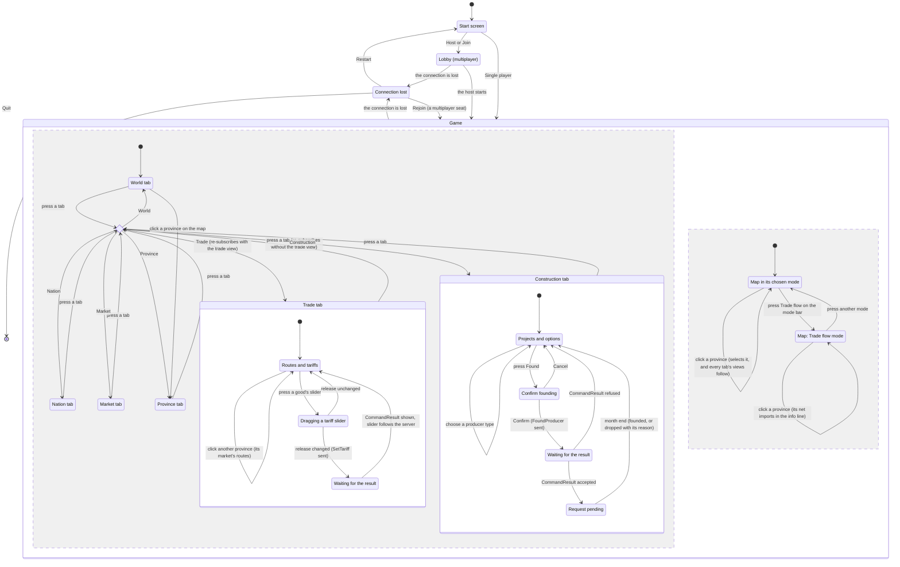

# System Specification: Milestone 5

> [!NOTE]
> **Status: planning record** for the "m5" run, kept by the SDLC workflow (docs/SDLC_WORKFLOW.md). Not binding: the contract wins, and each fact moves to its home as the work lands.

How Milestone 5 will be built: the Design stage of the [Project Workbook](README.md). It turns the [requirements specification](03-requirements-specification.md) into the modules that change, the decision texts the code needs, the physical data design, and the interfaces that cross task boundaries. The baseline plan's task DAG (planned, `tasks.json`) cites those interfaces by section. Code is cited at `aa2133a`, which the plan's commits don't change; documents as they stand on `m5/plan` at this page's commit. Everything on this page is *planned*, built by the task named beside it under the decision named beside it.

## How to read this page

- **Names are the code's.** Rust items are spelt as the code will spell them, schema items as `schemas/*.fbs` will. The requirements named tables in the ER diagram's style (`MERCHANT`); this page gives each its Rust struct (`Merchants`), and section 3.1 maps one to the other.
- **Every interface names the task that adds it** (M5-n) and the requirement or process-logic rule it builds (R-F, R-N, R-D, PL). A field or variant that a later task adds to an earlier task's type says so where it is listed.
- **Rules are linked, not restated:** a function's contract says what it computes and links the PL rule or decision that defines it.
- **Measurements** are from a release build of `aa2133a`'s engine on the run's machine, through uncommitted probes built outside the worktree, and from M4's own budget tests run there (the [correspondence log](README.md#correspondence-log), 05:13, 06:05 and 06:41).
- **Round 3's minor findings.** The Analysis stage was approved with six minor findings; how each is handled is in the [review log](README.md#analysis-round-3-minor-findings). Findings 1 to 3 are answered here (S8, S9), finding 4 by S6, and findings 5 and 6 by corrections to the requirements specification.
- **Design round 2.** Round 1 was returned with one major and eight minor findings; how each is handled is in the [review log](README.md#design-round-1-findings). The major one, settlement's hand-offs to `trade.rs`, is answered in 1.3, S5, S6 and 4.1: no `Cargo` row index leaves `trade.rs`.
- **Design round 3.** Round 2 was returned with one major and four minor findings; how each is handled is in the [review log](README.md#design-round-2-findings). The major one, M4's remote-client budget of 100 KB/s, is answered in 3.5, S28, S30, 4.4, 4.6, 6 and 8.4: every list in the new views is capped, and both views at their caps keep a remote client at about 82 KB/s.
- **Corrected in the baseline plan, round 1.** Round 3 was approved with six minor findings; how each is handled is in the [review log](README.md#design-round-3-minor-findings). The changes: `fill_new_views` at `view.rs`'s module level and the `Default` literals listed (8.1, 8.4); the snapshot and replica tests push a link only when `two_states` has none (8.1); `server_day_budget` subscribes both views unfilled (8.4); S30 says what a skipped update can lose (S30, 6); why 3.5's parts don't sum; and the second class diagram's missing wire tables. The [baseline plan](05-baseline-project-plan.md#plan-choices)'s B3 also fixes the order of M5-3, M5-4 and M5-8, so S11 and the "first of" clauses name one task.
- **Corrected in the whole-plan revision, round 2.** The three-lens panel returned the plan with one blocking and eight major findings; how each is handled is in the [review log](README.md#whole-plan-panel-round-1-findings). Here: the month end's fresh layout lands with M5-7, the first task whose step-6c function takes one (1.2, 4.7; panel finding 7); D6's founding bullet names D27's founders, the market's capitalists, and `InvestmentRules` gains `founder` (2.3, 3.2, 3.4, 3.7, 4.1; finding 2); the riot transfer's split (8.1; finding 1); the crafted-row refusals, the inventory and wage-floor tests and the replica cases by task (8.1; findings 8 and 9); and every clause that depended on landing order now names the order the baseline plan's chain fixes (B2), so 8.3's thread-count test is M5-12's.

## 1. Architecture

### 1.1 What changes, crate by crate

The crate boundaries stay as [AGENTS.md §2](../../../AGENTS.md#2-strict-decoupling) and ARCHITECTURE.md's table (`docs/ARCHITECTURE.md:53-61`) set them. Nothing new crosses a boundary: the engine gains state, systems and one load-time function; the loader gains formats; the server gains conversions and views; the protocol gains generated tables; the bridge and client gain views and controls.

| Crate | Changes (task) | New modules (task) |
|---|---|---|
| `pax_engine` | `world.rs`: seven new tables, two producer columns, `Nations::tariff`, `total_money`, `state_hash`, `check_tables`, `credit_pops_by_working` (M5-1 to M5-4, M5-6, M5-8, M5-9, M5-11, M5-16); `defs.rs`: `ExpansionRecipe`, `TradeRules`, `InvestmentRules`, new `PoliticsRules` fields (M5-1, M5-4, M5-6 to M5-9, M5-11, M5-12, M5-16); `command.rs`: `SetTariff` (M5-3), `FoundProducer` (M5-8); `tick.rs`: the amended D4 order and new `DayReport` fields (each task); `hash.rs`: `u8s` (M5-2), `option_u32s` (M5-4, which M5-8 follows: B3); `views.rs`: trade and investment views (M5-13), trade flow (M5-14); `systems/labor.rs`, `systems/firms.rs`, `systems/market.rs` | `horizon.rs` (M5-1); `systems/trade.rs` (M5-2, extended by M5-3, M5-4, M5-16); `systems/investment.rs` (M5-7, extended by M5-8, M5-9); `systems/unrest.rs` (M5-11, extended by M5-12) |
| `pax_data` | `schema.rs`: links, routes, merchants, recipes, rules, command fields; `lib.rs`: `build_world`, `command_of`, `describe_command`; `save.rs`: command fields, `SAVE_FORMAT`, format first; `snapshot.rs`: new blocks, `SNAPSHOT_FORMAT`; `bench.rs`: every M5 table copied, warm state copied | — |
| `pax_cli` | `main.rs`: `bench`'s per-day timing (M5-1), `--warmup` (M5-7); `report.rs`: `--market` (M5-5), new columns (R-F67's tasks) | — |
| `pax_server` | `commands.rs`, `request.rs` (M5-3, M5-8, M5-13); `view.rs`: subscriptions, `TradeRouteView`, `InvestmentLedgerView` (M5-13), `TradeFlow` (M5-14); `encode.rs`: `StaticData.routes` (M5-13); `hostile.rs` | — |
| `pax_protocol` | `schemas/*.fbs` and the generated code (`scripts/gen-protocol.sh`, never by hand, D22); `PROTOCOL_MINOR` | — |
| `pax_godot` | `encode.rs`, `connection.rs`, `decode.rs`, `keys.rs`, `lib.rs` (M5-13); `client/pax_keys.gd` regenerated whenever the schema's enums change (M5-3, M5-8, M5-13, M5-14) | — |
| `client/` | `main.gd`, `ui/map_modes.gd`, `ui/map_colors.gd`, `smoke.gd` (M5-14) | `ui/trade_panel.gd`, `ui/construction_panel.gd` (M5-14) |
| `data/`, `scenarios/` | `professions.toml` (M5-4), `production.toml` (M5-6), `rules.toml` (each rule's task); `two_states` (M5-5, re-recorded by every task that changes its results); `mini_valley/defs/rules.toml` (each rule's task, mechanisms off) | — |

`scripts/check_docs.py:116-130` requires every `systems/*.rs` to be named in ARCHITECTURE.md's game loop and on BACKEND_SCHEMA.md's workspace-tree `systems/` line, so M5-2, M5-7 and M5-11 each update both when they add `trade.rs`, `investment.rs` and `unrest.rs`.

### 1.2 The tick, as D4 will read

D17, D27 and D28 amend D4 ([its new text](#d4-tick-schedule-and-goods-persistence)). Commands still apply first, through `tick::step_with` (`crates/pax_engine/src/tick.rs:79-82`). The step numbers 1 to 7 keep their meaning, because D18, D19 and REBELLIONS.md cite steps 5, 6 and 1 (`docs/DECISIONS.md:340`, `:360`; `docs/REBELLIONS.md:25`); the new steps are 0, 6b and 6c (S2).

| Step | System | Function | Task | Reads | Writes |
|---|---|---|---|---|---|
| 0 | Arrival | `systems::trade::land_cargo` | M5-2 | `cargo` in transit, `network`, `geography.market_nation` | `cargo`, merchant cash, treasuries, `month_profit` (M5-4), today's `TradeReport` |
| 1 | Labour, with strikes | `systems::labor::assign_employment`, calling `systems::unrest::working_members` per POP | M5-11 | sizes, militancy, capacities | `producers.employed`, `LabourReport` with `striking` |
| 2 | Production | `systems::production::produce` | unchanged | | |
| 3 | Market | `systems::market::clear_markets`, with orders from `investment::construction_orders` (M5-7) and `trade::merchant_orders` (M5-3), offers from `trade::merchant_offers` (M5-3), and settlement's hand-offs, keyed by merchant or producer and good: `investment::deliver` (M5-7) and `trade::book_purchases` (M5-3) after the buy orders, `trade::book_sales` (M5-3) after the sellers (4.1) | M5-3, M5-5, M5-7 | as today, plus merchants, cargo, tariffs, projects | as today, plus merchant cash, cargo, project needs, spending by market |
| 4 | Firms | `systems::firms::pay_wages_and_dividends` (wages to working members, M5-11; the project reserve, M5-7; state owners, M5-8), then `systems::trade::pay_merchant_dividends` (M5-4) | M5-4, M5-7, M5-8, M5-11 | as today, plus projects, merchants | as today, plus merchant cash and `purchases_avg` |
| 4b | Government | `systems::government::pay_transfers` | unchanged | | |
| 5 | Mobility | `systems::mobility` (D18, D20, D25), unchanged code; D18 reads `LabourReport::unemployed`, which excludes strikers (M5-11, C16) | — | | |
| 6 | Politics | `systems::politics::update_militancy` | unchanged | | |
| — | A fresh layout | `World::pop_layout` after politics (mobility, migration and retraining may have appended rows, `tick.rs:96-104`), passed to every step-6c function | M5-7, the first task in the queue whose step-6c function takes a layout (`investment::run_month_end`); M5-4's `trade::run_month_end` and M5-8's founding reuse it (B8) | | |
| 6b | Riots | `systems::unrest::riot` | M5-12 | sizes, militancy, output stocks, treasuries | output stocks, treasuries, POP cash |
| 6c | Investment, then merchants | `systems::investment::run_month_end` (M5-7, M5-8, M5-9), then `systems::trade::run_month_end` (M5-4, M5-16) | M5-4, M5-7 to M5-9, M5-16 | producers, projects, requests, POPs, treasuries, merchants, route gaps | the same |
| 7 | Demographics, compaction | unchanged | | | |
| — | Money assert | `World::total_money` now counts merchant cash (`world.rs:597-602`) | M5-2 | | |

`tick::step_systems` (`tick.rs:84-136`), when M5 is complete:

```rust
fn step_systems(world: &mut World) -> DayReport {
    let money_before = world.total_money();
    let mut trade = trade::land_cargo(world); // D4 step 0 (M5-2)
    let layout = world.pop_layout();
    let labour = labor::assign_employment(world, &layout.labour); // step 1, strikes inside (M5-11)
    production::produce(world); // step 2
    let outcome = market::clear_markets(world, &layout, &mut trade); // step 3
    trade.finish(); // one row per (route, good), sorted
    let payouts = firms::pay_wages_and_dividends(world, &layout, &outcome.revenue, &outcome.input_cost); // step 4
    let merchant_dividends = trade::pay_merchant_dividends(world, &layout, &outcome.merchant_purchases); // step 4 (M5-4)
    let transfers = government::pay_transfers(world, &layout); // step 4b
    let (mut riots, mut built, mut merchant_month) = (Vec::new(), InvestmentMonth::default(), MerchantMonth::default());
    // ... as today: moved, migrated, retrained, compacted, militancy
    if demographics::is_month_end(world) {
        // step 5, as today (tick.rs:96-104)
        politics::update_militancy(world); // step 6
        let fresh = world.pop_layout(); // M5-7 (B8): mobility, migration and retraining may have appended rows
        riots = unrest::riot(world); // step 6b (M5-12)
        built = investment::run_month_end(world, &fresh); // step 6c (M5-7 to M5-9)
        merchant_month = trade::run_month_end(world, &fresh); // step 6c (M5-4, M5-16)
        // step 7, as today (tick.rs:106-108)
    }
    // the money assert and check_tables, as today (tick.rs:111-115), plus R-N4's goods check (section 8.2)
    // DayReport { ..., trade, merchant_dividends, merchants: merchant_month,
    //     investment: InvestmentReport { construction_spending: outcome.construction_spending, month: built }, riots, ... }
}
```

### 1.3 How data and control flow between the modules

- **`market.rs` keeps the clearing machinery and the market step's money; the agents' rules live with the agents.** Order formation calls `trade::merchant_orders` and `investment::construction_orders`, which return `market::BuyOrder`s, and `trade::merchant_offers`, which returns `market::SellOffer`s, so D1's discovery and settlement treat every buyer and seller alike (D17's Rule, D27's Rule, construction). Settlement moves all of the step's money, as it does today (`crates/pax_engine/src/systems/market.rs:785-830`): it debits each buyer's cash, merchants' and projects' included, and credits each seller's, merchants' included. It hands the goods to the agents' modules in the order it settles: after the buy-order loop, each construction delivery to `investment::deliver` (PL-10) and the merchants' purchases to `trade::book_purchases`, which merges them into `Cargo` as in-transit rows and asserts R-D9 before any sale's receipts are credited; after the seller loop, the merchants' sales to `trade::book_sales`, which takes each sale's units and its share of landed cost off its for-sale row (PL-3). **No `Cargo` row index leaves `trade.rs`:** an offer names its merchant (`Seller::Merchant`) and its good, and a purchase or a sale names its merchant and good, the key by which `trade.rs` finds the row (R-D10). The purchases' merge moves every row after a new in-transit row, so a row index taken at order formation would be stale by the time the sales are booked; a key can't be, whichever hand-off runs first (S5, S6; the sequence is in [4.1](#41-pax_engine)).
- **`firms.rs` asks the systems for what it needs:** `investment::project_reserve` for the dividend reserve (PL-11) and `World::credit_pops_by_working` for the wage split (PL-15).
- **The month end runs on one fresh layout** (6b, 6c), because mobility can append POP rows (`crates/pax_engine/src/systems/mobility.rs:107-111`); riots, foundings and merchant entry move cash between existing rows only, so the layout stays valid through them.
- **Loading** (`pax_data::build_world`) parses links and routes, pushes the links, calls `pax_engine::horizon::trade_horizon` on them, checks each route with `horizon::resolve_route`, pushes the routes, and drops the horizon (PL-1, R-N20).
- **The server** builds its views from `pax_engine::views` and the day's `DayReport`, as it does today (`crates/pax_server/src/view.rs:1-13`), and converts commands with exhaustive matches over the engine's enums (`crates/pax_server/src/commands.rs:1-7`).

### 1.4 What runs concurrently, and how it reduces

- **The four parallel passes stay as they are** (consumer aggregation, `market.rs:502-530`; discovery, one job per market, `:307-318`; settlement's passes A and B, `:683-701` and `:722-770`). Their reductions sum integers only, so results don't depend on the thread count ([AGENTS.md §3](../../../AGENTS.md#3-concurrency-mitigation)).
- **M5 adds no parallel pass and no new reduction.** Arrival, the new order formation, settlement's hand-offs, merchant dividends, strikes inside the labour loop, and the month-end steps all run on the sim thread in row order. Their tables are small next to the POP table (two merchants in `two_states`; about 60,000 routes at D13's long-term scale), and row order is their determinism (D8).
- **Markets stay independent within a tick** (D17's one day of transit): a merchant's buy order is in its route's origin and its offers in its destination, each in that market's slice of the sorted lists (`market.rs:296-302`), so each discovery job still reads only its own market and no cross-market lock exists.
- **Strikes** are computed per POP inside `assign_employment`'s loop over pools (`crates/pax_engine/src/systems/labor.rs:55-79`), which is sequential today, and again in the wage split (`crates/pax_engine/src/systems/firms.rs:131-139`); neither becomes parallel.
- **The server's threads don't change** (D23): the sim thread owns the world and builds the views.

### 1.5 Boundaries

- The trade horizon is pure `Fixed` arithmetic over a table, so it lives in `pax_engine` (`horizon.rs`, no IO); `pax_data` reads the files and calls it ([AGENTS.md §2](../../../AGENTS.md#2-strict-decoupling), D9).
- Every schema change is regenerated by `scripts/gen-protocol.sh` and checked by CI (`.github/workflows/ci.yml:34-41`); nothing in `crates/pax_protocol/src/generated` is edited by hand (D22).
- `pax_godot` gains no dependency: it decodes the new views with `pax_protocol` only (D12; the allowlist at `ci.yml:77-84`).

## 2. Decisions

### 2.1 What the design relies on

| Decision | Status | What the design uses it for |
|---|---|---|
| [D17](../../DECISIONS.md#d17-inter-market-trade-routes-merchants-and-tariffs), [D27](../../DECISIONS.md#d27-capital-investment-and-capacity-expansion), [D28](../../DECISIONS.md#d28-economic-unrest-strikes-and-riots) | Accepted by the maintainer for this run (run decisions 1 to 4, [quoted](README.md#run-rules)), recorded in DECISIONS.md on `m5/plan` (`bd08ee6`) | The rules of trade, investment and unrest; their Amends lines authorise every amendment in [2.3](#23-amended-decision-texts-proposed) |
| [D4](../../DECISIONS.md#d4-tick-schedule-and-goods-persistence) | Accepted; amended by D17, D27, D28 | The tick order (1.2) |
| [D5](../../DECISIONS.md#d5-money-model-and-stock-flow-consistency) | Accepted; amended by D17 | Merchant cash in outside money; every new flow a transfer |
| [D6](../../DECISIONS.md#d6-firms-production-wages-ownership) | Accepted; amended by D17, D27, D28 | Merchant dividends; the project reserve; state ownership; founding; strikers' pay |
| [D14](../../DECISIONS.md#d14-market-hierarchy-and-inter-market-trade) | Accepted (principle); rule 5 amended by D17 | Rules 1 to 4 as they stand; the sparse horizon |
| [D21](../../DECISIONS.md#d21-commands-and-command-logs), [D24](../../DECISIONS.md#d24-multiplayer-authority) | Accepted; amended by D17 and D27 | `SetTariff`, `FoundProducer`, their validation, permission and conflict rule |
| [D1](../../DECISIONS.md#d1-market-clearing-bounded-tâtonnement-with-pro-rata-rationing), [D2](../../DECISIONS.md#d2-consumer-demand-linear-expenditure-system-stone-geary), [D3](../../DECISIONS.md#d3-determinism-fixed-point-everything), [D7](../../DECISIONS.md#d7-pop-accounting), [D8](../../DECISIONS.md#d8-ecs-hand-rolled-struct-of-arrays), [D9](../../DECISIONS.md#d9-data-format-toml), [D10](../../DECISIONS.md#d10-network-model-server-authoritative-deterministic-core), [D11](../../DECISIONS.md#d11-determinism-harness-and-golden-files), [D12](../../DECISIONS.md#d12-frontend-godot-with-a-rust-gdextension-bridge), [D13](../../DECISIONS.md#d13-performance-budget), [D15](../../DECISIONS.md#d15-nations-treasuries-income-tax-and-transfers), [D16](../../DECISIONS.md#d16-government-consumption), [D18](../../DECISIONS.md#d18-labour-mobility), [D19](../../DECISIONS.md#d19-militancy), [D20](../../DECISIONS.md#d20-migration-within-a-market), [D22](../../DECISIONS.md#d22-wire-protocol-and-client-sessions), [D23](../../DECISIONS.md#d23-server-loop-pacing-flow-control-and-saves), [D25](../../DECISIONS.md#d25-occupational-migration-within-a-market), [D26](../../DECISIONS.md#d26-births-follow-employment-band-aid) | Accepted, binding as they stand | Clearing, demand, determinism, accounting, tables, formats, saves, the budget, labour flows, the protocol; D19's and D22's texts get the descriptive updates in 2.3 |
| D29 to D32 | Proposed (M6) | Not relied on |

### 2.2 No decision is missing

No task needs a decision that is neither accepted nor a run decision. Each point that could have needed one was checked:

| Point | Why no decision is needed |
|---|---|
| Income tax on merchant dividends | Not taxed: D15 withholds from producers' payments only (`docs/DECISIONS.md:311`), and D17's Amends line names no D15 change (C7) |
| A share registry | Owners stay the profession and the state (D6, D17, D27; C8, C14) |
| Firm failure | No holder can owe money: a merchant's cash covers its tariffs (R-D9), and construction spends only cash above the day's needs (C24) |
| Making D1's adaptive step the default | Not planned; it would change D1's "off by default" text and re-record golden files, which is the maintainer's (D1's Revisit). If a task's benchmark needs it, that task is blocked on it ([8.4](#84-performance-d13)) |
| A command that charters merchants | Out of scope (SSR item 3; R-F60) |
| D18's "unemployed" when strikers exist | D18 moves the labour report's unemployed; strikers withhold labour and aren't seeking work, so they aren't unemployed (C16); no text of D18 changes |
| `FoundProducer`'s conflicts between players | D27's own Amends line gives the rule, "only in the commanding nation's own markets" (`docs/DECISIONS.md:525`); its text lands in D24 below |
| Where the amendment texts land | DECISIONS.md's own rule (`docs/DECISIONS.md:12`): in the pull request that changes the code (S1) |

### 2.3 Amended decision texts (Proposed)

Each entry below is given as it will read when M5 is complete, in DECISIONS.md's own formatting, after a list of exactly what changes. Each part is **Proposed** until the task named for it lands it, in the same pull request as its code, under the accepted Amends line named beside it (S1). A task lands only its own parts, so DECISIONS.md describes the code at every merge.

#### D4. Tick schedule and goods persistence

Authorised by D17's Amends line ("D4 (arrival step and merchant orders; the tick order in DATA_MODEL_M5_M6.md)"), D27's ("D4 (the month-end investment step)") and D28's ("D4 (riots after politics)"). It is the data model's order (`docs/DATA_MODEL_M5_M6.md:311-327`) with the two refinements the requirements settled: construction goods are delivered at settlement, where every buyer's goods are, not at production (C13), and the merchants' month-end steps follow investment in 6c (C19). The changes, each with the task that lands it:
- the lead sentence ends "…in this fixed order (`crates/pax_engine/src/tick.rs`), after the tick's commands (D21):" (M5-2);
- a new row 0, arrival (M5-2);
- row 1 gains "strikes (D28), then" (M5-11);
- row 3's orders gain "construction projects D27" (M5-7) and "merchants D17" (M5-3);
- row 4 gains "; merchants' dividends (D17)" (M5-4);
- a new row 6b, riots (M5-12);
- a new row 6c: "Investment: complete projects" and "start expansions" (M5-7), "shrink idle capacity" (M5-9), "found the producers the state asked for" and "found producers for owners" (M5-8), "then merchants: wind up loss-makers" (M5-4), "found new merchants" (M5-16); each task writes its clause, and the row's first task writes the row;
- the goods-persist bullet gains its last sentence (M5-2), and the households bullet its last sentence (M5-7).

> **Problem.** Markets cleared daily but POPs bought weekly, so six days out of seven had no consumer demand. The order within a tick and the fate of unsold goods were also undefined.
>
> **Decision.** All economic systems run **daily**, in this fixed order (`crates/pax_engine/src/tick.rs`), after the tick's commands (D21):
>
> | # | System | Cadence |
> |---|---|---|
> | 0 | Arrival: the goods merchants bought the day before land in their destination, less the iceberg share, which is destroyed, and pay the tariff assessed on them to the importing treasury (D17) | daily |
> | 1 | Labour: strikes (D28), then assign employment | daily |
> | 2 | Production | daily |
> | 3 | Market: orders (households, producers' inputs, construction projects D27, governments D16, merchants D17) → price discovery → settlement | daily |
> | 4 | Firms: wages, dividends (income tax withheld, D15); merchants' dividends (D17) | daily |
> | 4b | Government: transfers from treasuries to POPs (D15) | daily |
> | 5 | Labour mobility within a province (D18), then migration within a market (D20), then occupational migration within a market (D25); *(planned, needs a decision, none drafted)* promotion | month end |
> | 6 | Politics: militancy (D19); *(planned, needs a decision, none drafted)* consciousness | month end |
> | 6b | Riots, on this month's militancy (D28) | month end |
> | 6c | Investment: complete projects, shrink idle capacity, found the producers the state asked for, start expansions, found producers for owners (D27); then merchants: wind up loss-makers, found new merchants (D17) | month end |
> | 7 | Demographics, then POP row compaction (D7) | month end |
>
> - A month is 30 days until a real calendar is needed (`rules.days_per_month`).
> - **Goods persist.** Unsold output stays in the producer's stock, and producers stop producing when stock reaches `target_stock_days` of output (D6). A merchant's goods are in transit for one day, then stay in its stock in the destination until sold (D17).
> - Goods bought by POPs are consumed immediately; households hold no inventory in M1. Construction goods are consumed by the project that bought them (D27).
> - Perishability, if wanted, will be a per-good decay rate in data, not an implicit loss.

#### D5. Money model and stock-flow consistency

Authorised by D17's Amends line ("D5 and D6 (merchant cash; merchant dividends)"). One change, with M5-2, which adds merchant cash to `World::total_money`: the outside-money bullet names the holders.

> - **Outside money** (`Σ cash` over all agents: POPs, producers, treasuries and merchants, D17) is constant. It may change only through an explicit, logged *mint* or *burn* event. Today none exists, and `tick::step` panics if the total moves.

#### D6. Firms: production, wages, ownership

Authorised by D17's Amends line (merchant dividends), D27's ("D6 (dividends only above the project reserve; state ownership; founding transfers)") and D28's ("D6 (striking workers' pay, once settled)", settled by run decision 3). The technology, shutdown, inventory, pricing, wage and wage-floor bullets don't change. The changes:
- the liquidity rule's last sentence, "It goes into the labour pool `(province, profession)` and is split by POP size", becomes the first sentence below, with "Striking workers forgo wages." after it (M5-11);
- the dividends bullet gains "and the reserve of the producer's construction project (D27)" (M5-7) and its last clause, the state's producers (M5-8);
- a new bullet for merchants' dividends (M5-4);
- a new bullet for founding (M5-8);
- the ownership bullet loses "in M1" and gains the state's ownership: the merchants' part with M5-4, the producers' part with M5-8 (the chain puts M5-4 first, B2).

> - **Liquidity rule:** wages are paid only from cash above a **restart reserve**: the cost of the inputs still missing for one day of output at today's prices (`production::input_requirements`). It goes into the labour pool `(province, profession)` and is split among the pool's working members: its POPs in proportion to their members not on strike, by `alloc::allocate` (D28). Striking workers forgo wages.
>   - (its three sub-bullets unchanged)
> - **Dividends:** cash above `reserve_days × wage bill` and the reserve of the producer's construction project (D27) is paid out at `dividend_payout_rate` per day to the producer type's **owner profession** in the same market, split by size; a producer the state founded pays them to its nation's treasury (D27).
> - **Merchants' dividends (D17):** a merchant pays `dividend_payout_rate` per day of its cash above its working reserve (TRADE.md) to its owner by kind: the owner pool of its kind's owner profession in its route's origin market, split by size, or, for a chartered merchant, its nation's treasury.
> - **Founding (D27):** a new producer starts with capacity 0 and a construction project. Its founding cost moves into its cash in one transfer, from the market's capitalists (split by largest remainder; INVESTMENT.md) or, by `FoundProducer`, from the nation's treasury.
> - **Ownership is profession-level**, or the state's for the producers it founded and the merchants it chartered (D17, D27). A share registry (who owns which firm, so capitalists in one market can own firms in another) is planned and will be needed for investment and bankruptcy; the investment proposal ([#21](https://github.com/thomasclarkpersonal-sketch/Iron-and-Blood/pull/21), question 1) raises it, and nothing designs it yet.

#### D14. Market hierarchy and inter-market trade, rule 5

Authorised by D17's Amends line ("D14 rule 5 (a sparse horizon instead of a dense matrix)"). One change, with M5-1: "a matrix precomputed at load time and rebuilt only when infrastructure changes" becomes the sparse horizon.

> 5. Distances and friction come from a sparse trade horizon, precomputed at load time and rebuilt only when infrastructure changes: for each market, the markets whose best retention `Π(1 − τ)` over the links is at least `min_retention` (D17). Never pathfinding in the tick, never a dense all-pairs matrix (MAP_AND_LOGISTICS.md).

#### D21. Commands and command logs

Authorised by D17's Amends line ("D21 and D24 (`SetTariff` and its validation)") and D27's ("D21 and D24 (`FoundProducer`, only in the commanding nation's own markets)"). The Timing bullet and the rest don't change. The changes:
- the list of commands gains `SetTariff` (M5-3) and `FoundProducer` (M5-8);
- the list of errors gains the unknown good (M5-3), and the unknown province and producer type, the foreign province and the missing recipe (M5-8);
- a fifth sub-bullet under Validation: its first sentence with M5-3, for `SetTariff`, and its `FoundProducer` parts with M5-8;
- the command-log bullet's "`[[command]]` entries with `day`, `type`, `nation`, `rate`" becomes "…with `day`, `type`, `nation` and the command's own fields" (M5-3).

> - **`pax_engine::Command`** is the only way the outside world changes state during a game.
>   - Commands so far: `SetIncomeTax`, `SetTransferRate`, `SetConsumptionRate`, `SetTariff` (D17) and `FoundProducer` (D27).
>   - Rates are `Fixed` (D3); a command never carries a float.
> - **Validation first:** `World::validate` is the **only** definition of command validity (`CommandError`: unknown nation, good, province or producer type; rate outside [0, 1]; consumption without a basket; a province outside the nation's markets; a producer type without an expansion recipe).
>   - (its four sub-bullets unchanged)
>   - `SetTariff` and `FoundProducer` are valid on definitions and topology alone (a nation, a good, a province in one of its markets, a producer type with an expansion recipe), never on state that the tick or other commands change, so a logged one stays valid against the scenario's initial world. A `FoundProducer` only records a request, which the next month end's investment step funds or drops (D4 step 6c, D27).
> - **Command logs:** a game is its initial state plus its command log.
>   - A scenario may name a `commands` file (`[[command]]` entries with `day`, `type`, `nation` and the command's own fields; see DATA_FORMAT.md).

#### D24. Multiplayer authority, the Order bullet

Authorised by the same two Amends lines. D24 asks a command that can conflict for a conflict rule "in its decision"; run decision 5 keeps D17 and D27 as written, and both name D24 in their Amends lines, so the rule is written here. One change: two sentences appended, each command's part with its task (M5-3, M5-8).

> - **Order:** commands apply in `(day, player, sequence)` order, all server-stamped. Any future command that can conflict with another player's must define its own conflict rule in its decision. Player order is only a deterministic tie-break, and would otherwise always favour lower ids. `SetTariff` (D17) and `FoundProducer` (D27) act only in the commanding nation's own markets (its imports; its own provinces' workers, and its treasury), so outside sandbox, where each nation has one player, they can't conflict with another player's commands. Sandbox seats may command any nation, and their commands apply in stamp order, as the rate commands do.

#### Descriptive updates (not rule changes)

| Entry | Today | When it lands | Text |
|---|---|---|---|
| D19 | "It has no effects yet." (`docs/DECISIONS.md:357`) | M5-11, when militancy first has an effect | "**Its effects are strikes and riots (D28).**" The update rule, which run decision 4 keeps, is untouched (S20) |
| D22, "Views, not state" | lists `MapView`, `MarketDetail` and `ProvinceDetail` (`docs/DECISIONS.md:414`) | M5-13 | adds "**, `TradeRouteView` and `InvestmentLedgerView`**"; the budgets stay |

### 2.4 Choices this design makes within the contract

For the maintainer to check. None needs a new or amended decision beyond 2.3. They continue the requirements' C1 to C29.

These are run choices, not decisions: they go into the plan pull request's description and the [workbook](README.md), each for the maintainer to confirm or overturn, and never into DECISIONS.md, whose entries hold rules, not mechanism (`docs/DECISIONS.md:14-20`). The plan adds nothing to DECISIONS.md when it is approved: the run decisions are recorded already (`bd08ee6`), and each text of 2.3 lands in the pull request of the task named beside it (S1).

| # | Choice | Why |
|---|---|---|
| S1 | **No new decision, and every amendment lands in DECISIONS.md with its code.** The texts in 2.3 reach the plan PR as Proposed on this page; DECISIONS.md takes each part in the pull request that implements it, and the plan PR's description lists them with their tasks | DECISIONS.md: "edit its entry in the same pull request as the code" (`docs/DECISIONS.md:12`), as #64 did for D4's schedule (`4788b6d`). Writing them into accepted entries early would make those entries describe code that doesn't exist |
| S2 | **D4 keeps its step numbers**: arrival is 0, riots 6b, investment and the merchants' month end 6c | D18, D19 and REBELLIONS.md cite steps 5, 6 and 1 (`docs/DECISIONS.md:340`, `:360`; `docs/REBELLIONS.md:25`); the data model's 0 to 10 (`docs/DATA_MODEL_M5_M6.md:313-326`) would break them |
| S3 | **Trade topology is `World::network`** (`Links`, `Routes`), beside `geography`, not inside it. Like geography it is neither hashed nor snapshotted; a restored world copies it from its scenario (PL-18) | `World::new` keeps its signature (`world.rs:212-229`), so the six test sites that build a `Geography` literal (`crates/pax_engine/tests/common/mod.rs:117`, `extremes.rs:27`, `:58`, `mobility.rs:41`, `demographics.rs:29`, `:116`) don't change; the snapshot destructures `Geography` exhaustively (`crates/pax_data/src/snapshot.rs:103`). AGENTS.md §1's "add it to `World::state_hash`" is the rule for state, and topology isn't state: `state_hash` covers "all mutable state" and excludes static definitions (`crates/pax_engine/src/world.rs:609-610`), as it excludes `Geography`'s columns today; links and routes are fixed for the game, read from the scenario, whose content hash covers them (D22), and taken from it when a save loads (D23), so a hash of them would change on no day. If a decision lets infrastructure change during play (D14 rule 5's "rebuilt only when infrastructure changes"), links become state, and the task that builds that hashes and snapshots them |
| S4 | **A project's needs are keyed by its producer row**, not by a project row | One project per producer (R-D11), and producer rows never move (R-F32), so closing a project renumbers nothing. The ER diagram's `PROJECT_NEED.project` is this key |
| S5 | **`Cargo` is rebuilt by merge passes, never by inserting rows, and its row indices never leave `trade.rs`**: `trade::book_purchases` merges the day's purchases (at most one per merchant and good) into the table in one sorted pass; arrival lands every in-transit row and drops emptied for-sale rows in one linear pass. Offers, purchases and sales name `(merchant, good)`, and `trade.rs` finds the row by that key with a binary search on the sorted table (R-D10) | Inserting rows one at a time into a sorted table of about 300,000 rows (60,000 routes, a few goods each) is quadratic. The merge moves every row after a new in-transit row, so a row index taken before it would book a merchant's same-day sale on a shifted row, with the wrong quantity and landed cost; the money assert can't see that (Design round 1's major finding) |
| S6 | **Merchant goods bookkeeping is in `trade.rs`; the market step's money stays in `market.rs`.** Settlement debits a merchant's cash for its purchases and credits it for its sales, as it does every buyer and seller, and passes the purchases to `trade::book_purchases` after the buy-order loop and the sales to `trade::book_sales` after the seller loop (4.1); M5-4's `month_profit` hooks (PL-3, PL-4) are therefore edits to `trade::book_sales` and `trade::land_cargo`, both in `trade.rs` | One home for cargo's rules, and one function where every unit of the step's money moves; answers round 3's minor finding 4. Booking purchases before any receipt is credited lets `book_purchases` assert R-D9 on the cash the purchases left |
| S7 | **Strikes land before investment**: M5-7 depends on M5-11, so PL-8's available workers count working members from M5-7's first commit, and R-F24's `no_project_for_strikers` lands with M5-7 | Otherwise PL-8 would be built by size and rebuilt later. Both are in the queue's one-at-a-time order (`parallel` 1), so the edge only orders it |
| S8 | **M5-1 is the DAG's root**: every other task depends on it, directly or through others. M5-2 already does (`docs/MILESTONE_5.md:65`), and C29 adds M5-7 and M5-12; the new edges are M5-1 → M5-6 and M5-1 → M5-11, the two tasks with no dependency, after which every task reaches M5-1 | M5-1's first commit, the bench print, measures the baseline on `main`'s engine; it is `aa2133a`'s only if no other engine change has landed (round 3's minor finding 2) |
| S9 | **`bench`'s new lines give times in "ms", never "ms/day"**, and its summary line keeps today's form; R-N26 also compares each month-end task's median with M5-1's baseline (a cumulative 20% trigger) | `scripts/bench-compare.sh:19-21` reads `: <number> ms/day`, greedily, from every line (minor finding 1); per-task comparisons alone miss a drift of many small steps (minor finding 3) |
| S10 | **A command's fields beyond `nation` are optional scalars on the wire** (`good: uint = null`), so an absent one is `Malformed`, never a silent 0 | FlatBuffers scalars default to 0; today only the `rate` struct can be absent (`schemas/common.fbs:50-63`) |
| S11 | **New `CommandError` wire values are appended in landing order** after `NotStarted = 7`: `UnknownGood` 8 (M5-3), then `UnknownProvince` 9, `UnknownProducerType` 10, `ForeignProvince` 11, `NoExpansionRecipe` 12 (M5-8). The baseline plan makes M5-8 follow M5-3 (B3), so these are the values; the rule for any other order stays "next after the last value on `main`" | D22's append-only rule; PL-13 |
| S12 | **`Subscribe` gains `trade_routes`, `tariff_nation` and `investment`**, so the new views go only to a client that asks, and a 1.6 client's `Subscribe` asks for none | R-N15; R-N14's budgets |
| S13 | **`StaticData.routes` is a vector of `RouteDef` tables** (origin and destination markets) | Tables can gain fields later; structs can't (D22's append-only rule) |
| S14 | **The bridge keeps `subscribe` and adds `subscribe_views`**, so M5-13 doesn't break the client before M5-14 switches `main.gd` over | `client/main.gd:319` calls `subscribe` with four arguments |
| S15 | **A save's format is read before the rest of the file**, by a permissive parse of `format` alone | R-N16: today the whole file is parsed first (`crates/pax_data/src/save.rs:232-237`), so a newer save fails as an unknown field |
| S16 | **The new state-hash blocks start with 8-byte ASCII tags** (`u64::from_le_bytes(*b"merchant")` and so on) | PL-18 asks for a tag per block; readable constants can't collide by accident |
| S17 | **Per-pool working members for the investment ledger are counted once a day, in `views::ProvinceStats::of`'s existing pass over the POP table** | R-F46 needs unclaimed workers per province; counting them per session and update would add a pass over every POP row to each view (R-N14) |
| S18 | **Unrest values in `data/rules.toml`: `strike_threshold` 0.3, `strike_rate` 1, `riot_threshold` 0.3, `riot_destruction` 0.2, `riot_security_rate` 0.01** ([3.7](#37-planned-data-values-and-the-measurements-behind-them)) | Measured: they meet R-F40, and keep `two_states` riot-free at 12% tax. Peaks' starving miners (militancy up to 0.355) strike in the famine years, so M5-11 changes `two_states`' results and re-records it, under the bands clause |
| S19 | **Investment, trade and recipe values** as in 3.7, calibrated by M5-6 to M5-10 and M5-16 against R-F33 and the bands clause; a task whose change breaks a scenario test tunes only its own levers, within their data rules, or reports blocked ([baseline plan](05-baseline-project-plan.md#plan-choices), B9) | Measured where the economy has room: unemployed farmers (880 and 740), farms 25% above the wage bill, with 52.5k and 35.3k in cash. The farms pass PL-9 themselves, so R-F33's growth doesn't wait on owners founding farms, which C14's literal reading of D27 rules out ([3.7](#37-planned-data-values-and-the-measurements-behind-them)) |
| S20 | **D19's "It has no effects yet" is updated by M5-11** (2.3), its rule untouched, and so is `Pops::militancy`'s rustdoc, which says the same (`crates/pax_engine/src/world.rs:67`) | Run decision 4 keeps D19's update rule; the status sentence would be false once strikes exist ([AGENTS.md §8](../../../AGENTS.md#8-documentation-maintenance)) |
| S21 | **`RouteFlow` also carries units sold and their receipts**, beside R-F54's bought, landed, lost, cost and tariff; they stay in `DayReport`, and the wire's `TradeRoute` doesn't carry them (S28) | R-N4's daily goods check needs the units sold, and the trade view's order, the most traded first (S28), needs the receipts |
| S22 | **The riot step groups POP rows by province itself** (`Groups::build`, `crates/pax_engine/src/groups.rs:17-32`) | The layout has labour, owner and nation groups but no province groups (`crates/pax_engine/src/layout.rs:78-90`) |
| S23 | **A seeded merchant names its route by `from` and `to` markets** | Routes have no keys (R-F6); `TRADE.md:86-91`'s `route = "lowland-highland"` is updated by M5-4 |
| S24 | **`mini_valley`'s frozen rules name `capitalist` for both merchant owners** | It has no merchant profession (`scenarios/mini_valley/defs/professions.toml`), and nothing trades there (R-F59) |
| S25 | **The client gets two tabs, Trade and Construction**, beside World, Nation, Market and Province (`client/main.gd:435-455`); tariffs are per-mille sliders like the nation panel's (`client/ui/nation_panel.gd:20-25`, `:61-68`) | R-F49 to R-F51; one pattern for every rate the player sets |
| S26 | **`owner_nation` is ownership, kept as state** on producers and merchants ([3.1](#31-engine-state-world)). `check_tables` pins it to the producer's market's nation (R-D12) and the chartered merchant's route origin's (R-D3) only while market ownership is topology, as it is in M5 | D7 forbids storing what other state determines (`docs/DECISIONS.md:190`). Ownership is set once, by a founding or a charter, and no other state determines it after; deriving it from the market would decide, in the data layout, that state property passes with a market that changes hands, which is for the decision that makes market ownership state (`docs/DATA_MODEL_M5_M6.md:29`) to say, as the data model asks of deposits (`:292`). Design round 1's minor finding 3 |
| S27 | **M5-10 depends on M5-9**, beside M5-7 and M5-8 | 3.7's investment values count on depreciation being in when the growth test runs: the half-empty peaks mines shrink by about 5,000 slots, which R-F33's capacity bound must outgrow. With the edge, M5-10 measures the economy with all three mechanisms, and any recalibration is M5-10's, never left to M5-9's pull request (Design round 1's minor finding 8) |
| S28 | **The new views are bounded, so that a remote client with every view subscribed stays within M4's 100 KB/s at speed 3, and the full update within D22's 128 KB:** `TradeRoute` carries R-F45's five figures a good (bought, cost, landed, lost, tariff), and `sold` and `receipts` stay in `DayReport` (S21); `TradeRouteView` lists at most 20 routes, the most traded today first, each with at most 10 goods, the most traded first; the ledger lists at most 16 projects, 16 pending requests and 16 founding results; each list carries the count it leaves out ([3.5](#35-wire-schema)) | Round 2's views, 40 routes of 10 goods with seven figures each, would take a remote client to about 117 KB/s (`MILESTONE_4.md:111`, `crates/pax_server/src/game.rs:227-270`; Design round 2's major finding). At these caps both views take 14,456 bytes at the long-term scale: 82.4 KB/s against M4's measure, and 107,272 of 131,072 bytes an update. Every list is capped, so no world can exceed them, and the caps are derived from the budget in 3.5. Neither budget is raised: D22's is a decision, and the 100 KB/s is the maintainer's M4 target |
| S29 | **A `FoundProducer` from the Construction tab names the nation of the selected province's market**, in sandbox and in a claimed seat alike; its Found button is disabled when that market is stateless or, in a claimed seat, another nation's ([6](#6-dialogue-design)) | D27 founds only in the commanding nation's own markets (`docs/DECISIONS.md:525`), so that nation is the only one `World::validate` accepts: a sandbox chooser could offer only refusals (`ForeignProvince`) |
| S30 | **The client asks for `TradeRouteView` only while the Trade tab is open, and for the ledger whenever a province is selected**; it re-subscribes when the Trade tab is entered or left, and on no other change of tab ([4.6](#46-pax_godot-and-the-client), [6](#6-dialogue-design)) | The trade view is the larger (11.6 KB at its caps) and is replaced whole every day, so it is sent only while shown: a remote client with another tab open gets 57.7 KB/s at speed 3, not 80.2 (3.5). Each change of subscription is answered with a full update, map included (`crates/pax_server/src/sim.rs:845-853`), so only the Trade tab's entry and exit re-subscribe. The ledger (2.1 KB) stays subscribed, because a founding's outcome is in the month-end day's update only (R-F46): with its tab closed that day, the player would never learn why a request was dropped. *Restated in the baseline plan, round 1 (Design round 3's minor finding 4):* the update can still be skipped, by D23's window or by D24's cap for a remote session above four days a second (`crates/pax_server/src/throttle.rs:1-10`), and then that outcome is lost too; the client still sees the request leave the pending list and, if it was founded, its project appear, so only a drop's reason is lost. Keeping the outcome in the server until a later update would build a view from an earlier day's report, which D22's views don't provide for (`docs/DECISIONS.md:415`) ([baseline plan](05-baseline-project-plan.md#plan-choices), B4). The budget tests subscribe both views whatever the client does (8.4) |

## 3. Physical data design

### 3.1 Engine state: `World`

`World` (`world.rs:183-197`) gains these fields, each a table of equal-length `Vec` columns pushed together (D8, [AGENTS.md §1](../../../AGENTS.md#1-core-architecture-rust--data-oriented-design)). `World::new` leaves every new table empty, so a world without M5 content is today's. `check_tables` destructures each new table without `..` (as `world.rs:484-486` requires) and checks the rules below; the snapshot writes every state table and column (R-N17).

| ER entity | Field: struct | Kind | Task |
|---|---|---|---|
| `LINK`, `ROUTE` | `network: TradeNetwork { links: Links, routes: Routes }` | topology | M5-1 |
| `ROUTE_GAP` | `route_gaps: RouteGaps` | state | M5-16 |
| `MERCHANT` | `merchants: Merchants` | state | M5-2; columns of M5-4 |
| `CARGO` | `cargo: Cargo` | state | M5-2 |
| `NATION_TARIFF` | `nations.tariff: Vec<Fixed>` | state | M5-3 |
| `PRODUCER` | `producers.owner_nation: Vec<Option<u32>>`, `producers.idle_months: Vec<u16>` | state | M5-8, M5-9 |
| `PROJECT`, `PROJECT_NEED` | `projects: Projects`, `project_needs: ProjectNeeds` | state | M5-6 |
| `FOUNDING_REQUEST` | `founding_requests: FoundingRequests` | state | M5-8 |

**`Links`** (M5-1). Rows sorted by `(origin, destination)` and unique.

| Column | Type | Rule (`check_tables`) |
|---|---|---|
| `origin`, `destination` | `Vec<u32>` | known markets, different (R-D1) |
| `retention` | `Vec<Fixed>` | `1 − τ`, in (0, 1] |
| `capacity` | `Vec<Fixed>` | units a day, all goods, > 0 |

**`Routes`** (M5-1). Rows sorted by `(origin, destination)` and unique (R-D14).

| Column | Type | Rule |
|---|---|---|
| `origin`, `destination` | `Vec<u32>` | known markets, different |
| `link` | `Vec<u32>` | a `Links` row joining `origin` to `destination` (R-D2; PL-1 checked the best path at load) |
| `margin` | `Vec<Fixed>` | ≥ 0 |
| `k` | `Vec<Fixed>` | > 0 |

**`RouteGaps`** (M5-16): `gap_months: Vec<u16>`, one row per route in route order, each ≤ `trade.entry_months` (PL-7). `World::push_route` pushes 0.

**`Merchants`** (M5-2; M5-4 adds the last six columns). Rows are never removed or reordered (R-D15).

| Column | Type | Rule |
|---|---|---|
| `route` | `Vec<u32>` | a route row |
| `cash` | `Vec<Fixed>` | ≥ 0, and ≥ its in-transit cargo's `Σ tariff_due` (R-D9) |
| `kind` | `Vec<MerchantKind>` | `Private`, `Commercial` or `Chartered` |
| `owner_nation` | `Vec<Option<u32>>` | `Some` exactly when `Chartered`: the payload of that kind, the chartering nation (R-D9); in M5 its route origin's nation (R-D3), a check for as long as market ownership is topology (S26) |
| `month_profit` | `Vec<Fixed>` | any sign; 0 after every month end (C28) |
| `purchases_avg` | `Vec<Fixed>` | ≥ 0 |
| `loss_months` | `Vec<u16>` | < `trade.exit_months` unless winding up |
| `winding_up` | `Vec<bool>` | |

`MerchantKind` is `#[repr(u8)] enum { Private = 0, Commercial = 1, Chartered = 2 }`, hashed and snapshotted as its `u8`.

**`Cargo`** (M5-2). Rows sorted by `(merchant, good, stage)` and unique (R-D10).

| Column | Type | Rule |
|---|---|---|
| `merchant` | `Vec<u32>` | a merchant row |
| `good` | `Vec<u16>` | a good |
| `stage` | `Vec<CargoStage>` | `#[repr(u8)] enum CargoStage { InTransit = 0, ForSale = 1 }`; `InTransit` rows exist only between settlement and the next arrival |
| `quantity`, `landed_cost` | `Vec<Fixed>` | ≥ 0; a `ForSale` row with quantity 0 has landed cost 0 and is dropped at the next arrival |
| `tariff_due` | `Vec<Fixed>` | ≥ 0; 0 unless `InTransit` |

**`Nations::tariff`** (M5-3): row-major `[nation × good]`, each in [0, 1] (R-D8). `World::push_nation` pushes `goods` zeros, so tariffs start at 0 (R-F17); `NewNation` doesn't change.

**`Producers`** gains `owner_nation: Vec<Option<u32>>` (M5-8; `Some(n)` for a producer nation `n` founded, R-F30; in M5 the nation of the producer's market, R-D12, S26) and `idle_months: Vec<u16>` (M5-9). `World::push_producer` pushes `None` and 0, so `NewProducer` (`world.rs:199-208`) and its six construction sites (the loader, `bench.rs` and four in the engine's tests) don't change; the investment step sets `owner_nation` on the rows it founds.

**Why `owner_nation` is state, not derived (S26).** D7 forbids storing what other state determines: a POP's nation follows its province, so a stored copy would go stale on conquest (`docs/DECISIONS.md:190`). Ownership is a different kind of fact. A founding (M5-8) or a charter (a seeded merchant, M5-4) sets it once, and nothing else in the world determines it afterwards. Deriving it from the market's nation would decide, in the data layout, that a state's property passes to whoever later owns the market; the data model raises that question for deposits (`docs/DATA_MODEL_M5_M6.md:292`) and leaves market ownership to M6 (`:29`). In M5 market ownership is topology and never changes, and D27 founds only in the commanding nation's own markets (`docs/DECISIONS.md:525`), so `check_tables` pins every `Some(n)` to the market's nation (R-D12) or the route origin's (R-D3). Those two checks are M5's: the decision that makes market ownership state says what happens to state property when a market changes hands, and changes or drops them; the rustdoc of each column says so. "`Some` exactly when `Chartered`" is not one of them: it ties a payload to its tag, `MerchantKind` staying a `u8` column (D8), and holds after M6 too.

**`Projects`** (M5-6): `producer: Vec<u32>` sorted and unique (one project per producer), `slots: Vec<u32>` > 0. **`ProjectNeeds`** (M5-6): `producer: Vec<u32>`, `good: Vec<u16>`, `remaining: Vec<Fixed>`, sorted and unique by `(producer, good)`; every producer in it has a project, and every project has exactly one row per good of its type's recipe, `remaining` ≥ 0 (R-D11, S4). The producer's type has a recipe.

**`FoundingRequests`** (M5-8): `nation: Vec<u32>`, `province: Vec<u32>`, `producer_type: Vec<u16>`, in the order they applied; each satisfies `World::validate`'s rules for `FoundProducer` (R-D16); the month end empties the table.

**`World::total_money`** (M5-2) adds `Σ merchants.cash` to today's three terms (`world.rs:597-602`; R-N1).

**`World::state_hash`** keeps today's sequence (`world.rs:611-643`) and appends PL-18's blocks, each only when it holds something, tag first:

| Block | Tag | Hashed when | Columns, in order | Task |
|---|---|---|---|---|
| tariff, inside the nations block after `basket` | `b"tariff\0\0"` | some rate ≠ 0 | `tariff` | M5-3 |
| producers' owner nation | `b"ownernat"` | some `Some` | `option_u32s(owner_nation)` | M5-8 |
| producers' idle months | `b"idlemths"` | some ≠ 0 | `u16s(idle_months)` | M5-9 |
| route gaps | `b"routegap"` | rows exist | `u16s(gap_months)` | M5-16 |
| merchants | `b"merchant"` | rows exist | `route, cash` (M5-2), then `kind, owner_nation, month_profit, purchases_avg, loss_months, winding_up` (M5-4) | M5-2, M5-4 |
| cargo | `b"cargo\0\0\0"` | rows exist | `merchant, good, stage, quantity, landed_cost, tariff_due` | M5-2 |
| projects | `b"projects"` | rows exist | `producer, slots` | M5-6 |
| project needs | `b"projneed"` | rows exist | `producer, good, remaining` | M5-6 |
| founding requests | `b"foundreq"` | rows exist | `nation, province, producer_type` | M5-8 |

Enums and booleans hash as `u8s`. `StateHasher` (`crates/pax_engine/src/hash.rs:23-58`) gains `u8s(&mut self, vs: &[u8])` (M5-2) and `option_u32s(&mut self, vs: &[Option<u32>])` (M5-4, which M5-8 follows, B3: a length, then per value a `u8` flag and a `u32`). The tags are `const TAG_*: u64` in `world.rs`.

### 3.2 Definitions and rules: `Defs`

`defs.rs` (`crates/pax_engine/src/defs.rs:65-80`, `:161-179`) gains, by task:

| Item | Fields | Task | Rule checked at load |
|---|---|---|---|
| `ExpansionRecipe` | `step: u32`, `inputs: Vec<(GoodId, Fixed)>` (sorted by good) | M5-6 | `step` ≥ 1; at least one input, each > 0 (R-D7) |
| `ProducerTypeDef::expansion` | `Option<ExpansionRecipe>` | M5-6 | — |
| `TradeRules` | `min_retention: Fixed` (M5-1); `private_owner: ProfessionId`, `commercial_owner: ProfessionId`, `exit_months: u32` (M5-4); `entry_months: u32` (M5-16) | M5-1, M5-4, M5-16 | R-D4 |
| `InvestmentRules` | `enabled: bool`, `profit_margin: Fixed` (M5-7); `investor_reserve_days: u32`, `founder: ProfessionId` (M5-8: the profession of D27's "market's capitalists", C14); `slack: Fixed`, `idle_months_before_shrink: u32` (M5-9) | M5-7 to M5-9 | R-D5 |
| `PoliticsRules` | `strike_threshold`, `strike_rate` (M5-11); `riot_threshold`, `riot_destruction`, `riot_security_rate` (M5-12), all `Fixed` | M5-11, M5-12 | R-D6 |
| `Rules` | `trade: TradeRules` (M5-1), `investment: InvestmentRules` (M5-7) | M5-1, M5-7 | — |

Every new field of `Rules` breaks the two struct literals that build one, `crates/pax_data/src/lib.rs:431-465` and `crates/pax_engine/tests/common/mod.rs:37-73`, so each task updates both; `ProducerTypeDef`'s literals (`lib.rs:367-376`, `tests/common/mod.rs:95-104`, `tests/demographics.rs:104`, `tests/mobility.rs:25`) gain `expansion` in M5-6.

### 3.3 The day's report: `DayReport`

Diagnostics, never state (`tick.rs:31-64`). Each type lives with the system that fills it, as `LabourReport` lives in `labor.rs`.

| Field | Type | Filled by | Task | Requirement |
|---|---|---|---|---|
| `labour[].striking` | `u64` in `LabourReport` | labour | M5-11 | R-F36 |
| `trade` | `trade::TradeReport { flows: Vec<RouteFlow>, markets: Vec<MarketTrade> }` | arrival, then settlement | M5-2, M5-3 | R-F54 |
| `merchant_dividends` | `trade::MerchantDividends { by_kind: [Fixed; 3] }`, indexed by `MerchantKind as usize` | firms step | M5-4 | R-F63 |
| `merchants` | `trade::MerchantMonth { wind_ups: Vec<WindUp>, founded: Vec<MerchantFounding> }`; empty except at month end | step 6c | M5-4, M5-16 | R-F63 |
| `household_spending_by_market`, `government_spending_by_market` | `Vec<Fixed>`, one per market, summing exactly to today's totals | settlement | M5-5 | R-F64 |
| `investment` | `investment::InvestmentReport { construction_spending: Vec<Fixed>, month: InvestmentMonth }` | settlement, step 6c | M5-7 to M5-9 | R-F65 |
| `riots` | `Vec<unrest::RiotReport>` | step 6b | M5-12 | R-F66 |

`RouteFlow { route: u32, good: u16, bought: Fixed, cost: Fixed, landed: Fixed, lost: Fixed, tariff: Fixed, sold: Fixed, receipts: Fixed }`: one row per route and good with any flow, sorted; units for `bought`, `landed`, `lost` and `sold`, money for the rest (S21); the wire's `TradeRoute` sends the first five figures (S28). `MarketTrade { purchases: Fixed, sales: Fixed, tariffs: Fixed }`, money, indexed by market: the cost of merchants' purchases there, the receipts of their sales there, and the tariffs paid on goods landing there. `WindUp { merchant: u32, started: bool, returned: Fixed }`. `MerchantFounding { merchant: u32, route: u32, kind: MerchantKind, capital: Fixed }`. `InvestmentMonth { started: Vec<ProjectEvent>, completed: Vec<ProjectEvent>, foundings: Vec<Founding>, depreciated: Vec<Depreciation> }` with `ProjectEvent { producer: u32, slots: u32 }`, `Founding { province: u32, producer_type: u16, funder: Funder, cost: Fixed, outcome: FoundingOutcome }`, `enum Funder { Owners, Nation(u32) }`, `enum FoundingOutcome { Founded { producer: u32 }, AlreadyFounded, Unfunded, NoWorkers }` and `Depreciation { producer: u32, removed: u32 }`. `RiotReport { province: u32, destroyed: Vec<(u16, Fixed)>, transfer: Fixed }`.

### 3.4 File formats

Parsed in `pax_data` only (D9), into `schema.rs`'s structs, every one `deny_unknown_fields` as today (`crates/pax_data/src/schema.rs:85-98`, `:156-179`). Each task updates DATA_FORMAT.md in the same change (R-N23).

**`scenario.toml`** gains three optional arrays (`ScenarioFile`, `schema.rs:156-179`):

```toml
[[link]]                  # M5-1: a directed link between markets (D17)
from = "lowland"
to = "highland"
iceberg = 0.05            # τ, in [0, 1): the share of goods lost in transit
capacity = 200            # units a day, all goods together; > 0
both_ways = true          # optional (default false): also the reverse link, same values

[[route]]                 # M5-1: a directed route over the link that joins its markets (C1)
from = "lowland"
to = "highland"
margin = 0.05             # >= 0
k = 0.2                   # flow speed; > 0
both_ways = true          # optional (default false)

[[merchant]]              # M5-4: a seeded merchant on the route from -> to
from = "lowland"
to = "highland"
kind = "private"          # private | commercial | chartered (its origin market needs a nation)
cash = 500                # >= 0
```

Their Rust mirrors are `LinkEntry { from: String, to: String, iceberg: Dec, capacity: Dec, both_ways: bool }`, `RouteEntry { from: String, to: String, margin: Dec, k: Dec, both_ways: bool }` and `MerchantEntry { from: String, to: String, kind: String, cash: Dec }`, with `#[serde(default)]` on `both_ways` and on the three `Vec`s. A `both_ways` entry that duplicates another entry's reverse is refused as a duplicate (R-D1, R-D2).

**`production.toml`** (M5-6): `ProducerTypeEntry` (`schema.rs:85-98`) gains `#[serde(default)] expansion: Option<ExpansionEntry>`, with `ExpansionEntry { inputs: BTreeMap<String, Dec>, step: u32 }`:

```toml
expansion = { inputs = { tools = 0.02, timber = 0.05 }, step = 400 }   # units per slot; slots per project
```

**`professions.toml`** (M5-4): a `merchant` profession appended, so every existing id keeps its index (R-F57).

**`rules.toml`**: `RulesFile` (`schema.rs:100-108`) gains `trade: TradeRulesEntry` (M5-1) and `investment: InvestmentRulesEntry` (M5-7), and `PoliticsRulesEntry` (`:110-116`) its five keys; every key is required (C20), and `data/` and `mini_valley/defs/` gain each in the task that reads it.

```toml
[trade]                         # D17
min_retention = 0.5             # M5-1: (0, 1]
private_owner = "capitalist"    # M5-4: a known profession
commercial_owner = "merchant"   # M5-4
exit_months = 3                 # M5-4: >= 1
entry_months = 3                # M5-16: >= 0; 0 = no dynamic entry

[investment]                    # D27
enabled = true                  # M5-7: expansion, owner founding and depreciation
profit_margin = 0.1             # M5-7: >= 0
investor_reserve_days = 5       # M5-8: >= 0
founder = "capitalist"          # M5-8: a known profession; owners found only the types it owns (C14)
slack = 0.25                    # M5-9: [0, 1]
idle_months_before_shrink = 12  # M5-9: >= 1

[politics]                      # D19, D28: added keys
strike_threshold = 0.3          # M5-11: [0, 1]
strike_rate = 1                 # M5-11: >= 0, with strike_rate x (1 - strike_threshold) <= 1
riot_threshold = 0.3            # M5-12: [0, 1]
riot_destruction = 0.2          # M5-12: [0, 1]
riot_security_rate = 0.01       # M5-12: [0, 1]
```

`mini_valley/defs/rules.toml` sets `private_owner = commercial_owner = founder = "capitalist"` (S24; its professions include `capitalist`), `entry_months = 0`, `enabled = false`, and thresholds of 1 (R-F59).

**`commands.toml` and saves' `[[command]]`.** `CommandEntry` (`schema.rs:243-253`) and the save's `SaveCommandEntry` (`save.rs:192-201`) both become `{ day, type, nation, rate: Option<Dec>, good: Option<String>, province: Option<String>, producer_type: Option<String> }` (plus the save's `player`). Each `type` takes exactly its fields; a missing one or one it doesn't take is a load error naming it.

```toml
[[command]]
day = 400
type = "set_tariff"             # M5-3: nation, good, rate
nation = "highland_republic"
good = "cloth"
rate = 0.15

[[command]]
day = 420
type = "found_producer"         # M5-8: nation, province, producer_type
nation = "lowland_kingdom"
province = "riverlands"
producer_type = "farm"
```

**Saves.** `SAVE_FORMAT` (`save.rs:63`) rises by one in each pull request that changes the save's layout: 2 with M5-3's `good`, 3 with M5-8's `province` and `producer_type`. The loader reads `format` first through a permissive struct (`FormatOnly { format: u32 }`, without `deny_unknown_fields`) and refuses any other value with an error naming it, before it parses anything else (S15, R-N16).

**Snapshots.** `SNAPSHOT_FORMAT` (`snapshot.rs:44`) rises by one in each pull request that adds a state table or column. The new blocks follow today's last block, the nations (`snapshot.rs:15-16`), in the order of the state-hash table above, each written whatever its content; options as today's (`snapshot.rs:20`), enums and booleans as `u8s`. Links and routes aren't written: `decode` copies `scenario.network` into the restored world, so it is the scenario's (R-N17, S3). The format-comment block (`snapshot.rs:4-21`) lists every new block. The reader already refuses another format by number right after the magic, before the content hash (`snapshot.rs:217-220`), and M5-2's `a_snapshot_of_another_format_is_refused_by_name` pins that for every later format (R-N16, 8.1).

### 3.5 Wire schema

Append-only (D22; `docs/NETWORK_PROTOCOL.md` §8). `PROTOCOL_MINOR` (`crates/pax_protocol/src/lib.rs:76`, 6 today) rises by one in each pull request that changes a schema (C27): 7 with M5-3, 8 with M5-8, 9 with M5-13 and 10 with M5-14 in that landing order; NETWORK_PROTOCOL.md §8's history gains each.

**`common.fbs`** (`schemas/common.fbs:29-80`):

```fbs
/// Set a nation's tariff on imports of one good (D17). Protocol 1.7 (M5-3).
table SetTariff {
  nation: uint;
  /// Index into StaticData.goods; absent is Malformed.
  good: uint = null;
  /// In [0, 1]; absent is Malformed.
  rate: Fixed;
}

/// Ask for a state-owned producer in one of the nation's provinces (D27): recorded at
/// the next tick, funded or dropped at the month end. Protocol 1.8 (M5-8).
table FoundProducer {
  nation: uint;
  /// Index into StaticData.provinces; absent is Malformed.
  province: uint = null;
  /// Index into StaticData.producer_types; absent is Malformed.
  producer_type: uint = null;
}

union Command {
  SetIncomeTax,
  SetTransferRate,
  SetConsumptionRate,
  SetTariff,       // protocol 1.7
  FoundProducer,   // protocol 1.8
}

enum CommandError : ubyte {
  // None = 0 ... NotStarted = 7, as today
  UnknownGood = 8,          // protocol 1.7 (S11)
  UnknownProvince = 9,      // protocol 1.8
  UnknownProducerType = 10, // protocol 1.8
  ForeignProvince = 11,     // protocol 1.8: the province isn't in the nation's markets
  NoExpansionRecipe = 12,   // protocol 1.8
}

enum MapMode : ubyte {
  // None = 0 ... Price = 6, as today
  TradeFlow = 7,  // protocol 1.10: the market's net imports by value, signed money
}
```

The comment "The first values mirror `pax_engine::CommandError`" (`common.fbs:30`) stays true: values 1 to 3 mirror the engine's first three.

**`client.fbs`**, `Subscribe` (`schemas/client.fbs:41-51`), appended fields (M5-13, protocol 1.9):

```fbs
  /// Send TradeRouteView for `market`.
  trade_routes: bool;
  /// Send this nation's tariffs in TradeRouteView; absent for none.
  tariff_nation: uint = null;
  /// Send InvestmentLedgerView for `province`.
  investment: bool;
```

**`server.fbs`** (M5-13, protocol 1.9; `schemas/server.fbs:19-41`, `:148-164`): `StaticData` gains `routes: [RouteDef]`, `DayUpdate` gains `trade: TradeRouteView` and `investment: InvestmentLedgerView`, appended after `province`. Every list in the two views is capped, and carries the count of what it leaves out (S28):

```fbs
/// A directed route (D17): StaticData.routes, fixed for the session.
table RouteDef {
  origin: uint;       // StaticData.markets
  destination: uint;
}

/// One route into or out of the subscribed market, with the day's flows (R-F45).
table TradeRoute {
  route: uint;              // StaticData.routes
  /// Active merchants and their cash, three entries each: Private, Commercial, Chartered.
  merchants: [uint];
  cash: [Fixed];
  /// Its goods with any flow today (DayReport.trade), at most 10, the most traded first
  /// (purchase cost plus sales receipts, ties to the lower good):
  good: [uint];
  bought: [Fixed];          // units bought in the origin
  cost: [Fixed];            // money paid for them
  landed: [Fixed];          // units landed in the destination
  lost: [Fixed];            // units lost in transit
  tariff: [Fixed];          // money paid in tariffs on landing
  /// Its goods with a flow today that the cap left out.
  goods_omitted: uint;
}

table TradeRouteView {
  /// The subscribed market; absent when only tariffs were asked for.
  market: uint = null;
  /// At most 20 routes into or out of it, the most traded today first (the sum of
  /// their goods' purchase cost and sales receipts, ties to the lower route).
  routes: [TradeRoute];
  /// Subscribe.tariff_nation, and its tariff on each good in StaticData order.
  tariff_nation: uint = null;
  tariffs: [Fixed];
  /// Routes into or out of the market that the cap left out.
  routes_omitted: uint;
}

table ConstructionProject {
  producer_type: uint;
  slots: uint;
  /// State industry; absent for a private owner.
  owner_nation: uint = null;
  /// Per construction good of its recipe: units still to deliver.
  good: [uint];
  remaining: [Fixed];
}

enum FoundingOutcome : ubyte { Founded = 0, AlreadyFounded = 1, Unfunded = 2, NoWorkers = 3 }

table FoundingResult {
  producer_type: uint;
  /// The founding nation; absent when the market's owners funded it.
  nation: uint = null;
  cost: Fixed;
  outcome: FoundingOutcome;
}

table InvestmentLedgerView {
  province: uint;
  /// Its projects, at most 16, in producer order:
  projects: [ConstructionProject];
  /// One entry per producer type with an expansion recipe:
  option_type: [uint];
  option_cost: [Fixed];     // founding cost at today's prices (PL-12)
  option_workers: [ulong];  // unclaimed unemployed workers of its worker profession here (PL-8)
  /// The state's requests pending here, at most 16, in the order they applied:
  pending_nation: [uint];
  pending_type: [uint];
  /// Today's foundings here (month-end days only), at most 16, in the report's order:
  results: [FoundingResult];
  /// What the caps left out of each list.
  projects_omitted: uint;
  pending_omitted: uint;
  results_omitted: uint;
}
```

The caps are the server's, constants in `crates/pax_server/src/view.rs` (4.4): `MAX_ROUTES` 20, `MAX_GOODS_PER_ROUTE` 10 and `MAX_LEDGER_ROWS` 16. The engine's views return every row, in the order above (4.1); `day_update` sends the first rows of each list and counts the rest. The founding options are one per producer type with a recipe, bounded by the content as `MarketDetail`'s goods are, so they have no cap.

**Size: the two budgets.** A `DayUpdate` at D13's long-term scale must stay within D22's 128 KB with every view subscribed (R-N14), and a remote client at speed 3 with every view subscribed within 100 KB a second, M4's target (`docs/MILESTONE_4.md:70`, `:111`; `docs/PERFORMANCE.md:46`), which `game::tests::remote_bandwidth_budget` asserts (`crates/pax_server/src/game.rs:227-270`). The long-term scale's trade is about 60,000 routes over 3,000 markets (`docs/DATA_MODEL_M5_M6.md:25`): 20 out of and 20 into each market, each with 10 of the 50 goods flowing.

*Per update (D22).* An uncommitted probe (the [correspondence log](README.md#correspondence-log), 06:41) built `crates/pax_protocol/tests/size_budget.rs`'s frame, then the two views with flatbuffers' table API in the field order above, with `LONG_TERM`'s 50 goods and one founding option per type for 50 producer types:

| Part | Round 2's views (bytes) | At the caps (bytes) |
|---|---|---|
| Today's update with the map (`size_budget.rs`'s frame) | 92,816 | 92,816 |
| `TradeRouteView` | 29,600: 40 routes of 10 goods, seven figures a good, 50 tariffs | 11,600: 20 routes of 10 goods, five figures a good, 50 tariffs, the counts |
| `InvestmentLedgerView` | 2,208: 10 projects of 3 needs, 50 options, 10 requests, 10 results | 2,872: 16 projects of 3 needs, 50 options, 16 requests, 16 results, the counts |
| **The full update** | 124,616 of 131,072 | **107,272 of 131,072**, 23,800 to spare |

*Why the parts don't sum* (Design round 3's minor finding 5). Each view's figure is its size alone beside the frame. In one buffer flatbuffers' builder shares identical vtables between tables, so the two views together take 16 bytes less than their sum: 11,600 + 2,872 = 14,472, measured together as 14,456. The same sharing explains the 06:05 entry's 2,200 for round 2's ledger: that was its size added beside round 2's trade view, 8 bytes less than its 2,208 alone. Both probes were re-run for the baseline plan, unchanged, against `m5/plan`'s `pax_protocol`, and gave these figures again (the [correspondence log](README.md#correspondence-log), 07:05).

*Per second (M4).* Under D24's default policy (`crates/pax_server/src/lib.rs:64-70`), speed 3 runs two days a second, below the cap of four updates a second, and the `MapView` goes with every fifth update; the new views go with every update, since only the map skips updates (D24). With `W` and `M` the update's size without and with the map, a remote client receives `2 × (4W + M) ÷ 5` a second. M4's test, re-run at `aa2133a` on the run's machine (06:41), measures `W` = 10.7 KB and `M` = 90.8 KB at 10,000 provinces and about 1M POP rows (KB of 1,000 bytes, as the test counts): 53.5 KB/s. New views of `V` KB in every update add `2V`, so the budget leaves `V` ≤ 23.3 KB:

| Views subscribed | `V` | A remote client at speed 3 |
|---|---|---|
| None (today) | 0 | 53.5 KB/s |
| Round 2's two views | 31.8 KB | 117.1 KB/s, over the budget |
| Round 2's `TradeRouteView` alone | 29.6 KB | 112.6 KB/s, over the budget |
| Both at their caps, with `two_states`' 12 goods and 12 producer types (what M5-13's test measures, 8.4) | 13.4 KB | 80.2 KB/s |
| Both at their caps, with `LONG_TERM`'s 50 goods and types | 14.5 KB | 82.4 KB/s |
| The ledger alone at its caps (the client with a tab other than Trade open, S30) | 2.1 KB | 57.7 KB/s |

`size_budget.rs`'s own frame, whose market and province views are larger than the test world's (50 goods, 40 POP rows), gives 57.6 KB/s today and 86.5 KB/s with both views at their caps; every case at the caps is within 100 KB/s.

*How the caps were chosen.* The views may add 23.3 KB an update. The caps keep both under about 15 KB, two thirds of that, so about 8 KB an update (16 KB/s) is left for the rest of the update to grow. The ledger at its caps is 2.9 KB, its three capped lists a little above the long-term scale's ten each, which leaves about 12.1 KB for the trade view. That view is 456 bytes with no routes (50 tariffs), and each route of 10 goods adds 560, so (12,100 − 456) ÷ 560 = 20.8: 20 routes. Ten goods a route is the long-term scale's own, so at that scale only the route cap binds, halving 40 routes to 20; the goods cap bounds a route on which every good flows, which would add 44 bytes a good. R-F45 doesn't ask for `sold` and `receipts`, and leaving them out saves 3,528 bytes at the caps (15,128 with them).

Neither budget is raised: D22's is a decision, and the 100 KB/s is the maintainer's M4 target. A cap that a later need outgrows is the server's constant to change, with its budgets re-measured.

### 3.6 Compatibility

| Artefact | Old | After M5 | What an old one does |
|---|---|---|---|
| Client protocol | 1.6 | 1.10 | A 1.6 client plays on: its `Subscribe` asks for no new view, its commands are today's, and a `DayUpdate`'s appended fields and new enum values are ignored (D22; R-N15) |
| Server for a newer client | — | — | A newer client on a 1.6 server gets `Malformed` for the new commands (unknown union member, `crates/pax_server/src/request.rs:96-112`) and no new views; it reads their absence as "no data" (NETWORK_PROTOCOL §8) |
| Save (`.toml`) | format 1 | 3 | Refused by name, "save format 1 is not supported (expected 3)", before anything else is read |
| Snapshot (`.world`) | format 1 | 8 if every listed PR changes it (M5-2, -3, -4, -6, -8, -9, -16) | Refused by name (`snapshot.rs:217-219`) |
| Scenario and data files | today's | today's plus optional entries | Load unchanged, except `rules.toml`, which needs the new required sections; `data/` and `mini_valley/defs/` gain them in the same pull requests |
| `golden.hashes` | — | — | `mini_valley`'s never change (R-N8); `two_states`' change only in the tasks of [8.5](#85-golden-hashes) |

Content hashes change whenever a scenario's files do (D22), so a save made before such a pull request is refused for changed content, as today.

### 3.7 Planned data values, and the measurements behind them

Starting values for the tasks that calibrate them. Each task measures, keeps the bands clause or moves a band with its reason (R-N22), and records the values it settles on.

**Measured at `aa2133a`** (`two_states`, 7,200 days, its own command log; the probe in the correspondence log, 05:13):
- **Militancy at 12% tax:** fed POPs settle at 0.120 (D19's equilibrium). The miners are short of life needs (0.757 on the coast, 0.820 in the peaks on day 7200) and reach 0.355 (peaks, around day 630) and 0.251 (coast); on day 7200 they are at 0.203 and 0.228. Province means peak at 0.188 (peaks, day 629) and 0.158 (coast).
- **R-F40's episode** (both nations' income tax 40% from day 1080, 12% again from day 1800): province means pass 0.3 in all four provinces by day 1440 (0.320 to 0.387), reach 0.377 to 0.433 on day 1800, fall to 0.141 to 0.175 by day 2520 and 0.126 to 0.153 by day 2880. Single POPs reach 0.445.
- **Room for investment on day 7200:** unemployed workers are farmers (880 in the riverlands, 740 in the dale), craftsmen (220, 140) and peaks labourers (70); the mines have vacancies (peaks: 5,539 miners for 12,000 jobs). Farms' smoothed value added is 1.25 times their wage bill, with 52,507 and 35,298 in cash; dale's furniture workshop and tailor are at 2.0. The riverlands' capitalists hold 160, the dale's 1,927; the aristocrats 3,763 and 2,780.
- **Expansion and founding with these values** (a second uncommitted probe, the correspondence log's 08:36 entry; month ends of days 360, 1800, 3600, 5400 and 7200): both farms pass PL-9, 1.25 times their wage bill with 7,120 and 4,785 of cash above their restart reserve and 30 days of wages, against a 400-slot project's reserve of about 460 and 335; so do both vineyards (1.43), the riverlands' furniture workshop (1.15) and the dale's furniture workshop and tailor (2.0). The capitalists, who alone found producers by D27's words (C14), can give 960 to 1,010 in the highland market and 80 to 140 in the lowland one (half their cash, at `investor_reserve_days` 5); the types they own cost 84 to 106 to found in the dale and 111 to 293 in the lowland market. Expansion runs before owner founding in step 6c (C19) and claims the waiting craftsmen first, so these values found nothing by owners in `two_states` at the start, and its growth comes from expansion.

**Values:**

| Values | Task | Reason |
|---|---|---|
| Unrest: `strike_threshold` 0.3, `strike_rate` 1, `riot_threshold` 0.3, `riot_destruction` 0.2, `riot_security_rate` 0.01 (S18) | M5-11, M5-12 | R-F40's riot before day 1800 and none from day 2520 need a threshold below 0.433 (the highest province mean on day 1800) and above 0.175 (the highest on day 2520); above 0.188, the 12% baseline's highest, also keeps `two_states` riot-free. At 0.3 all four provinces riot by day 1440, and all are below it again by day 1980 (the highest, the peaks, at 0.293). Strikes at the same level start no later than riots; at 0.3 only the peaks' miners strike at 12% tax (up to 5.5%, around days 400 to 1080), so M5-11 changes `two_states`' results and re-records it |
| Recipes: `step` 400 for farms, 200 for cotton, fisheries, lumber camps and mines, 100 for vineyards and every workshop and mill; inputs per slot `tools` 0.02 and `timber` 0.05 for every type, plus `steel` 0.02 for mines, mills and tool works | M5-6 | A project needs `step` unclaimed unemployed workers (R-F24): 400 fits the farms' 880 and 740, 100 the craftsmen's 220 and 140. Every recipe buys tools and timber, and the heavy ones steel, which DoD 2's construction demand names |
| Investment: `enabled` true, `profit_margin` 0.1, `investor_reserve_days` 5, `founder` `capitalist`, `slack` 0.25, `idle_months_before_shrink` 12 | M5-7 to M5-9 | At 0.1 the farms (1.25) and the dale's workshops (2.0) pass the profit test; at 5 days a capitalist (spend rate 0.1) keeps half its cash and may give the rest; `founder` names D27's capitalists (C14). With slack 0.25 the half-empty peaks mines shrink, by about 5,000 slots over the years, which M5-10's capacity test (R-F33) must outgrow; M5-9 reports it, and M5-10, which follows M5-9 (S27), recalibrates within these rules if it doesn't |
| Trade: `min_retention` 0.5, `exit_months` 3, `entry_months` 3 | M5-1, M5-4, M5-16 | `TRADE.md:110`'s example; three months of loss or of an open gap before acting |
| `two_states`' link and routes: `iceberg` 0.05, `capacity` 200, both ways; `margin` 0.05, `k` 0.2, both ways; one Private merchant each way with `cash` 500 | M5-5 | `TRADE.md:100-107`'s example and `:86-91`'s seed; the friction band is then 1.105, above which every good but fish trades (R-F20) |

## 4. Interface specifications

The signatures that cross task boundaries, as the code will have them. Each function's rustdoc states its rule, its mathematics and its decision (AGENTS.md §8); here each links its PL rule.

### 4.1 `pax_engine`

**`world.rs`**

| Item | Signature | Task | Notes |
|---|---|---|---|
| `TradeNetwork` | `pub struct TradeNetwork { pub links: Links, pub routes: Routes }` | M5-1 | `#[derive(Clone, Debug, Default, PartialEq, Eq)]`, as every table |
| `TradeNetwork::links_from` | `pub fn links_from(&self, market: u32) -> std::ops::Range<usize>` | M5-1 | The links leaving `market`: contiguous, since rows are sorted by origin (`partition_point`) |
| `TradeNetwork::route_between` | `pub fn route_between(&self, origin: u32, destination: u32) -> Option<usize>` | M5-1 | Binary search; used by the loader's merchant entries and by tests |
| `World::push_link` | `pub fn push_link(&mut self, new: NewLink) -> usize` | M5-1 | `NewLink { origin: u32, destination: u32, retention: Fixed, capacity: Fixed }`; panics on a broken row rule or out-of-order key |
| `World::push_route` | `pub fn push_route(&mut self, new: NewRoute) -> usize` | M5-1 | `NewRoute { origin: u32, destination: u32, link: u32, margin: Fixed, k: Fixed }`; from M5-16 also pushes `route_gaps.gap_months` 0 |
| `World::push_merchant` | `pub fn push_merchant(&mut self, new: NewMerchant) -> usize` | M5-2 | `NewMerchant { route: u32, cash: Fixed }`, gaining `kind: MerchantKind` in M5-4; sets `owner_nation` for `Chartered` from its route's origin market and panics if that market is stateless |
| `World::push_cargo` | `pub fn push_cargo(&mut self, new: NewCargo) -> usize` | M5-2 | `NewCargo { merchant: u32, good: GoodId, stage: CargoStage, quantity: Fixed, landed_cost: Fixed, tariff_due: Fixed }`; key order enforced; for the loader and tests (systems rebuild the table, S5) |
| `World::start_project` | `pub fn start_project(&mut self, producer: usize, slots: u32)` | M5-6 | Inserts the project and one need row per recipe good, `need = per_slot.mul_ceil(Fixed::from_int(slots))` (PL-9); panics if the producer has a project or its type no recipe |
| `World::credit_pops_by_working` | `pub fn credit_pops_by_working(&mut self, rows: &[u32], amount: Fixed) -> bool` | M5-11 | `credit_pops_by_size` (`world.rs:382-389`) with weights `unrest::working_members` (PL-15); `false`, crediting nothing, if no row works |
| `MerchantKind`, `CargoStage` | as in 3.1, `#[derive(Clone, Copy, Debug, PartialEq, Eq, PartialOrd, Ord)]` | M5-4, M5-2 | |

**`horizon.rs`** (M5-1; PL-1)

```rust
/// One source's horizon: `(market, best retention)` for every market it reaches at
/// `min_retention` or better, in market order (D17's sparse trade horizon).
pub type Reach = Vec<(u32, Fixed)>;

/// PL-1: a Dijkstra search from every market over `links` (sorted by origin), settling
/// the highest retention first, ties to the lower market; each step rounds down. O(markets
/// × (links + reached × log reached)); load time only, never in the tick (AGENTS.md §5).
pub fn trade_horizon(markets: usize, links: &Links, min_retention: Fixed) -> Vec<Reach>;

/// Why a declared route can't ship (PL-1's decision table).
#[derive(Clone, Copy, Debug, PartialEq, Eq)]
pub enum RouteError {
    NoLink,
    BelowMinRetention,
    LongerPathRetainsMore { best: Fixed, link: Fixed },
}

/// PL-1: the link row a route from `origin` to `destination` ships over.
pub fn resolve_route(horizon: &[Reach], links: &Links, origin: u32, destination: u32) -> Result<u32, RouteError>;
```

**`command.rs`** (`crates/pax_engine/src/command.rs:16-33`)

```rust
pub enum Command {
    // SetIncomeTax, SetTransferRate, SetConsumptionRate as today
    /// D17: a nation's ad valorem tariff on imports of `good`, in [0, 1]. M5-3.
    SetTariff { nation: usize, good: usize, rate: Fixed },
    /// D27: a request for a state-owned producer, answered at the next month end. M5-8.
    FoundProducer { nation: usize, province: u32, producer_type: usize },
}

pub enum CommandError {
    // UnknownNation(usize), RateOutOfRange(Fixed), NoBasket(usize) as today
    UnknownGood(usize),                               // M5-3: "unknown good {g}"
    UnknownProvince(u32),                             // M5-8: "unknown province {p}"
    UnknownProducerType(usize),                       // M5-8: "unknown producer type {t}"
    ForeignProvince { nation: usize, province: u32 }, // M5-8: "province {p} is not in nation {n}'s markets"
    NoExpansionRecipe(usize),                         // M5-8: "producer type {t} has no expansion recipe"
}
```

`World::validate` (`command.rs:51-71`) checks in PL-13's order and reads nothing else (R-D13); its `(nation, rate)` destructuring becomes a match per variant. `World::apply` (`:74-83`) sets `nations.tariff[nation × goods + good]`, or appends a row to `founding_requests`.

**`tick.rs`**: `DayReport` gains the fields of 3.3; `step`, `step_with` and `run` keep their signatures (`tick.rs:72`, `:79`, `:142`).

**`systems/labor.rs`** (M5-11): `LabourReport` (`labor.rs:25-41`) gains `pub striking: u64`; `unemployed()` returns `workforce − striking − employed`; `assign_employment`'s signature is unchanged (`labor.rs:45`), its supply becomes `Σ working_members` (`labor.rs:57`). `crates/pax_engine/tests/labour_report.rs:21-22` asserts `employed == min(workforce − striking, jobs)` from then on. `Pools` (`labor.rs:107-144`) keeps counting by size (C16).

**`systems/market.rs`**

| Item | Signature | Task |
|---|---|---|
| `Buyer` | `pub(crate) enum Buyer { Producer(usize), Nation(usize), Merchant(usize), Project(usize) }` (`Project` is a producer row) | M5-3 (`Merchant`), M5-7 (`Project`) |
| `BuyOrder` | `pub(crate) struct BuyOrder { pub(crate) buyer: Buyer, pub(crate) market: usize, pub(crate) good: usize, pub(crate) need: Fixed, pub(crate) budget: Fixed }`, `demand` as today (`market.rs:185-198`) | M5-3 |
| `Seller` | `pub(crate) enum Seller { Producer(usize), Merchant(usize) }`: a producer row, or a merchant row offering its for-sale stock of the offer's `good`; rows of both tables never move (R-F32, R-D15), and no `Cargo` row index appears (S5) | M5-3 |
| `SellOffer` | `pub(crate) struct SellOffer { pub(crate) seller: Seller, pub(crate) market: usize, pub(crate) good: usize, pub(crate) stock: Fixed, pub(crate) reservation: Fixed }`, replacing `producer: usize` (`market.rs:202-208`) | M5-3 |
| `clear_markets` | `pub fn clear_markets(world: &mut World, layout: &PopLayout, trade: &mut TradeReport) -> MarketOutcome` | M5-3 |
| `MarketOutcome` | gains `merchant_purchases: Vec<Fixed>` (per merchant row: cost plus assessed tariff, PL-3; M5-3), `household_spending_by_market`, `government_spending_by_market: Vec<Fixed>` (M5-5), `construction_spending: Vec<Fixed>` (per market, M5-7) | M5-3, M5-5, M5-7 |

Orders are listed producers' inputs, then construction, then governments, then merchants, before the stable sort by market (`market.rs:296-298`), so each market's order is fixed. Settlement (`settle`, `market.rs:666-852`) keeps today's sequence and adds these arms and hand-offs, in this order:
1. Passes A and B, the households, unchanged (`:682-779`).
2. The buy-order loop (`:785-806`) gains two arms beside `:791-803`'s. `Buyer::Project(i)` debits producer `i`'s cash, asserts it isn't negative, and records the delivery `(i, good, q)` (M5-7). `Buyer::Merchant(j)` debits merchant `j`'s cash by the cost, asserts it isn't negative, and records `CargoPurchase { merchant: j, good, units: q, cost, price: p* }` (M5-3).
3. After the loop: `investment::deliver` for each recorded delivery, in order (M5-7), then `trade::book_purchases(world, purchases, trade)`, whose result is `MarketOutcome::merchant_purchases` (M5-3).
4. The seller loop (`:808-830`) gains `Seller::Merchant(j)` beside `:825-828`'s producer arm: merchant `j`'s cash gains the offer's receipts, and `CargoSale { merchant: j, good, units: q, receipts }` is recorded (M5-3).
5. After the loop: `trade::book_sales(world, &sales, trade)` (M5-3).

Every hand-off names a merchant or producer row and a good, rows that never move, and `trade.rs` and `investment.rs` find their `Cargo` and `ProjectNeeds` rows by that key. So step 3's merge, which moves the `Cargo` rows after each new in-transit row, can't misdirect step 5's sales, and swapping steps 3 and 5 would book the same table (S5; tested in 8.1).

**`systems/trade.rs`** (new)

| Function | Signature | Task | Rule |
|---|---|---|---|
| `land_cargo` | `pub fn land_cargo(world: &mut World) -> TradeReport` | M5-2 (M5-4 adds the write-off to `month_profit`) | PL-4 |
| `tariff_rate` | `pub fn tariff_rate(world: &World, route: usize, good: usize) -> Fixed` | M5-3 | PL-2 step 1 |
| `gap` | `pub fn gap(world: &World, route: usize, good: usize) -> Fixed` (signed, at `world.markets.price`) | M5-3 | PL-2 step 2 |
| `merchant_orders` | `pub(crate) fn merchant_orders(world: &World) -> Vec<BuyOrder>` | M5-3 | PL-2 |
| `merchant_offers` | `pub(crate) fn merchant_offers(world: &World) -> Vec<SellOffer>` | M5-3 (M5-4: reservation 0 while winding up) | PL-3 |
| `CargoPurchase` | `pub(crate) struct CargoPurchase { pub merchant: u32, pub good: u16, pub units: Fixed, pub cost: Fixed, pub price: Fixed }` | M5-3 | |
| `CargoSale` | `pub(crate) struct CargoSale { pub merchant: u32, pub good: u16, pub units: Fixed, pub receipts: Fixed }`: keyed like `CargoPurchase`, never by a `Cargo` row (S5) | M5-3 | |
| `book_purchases` | `pub(crate) fn book_purchases(world: &mut World, purchases: Vec<CargoPurchase>, report: &mut TradeReport) -> Vec<Fixed>` (returns `merchant_purchases`, one per merchant row) | M5-3 | PL-3, S5: sorts the purchases by `(merchant, good)`, which are unique, and merges them into `Cargo` as in-transit rows in one pass; called before any sale's receipts are credited, so its R-D9 assert reads the cash the purchases left |
| `book_sales` | `pub(crate) fn book_sales(world: &mut World, sales: &[CargoSale], report: &mut TradeReport)` | M5-3 (M5-4 adds `month_profit`) | PL-3, S5: finds each sale's `(merchant, good, ForSale)` row by binary search, then splits its landed cost by `alloc::allocate`; panics if the row is missing or holds fewer units than were sold. Cash isn't touched: settlement credited it |
| `TradeReport::finish` | `pub fn finish(&mut self)` | M5-2 | Sorts `flows` by `(route, good)` and merges rows with one key |
| `pay_merchant_dividends` | `pub fn pay_merchant_dividends(world: &mut World, layout: &PopLayout, purchases: &[Fixed]) -> MerchantDividends` | M5-4 | PL-5, PL-17 |
| `run_month_end` | `pub fn run_month_end(world: &mut World, layout: &PopLayout) -> MerchantMonth` | M5-4 (wind-up), M5-16 (entry) | PL-6, PL-7 |

**`systems/investment.rs`** (new)

| Function | Signature | Task | Rule |
|---|---|---|---|
| `project_reserve` | `pub fn project_reserve(world: &World, producer: usize) -> Fixed` (0 without a project) | M5-7 | PL-10 |
| `construction_orders` | `pub(crate) fn construction_orders(world: &World, input_budgets: &[Fixed]) -> Vec<BuyOrder>` (`input_budgets`: each producer's input orders' budgets today) | M5-7 | PL-10 |
| `deliver` | `pub(crate) fn deliver(world: &mut World, producer: usize, good: usize, units: Fixed)` | M5-7 | PL-10; R-N4 |
| `Openings` | `pub struct Openings { available: Vec<u64>, jobs: Vec<u64>, claimed: Vec<u64> }`, by `layout::pool_key` | M5-7 | PL-8 |
| `Openings::count` | `pub fn count(world: &World) -> Openings` | M5-7 | PL-8, working members by `unrest::working_members` (S7) |
| `Openings::with_available` | `pub fn with_available(world: &World, available: Vec<u64>) -> Openings` | M5-13 | jobs and claims counted, available given (S17) |
| `Openings::unclaimed` | `pub fn unclaimed(&self, world: &World, province: u32, profession: usize) -> u64` | M5-7 | `max(0, A − J − claimed)` |
| `Openings::claim` | `pub fn claim(&mut self, world: &World, province: u32, profession: usize, slots: u32)` | M5-7 | |
| `founding_cost` | `pub fn founding_cost(world: &World, province: u32, producer_type: usize) -> Option<Fixed>` | M5-8 | PL-12's `F` |
| `owner_funds` | `pub fn owner_funds(world: &World, layout: &PopLayout, market: usize, profession: usize) -> Vec<(u32, Fixed)>` | M5-8 | PL-8; owner founding passes `rules.investment.founder` and considers only the types it owns (PL-12, C14); merchant entry passes the trade owners (M5-16) |
| `take_funds` | `pub fn take_funds(world: &mut World, funds: &[(u32, Fixed)], amount: Fixed) -> bool` | M5-8 | PL-8, by `alloc::allocate` |
| `run_month_end` | `pub fn run_month_end(world: &mut World, layout: &PopLayout) -> InvestmentMonth` | M5-7 (complete, expand), M5-8 (requests, owners), M5-9 (shrink) | PL-9, PL-10, PL-12 to PL-14; C19's order; `layout` is the fresh one `tick.rs` takes after politics, which M5-7 adds (B8) |

**`systems/unrest.rs`** (new)

| Function | Signature | Task | Rule |
|---|---|---|---|
| `strike_share` | `pub fn strike_share(militancy: Fixed, rules: &PoliticsRules) -> Fixed` | M5-11 | PL-15 |
| `working_members` | `pub fn working_members(size: u32, militancy: Fixed, rules: &PoliticsRules) -> u32` | M5-11 | PL-15 |
| `riot` | `pub fn riot(world: &mut World) -> Vec<RiotReport>` | M5-12 | PL-16 |

**`systems/firms.rs`**: `pay_wages_and_dividends` keeps its signature (`firms.rs:43-48`). Its reserve becomes `bill × reserve_days + investment::project_reserve(world, i)` (M5-7, PL-11); a producer with `owner_nation` `Some(n)` pays its whole dividend to treasury `n`, whether or not owner POPs live in its market (M5-8, PL-17; today's `has_owners` test, `firms.rs:74`, applies only to the others); wage pools are credited through `credit_pops_by_working` and owner pools through `credit_pops_by_size` (M5-11).

**`views.rs`** (M5-13, M5-14; read-only, never state)

```rust
pub struct RouteRow { pub route: u32, pub merchants: [u32; 3], pub cash: [Fixed; 3], pub flows: Vec<RouteFlow> }
/// Every route into or out of `market`, with its active merchants by kind and today's flows,
/// the most traded first: routes by the sum of their flows' `cost + receipts`, ties to the
/// lower route row, and each route's flows by `cost + receipts`, ties to the lower good.
/// The server sends the first rows of each (S28).
pub fn trade_routes(world: &World, report: Option<&DayReport>, market: usize) -> Vec<RouteRow>;
/// `nation`'s tariff on each good, in good order.
pub fn tariffs(world: &World, nation: usize) -> &[Fixed];
pub struct ProjectRow { pub producer_type: u16, pub slots: u32, pub owner_nation: Option<u32>, pub needs: Vec<(u16, Fixed)> }
pub struct FoundingOption { pub producer_type: u16, pub cost: Fixed, pub workers: u64 }
pub struct InvestmentLedger { pub projects: Vec<ProjectRow>, pub options: Vec<FoundingOption>, pub pending: Vec<(u32, u16)>, pub results: Vec<Founding> }
/// One province's construction (R-F46), from the day's stats (S17) and report: its projects
/// in producer order, its pending requests in the order they applied, and today's foundings
/// there in the report's order. The server sends the first rows of each (S28).
pub fn investment_ledger(world: &World, stats: &ProvinceStats, report: Option<&DayReport>, province: u32) -> InvestmentLedger;
/// Each province's market's net imports by value: sales receipts less purchase cost (R-F47). M5-14.
pub fn trade_flow(world: &World, report: Option<&DayReport>) -> Vec<Fixed>;
```

`ProvinceStats` (`crates/pax_engine/src/views.rs:26-39`) gains `pub available: Vec<u64>`, working members per labour pool by `layout::pool_key`, counted in `ProvinceStats::of`'s existing pass (`views.rs:63-69`; M5-13, S17).

### 4.2 `pax_data`

| Item | Signature | Task |
|---|---|---|
| `CommandText` | `pub(crate) struct CommandText<'a> { pub kind: &'a str, pub nation: &'a str, pub rate: Option<Fixed>, pub good: Option<&'a str>, pub province: Option<&'a str>, pub producer_type: Option<&'a str> }` | M5-3 (`good`), M5-8 (`province`, `producer_type`) |
| `command_of` | `pub(crate) fn command_of(world: &World, text: &CommandText<'_>) -> Result<Command, String>`, replacing `(world, kind, nation, rate)` (`crates/pax_data/src/lib.rs:187-200`) | M5-3 |
| `describe_command` | `pub(crate) fn describe_command<'w>(world: &'w World, command: &Command) -> CommandText<'w>`, replacing the `(kind, nation, rate)` tuple (`lib.rs:205-211`); still exhaustive | M5-3 |
| `build_world` | unchanged signature (`lib.rs:470`); parses links and routes (M5-1), merchants (M5-4) | M5-1, M5-4 |
| `save::SAVE_FORMAT` | `pub const SAVE_FORMAT: u32` | M5-3, M5-8 |
| `save::read_format` | `fn read_format(name: &str, text: &str) -> Result<u32, LoadError>` (private) | M5-3 |
| `snapshot::SNAPSHOT_FORMAT` | `pub const SNAPSHOT_FORMAT: u32` | each table's task |
| `bench::replicate`, `replicate_with_nations` | unchanged signatures (`crates/pax_data/src/bench.rs:43`, `:50`); copy every M5 table and column (R-N12), and the warm state: `day`, prices, POPs' `life_needs` and `militancy`, producers' `employed`, `value_added_avg` and `input_stock` (R-N25) | M5-1 (links, routes), M5-2, M5-3, M5-4, M5-6, M5-7 (warm state), M5-8, M5-9, M5-16 |

`parse_commands` (`lib.rs:165-181`) and the save's loop (`save.rs:251-266`) build a `CommandText` from each entry and call `command_of`; `SaveData::to_toml` (`save.rs:127-134`) writes the fields `describe_command` returns.

### 4.3 `pax_cli`

| Item | Signature | Task |
|---|---|---|
| `bench` | `fn bench(world: World, log: &CommandLog, days: Option<u64>, scale: u32, regions: u32, warmup: u64) -> Result<ExitCode, String>` (`crates/pax_cli/src/main.rs:278`) | M5-1 (per-day timing; `log` and `warmup` from M5-7) |
| `Flag::Warmup` | `"--warmup"`, for `bench` only (`main.rs:66-74`, `:80-101`) | M5-7 |
| `Flag::Market` for `report` | `Cmd::Report => &[Flag::Days, Flag::Every, Flag::Market]` | M5-5 |
| `report::run` | `pub fn run(world: World, log: &CommandLog, days: u64, every: u64, market: Option<&str>) -> Result<ExitCode, String>` (`crates/pax_cli/src/report.rs:43`) | M5-5 |

`bench`'s output (S9): the summary line keeps today's form (`main.rs:297-303`), with the POP rows and producers counted before the first day; then one line for the slowest day, and one for the first month end:

```text
990000 POP rows, 36000 producers, 3000 markets, 8 threads: 72.712 ms/day over 30 days
slowest day: day 29, 105.731 ms
first month end: day 29, 105.731 ms; the 29 days before it: 71.512 ms mean
```

With no month end in the run, the third line is `first month end: not reached in 29 days`; when it is the first day timed, its clause after the semicolon is `no days before it`. Days are `DayReport::day`, 0-based; with `--warmup`, they continue from the warmed day.

`report`'s new columns (R-F67), period means per day unless stated, each from the task that adds its figure: `tariffs` and `iceberg%` (lost ÷ (landed + lost)) by M5-2; `trade` (merchants' purchase cost) by M5-3; `merch.div`, `wound_up` (count) by M5-4; `invest` (construction spending), `started`, `capacity` (at period end) by M5-7; `founded` by M5-8; `shrunk` (slots) by M5-9; `strike%` (strikers ÷ the worker professions' workforce, period end) by M5-11; `riots` (count) by M5-12; `m.founded` by M5-16. `--market KEY` prints `market: KEY` first, as `run` does (`main.rs:228`), and its GDP, prices and real GDP columns are that market's own (R-F55).

### 4.4 `pax_server`

| Item | Signature | Task |
|---|---|---|
| `WireCommand` | gains `SetTariff { nation: u32, good: Option<u32>, rate_raw: Option<i64> }` (M5-3) and `FoundProducer { nation: u32, province: Option<u32>, producer_type: Option<u32> }` (M5-8) (`crates/pax_server/src/request.rs:10-17`) | M5-3, M5-8 |
| `Request::Subscribe` | gains `trade_routes: bool, tariff_nation: Option<u32>, investment: bool` (`request.rs:40-45`, `:134-139`) | M5-13 |
| `commands::to_engine`, `nation_of`, `error_to_wire` | same signatures (`commands.rs:15`, `:32`, `:41`), one arm per new variant; an absent field is `wire::CommandError::Malformed` | M5-3, M5-8 |
| `view::Subscription` | gains `pub trade_routes: bool, pub tariff_nation: Option<u32>, pub investment: bool` (`view.rs:22-29`) | M5-13 |
| `Subscription::checked` | same signature (`view.rs:106`); an out-of-range `tariff_nation` is `Err`, which closes the session with `Goodbye` (`crates/pax_server/src/sim.rs:340-344`; R-N21) | M5-13 |
| `CheckedSubscription` | gains `trade_routes: bool, tariff_nation: Option<usize>, investment: bool` (`view.rs:89-94`) | M5-13 |
| `MapLayer::TradeFlow` | a variant of `view.rs:40-49`, in `from_wire` and `to_wire` | M5-14 |
| `day_update` | same signature (`view.rs:326-332`); builds `trade` when the subscription has `trade_routes` with a market, or a `tariff_nation`, and `investment` when it has `investment` with a province; sends the first `MAX_ROUTES` of `views::trade_routes`' rows, each with the first `MAX_GOODS_PER_ROUTE` of its flows and their five figures, and the first `MAX_LEDGER_ROWS` of the ledger's projects, requests and results, each list with the count it leaves out (S28) | M5-13 |
| The caps | `pub(crate) const MAX_ROUTES: usize = 20;`, `pub(crate) const MAX_GOODS_PER_ROUTE: usize = 10;`, `pub(crate) const MAX_LEDGER_ROWS: usize = 16;` in `view.rs`, each with a rustdoc giving the budget arithmetic of 3.5 | M5-13 |
| `encode::static_data` | adds `routes` (`crates/pax_server/src/encode.rs:23-69`) | M5-13 |
| `view::fill_new_views` | `#[cfg(test)] pub(crate) fn fill_new_views(world: &mut World, report: &mut DayReport, market: u32, province: u32)` at `view.rs`'s module level, outside its private `mod tests`, so `game.rs`'s tests can call it (B6; 8.4) | M5-13 |

The checks of `SubmitCommand` keep their order (`sim.rs:368-389`): rate limit, well-formed, started, permitted (D24, through `nation_of`), `World::validate`.

### 4.5 `pax_protocol`

The schema of 3.5, regenerated; `PROTOCOL_MINOR` as there. `tests/roundtrip.rs` gains a case per new table and union member, and `tests/size_budget.rs` the new views (8.4).

### 4.6 `pax_godot` and the client

| Item | Signature | Task |
|---|---|---|
| `encode::set_tariff` | `pub fn set_tariff(client_seq: u32, nation: u32, good: u32, rate_raw: i64) -> Vec<u8>` | M5-13 |
| `encode::found_producer` | `pub fn found_producer(client_seq: u32, nation: u32, province: u32, producer_type: u32) -> Vec<u8>` | M5-13 |
| `encode::Views` | `pub struct Views { pub trade_routes: bool, pub tariff_nation: Option<u32>, pub investment: bool }` | M5-13 |
| `encode::subscribe_views` | `pub fn subscribe_views(map_mode: wire::MapMode, map_good: u16, market: Option<u32>, province: Option<u32>, views: Views) -> Vec<u8>`; `subscribe` (`crates/pax_godot/src/encode.rs:94`) stays, with no views | M5-13 |
| `Connection::submit_tariff`, `submit_founding`, `subscribe_views` | `pub fn submit_tariff(&mut self, nation: u32, good: u32, rate_raw: i64) -> u32`; `pub fn submit_founding(&mut self, nation: u32, province: u32, producer_type: u32) -> u32`; `pub fn subscribe_views(&mut self, mode: wire::MapMode, good: u16, market: Option<u32>, province: Option<u32>, views: encode::Views)` (beside `crates/pax_godot/src/connection.rs:215`, `:225`) | M5-13 |
| `PaxClient` funcs | `fn submit_tariff(&mut self, nation: i64, good: i64, rate_raw: i64) -> Variant`; `fn submit_founding(&mut self, nation: i64, province: i64, producer_type: i64) -> Variant` (each returns its `client_seq`, or `null` if nothing was sent, as `submit_policy` does, `crates/pax_godot/src/lib.rs:439-452`); `fn subscribe_views(&mut self, map_mode: i64, map_good: i64, market: Variant, province: Variant, trade_routes: bool, tariff_nation: Variant, investment: bool) -> GString` | M5-13 |
| `decode` | `WelcomeView` gains `route_origin`, `route_destination: Vec<u32>`; `DayUpdateView` (`crates/pax_godot/src/decode.rs:183-193`) gains `trade: Option<TradeView>` and `investment: Option<InvestmentView>`, every id checked against the session's tables as today | M5-13 |
| `keys` | the new Dictionary keys, and `MAP_MODE_TRADE_FLOW`, `COMMAND_ERROR_NAMES` and `FOUNDING_OUTCOME_*` generated from the schema into `client/pax_keys.gd` (`crates/pax_godot/src/keys.rs:1-8`) | M5-3, M5-8, M5-13, M5-14 |
| `client/ui/trade_panel.gd` | `signal tariff_requested(nation: int, good: int, rate_raw: int)`; `func set_session(welcome: Dictionary)`, `func set_playing(playing: Variant)`, `func show_update(update: Dictionary)`, `func show_result(result: Dictionary)` | M5-14 |
| `client/ui/construction_panel.gd` | `signal founding_requested(nation: int, province: int, producer_type: int)`; the same four funcs | M5-14 |
| `client/main.gd` | `_subscribe()` (`client/main.gd:313-319`) calls `subscribe_views` with `investment` true whenever a province is selected, and, only while the Trade tab is the current tab, `trade_routes` true and the player's nation (the trade panel's choice in sandbox) as `tariff_nation` (S30); `tabs.tab_changed` calls `_subscribe()` when the Trade tab becomes or stops being the current tab, and on no other change, since each `Subscribe` is answered with the map; the trade panel's nation chooser calls it too. `open_tab(name: String) -> String` takes `_open_tab_arg`'s body (`main.gd:498-512`), so `--tab=NAME` and the smoke test open a tab the same way. `main.gd` keeps each `client_seq` with the panel that sent it, and routes each `COMMAND_RESULT` to that panel (today they all go to the nation panel, `main.gd:236-237`); `_show_province` (`client/main.gd:337-354`) shows the trade flow mode's value as money | M5-14 |

### 4.7 Interfaces by task

For the DAG: what each task adds and what it calls that another task added. Besides these calls, the baseline plan's chain makes every task depend on the task before it in the queue ([B2](05-baseline-project-plan.md#plan-choices)), so each starts from a `main` that holds every earlier task.

| Task | Adds (sections above) | Calls from earlier tasks |
|---|---|---|
| M5-1 | bench's per-day timing (first commit); `Links`, `Routes`, `TradeNetwork`, `push_link`, `push_route`; `horizon`; `TradeRules::min_retention`; `[[link]]`, `[[route]]`; D14 rule 5 | — |
| M5-2 | `systems/trade.rs` with `land_cargo`, `TradeReport`, `RouteFlow`, `MarketTrade`; `Merchants` (`route`, `cash`), `Cargo`, `push_merchant`, `push_cargo`; `total_money`; `StateHasher::u8s`; snapshot blocks; D4 step 0, D5 | M5-1's tables |
| M5-3 | `Buyer::Merchant`, `Seller`, `SellOffer::seller`; `merchant_orders`, `merchant_offers`, `book_purchases`, `book_sales`, `gap`, `tariff_rate`; `Nations::tariff`; `Command::SetTariff`, `UnknownGood`; wire `SetTariff`, protocol 1.7; `CommandText`; `SAVE_FORMAT` 2; D21, D24 | M5-2's cargo and report |
| M5-4 | `MerchantKind` and the six columns; `month_profit` hooks in `land_cargo` and `book_sales`; `pay_merchant_dividends`; `trade::run_month_end` (wind-up), called in step 6c after investment with the same fresh layout; `[[merchant]]`; `merchant` profession; `option_u32s`; D4 step 4, D6 | M5-3's settlement hand-offs; M5-7's fresh month-end layout and its step 6c row (B8) |
| M5-5 | `two_states`' link, routes and merchants; spending by market; `report --market` | M5-4's seeding; M5-12's thread-count test, which it extends with merchant purchases |
| M5-6 | `ExpansionRecipe`; `Projects`, `ProjectNeeds`, `start_project`; recipes in `data/` | — (after M5-1, S8) |
| M5-7 | `systems/investment.rs` with `project_reserve`, `construction_orders`, `deliver`, `Openings`, `run_month_end` (complete, expand); `tick.rs`'s one fresh `World::pop_layout()` after politics, passed to `run_month_end` (B8); `Buyer::Project`; `InvestmentRules` (`enabled`, `profit_margin`); `bench --warmup`; D4 steps 3 and 6c, D6 | M5-6's tables; M5-11's `working_members` (S7); M5-3's `Buyer` and settlement arms, beside which it adds its own |
| M5-8 | `owner_nation`; `FoundingRequests`; `founding_cost`, `owner_funds`, `take_funds`; requests and owner founding in `run_month_end`; `InvestmentRules::founder`; `Command::FoundProducer` and its errors; wire `FoundProducer`, protocol 1.8; `SAVE_FORMAT` 3; D6, D21, D24 | M5-7's month end and its fresh layout (B8); M5-4's `option_u32s`, and M5-3's `CommandText`, `read_format` and command path, which it extends (B3) |
| M5-9 | `idle_months`; depreciation in `run_month_end` | M5-7's month end |
| M5-10 | the growth test (`crates/pax_data/tests/growth.rs`) | M5-7, M5-8, and M5-9's depreciation (S27); and every other task that changes `two_states`' results (M5-5, M5-12, M5-16), so it measures the economy M5 delivers (B1) |
| M5-11 | `systems/unrest.rs` with `strike_share`, `working_members`; `LabourReport::striking`; `credit_pops_by_working`; D6's split; D19's sentence | — (after M5-1, S8) |
| M5-12 | `unrest::riot`, `RiotReport`, called between M5-7's fresh layout and step 6c; the thread-count test of 8.3; D4 step 6b | M5-11's rules; M5-7's month-end block in `tick.rs` |
| M5-13 | `views::trade_routes`, `tariffs`, `investment_ledger`, `ProvinceStats::available`, `Openings::with_available`; wire views with their caps (S28), `StaticData.routes`, `Subscribe` fields, protocol 1.9; the bridge's encoders, decoders, keys, funcs; D22's list; the budget tests with both views (8.4) | M5-5's and M5-8's state and reports |
| M5-14 | `views::trade_flow`, `MapLayer::TradeFlow`, `MapMode::TradeFlow`, protocol 1.10; the client's panels, its subscriptions (S30), `open_tab`, map mode and smoke test | M5-13 |
| M5-15 | the session replay and determinism tests over everything; PERFORMANCE.md | all |
| M5-16 | `RouteGaps`; entry in `trade::run_month_end`; `TradeRules::entry_months` | M5-4, M5-8's `owner_funds` |

## 5. Class diagrams

The static structure after M5, adapted to D8: each table is a class whose attributes are its `Vec` columns, each tick system a class with the stereotype `<<system>>` whose operations are its functions, crates are namespaces, and associations are row-index references with their multiplicities. Nothing inherits from anything: simulation entities are rows of tables, not objects (D8, [AGENTS.md §1](../../../AGENTS.md#1-core-architecture-rust--data-oriented-design)), so no diagram here has an inheritance or realisation edge. Unchanged tables and definitions are drawn wherever a new table or column refers to them, with the columns that matter; what is left out on purpose is listed under the diagram.

### Class diagram: engine tables and systems

```mermaid
classDiagram
    namespace pax_engine {
        class World {
            <<state>>
            +Arc~Defs~ defs
            +Geography geography
            +TradeNetwork network
            +Pops pops
            +Producers producers
            +Markets markets
            +Nations nations
            +RouteGaps route_gaps
            +Merchants merchants
            +Cargo cargo
            +Projects projects
            +ProjectNeeds project_needs
            +FoundingRequests founding_requests
            +total_money() Fixed
            +state_hash() u64
            +check_tables() Result
            +push_link(new: NewLink) usize
            +push_route(new: NewRoute) usize
            +push_merchant(new: NewMerchant) usize
            +push_cargo(new: NewCargo) usize
            +start_project(producer: usize, slots: u32)
            +credit_pops_by_working(rows: &[u32], amount: Fixed) bool
        }
        class Links {
            <<table>>
            +Vec~u32~ origin
            +Vec~u32~ destination
            +Vec~Fixed~ retention
            +Vec~Fixed~ capacity
        }
        class Routes {
            <<table>>
            +Vec~u32~ origin
            +Vec~u32~ destination
            +Vec~u32~ link
            +Vec~Fixed~ margin
            +Vec~Fixed~ k
        }
        class RouteGaps {
            <<table>>
            +Vec~u16~ gap_months
        }
        class Merchants {
            <<table>>
            +Vec~u32~ route
            +Vec~Fixed~ cash
            +Vec~MerchantKind~ kind
            +Vec~Option~u32~~ owner_nation
            +Vec~Fixed~ month_profit
            +Vec~Fixed~ purchases_avg
            +Vec~u16~ loss_months
            +Vec~bool~ winding_up
        }
        class Cargo {
            <<table>>
            +Vec~u32~ merchant
            +Vec~u16~ good
            +Vec~CargoStage~ stage
            +Vec~Fixed~ quantity
            +Vec~Fixed~ landed_cost
            +Vec~Fixed~ tariff_due
        }
        class Nations {
            <<table>>
            +Vec~String~ key
            +Vec~Fixed~ treasury
            +Vec~Fixed~ income_tax_rate
            +Vec~Fixed~ transfer_rate
            +Vec~Fixed~ consumption_rate
            +Vec~Fixed~ basket
            +Vec~Fixed~ tariff
        }
        class Markets {
            <<table>>
            +Vec~Fixed~ price
        }
        class Producers {
            <<table>>
            +Vec~u16~ kind
            +Vec~u32~ province
            +Vec~u32~ capacity
            +Vec~u32~ employed
            +Vec~Fixed~ cash
            +Vec~Fixed~ wage
            +Vec~Fixed~ value_added_avg
            +Vec~Fixed~ output_stock
            +Vec~Fixed~ input_stock
            +Vec~Option~u32~~ owner_nation
            +Vec~u16~ idle_months
        }
        class Projects {
            <<table>>
            +Vec~u32~ producer
            +Vec~u32~ slots
        }
        class ProjectNeeds {
            <<table>>
            +Vec~u32~ producer
            +Vec~u16~ good
            +Vec~Fixed~ remaining
        }
        class FoundingRequests {
            <<table>>
            +Vec~u32~ nation
            +Vec~u32~ province
            +Vec~u16~ producer_type
        }
        class Pops {
            <<table>>
            +Vec~u32~ size
            +Vec~Fixed~ cash
            +Vec~u16~ profession
            +Vec~u32~ province
            +Vec~Fixed~ life_needs
            +Vec~Fixed~ militancy
        }
        class Geography {
            <<topology>>
            +Vec~String~ province_keys
            +Vec~u32~ province_market
            +Vec~String~ market_keys
            +Vec~Option~u32~~ market_nation
            +province_count() usize
            +market_count() usize
        }
        class Defs {
            <<definition>>
            +Vec~GoodDef~ goods
            +Vec~ProducerTypeDef~ producer_types
            +Rules rules
        }
        class GoodDef {
            <<definition>>
            +String key
        }
        class ProducerTypeDef {
            <<definition>>
            +String key
            +GoodId output
            +Option~ExpansionRecipe~ expansion
        }
        class MerchantKind {
            <<enumeration>>
            Private
            Commercial
            Chartered
        }
        class CargoStage {
            <<enumeration>>
            InTransit
            ForSale
        }
        class ExpansionRecipe {
            <<definition>>
            +u32 step
            +Vec~GoodAndUnits~ inputs
        }
        class horizon {
            <<load time>>
            +trade_horizon(markets: usize, links: &Links, min_retention: Fixed) Vec~Reach~
            +resolve_route(horizon: &[Reach], links: &Links, origin: u32, destination: u32) Result
        }
        class trade {
            <<system>>
            +land_cargo(world: &mut World) TradeReport
            +merchant_orders(world: &World) Vec~BuyOrder~
            +merchant_offers(world: &World) Vec~SellOffer~
            +book_purchases(world: &mut World, purchases: Vec~CargoPurchase~, report: &mut TradeReport) Vec~Fixed~
            +book_sales(world: &mut World, sales: &[CargoSale], report: &mut TradeReport)
            +pay_merchant_dividends(world: &mut World, layout: &PopLayout, purchases: &[Fixed]) MerchantDividends
            +run_month_end(world: &mut World, layout: &PopLayout) MerchantMonth
        }
        class investment {
            <<system>>
            +project_reserve(world: &World, producer: usize) Fixed
            +construction_orders(world: &World, input_budgets: &[Fixed]) Vec~BuyOrder~
            +deliver(world: &mut World, producer: usize, good: usize, units: Fixed)
            +founding_cost(world: &World, province: u32, producer_type: usize) Option~Fixed~
            +run_month_end(world: &mut World, layout: &PopLayout) InvestmentMonth
        }
        class unrest {
            <<system>>
            +strike_share(militancy: Fixed, rules: &PoliticsRules) Fixed
            +working_members(size: u32, militancy: Fixed, rules: &PoliticsRules) u32
            +riot(world: &mut World) Vec~RiotReport~
        }
        class market {
            <<system>>
            +clear_markets(world: &mut World, layout: &PopLayout, trade: &mut TradeReport) MarketOutcome
        }
        class labor {
            <<system>>
            +assign_employment(world: &mut World, pools: &Groups) Vec~LabourReport~
        }
        class firms {
            <<system>>
            +pay_wages_and_dividends(world: &mut World, layout: &PopLayout, revenue: &[Fixed], input_cost: &[Fixed]) Payouts
        }
    }
    World *-- Links
    World *-- Routes
    World *-- RouteGaps
    World *-- Merchants
    World *-- Cargo
    World *-- Nations
    World *-- Producers
    World *-- Projects
    World *-- ProjectNeeds
    World *-- FoundingRequests
    World *-- Pops
    World *-- Markets
    World *-- Geography
    World --> "1" Defs : defs, shared and read-only
    Defs *-- GoodDef
    Defs *-- ProducerTypeDef
    ProducerTypeDef "1" *-- "0..1" ExpansionRecipe : expansion
    ExpansionRecipe "0..*" --> "1..*" GoodDef : inputs
    Links "0..*" --> "1" Geography : origin market
    Links "0..*" --> "1" Geography : destination market
    Routes "0..*" --> "1" Geography : origin market
    Routes "0..*" --> "1" Geography : destination market
    Routes "0..1" --> "1" Links : link
    RouteGaps "1" --> "1" Routes : same row
    Geography "0..*" --> "0..1" Nations : market_nation
    Merchants "0..*" --> "1" Routes : route
    Merchants "0..*" --> "0..1" Nations : owner_nation
    Merchants ..> MerchantKind
    Cargo "0..*" --> "1" Merchants : merchant
    Cargo "0..*" --> "1" GoodDef : good
    Cargo ..> CargoStage
    Nations "0..*" --> "1..*" GoodDef : tariff and basket, one per good
    Markets ..> Geography : a price row per market, by position
    Markets ..> GoodDef : a price per good, by position
    Producers "0..*" --> "1" ProducerTypeDef : kind
    Producers "0..*" --> "1" Geography : province
    Producers "0..*" --> "0..1" Nations : owner_nation
    Pops "0..*" --> "1" Geography : province
    Projects "0..1" --> "1" Producers : producer
    ProjectNeeds "1..*" --> "1" Projects : producer
    ProjectNeeds "0..*" --> "1" GoodDef : good
    FoundingRequests "0..*" --> "1" Nations : nation
    FoundingRequests "0..*" --> "1" Geography : province
    FoundingRequests "0..*" --> "1" ProducerTypeDef : producer_type
    horizon ..> Links : reads at load
    trade ..> Cargo : lands, books
    trade ..> Merchants : cash, profit, dividends
    trade ..> Nations : tariffs
    investment ..> Projects : starts, completes
    investment ..> ProjectNeeds : delivers
    investment ..> FoundingRequests : answers
    investment ..> Producers : capacity, founding
    unrest ..> Pops : working members, riot transfer
    unrest ..> Producers : output destroyed
    market ..> trade : merchant orders, hand-offs
    market ..> investment : construction orders, deliveries
    labor ..> unrest : working members
    firms ..> investment : project reserve
```



`GoodAndUnits` stands for the `(GoodId, Fixed)` pair of `ExpansionRecipe::inputs`; `Reach` is `horizon::Reach`. `Projects` to `ProjectNeeds` is keyed by the producer row (S4), and `RouteGaps` shares the route's row index. `Geography` holds both kinds of row the tables refer to: a link's or route's two ends are market rows, and a producer's, POP's or founding request's province is a province row (`crates/pax_engine/src/world.rs:22-35`). `Nations::tariff` and `basket` refer to goods by position, row-major `[nation × good]`, and `Markets::price` to markets and goods, row-major `[market × good]`, not by a column, so those are drawn as dependencies or labelled "by position".

Every column of each state and topology table drawn (`<<table>>`, `<<topology>>`) is shown, the unchanged ones too, since M5's systems read or write nearly all of them (strikes set `employed`, PL-9's tests read `wage` and `value_added_avg`, the restart reserve reads `input_stock`, riots `output_stock`). Left out on purpose: the profession definitions, which `Pops.profession`, a producer type's worker and owner and `TradeRules`' two owner professions refer to; the rules other than `ExpansionRecipe` (3.2 lists their new fields); and, of the definitions (`<<definition>>`), every field but those M5 adds or the new tables refer to.

### Class diagram: loader, server, protocol and bridge

```mermaid
classDiagram
    namespace pax_data {
        class schema {
            <<module>>
            +LinkEntry from, to, iceberg, capacity, both_ways
            +RouteEntry from, to, margin, k, both_ways
            +MerchantEntry from, to, kind, cash
            +ExpansionEntry inputs, step
            +CommandEntry day, type, nation, rate, good, province, producer_type
        }
        class loader {
            <<module>>
            +build_world(defs: Arc~Defs~, s: &ScenarioFile) Result
            +command_of(world: &World, text: &CommandText) Result
            +describe_command(world: &World, command: &Command) CommandText
        }
        class save {
            <<module>>
            +u32 SAVE_FORMAT
            +read_format(name: &str, text: &str) Result
        }
        class snapshot {
            <<module>>
            +u32 SNAPSHOT_FORMAT
            +encode(world: &World, content_hash: u64) Bytes
            +read(path: &Path, scenario: &World, content_hash: u64) Result
        }
        class bench {
            <<module>>
            +replicate(base: &World, scale: u32, regions: u32) World
        }
    }
    namespace pax_server {
        class commands {
            <<module>>
            +to_engine(c: WireCommand) Result
            +nation_of(c: &Command) usize
            +error_to_wire(e: &CommandError) CommandError
        }
        class view {
            <<module>>
            +usize MAX_ROUTES
            +usize MAX_GOODS_PER_ROUTE
            +usize MAX_LEDGER_ROWS
            +Subscription subscription
            +checked(world: &World) Result
            +day_update(v: &DayViews, sub: &CheckedSubscription, speed: Speed, skipped: u32, map: MapPart) Bytes
        }
    }
    namespace pax_protocol {
        class SetTariff {
            <<wire table>>
            +uint nation
            +uint good
            +Fixed rate
        }
        class FoundProducer {
            <<wire table>>
            +uint nation
            +uint province
            +uint producer_type
        }
        class TradeRouteView {
            <<wire table>>
            +uint market
            +TradeRoute[] routes
            +uint tariff_nation
            +Fixed[] tariffs
            +uint routes_omitted
        }
        class InvestmentLedgerView {
            <<wire table>>
            +uint province
            +ConstructionProject[] projects
            +uint[] option_type
            +Fixed[] option_cost
            +ulong[] option_workers
            +uint[] pending_nation
            +uint[] pending_type
            +FoundingResult[] results
            +uint projects_omitted
            +uint pending_omitted
            +uint results_omitted
        }
        class TradeRoute {
            <<wire table>>
            +uint route
            +uint[] merchants
            +Fixed[] cash
            +uint[] good
            +Fixed[] bought
            +Fixed[] cost
            +Fixed[] landed
            +Fixed[] lost
            +Fixed[] tariff
            +uint goods_omitted
        }
        class ConstructionProject {
            <<wire table>>
            +uint producer_type
            +uint slots
            +uint owner_nation
            +uint[] good
            +Fixed[] remaining
        }
        class FoundingResult {
            <<wire table>>
            +uint producer_type
            +uint nation
            +Fixed cost
            +FoundingOutcome outcome
        }
        class RouteDef {
            <<wire table>>
            +uint origin
            +uint destination
        }
    }
    namespace pax_godot {
        class encode {
            <<module>>
            +set_tariff(client_seq: u32, nation: u32, good: u32, rate_raw: i64) Bytes
            +found_producer(client_seq: u32, nation: u32, province: u32, producer_type: u32) Bytes
            +subscribe_views(map_mode: MapMode, map_good: u16, market: Option~u32~, province: Option~u32~, views: Views) Bytes
        }
        class PaxClient {
            <<godot class>>
            +submit_tariff(nation: i64, good: i64, rate_raw: i64) Variant
            +submit_founding(nation: i64, province: i64, producer_type: i64) Variant
            +subscribe_views(map_mode: i64, map_good: i64, market: Variant, province: Variant, trade_routes: bool, tariff_nation: Variant, investment: bool) GString
        }
    }
    loader ..> schema : parses
    loader ..> save : command fields
    snapshot ..> loader : scenario network copied
    commands ..> SetTariff : decodes
    commands ..> FoundProducer : decodes
    view ..> TradeRouteView : builds
    view ..> InvestmentLedgerView : builds
    view ..> RouteDef : StaticData.routes
    TradeRouteView "1" *-- "0..20" TradeRoute : routes
    InvestmentLedgerView "1" *-- "0..16" ConstructionProject : projects
    InvestmentLedgerView "1" *-- "0..16" FoundingResult : results
    TradeRoute "0..*" --> "1" RouteDef : route
    encode ..> SetTariff : encodes
    encode ..> FoundProducer : encodes
    PaxClient ..> encode
```



Every field of each new wire table is drawn, and the composition edges are the views' capped lists with their caps (S28). *Added in the baseline plan, round 1 (Design round 3's minor finding 6):* `InvestmentLedgerView`'s option and pending columns, and the `TradeRoute`, `ConstructionProject` and `FoundingResult` tables. Left out on purpose: the existing wire tables and enums that gain fields or values (`Subscribe`, `StaticData`, `DayUpdate`, `CommandError`, `MapMode`), which 3.5 lists one by one; `server::view`'s other items (`Subscription`'s fields, `CheckedSubscription`, `DayViews`), which 4.4 lists; and the generated accessors, which `scripts/gen-protocol.sh` writes.

## 6. Dialogue design

Two things a person uses change: the Godot client (two new tabs, the tariff sliders, the founding control and a map mode) and `pax_cli`'s `bench` and `report`. The server's command line doesn't change.

### Dialogue diagram: the client's screens

States are screens and panels, transitions the player's actions. The game screen has two regions that run side by side, drawn as the two concurrent halves of `Game` (`client/main.gd:401-459`): the tab region, the screen's right side, whose tab bar is the menu tree; and the map region, its left side, whose mode bar is there whichever tab is open. The tab bar's choice point stands for "press any tab": from every tab, each tab is one press away. The composite states are the two new tabs. The breadcrumb is *Start screen › (Lobby ›) Game › tab*, with the map mode beside it.



The map region doesn't depend on the tab: a mode chosen on any tab stays when another tab is pressed, and a province clicked on the map is the selection every tab shows (`client/main.gd:357-363`); only from the World tab does a click also open the Province tab, as today.

**What the client asks for (S30).** Entering the Trade tab sends a `Subscribe` with the trade view, for the selected province's market and the tariffs' nation, and leaving it sends one without; no other change of tab sends anything, because each `Subscribe` is answered with a full update, map included. The ledger is asked for whenever a province is selected, whatever the tab, so the Construction tab fills at once and a month end's founding outcome reaches it even while another tab is open; S30 says what an update skipped by flow control or the remote cap loses (B4). A province clicked while the Trade tab is open re-subscribes with the trade view, as every click does today.

**Whose commands.** In sandbox the Trade tab's nation chooser picks whose tariffs the sliders set, as the nation panel's does (`client/ui/nation_panel.gd:38-44`); in a claimed seat it is fixed to the player's nation (`:89-94`). A `FoundProducer` from the Construction tab always names the nation of the selected province's market, the only nation `World::validate` accepts for that province (D27: only in the commanding nation's own markets), so the tab has no chooser (S29). Its Found button is disabled when that market has no nation, and in a claimed seat when the market is another nation's, so the dialogue never offers a command that would be refused as `ForeignProvince`. The smoke test runs in sandbox and founds in province 0, the riverlands, whose market's nation is nation 0, Lowland Kingdom (`scenarios/two_states/scenario.toml:14-40`).

### Wireframes

The **game screen** (`client/main.gd:401-459`), whose tab bar gains two tabs (M5-14):

```text
+-- top bar: day 132 | speed [|| > >> >>>] | Saves -----------------------------------+
| [Nations][Population][Unemployment][Life needs][Militancy][Price][Trade flow] legend |
| +------------------------------------------+ +-[World][Nation][Market][Province]---+ |
| |                                          | |  [Trade][Construction]               | |
| |              the province map            | |                                      | |
| |                                          | |   the selected tab's panel           | |
| +------------------------------------------+ |                                      | |
| Riverlands · market Lowland · net imports 12.4 +-------------------------------------+ |
+--------------------------------------------------------------------------------------+
```

The **Trade tab** (`client/ui/trade_panel.gd`, M5-14), for the selected province's market:

```text
+-- Trade ---------------------------------------------------------------+
| Market: Lowland                       Tariffs of: [Lowland Kingdom v]  |
|                                                                        |
| Route              Merchants        Good     Bought Landed Lost Tariff |
| Highland > Lowland 1 private 498.10 Cloth      40.0   38.0  2.0   3.04 |
|                                     Steel      12.5   11.9  0.6   1.15 |
| Lowland > Highland 1 private 512.40 Clothes    10.2    9.7  0.5   0.00 |
|                                                                        |
| Tariff on imports, per mille                                           |
|   Grain    [#####|--------------]   50  (5.0%)                         |
|   Fish     [|-------------------]    0  (0.0%)                         |
|   ...      one slider per good                                         |
|                                                                        |
| Accepted: applies at the start of day 132.                             |
+------------------------------------------------------------------------+
```

The routes come the most traded first, as the view sends them; beyond the view's 20 routes the panel adds a line "and N more routes", and beyond a route's 10 goods "and N more goods" (S28). The units are the view's: bought in the origin, landed in the destination and lost on the way, and the tariff paid on landing, in money.

The **Construction tab** (`client/ui/construction_panel.gd`, M5-14), for the selected province:

```text
+-- Construction --------------------------------------------------------+
| Province: Riverlands (market Lowland, Lowland Kingdom)                 |
|                                                                        |
| Projects        Slots  Owner     Still needed                          |
| Farm              400  private   tools 3.2   timber 0.0                |
| Textile mill      100  state     tools 1.0   timber 2.5   steel 0.0    |
|                                                                        |
| Found a producer: [Farm v]   cost 462.10   workers available 880       |
|                   [ Found ]  (for Lowland Kingdom, the market's nation)|
|   +-- Found a Farm in Riverlands for 462.10? --[ Cancel ] [ Confirm ]+ |
|                                                                        |
| Pending: Farm (Lowland Kingdom), answered at the month end             |
| Day 359: Farm founded / Farm dropped: the treasury can't pay           |
+------------------------------------------------------------------------+
```

The **map-mode bar** (`client/ui/map_modes.gd:9-16`) gains one button, *Trade flow*; its legend shows net imports in money, exports in one hue and imports in another:

```text
[Nations] [Population] [Unemployment] [Life needs] [Militancy] [Price] [Trade flow]   net imports -120 .. 0 .. +85
```

### Command-line synopsis

```text
pax_cli bench  <scenario-dir> [--days N] [--scale K] [--regions R] [--threads T] [--warmup DAYS]
    --warmup DAYS  run the scenario, with its command log, DAYS days before replicating it (R-N25, M5-7)
    prints the summary line in ms/day, then "slowest day: day D, X ms" and
    "first month end: day D, X ms; the N days before it: Y ms mean" (R-F56, M5-1)
pax_cli report <scenario-dir> [--days N] [--every K] [--market KEY]
    --market KEY   GDP, prices and real GDP of market KEY on its own (R-F55, M5-5)
    new columns after militancy, each from the task that adds its figure (R-F67)
```

`run`, `record`, `verify` and `replay` don't change. The client's `--tab=NAME` option takes a tab's node name (`client/main.gd:498-512`), so `--tab=Trade` and `--tab=Construction` open the new tabs with no change to the option; `--map-mode=7` starts in the trade flow mode, as every mode's value does today.

## 7. Technology acquisition

**None.** Everything is built with what the workspace already pins: `rayon`, `serde` and `toml` (`Cargo.toml:14-25`), FlatBuffers through the pinned flatc 24.3.25 (D22), godot-rust 0.5.5 (D12), and the pinned mermaid-cli for the diagrams (`scripts/render-mermaid.sh:18`). The horizon's Dijkstra uses `std::collections::BinaryHeap` with the total order `(retention, Reverse(market))`, so equal keys can't occur and the pop order is deterministic (D3); `BTreeMap` is not needed. No new tool runs in CI.

## 8. Test design

Test names are the requirements' where they named one, planned until they exist. Engine tests drive the engine alone; `pax_data` tests drive files and scenarios; release-only tests are ignored in debug as `economic_bands.rs` is (`crates/pax_data/tests/economic_bands.rs:17-18`). Each test below is named with its file:
- an **integration test** in `crates/<crate>/tests/*.rs` sees only the public API: the tick and its `DayReport`, the tables' `pub` columns, `World`'s `pub` methods, and the `pub` system functions, which today's tests already call (`crates/pax_engine/tests/mobility.rs:10-11`). In M5 that includes `horizon`, `trade::land_cargo`, `trade::gap`, `trade::tariff_rate`, `trade::pay_merchant_dividends`, `trade::run_month_end`, `market::clear_markets`, `investment::project_reserve`, `investment::run_month_end`, `investment::founding_cost` and every `unrest` function;
- a **unit test** in the `#[cfg(test)] mod tests` of the source file named, for a `pub(crate)` item: `trade::merchant_orders`, `merchant_offers`, `book_purchases`, `book_sales`, and `investment::construction_orders`, `deliver`. `crates/pax_engine/src/world.rs` and `systems/trade.rs` and `systems/investment.rs` gain such a module; `crates/pax_cli/src/main.rs` and `report.rs` have theirs (`crates/pax_cli/src/report.rs:109`).

### 8.1 Tests by task

| Task | Unit and integration tests, by file |
|---|---|
| M5-1 | `crates/pax_cli/src/main.rs` (unit): `bench_times_the_first_month_end_day`, `bench_has_one_ms_per_day_line` (the output matches `bench-compare.sh`'s pattern exactly once). `crates/pax_engine/tests/trade.rs`: `horizon_matches_a_hand_computed_one`, `horizon_is_independent_of_link_order`, `a_route_takes_its_links_retention_and_whole_capacity`, `horizon_build_at_scale` (ignored, R-N13). `crates/pax_data/tests/validation.rs`: `links_load_both_ways`, `routes_load_with_their_tuning`, `bad_links_are_refused`, `bad_routes_are_refused`, `trade_rules_are_checked`. `crates/pax_data/src/snapshot.rs` (unit): `a_restored_world_has_the_scenarios_routes` (R-N17, S3). `crates/pax_data/src/bench.rs` (unit): `replicas_copy_the_trade_and_investment_tables`, created with links and routes (R-N12) |
| M5-2 | `crates/pax_engine/tests/trade.rs`: `cargo_lands_next_day_less_the_iceberg_share`, `tariffs_reach_the_importing_treasury`, `merchant_tables_keep_their_invariants`, `merchant_rows_are_stable`, and `market_figures_sum_their_routes` (R-F54: each market's tariffs are the sum of its incoming routes'; M5-3 adds purchases over the outgoing routes and sales over the incoming). `crates/pax_engine/src/world.rs` (unit): `a_new_table_is_hashed_once_it_has_rows`. `crates/pax_data/src/snapshot.rs` (unit): `a_snapshot_restores_the_exact_state_and_it_runs_on_identically` (`snapshot.rs:325-336`) gains merchants and cargo. `two_states` has no trade before M5-5, so before encoding the test pushes onto the loaded world a link and a route between its two markets (`push_link`, `push_route`), but only when `TradeNetwork::route_between` finds none, so that M5-5's own link doesn't make `push_link` panic on a duplicate key (B5, Design round 3's minor finding 2), then a merchant on the route (`push_merchant`) and an in-transit and a for-sale `Cargo` row (`push_cargo`); `decode` takes its topology from the world it is given, here that same world (`snapshot.rs:327-328`), so the restored world has the route, and the hundred days after it run on both with the merchant's goods landing. `crafted_merchants_and_projects_are_refused` refuses crafted merchant and cargo rows (a merchant on a missing route, cargo out of key order; R-N17; M5-6 adds projects). `a_snapshot_of_another_format_is_refused_by_name` (created, R-N16): an encoded snapshot whose header format, the `u32` after the magic (`snapshot.rs:217-220`), is rewritten to `SNAPSHOT_FORMAT − 1` and to `SNAPSHOT_FORMAT + 1` is refused with an error naming that format, and so is the same header cut off right after the format field, so `decode` checks the format before it reads anything else; every later task that raises `SNAPSHOT_FORMAT` keeps it green (*added in the whole-plan revision, round 3*). `crates/pax_data/src/bench.rs` (unit): `replicas_copy_the_trade_and_investment_tables` gains merchants and cargo. `crates/pax_cli/src/report.rs` (unit): `new_columns_follow_todays`, created with arrival's columns (`tariffs`, `iceberg%`): today's columns keep their headers and values, and each new column follows them (R-F67) |
| M5-3 | `crates/pax_engine/src/systems/trade.rs` (unit): `export_orders_follow_the_flow_rule`, `imports_are_offered_at_landed_cost_plus_margin`, `exporters_and_locals_get_the_same_fraction` (it compares a merchant order's `need` with what it got), and `settlement_books_purchases_and_sales`. The last books purchases and sales on a `Cargo` table holding two merchants' for-sale rows. In one case merchant 0 buys good `g` in its origin and sells some of its for-sale `g` in its destination on the same day, while merchant 1, whose rows sort after merchant 0's, sells `g` too. The test checks that each sale comes off its own for-sale row, with `Q − s` units and its `allocate` share of landed cost; that the purchase is a new in-transit row with its units, cost and tariff due; and that booking in settlement's order (purchases, then sales) and in the other order give the same table (S5). `crates/pax_engine/tests/trade.rs`: `a_merchant_never_owes_more_than_its_cash`, `capacity_binds_however_many_merchants`, `equal_prices_mean_no_trade_and_no_entry` (no flows), `tariffs_apply_only_between_nations`, `a_higher_tariff_cuts_the_flow_and_the_treasury_gets_it_all`, `prices_converge_to_the_friction_band`. `crates/pax_engine/tests/commands.rs`: `set_tariff_is_validated`. `crates/pax_data/tests/saves.rs`: `new_commands_round_trip_through_a_save`, `another_format_is_refused_by_name`. `crates/pax_data/tests/validation.rs`: `command_logs_take_the_new_commands` (R-F42: a `set_tariff` entry with its nation, good and rate loads as `Command::SetTariff`; one without `good`, and a `set_income_tax` entry with one, are each refused with an error naming the field, 3.4). `crates/pax_server/tests/session.rs`: `new_commands_are_checked_in_order`. `crates/pax_protocol/tests/roundtrip.rs`: `set_tariff`. `crates/pax_cli/src/report.rs`: `new_columns_follow_todays` gains `trade`. `crates/pax_data/src/snapshot.rs` (unit): the round trip gains a tariff set off 0 by `World::apply`, and `crafted_merchants_and_projects_are_refused` a tariff outside [0, 1] (R-D8, R-N17). `crates/pax_data/src/bench.rs` (unit): `replicas_copy_the_trade_and_investment_tables` gains tariffs, and `a_replica_of_one_region_hashes_like_its_base` sets one when M5-7 creates it |
| M5-4 | `crates/pax_engine/tests/trade.rs`: `each_kind_pays_its_owner`, `a_loss_maker_winds_up_and_returns_its_cash`, `an_idle_merchant_is_never_wound_up`. `crates/pax_engine/src/systems/trade.rs` (unit): `settlement_books_purchases_and_sales` gains each merchant's `month_profit`, `R − cost_sold` (PL-3). `crates/pax_data/tests/validation.rs`: `merchants_seed_by_route_and_kind`, `bad_merchants_are_refused`. `crates/pax_cli/src/report.rs`: `new_columns_follow_todays` gains `merch.div` and `wound_up`. `crates/pax_data/tests/content_stability.rs`'s header comment counts 7 professions once `merchant` is appended (`content_stability.rs:3`). `crates/pax_data/src/snapshot.rs` (unit): the round trip with the merchant Chartered and its other five columns off their defaults, and `crafted_merchants_and_projects_are_refused` refuses a Private merchant with an owner nation, a Chartered one without, and a Chartered one whose owner nation isn't its route origin's nation (R-D3, R-D9). `crates/pax_data/src/bench.rs` (unit): both replica tests gain the six columns |
| M5-5 | `crates/pax_data/tests/trade_two_states.rs` (release): `trade_narrows_gaps_and_both_markets_gain`. `crates/pax_cli/src/report.rs` (unit): `report_shows_a_market_on_its_own`. `crates/pax_engine/tests/market_properties.rs`: `spending_by_market_sums_to_the_totals` (R-F64). `scenarios/two_states/scenario.toml`'s header, which says the markets don't trade (`:3`), is rewritten with the route |
| M5-6 | `crates/pax_data/tests/validation.rs`: `expansion_recipes_load`, `bad_recipes_are_refused`. `crates/pax_engine/tests/investment.rs`: `one_project_per_producer`, `producer_rows_are_stable`. `crates/pax_data/src/snapshot.rs` (unit): the round trip gains projects and their needs, the test calling `World::start_project` on one of the loaded world's producers and lowering one need's `remaining` before encoding, and `crafted_merchants_and_projects_are_refused` refuses a need without its project. `crates/pax_data/src/bench.rs` (unit): `replicas_copy_the_trade_and_investment_tables` gains them |
| M5-7 | `crates/pax_engine/tests/investment.rs`: `no_project_without_profit`, `no_project_without_spare_workers`, `no_project_for_strikers` (S7), `no_project_without_cash`, `a_project_starts_when_all_hold`, `a_project_orders_every_day_until_delivered` (through `DayReport::investment`), `delivery_then_month_end_adds_capacity`, `dividends_leave_the_project_reserve`. `crates/pax_engine/src/systems/investment.rs` (unit): `construction_leaves_inputs_and_wages`, on `construction_orders`' budgets. `crates/pax_data/tests/validation.rs`: `investment_rules_are_checked` (R-D5's `enabled` and `profit_margin`; M5-8 and M5-9 add their keys). `crates/pax_data/src/bench.rs` (unit): `a_replica_of_one_region_hashes_like_its_base` (R-N25). `crates/pax_cli/src/report.rs`: `new_columns_follow_todays` gains `invest`, `started` and `capacity` |
| M5-8 | `crates/pax_engine/tests/commands.rs`: `found_producer_is_validated`. `crates/pax_data/src/snapshot.rs` (unit): the round trip gains founding requests and state ownership, the test applying a `FoundProducer` (`World::apply`) and setting one producer's `owner_nation` to its market's nation before encoding, so the hundred days after it answer the request at a month end on both worlds. `crates/pax_engine/tests/investment.rs`: `owners_found_a_producer_where_workers_wait`, `founding_moves_exactly_its_cost`, `a_request_founds_at_the_month_end_when_funded`, `an_unfunded_request_is_dropped`, `state_producers_pay_their_treasury`, `requests_are_answered_at_the_month_end`. `crates/pax_data/tests/saves.rs`: `a_founding_logged_with_a_full_treasury_loads`, and `new_commands_round_trip_through_a_save` gains `found_producer`. `crates/pax_data/tests/validation.rs`: `command_logs_take_the_new_commands` gains `found_producer` (R-F42: an entry with its nation, province and producer type loads as `Command::FoundProducer`; one missing `province` or `producer_type`, or carrying a `rate`, is refused with an error naming the field, 3.4; *added in the whole-plan revision, round 3*). `crates/pax_cli/src/report.rs`: `new_columns_follow_todays` gains `founded`. `crates/pax_engine/tests/investment.rs`: `owners_found_only_the_types_they_own` (where workers wait for a type owned by another profession than `investment.founder`, owners found nothing, and a `FoundProducer` for that type founds it; C14). `crafted_merchants_and_projects_are_refused` refuses a producer whose owner nation is set where its market has another nation or none, or names a nation that doesn't exist (R-D12), and a founding request naming an unknown province or a type without a recipe (R-D16). `crates/pax_data/src/bench.rs` (unit): `replicas_copy_the_trade_and_investment_tables` and `a_replica_of_one_region_hashes_like_its_base` gain a producer's owner nation and a founding request |
| M5-9 | `crates/pax_engine/tests/investment.rs`: `idle_capacity_shrinks`, `capacity_in_use_never_does`, and `a_shrink_leaves_stocks_stable` (the milestone's "inventory stability", R-F31: on the shrink's month end every producer's output and input stocks and employment are what they were before step 6c, and over the next 60 days the shrunk producer's output stock stays within `max(its stock then, target_stock_days × output_per_worker × capacity)` and each input stock within `max(its stock then, a.mul_ceil(output_per_worker × capacity))`). `crates/pax_engine/src/world.rs` (unit): `a_new_column_is_hashed_once_it_differs`. `crates/pax_cli/src/report.rs`: `new_columns_follow_todays` gains `shrunk` |
| M5-10 | `crates/pax_data/tests/growth.rs` (release): `investment_grows_two_states`, with M5-7 to M5-9 in (S27) |
| M5-11 | `crates/pax_engine/tests/unrest.rs`: `strikes_cut_labour_and_output`, `strikers_get_no_wage`, and `wages_keep_their_floor_while_workers_strike` (the milestone's "wage floor consistency", R-F35: with prices unchanged, `labor::assign_employment` and `firms::pay_wages_and_dividends` called directly for 60 days while part of a pool strikes, each producer's wage moves towards `max(labor_share × value_added_avg ÷ employed, floor)` with `employed` excluding strikers, never falls below a floor it started at or above, and a producer whose whole pool strikes keeps its wage and pays 0). `crates/pax_engine/tests/labour_report.rs`: `strikers_are_neither_employed_nor_unemployed`. `crates/pax_data/tests/validation.rs`: `unrest_rules_are_checked`. `crates/pax_data/tests/unrest_two_states.rs` (release): the strikers of `a_high_tax_causes_riots_that_end_when_it_falls`. `crates/pax_cli/src/report.rs`: `new_columns_follow_todays` gains `strike%`. `economic_bands.rs`'s `employed` helper (`crates/pax_data/tests/economic_bands.rs:90-93`), workforce less unemployed, would then count strikers as employed, so it sums the worker pools' `employed` instead |
| M5-12 | `crates/pax_engine/tests/unrest.rs`: `riots_destroy_output_stock_never_money`, `the_security_transfer_is_exactly_what_the_treasury_pays`, `a_stateless_province_riots_without_a_transfer`, `the_riot_transfer_has_no_direct_relief`, and `when_every_province_riots_the_treasury_pays_the_whole_budget` (every province of a nation above the threshold, with populations whose shares don't divide the budget evenly: the transfers sum to exactly `B_n = T₀.mul(riot_security_rate)`, each is its `allocate` part, PL-16, C17). `crates/pax_data/tests/determinism.rs` (release): the thread-count test of 8.3, created here. `crates/pax_data/tests/unrest_two_states.rs`: the riots and their end. `crates/pax_cli/src/report.rs`: `new_columns_follow_todays` gains `riots` |
| M5-13 | `crates/pax_server/tests/views.rs`: `trade_route_view_matches_the_day`, `investment_ledger_view_matches_the_world`. `crates/pax_server/src/view.rs` (unit): `subscriptions_naming_missing_ids_are_refused` (`:525`) gains a bad `tariff_nation`; `the_new_views_keep_their_caps_and_count_the_rest`, on a world filled past every cap by `fill_new_views` (8.4), checks 20 routes in their order of value traded with `routes_omitted` 20, 10 goods a route with `goods_omitted` 2, and 16 projects, requests and results with 4 left out of each. `crates/pax_server/src/sim.rs` (unit): `a_subscribe_naming_no_nation_says_goodbye`. `crates/pax_protocol/tests/roundtrip.rs`: every new table, and `a_1_6_client_reads_every_later_update`. The budget tests of 8.4, with both views subscribed: `crates/pax_protocol/tests/size_budget.rs`, `view_building_budget` (`crates/pax_server/src/view.rs:549-589`), `server_day_budget` and `remote_bandwidth_budget` (`crates/pax_server/src/game.rs:164-225`, `:227-270`). `crates/pax_godot/tests/client.rs`: the new encoders and decoders. Every full `Subscription` literal gains the three fields: on in the three server budget tests (`game.rs:196`, `:248`; `view.rs:563`), off in `Subscription`'s `Default` (`view.rs:33`), `view.rs:527` and `sim.rs:1670`, which test ids and answers, and from the request in `sim.rs:783`; `CheckedSubscription`'s two literals gain theirs, off in its `Default` (`view.rs:99`) and from the checked subscription in `Subscription::checked` (`view.rs:116`) (Design round 3's minor finding 1). |
| M5-14 | `crates/pax_server/src/view.rs` (unit): `every_map_mode_has_one_value_per_province` (`:444`) covers `TradeFlow`, and `trade_flow_is_sales_less_purchases_by_value`; the client smoke test (8.6) |
| M5-15 | `crates/pax_server/tests/session_replay.rs` extended (R-N7); the determinism test of 8.3 asserting all four mechanisms |
| M5-16 | `crates/pax_engine/tests/trade.rs`: `a_persistent_gap_founds_a_merchant`, `entry_never_charters`, and `equal_prices_mean_no_trade_and_no_entry` extended to no entry. `crates/pax_cli/src/report.rs`: `new_columns_follow_todays` gains `m.founded`. `crates/pax_data/src/snapshot.rs` (unit): the round trip with a route's `gap_months` off 0, and `crafted_merchants_and_projects_are_refused` refuses route gaps of the wrong length or with a value above `trade.entry_months` (R-N17). `crates/pax_data/src/bench.rs` (unit): both replica tests gain route gaps |

Each task that adds a table or column R-N12 copies (M5-1 to M5-4, M5-6, M5-8, M5-9, M5-16) extends `replicas_copy_the_trade_and_investment_tables`, each that adds a snapshot block extends the snapshot round trip and the crafted-row refusals, and each that adds a `rules.toml` key extends its section's `*_rules_are_checked` test. The crafted-row refusals of `crafted_merchants_and_projects_are_refused`, one per `check_tables` rule a restored snapshot must pass (R-N17), are: a merchant on a missing route and cargo out of key order (M5-2); a tariff outside [0, 1] (M5-3); a Private merchant with an owner nation, a Chartered one without, and one not pinned to its origin's nation (M5-4); a need without its project (M5-6); a producer's owner nation that its market's nation doesn't match or that doesn't exist, and a founding request with an unknown province or a recipe-less type (M5-8); and route gaps of the wrong length or above `entry_months` (M5-16). The round trip gets every block non-empty the way M5-2's row says, by setting the task's state on the loaded world before encoding, each new column off its default: a tariff by `World::apply` (M5-3), the merchant Chartered with its other five M5-4 columns set (M5-4), one producer's `idle_months` (M5-9), the route's `gap_months` (M5-16). Every task also keeps `crates/pax_engine/tests/conservation.rs`, `crates/pax_server/src/hostile.rs` and `crates/pax_server/tests/hostile.rs` passing with its new values (R-N21), and extends `crates/pax_engine/tests/extremes.rs` with its quantities at the price ceiling (R-N24). `hostile.rs`'s request generator (`crates/pax_server/src/hostile.rs:174-182`) gains `SetTariff` (M5-3) and `FoundProducer` (M5-8), each with fields sometimes absent or out of range, and the new `Subscribe` fields (M5-13).

### 8.2 Conservation, and goods

**Money (D5, [AGENTS.md §6](../../../AGENTS.md#6-economic-integrity-d5)).** `tick::step` asserts every day (`tick.rs:111-112`), and `World::total_money` counts merchant cash from M5-2. `crates/pax_engine/tests/conservation.rs` gains a case per new flow, each through the shared `random_world` (`crates/pax_engine/tests/common/mod.rs:75`) and each with a counter that must end above 0, as `money_conserved_through_occupational_migration` does (`conservation.rs:30-43`):

| Test | Flows, with the counter each needs | Tasks |
|---|---|---|
| `money_conserved_through_trade` | tariffs paid at arrival (M5-2); merchant purchases and sales (M5-3); dividends of each kind and wind-up returns (M5-4); merchant foundings (M5-16) | M5-2, M5-3, M5-4, M5-16 |
| `money_conserved_through_investment` | construction purchases (M5-7); foundings by owners, foundings by command, and state-owned dividends (M5-8) | M5-7, M5-8 |
| `money_conserved_through_unrest` | wages paid among working members while some POP strikes (M5-11); riot transfers (M5-12) | M5-11, M5-12 |

**`random_world`** grows with each task, so every property test covers the new state: links and routes between its 1 to 3 markets, kept only where `horizon::resolve_route` accepts them (M5-1); merchants with random cash, and cargo (M5-2); random tariffs, and markets with nations (M5-3); merchant kinds, chartered ones only on routes from a market with a nation, and `exit_months` 1 (M5-4); recipes on random types (M5-6); investment on with a low margin (M5-7); random `FoundProducer` commands in the tests that apply commands, and `investor_reserve_days` 1 (M5-8); `slack` 0.5 and `idle_months_before_shrink` 1 (M5-9); `strike_threshold` and `riot_threshold` 0.05, so 90-day runs strike and riot (M5-11, M5-12); `entry_months` 1 (M5-16). `rules()` gains each new field (`common/mod.rs:37-73`).

**Goods (R-N4).** Debug builds check daily in `tick::step_systems`, beside `check_tables` (`tick.rs:113-115`): merchants' goods (`Σ cargo.quantity`) change by exactly `Σ bought − Σ sold − Σ lost` of the day's `TradeReport` (M5-2 for arrival, M5-3 for settlement); each project's needs fall by exactly what settlement delivered to it (M5-7); output stocks fall by exactly the units riots report (M5-12). `goods_are_accounted_exactly` in `conservation.rs` runs the random worlds through those checks in release too.

### 8.3 Determinism (D3, D11)

- **Thread count:** `a_world_that_trades_invests_and_riots_is_independent_of_thread_count` in `crates/pax_data/tests/determinism.rs` (release), beside today's `mini_valley` test (`determinism.rs:30-36`), runs R-F40's world and command log through day 1800 at 1, 2, 3 and 8 threads with identical hashes every day. M5-12 creates it, asserting strikers and a riot; M5-5, after it in the chain (B2), adds merchant purchases; M5-15 asserts all four (merchant purchases, a running project, strikers, a riot), adding a `FoundProducer` to the log if the data starts no project by day 1800 (R-N6).
- **Platforms:** CI's `verify` runs at 1 and 4 threads and on Windows and macOS (`ci.yml:112-117`, `:179-180`), and the session replay on all three (`:118-121`, `:181-187`), unchanged.
- **Resume:** the snapshot tests restore a world with merchants, cargo, projects and requests and run it on identically, as `a_snapshot_restores_the_exact_state_and_it_runs_on_identically` does (`snapshot.rs:325-336`).
- **No randomness enters** (D28 is deterministic): no new `rng::Stream`.

### 8.4 Performance (D13)

| Check | Command | Who |
|---|---|---|
| The cold 29 days (R-N10) | `pax_cli bench scenarios/two_states --scale 55 --regions 1500 --threads 8`, before and after, beside M5-1's baseline | M5-2, M5-3, M5-4, M5-5, M5-7, M5-11 |
| The first month end (R-N26) | the same with `--days 30`, five runs before and five after; the printed month-end day's median and range; a reason in the PR if the median rises more than 20% against the task's own "before", or against M5-1's baseline (S9) | M5-4, M5-7, M5-8, M5-9, M5-12, M5-16; M5-1 records the baseline |
| A warmed world (R-N27) | `pax_cli bench scenarios/two_states --warmup DAYS --scale 55 --regions 1500 --threads 8`, with a warm-up long enough that a project runs | M5-7, M5-15 |
| The horizon at scale (R-N13) | `cargo test -p pax_engine --release -- --ignored horizon_build_at_scale --nocapture` (3,000 markets, 20 links each, under 1 s on one thread) | M5-1 |
| View budgets (R-N14, D22) | `crates/pax_protocol/tests/size_budget.rs`, whose `LONG_TERM` scale (`crates/pax_protocol/tests/common/mod.rs:44-47`) gains the views at their caps (20 routes of 10 goods, 50 tariffs; 16 projects of 3 needs, 50 options, 16 requests, 16 results; every count), so `update_with_every_view_fits_its_budget` carries both new views (107,272 bytes measured, 3.5); and `view_building_budget` (`crates/pax_server/src/view.rs:549-589`, ≤ 5 ms and ≤ 128 KiB) with both views subscribed and filled past their caps by `fill_new_views` | M5-13 |
| A remote client's bandwidth (R-N14; `MILESTONE_4.md:111`) | `cargo test -p pax_server --release -- --ignored remote_bandwidth --nocapture`: `remote_bandwidth_budget` (`crates/pax_server/src/game.rs:227-270`), its `Subscription` with `trade_routes: true, tariff_nation: Some(0), investment: true`, and the views built, as `view_building_budget` builds them, from `DayViews` of the stepped world after `fill_new_views` on market 7 and province 11; ≤ 100 KB/s at speed 3, as today's assertion says, with about 80 KB/s expected (3.5). M5-13 records the figure in PERFORMANCE.md's Views and bandwidth table, beside M4's 53.5 | M5-13 |
| The server's day (M3's DoD 4) | `server_day_budget` (`game.rs:164-225`), its `Subscription` with both new views, on its own stepped world, not filled: it times ticks, and `fill_new_views`' world is a fixture no tick runs on (B7, Design round 3's minor finding 3); stats and one update stay within 10% of the tick. The views at their caps are timed by `view_building_budget` above | M5-13 |
| The regression gate (R-N11) | CI's Benchmark regression job, every PR | every task |

**`fill_new_views`** (M5-13), a test helper at `view.rs`'s module level, outside its private `mod tests` so that `game.rs`'s `remote_bandwidth_budget` can call it as `crate::view::fill_new_views` (B6, Design round 3's minor finding 1), `#[cfg(test)] pub(crate) fn fill_new_views(world: &mut World, report: &mut DayReport, market: u32, province: u32)`, puts the world past every cap of S28, so that `view_building_budget`, `remote_bandwidth_budget` and `the_new_views_keep_their_caps_and_count_the_rest` measure the views at their caps and not at what the replicated `two_states` holds (two routes a market); `server_day_budget` doesn't use it (B7):
- **trade:** it empties `network`, `merchants`, `cargo` and `route_gaps`, then pushes, in key order, a link and a route from `market` to each of the next twenty markets and from each of them to `market`, and one Private merchant on each of the forty routes; it sets `report.trade.flows` to a flow of every good on each of those routes, in `(route, good)` order, every figure positive;
- **construction:** it pushes twenty producers in `province` of a type with a recipe (`World::push_producer`), each with a project (`World::start_project`), applies twenty `FoundProducer`s there for its market's nation (`World::apply`), and appends twenty foundings there to `report.investment.month.foundings`.

The views are then built from that world and report with fresh stats (`DayViews`, `crates/pax_server/src/view.rs:127-135`), as `view_building_budget` does today. No tick runs on the filled world, which is a measuring fixture, never a game.

At `aa2133a` on the run's machine the cold days took 69.0 to 74.2 ms and the first month-end day a median of 105.7 ms (`03-requirements-specification.md`, R-N10, R-N26). D13's budget leaves about 25 ms for M5's daily work. If a task's mean exceeds 100 ms/day, it optimises within its own rules (fewer orders for goods without a gap, say); a fix that needs D1's adaptive step as the default is blocked on the maintainer's decision (2.2).

### 8.5 Golden hashes

`mini_valley`'s `golden.hashes` never changes: its frozen definitions switch every mechanism off (R-F59), it has no nations, links, routes, merchants or recipes, and PL-18 hashes nothing new for it (R-N8). `pax_cli verify scenarios/mini_valley` in CI is the check.

| Task | `two_states`' hashes | Why |
|---|---|---|
| M5-1 to M5-4, M5-6 | unchanged | No content uses the new state: no links, routes or merchants until M5-5; tariffs 0; the merchant profession has no POPs; recipes start nothing before M5-7 |
| M5-5 | re-recorded | The route and its two merchants trade from day 1 |
| M5-7 | re-recorded | Projects start at the first month end with a profitable, liquid producer and spare workers (3.7) |
| M5-8 | re-recorded if anything is founded, which 3.7's measurements don't expect | The market's capitalists found only the types they own (C14), and expansion claims the waiting workers first (C19); `two_states`' command log has no `FoundProducer` (3.7) |
| M5-9 | re-recorded if anything shrinks | The half-empty peaks mines shrink (3.7) |
| M5-10 | unchanged, unless its calibration changes data | Verification |
| M5-11 | re-recorded | Peaks' miners pass 0.3 in the famine years (3.7) |
| M5-12 | unchanged if no province mean passes 0.3 at 12% tax (0.188 measured) | The task re-measures on the economy as it stands then |
| M5-13, M5-14 | unchanged | Protocol and client only |
| M5-15 | unchanged, unless an earlier task's change is still unrecorded | The gate itself |
| M5-16 | re-recorded | `RouteGaps` has a row per route from day 0, and is hashed (PL-18) |

Each re-record states why in the commit's `Evidence:` and the pull request (R-N9, D11), and keeps the bands clause (R-N22) and `crates/pax_data/tests/content_stability.rs`. The second runs `two_states` for 20 years in release and 5 in debug, both in CI (`ci.yml:108-111`), and asserts that every good trades in every market in the last 30 days, that no price sits at a technical bound, that the population ends at 95% of its start or more, and that life-needs coverage ends at 0.95 or more (`content_stability.rs:20-63`). Every task that changes `two_states`' results (M5-5, M5-7, M5-8 and M5-9 if they change it, M5-11, M5-12 if it does, M5-16, and any recalibration of M5-10's) runs it and names it in its `Evidence:`; a bound it can't keep is reported as blocked, never relaxed, since the test is the content's acceptance (`docs/MILESTONE_1.md:38`, A11), not a band of the bands clause.

### 8.6 End to end

- **Session replay (R-N7):** `a_saved_session_replays_to_the_servers_final_state` (`crates/pax_server/tests/session_replay.rs:52-53`) submits a `SetTariff` (M5-3), a `FoundProducer` (M5-8), and a tax high enough to cause strikes and riots (M5-15), saves, and `pax_cli replay` reaches the server's final state hash on all three platforms.
- **The client (R-F53):** `client/smoke.gd` (`client/smoke.gd:1-7`) selects province 0, which subscribes the ledger, and opens the Trade tab with `ClientApp.open_tab("Trade")`, which subscribes the trade view through `subscribe_views` (S30), both through the client's own paths, as the smoke test's subscriptions are today (`smoke.gd:55-58`); it sets nation 0's tariff on good 0 to 50 per mille, and founds a farm in province 0. It fails unless both `CommandResult`s are `None` and an update carries both a `TradeRouteView` with that tariff and an `InvestmentLedgerView` for province 0, then saves and loads as today; the reloaded game, whose Welcome selects province 0 again with the Trade tab still open, must carry both views too. It runs in CI's `client-smoke` job (`ci.yml:189-228`).
- **Scenarios:** `pax_cli verify` for both scenarios; the release-only scenario tests of R-F20, R-F33 and R-F40; `economic_bands.rs` with every band kept or moved with its reason (R-N22); and `content_stability.rs` unchanged, in debug and release, after every task that changes `two_states`' results (8.5).
