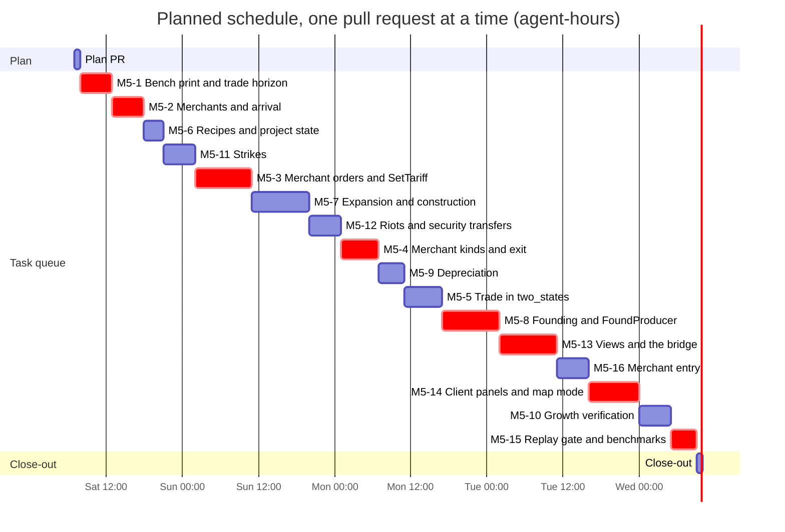
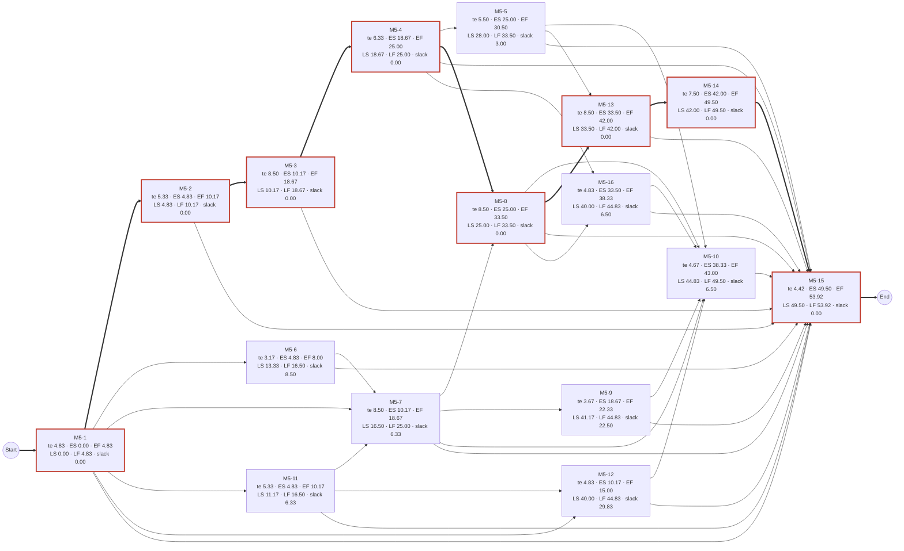

# Baseline Project Plan: Milestone 5

> [!NOTE]
> **Status: planning record** for the "m5" run, kept by the SDLC workflow (docs/SDLC_WORKFLOW.md). Not binding: the contract wins, and each fact moves to its home as the work lands.

The Baseline Plan stage of the [Project Workbook](README.md): how the run builds [Milestone 5](../../MILESTONE_5.md) from the approved [requirements](03-requirements-specification.md) and [design](04-system-specification.md). It fixes the scope, argues feasibility, names the risks, and gives the task queue, [`tasks.json`](tasks.json), with its schedule. The user and technical documentation each task writes is outlined in [06-user-and-technical-documentation.md](06-user-and-technical-documentation.md). Everything on this page is *planned*. Code is cited at `aa2133a`, which the plan's commits don't change; the workflow at `f911fa7` on the unmerged `sdlc-workflow` branch, as the [README](README.md#run-rules) links it.

## Introduction and project scope statement

### The problem

Today every market is an island, capacity is fixed at load, militancy has no consequences, and players can't see or steer trade or investment. The [System Service Request](01-system-service-request.md#what-happens-today) gives the evidence: buyers are producers and nations only (`crates/pax_engine/src/systems/market.rs:175-181`), no system changes a capacity (`crates/pax_engine/src/world.rs:287`), a labour pool supplies its whole size (`crates/pax_engine/src/systems/labor.rs:57`), and the only commands set a nation's three rates (`crates/pax_engine/src/command.rs:17-25`). In `two_states` the 12 goods' price gaps never close and real GDP is flat at about 4,202.5 a day over years 16-20.

### Objectives

The charter's objectives are the run's ([O1 to O10](02-project-charter.md#objectives)). This plan serves them as follows:
- **O1 and O2,** an approved plan on `main` with the decisions recorded exactly: the plan PR, the Gantt chart's first bar. D17, D27 and D28 were recorded in `bd08ee6` (run decision 5).
- **O3 to O7,** what M5 does: the sixteen tasks below, each one pull request, traced to the definition of done in [Acceptance criteria](#acceptance-criteria).
- **O8 and O9,** clean and documented merges: the run rules, the critic and the documentation duty, in every task's contract.
- **O10,** an honest record: the run report, and the [schedule verdict](#schedule) below.

### Deliverables

| Deliverable | Where | By |
|---|---|---|
| The approved plan | this workbook (`docs/workbooks/m5/`), with `bd08ee6`'s records of D17, D27 and D28 | the plan PR |
| Trade between markets | `pax_engine` (`horizon.rs`, `systems/trade.rs`, the `Merchants`, `Cargo` and `RouteGaps` tables, tariffs), `pax_data` (links, routes, merchants), `two_states`' route | M5-1 to M5-5, M5-16 |
| Investment and capacity growth | `systems/investment.rs`, the `Projects`, `ProjectNeeds` and `FoundingRequests` tables, two producer columns, recipes in `data/production.toml` | M5-6 to M5-10 |
| Strikes and riots | `systems/unrest.rs`, the wage split among working members | M5-11, M5-12 |
| Commands | `SetTariff` and `FoundProducer`, end to end: engine, command logs and saves, wire, server | M5-3, M5-8 |
| Views and client | `TradeRouteView`, `InvestmentLedgerView`, `StaticData.routes`, the `TradeFlow` map mode; the bridge's encoders and decoders; the Trade and Construction tabs | M5-13, M5-14 |
| Measures | `bench`'s month-end print and `--warmup`, `report --market` and its new columns, `DayReport`'s new figures | M5-1, M5-5, M5-7, and each figure's task |
| Tests | 6 new test files and the cases of [Design 8](04-system-specification.md#8-test-design), each with its task | every task |
| Documents | DECISIONS.md's amended texts ([Design 2.3](04-system-specification.md#23-amended-decision-texts-proposed)) and every document [the outline](06-user-and-technical-documentation.md) names | every task |
| The close-out | MILESTONE_5's status against its definition of done; this workbook made final | the close-out PR |

### Functional boundaries

Sharper than the [charter's scope](02-project-charter.md#scope-summary), from the choices the analysis and design made.

**In:**
- **Routes are one link each** (C1): a route ships over the link joining its two markets in its direction, which must be a best path of that horizon pair; the horizon is computed at load to check routes and then dropped (R-N20).
- **Tariffs per importing nation and good** (C2), 0 at load, assessed at purchase and paid on landing (C3), never within one nation or into a stateless market (R-F17).
- **Merchants of three kinds** (D17), Private and Commercial founded by dynamic entry, Chartered only by scenario seeding ([SSR](01-system-service-request.md#initial-assessment), item 3); dividends untaxed (C7).
- **Investment for every producer type `data/` gives a recipe** (M5-6 gives all of them one); expansion, founding by owners and by `FoundProducer`, and depreciation, each switched off by `investment.enabled = false` except running projects and the state's requests (C20).
- **Strikes and riots as D28 and run decisions 3 and 4 say**: strikers forgo wages; the riot transfer relieves militancy only through life needs.
- **Views capped** at 20 routes of 10 goods and 16 rows a ledger list, each with the count it leaves out (S28).
- **Both scenarios:** `two_states` changes on purpose and is re-recorded by the tasks of [Golden hashes impact](#golden-hashes-impact); `mini_valley` never changes (R-N8, R-F59).

**Out:** the [Exclusions](#exclusions) below.

### Acceptance criteria

The milestone's [definition of done](../../MILESTONE_5.md#-definition-of-done), mapped to requirements, tasks and tests. Every must-have requirement is in some task's list in [`tasks.json`](tasks.json), which the workflow checks; the won't-haves R-F60 to R-F62 are in none (the workflow refuses a task that traces one) and are checked by inspection where the table says.

| Definition of done | Requirements | Tasks | Decisive tests |
|---|---|---|---|
| 1. Price gaps converge towards the friction margin in `two_states` | R-F20, R-F21 | M5-5, M5-3 | `trade_narrows_gaps_and_both_markets_gain`, `prices_converge_to_the_friction_band` |
| 1. Tariffs reduce volume and the importing treasury gets 100% | R-F17 to R-F19, R-F10 | M5-3, M5-2 | `a_higher_tariff_cuts_the_flow_and_the_treasury_gets_it_all`, `tariffs_reach_the_importing_treasury` |
| 1. Merchants enter on persistent gaps and exit when loss-making, money conserved | R-F15, R-F16, R-N3 | M5-4, M5-16 | `a_loss_maker_winds_up_and_returns_its_cash`, `a_persistent_gap_founds_a_merchant`, `money_conserved_through_trade` |
| 1. The money invariant holds every tick with random routes and high volumes | R-N1, R-N3, R-N4 | M5-2, M5-3, M5-4, M5-16 | the daily assert; `money_conserved_through_trade`, `goods_are_accounted_exactly` |
| 2. Capacity and real GDP rise over 20 years, unemployment in its band | R-F33, R-F24 to R-F31, R-N22 | M5-7 to M5-10 | `investment_grows_two_states` |
| 2. Sustained demand for tools, timber and steel | R-F25, R-F33 | M5-7, M5-10 | `a_project_orders_every_day_until_delivered`, `investment_grows_two_states` |
| 3. Militancy above `strike_threshold` reduces output | R-F34 to R-F36 | M5-11 | `strikes_cut_labour_and_output`, `strikers_get_no_wage` |
| 3. Above `riot_threshold`, stock destruction and treasury payouts | R-F37 to R-F40 | M5-12, M5-11 | `riots_destroy_output_stock_never_money`, `the_security_transfer_is_exactly_what_the_treasury_pays`, `a_high_tax_causes_riots_that_end_when_it_falls` |
| 4. Players view routes, set tariffs, inspect construction and found factories from the client | R-F44 to R-F53 | M5-13, M5-14 | CI's client smoke test (R-F53), `trade_route_view_matches_the_day`, `investment_ledger_view_matches_the_world` |
| 4. Commands validated by `World::validate`, stamped and replayed identically | R-F18, R-F29, R-F42, R-F43, R-N7, R-D13 | M5-3, M5-8, M5-15 | `set_tariff_is_validated`, `found_producer_is_validated`, `new_commands_are_checked_in_order`, `a_saved_session_replays_to_the_servers_final_state` |
| 5. Identical results at 1, 2, 3 and 8 threads | R-N5, R-N6 | M5-12, M5-5, M5-15 | `a_world_that_trades_invests_and_riots_is_independent_of_thread_count` |
| 5. 1M POP rows within 100 ms/day on 8 threads | R-N10, R-N26, R-N27, R-N11 | every task that adds work; M5-15 records | `pax_cli bench` (Design [8.4](04-system-specification.md#84-performance-d13)); CI's Benchmark regression |
| Won't have: a charter command, multi-link routes, taxed merchant dividends | R-F60, R-F61, R-F62 | inspected in M5-16, M5-1 and M5-4 | no such command in `command.rs` or `schemas/common.fbs`; every route is one link (R-D2); `TRADE.md`'s tax line marked planned |

### Exclusions

The [charter's out-of-scope list](02-project-charter.md#out-of-scope) stands: Milestones 6 and 7; a command that charters merchants; multi-hop merchants, per-route transit days, customs unions, wear of capacity in use and a repression command; changing `mini_valley`; and the work in flight outside the run (PR #69, the `sdlc-workflow` branch, M4's rate-limit question, the miners' famine calibration, the playtest). Also out, each because it needs a decision that isn't accepted ([Design 2.2](04-system-specification.md#22-no-decision-is-missing)): income tax on merchant dividends (C7), a share registry, firm failure, and D1's adaptive step as the default. A task that finds it needs one stops and reports blocked on that decision.

### Constraints and assumptions

- **The contract:** [AGENTS.md](../../../AGENTS.md) and [DECISIONS.md](../../DECISIONS.md), as the [charter lists them](02-project-charter.md#constraints); the critic judges every PR against `main`'s copies ([AGENTS.md §9](../../../AGENTS.md#9-critic-feedback)).
- **The run rules** and the maintainer's run decisions, quoted in the [README](README.md#run-rules).
- **One pull request at a time.** The run's `parallel` is 1, the workflow's default (SDLC_WORKFLOW.md, "Running it"): the task rules this stage was given have no clause for tasks in flight together, which the workflow adds only above 1 (`.claude/workflows/sdlc-overnight.js:865` at `f911fa7`). So the run takes the queue in one fixed order ([Plan choices](#plan-choices), B2).
- **At most 16 tasks,** the run's `maxTasks`, so the milestone's sixteen ids stay one task each: nothing is split, and nothing merged (charter A10).
- **Assumptions:** the charter's A1 to A11 ([charter](02-project-charter.md#assumptions)), and two of this stage's: the stop time has passed before the plan is approved (A12, [Schedule](#schedule)), and a later run resumes the approved queue with `fromPlan` (A13), as the charter's target dates expect.

## System description

### The chosen design

The [system specification](04-system-specification.md) in brief:
- **Trade (D17):** scenarios declare links and one-link routes; merchants are rows of a `Merchants` table with their goods in a sparse `Cargo` table keyed by merchant, good and stage; they buy in the origin through ordinary D1 orders, ship for one day, lose the iceberg share at arrival (D4's new step 0), pay the tariff assessed at purchase, and sell in the destination at landed cost plus margin. Settlement moves all the step's money and hands goods to `trade.rs` by key, never by row (S5, S6). Merchants pay dividends to their owners by kind, wind up after months of realized loss (C28), and are founded on routes whose gap persists (PL-7).
- **Investment (D27):** projects buy their recipe's construction goods through D1 orders from cash above the day's needs (C24) and add capacity at the month end that follows delivery; owners and the state found producers where unclaimed unemployed workers wait (PL-8, PL-12, PL-13); idle capacity shrinks (PL-14). All of it in one month-end step, 6c, in C19's order.
- **Unrest (D28):** working members, computed per POP, set labour supply and the wage split (PL-15); riots at month end destroy output stock and pay the security transfer (PL-16).
- **Commands, views and client:** `SetTariff` and `FoundProducer` land with their wire, file and server forms (C27); the two views are capped (S28), and the client asks for the trade view only on its tab (S30).
- **Determinism and money:** no new parallel pass; every split by `alloc::allocate`; merchant cash in `World::total_money`; new state hashed only where it holds something, so `mini_valley`'s golden file stands (PL-18).

### Alternatives considered

| Alternative | Why it lost |
|---|---|
| **Merchant goods as dense per-good columns on `Merchants`** (M5-2's row text; `docs/TRADE.md:39-41`) | 72 MB at D13's long-term scale, the matrix D17 avoids (C4); a sparse `Cargo` table keyed by (merchant, good, stage) grows with what is actually shipped |
| **Routes that carry their own iceberg share and capacity, no links** (`docs/TRADE.md:97-108`) | Run decision 2 gives a route its bottleneck link's capacity, which presupposes links distinct from routes (C1); one-link routes keep that rule exact until multi-link routes, which the charter excludes |
| **Holding `SetTariff` and `FoundProducer` back to M5-13**, as the milestone's row has it | The server's and `pax_data`'s exhaustive matches over the engine's commands wouldn't compile, and the tariff column and founding requests would be writable only by tests until then (C27) |
| **Splitting the largest tasks** (M5-3, M5-8, M5-13) into parts, freeing ids by merging smaller rows | The run's bound is 16 tasks, the milestone's 16 ids; merging rows would lose ids the milestone document keeps. Each large task instead splits into commits by layer (documents; engine; data and formats; wire and server), each building and testing alone (Risk R11) |
| **A parallel schedule** (`parallel` above 1), which the PERT network allows | The tasks that could overlap edit the same files (`world.rs`, `systems/trade.rs`, `tests/common/mod.rs`, `tests/conservation.rs`), which the workflow would have to order anyway, and the run is configured with one pull request in flight |

## Plan choices

Choices this stage makes within the contract, for the maintainer to check, continuing the analysis's C1 to C29 and the design's S1 to S30. None needs a new or amended decision; like those, they go into the plan PR's description and this workbook, never into DECISIONS.md.

| # | Choice | Why |
|---|---|---|
| B1 | **M5-10 lands after every task that changes `two_states`' results** (M5-5, M5-7, M5-8, M5-9, M5-12, M5-16, and M5-11 through M5-7) | Its growth test, and any recalibration within R-D5 and R-D7, then measure the economy M5 delivers, and no later task can invalidate them; otherwise trade (M5-5) or merchant entry (M5-16) landing later would have to recalibrate investment, which isn't theirs. S27 made it follow M5-9 for the same reason |
| B2 | **The queue order is the workflow's own:** Kahn's algorithm with ties in `tasks.json`'s order (the milestone's), taken one pull request at a time: M5-1, M5-2, M5-6, M5-11, M5-3, M5-7, M5-12, M5-4, M5-9, M5-5, M5-8, M5-13, M5-16, M5-14, M5-10, M5-15 | `topoOrder` and the one-slot queue (`.claude/workflows/sdlc-overnight.js:585-600`, `:1610-1648` at `f911fa7`) start, at each task's end, the task that has waited longest among those whose dependencies are done, which is Kahn's order. Contracts that depend on landing order state the rule ("raised by one from `main`'s value") with the value expected in this order |
| B3 | **M5-8 follows M5-4, and so M5-3** | Both commands go through the same path (engine, `CommandText`, saves, wire, server), and M5-4 adds the month end's fresh layout and `option_u32s` that M5-8 uses; with the edge, M5-8 extends what they introduce, and the design's order-dependent clauses (S11's "if M5-8 lands first", "the first of M5-4 and M5-8") name one task each. It only orders the queue: M5-8 was after M5-4 in it already |
| B4 | **S30's guarantee is restated, not extended:** a founding's outcome reaches the client in the month-end day's update only, so an update skipped by D23's window or by D24's cap for a remote session above four days a second (`crates/pax_server/src/throttle.rs:1-10`) loses it; the client still sees the request leave the pending list and, if founded, its project appear, so only a drop's reason is lost | Design round 3's minor finding 4. The fix considered, keeping the last month end's foundings in the server and sending them with later updates, would build a view from an earlier day's report; D22 builds views from `ProvinceStats` and the day's report (`docs/DECISIONS.md:415`), and no Amends line covers widening that, so it would need a decision. The loss is a reason, under heavy throttling, which a later decision can add back |
| B5 | **Tests that add trade topology to a loaded `two_states`** (M5-1's replica test, M5-2's snapshot round trip) **push a link and route only when `route_between` finds none** | Design round 3's minor finding 2: from M5-5 the scenario has its own link, and `push_link` panics on a duplicate key |
| B6 | **`fill_new_views` is a `#[cfg(test)] pub(crate)` function at `view.rs`'s module level** | Design round 3's minor finding 1: inside the private `mod tests`, `game.rs`'s `remote_bandwidth_budget` can't call it (E0603) |
| B7 | **`server_day_budget` subscribes both views on its stepped world, unfilled** | Design round 3's minor finding 3: it times ticks, and the filled world is a fixture no tick runs on; `view_building_budget` and `remote_bandwidth_budget` measure the views at their caps |

## Feasibility

### Economic

**One-time cost.** The [PERT estimates](#estimates) give 94.4 expected agent-hours for the sixteen tasks (most likely 88, optimistic 54.5, pessimistic 160), plus 1.25 for the plan PR and 1.17 for the close-out (the workflow's own estimate for it, `sdlc-overnight.js:1662`): **96.8 agent-hours**, with a standard deviation of about 4.6 hours if the tasks' errors are independent. Within each task's estimate, review and CI time is about half: [How the estimates were made](#how-the-estimates-were-made) breaks it down. The planning already spent is about 6 hours of wall time (`out/m5-run/LOG.md`, 01:01 to 07:00).

**Recurring cost: the tick (D13).** D13's budget is 100 ms a day at 1M POP rows on 8 threads, measured as the mean day (PERFORMANCE.md). On the run's machine `aa2133a` takes 69.0 to 74.2 ms a day over the 29 cold days and a median of 105.7 ms on the first month-end day (R-N10, R-N26). PERFORMANCE.md records about 91 ms on M4-11's machine (`docs/PERFORMANCE.md:15`), so the headroom is machine-relative and small. What M5 adds, estimated for the benchmark's world (1,500 copies of `two_states`: 3,000 markets, 6,000 provinces, 36,000 producers, about 990,000 POP rows, 3,000 routes):

| Work | Where | Size at that scale | Estimated cost |
|---|---|---|---|
| Arrival | D4 step 0 (M5-2) | at most 72,000 cargo rows, one linear pass | under 1 ms a day |
| Merchant orders and offers | discovery and settlement (M5-3) | up to 36,000 orders and 36,000 offers if every good is open both ways; with the measured gaps (8 goods open from Highland, 3 from Lowland) about 16,500 of each, against about 69,000 orders and offers today (per copy, 14 input orders, 24 producers' offers and about 8 government orders) | the largest item: about 5 to 15 ms a day, if discovery's cost grows with its order rows (`clear_markets` dominates today, `docs/PERFORMANCE.md:22`) |
| Strikes and the wage split | labour and firms (M5-11) | one threshold test per POP row, a share only above it | about 1 to 3 ms a day |
| Merchant dividends, construction orders | firms, market (M5-4, M5-7) | per merchant and per project | under 1 ms a day |
| Investment, riots, merchant month end | month end (M5-7 to M5-9, M5-12, M5-16) | one pass over POP rows for available workers, one grouping of POP rows by province, 72,000 founding tests | about 6 to 12 ms on the month-end day |

So the cold days are estimated at about 80 to 90 ms on the run's machine and the 30-day mean at about 85 to 95: within the budget, with little to spare. These are estimates, not measurements; each task measures its own change against M5-1's baseline (R-N10, R-N26, R-N27), M5-15 records the result in PERFORMANCE.md, and an overrun that only D1's adaptive step could fix is blocked on that decision (Risk R3).

**Recurring cost: CI and maintenance.** The new release-only scenario tests run about 40,000 simulated days of `two_states` in all; a 7,200-day run takes 0.38 s in release on the run's machine (measured 07:26), so they add seconds. The maintenance surface grows by four engine modules (`horizon.rs`, `systems/trade.rs`, `systems/investment.rs`, `systems/unrest.rs`), seven new `World` fields holding eight tables (links and routes together in `network`), three columns on existing tables, two commands, two views, two client panels, about fifteen rules keys, a snapshot format raised seven times and a save format twice, and protocol 1.10.

**Benefits.** Tangible: the definition of done (trade with tariffs, investment that grows the economy, strikes and riots, the client's controls), and the measures that check it (`bench`'s month-end time and warm-up, `report --market`, the new report columns). M6 builds directly on M5 (`docs/MILESTONE_6.md:8`). Intangible: an economy that can grow and respond to policy, and a second milestone built by the workflow.

**Verdict: feasible.** About 97 agent-hours, no new dependency, a tick cost estimated within D13, and seconds of CI.

### Technical

| Area | Size and structure | Familiarity | Risk |
|---|---|---|---|
| Engine tables and systems (M5-1, M5-2, M5-4, M5-6, M5-9, M5-11, M5-12, M5-16) | New struct-of-arrays tables and plain system functions, the patterns of `Pops`, `Producers` and `systems/` (D8) | High: the code's own patterns, documented in ONBOARDING.md's recipes | **Low to medium**: the money path is guarded by the daily assert and a conservation case per flow |
| Settlement's new buyers and sellers (M5-3, M5-7) | Changes inside `market.rs`'s settlement (`market.rs:666-852`), the tick's hottest code | Medium: the sequence is written out (Design 4.1) | **Medium**: a wrong row or a missed debit breaks conservation (caught at once) or the hand-off order (S5's test) |
| The D13 budget | Every task that adds work | Measured baselines exist (R-N10, R-N26) | **High**: small headroom, see [Economic](#economic) |
| Calibration (M5-5, M5-7 to M5-11, M5-16) | Data values tuned against scenario tests | Medium: measured at `aa2133a` (Design 3.7) | **Medium to high**: the bands and growth tests may need recalibration, which only M5-10 does (B1) |
| Protocol, server and bridge (M5-3, M5-8, M5-13) | Append-only schema, generated code, exhaustive conversions | High: M3 and M4 added six minor versions this way | **Low** |
| Client (M5-14) | Two GDScript panels and a headless smoke test | Medium: GDScript, slow to iterate | **Medium** |

**Verdict: feasible, medium risk overall.** Sixteen pull requests touch 96 paths besides the shared documents, in six of the eight crates (not `pax_content` or `pax_map`), with no new boundary, dependency or tool (Design 7).

### Operational

- **Players:** two new tabs and a map mode; nothing is removed. Saves and snapshots written before a format change are refused by name (R-N16), and every scenario-content change already refuses older saves (D23's content hash), so a game saved before M5 can't be loaded after it.
- **Hosts:** a 1.6 client still plays on a 1.10 server without the new views (R-N15); a newer client on an older server gets `Malformed` for the new commands (Design 3.6). `protocol_major` doesn't change, so HOSTING.md's rule stands. No new server setting.
- **Scenario authors and modders:** new optional scenario entries; `data/professions.toml` gains `merchant`, appended so every id keeps its index; `rules.toml` gains required sections and keys (C20), so a data directory of one's own must add `[trade]`, `[investment]` and the five `[politics]` keys, and a missing one is a load error naming it. DATA_FORMAT.md documents each with its task.
- **Operators of CI:** no new job; the client smoke test gains its steps (R-F53); the Benchmark regression job sees trade once `two_states` has it (R-N12, Risk R4).
- **Verdict: feasible,** with the save break stated in the release notes the close-out writes.

### Schedule

**Does it fit before the stop time, 2026-10-10T07:00:00+08:00? No.** This stage started at 07:08, after the stop time, so no task can start in this run:
- the workflow checks the clock at the start of every task's cycle and returns "not-started" past the stop time (`.claude/workflows/sdlc-overnight.js:1510` at `f911fa7`);
- planning doesn't check it, and the plan PR, once the panel approves it, is published and watched: it merges if its first watch finds every check green, and is left in flight if checks are still pending past the stop time (`shepherd`, `:1426-1456`; the plan PR is published after the panel and the seal, `:1592-1596`).

**What the queue needs.** One pull request at a time, the queue takes the sum of the tasks' times, not the critical path: **96.8 expected agent-hours** (σ 4.6) with the plan PR and close-out, and 99 hours on the [Gantt chart](#gantt-chart), whose bars are rounded to whole hours. From the Gantt chart's start, 2026-10-10 07:00, that ends on 2026-10-14 at 10:00: about four days of continuous running. The [critical path](#critical-path-duration-and-slack), 53.9 hours (σ 3.5), is the lower bound that unlimited parallelism would reach, which this run doesn't use.

**Verdict: not feasible before the stop time; feasible as a resumed run.** The approved plan is what a later run continues from (`fromPlan`, SDLC_WORKFLOW.md "Running it"), as the [charter's target dates](02-project-charter.md#target-dates) expected (A13). Each task is buildable from this workbook and `main` once its dependencies merge, and the run report lists the queue.

### Legal and contractual

- **Licences:** nothing new (Design 7). The workspace's pinned dependencies (rayon, serde, toml, FlatBuffers through flatc 24.3.25, godot-rust 0.5.5) and the pinned mermaid-cli stay as they are.
- **The contract:** no change to AGENTS.md, DECISIONS.md's rules or critic.md, which the run can't make (no `contract-change` label). Every amendment M5 needs is named by an accepted decision's Amends line and lands with its code ([Design 2.3](04-system-specification.md#23-amended-decision-texts-proposed), S1); D19 changes only its status sentence (run decision 4, S20).
- **D28's Amends line** still names a D19 amendment that won't happen; run decision 5 keeps it as written, so it stays the maintainer's ([SSR](01-system-service-request.md#initial-assessment), item 4; charter A11).
- **Verdict: feasible.**

## Management issues

### Agents and roles

The workflow's roles are the [charter's](02-project-charter.md#key-stakeholders-and-roles): scouts, the planner, a reviewer per stage and the three-lens panel, then per task a refresh (planner and reviewer), a worker, the gate and gate-fix agents, the local critic, the commit auditor, publish, watch, remediation, merge, and the reporter, with a clock agent before every task and round. The maintainer is away until the morning (A6).

### The maintainer's checkpoints

| When | What they decide or check | Where |
|---|---|---|
| The plan PR | Whether its critic verdict on `bd08ee6`'s acceptance of D17, D27 and D28 stands; if CRITICAL, the PR is parked for them (A11, Risk R1) | the PR, labelled `needs-human` if parked |
| The morning | Every task's outcome, the decisions to check, drafted waivers, what remains | `out/m5-run/REPORT.md` |
| Choices within the contract | C1 to C29, S1 to S30, B1 to B7, and each task's `Decisions:` lines | this workbook, the plan PR's description, each PR, the report |
| Parked pull requests | A disputed CRITICAL finding, six rounds without green, or a refused merge | PRs labelled `needs-human` or `needs-waiver` |
| A task blocked on a decision | The decision it names (none is expected, Design 2.2) | the report |
| Resuming | Starting the queue again with `fromPlan` | the workflow's arguments |
| The playtest | A look at the Trade and Construction tabs and the map mode (R-F49 to R-F52) | the report's "what remains" |
| D28's Amends line | Whether to edit it | DECISIONS.md |

### Communication

- **The workbook:** the correspondence log (dated entries for each round, PR and decision), change requests (a task contract changed after approval), the review log, and each task's actual bar in the schedule.
- **Pull requests:** the workflow's description template (summary, why, what changed, documents, test evidence as a table, golden hashes, decisions to check, review rounds), a triage table comment per remediation round, and the critic's own comment.
- **Commits:** the five fields (Why, What, Evidence, Docs, Decisions), checked by the commit auditor before every push.
- **The run directory** (`out/m5-run/`, git-ignored): `LOG.md`, one timestamped line per event; `PLAN.md`, written when the plan is sealed; `REPORT.md`, rewritten after every task.

### Standards

The contract ([AGENTS.md](../../../AGENTS.md), [DECISIONS.md](../../DECISIONS.md)); the critic's rules ([critic.md](../../../.claude/commands/critic.md)), run locally before each push and by CI; the local gate, CI's commands that need no Godot, bench runner or fuzzer, plus `scripts/check_docs.py` and `scripts/render-mermaid.sh`; the commit shape; and the documentation duty: documents before code, rustdoc with code, the milestone row and workbook at the end.

## Resource allocation

Every task owns the files its `owns` list in [`tasks.json`](tasks.json) names, in full in the [work breakdown](#the-task-queue); `docs/DECISIONS.md`, `docs/MILESTONE_5.md`, this workbook and `Cargo.lock` are shared by design. With one pull request in flight, two tasks never edit a file at once; the files most tasks touch are `crates/pax_engine/tests/common/mod.rs` (11 tasks), `crates/pax_data/src/lib.rs`, `schema.rs` and `tests/validation.rs`, `crates/pax_engine/src/tick.rs` and `crates/pax_cli/src/report.rs` (10 each), `crates/pax_engine/src/world.rs`, `defs.rs`, `crates/pax_data/src/bench.rs` and `data/rules.toml` (9 each), and `scenarios/two_states/golden.hashes` (8), each task extending its own part.

Every task meets the same reviewers: the refresh reviewer on its contract against `main` as it then is, the local critic, CI's Critic, the commit auditor, and CI's required checks. The table names where a task meets them hardest.

| Task | Files | Reviewer touchpoints that bite |
|---|---|---|
| M5-1 | 23 | Benchmark regression reading the new print (`bench_has_one_ms_per_day_line`); the critic on D14 rule 5's text |
| M5-2 | 19 | The critic on money (D5's holders, the daily assert); `check_docs.py` on `systems/trade.rs` in ARCHITECTURE.md and BACKEND_SCHEMA.md |
| M5-3 | 40 | The critic on settlement's money path and C27's cross-crate change; CI's generated-code check, fuzzing (hostile `SetTariff`), session replay on three platforms |
| M5-4 | 27 | The critic on D6's merchants' dividends and the ownership bullet |
| M5-5 | 16 | Golden re-record explained (D11); Benchmark regression with trade in the head only (Risk R4); the bands clause |
| M5-6 | 18 | The critic on derived data (no `project_budget`, D7) |
| M5-7 | 29 | The critic on settlement and the dividend reserve (D6, D27); D13 measurements in Evidence (R-N10, R-N26, R-N27); golden re-record |
| M5-8 | 42 | The critic on D21's validation-only-in-`validate` rule and D24's conflict text; fuzzing; session replay; the protocol check |
| M5-9 | 23 | Hash rule for a new column (`a_new_column_is_hashed_once_it_differs`) |
| M5-10 | 8 | The bands clause and any recalibration's reasons; release tests in CI |
| M5-11 | 31 | The critic on run decision 3's D6 text and D19's sentence (run decision 4); golden re-record |
| M5-12 | 24 | The critic on the riot transfer (D5, D28); determinism test on four thread counts |
| M5-13 | 31 | The bandwidth and size budgets (R-N14); the crate-boundary check (D12); the critic on D22's views |
| M5-14 | 21 | CI's client smoke test (headless Godot); the maintainer's look in the morning |
| M5-15 | 5 | Session replay on Windows and macOS; PERFORMANCE.md's numbers |
| M5-16 | 24 | The critic on entry's funding (D17, D27's funding rule) and "never chartered" |

## Risk register

| Id | Risk | Likelihood | Impact | Mitigation | Owner | Trigger |
|---|---|---|---|---|---|---|
| R1 | The plan PR's critic reads `bd08ee6`'s acceptance of D17, D27 and D28 as an agent's contract change, judged against `main`'s Proposed entries | Medium | High: every task branches from `main` after the plan | The description quotes run decisions 1-5 verbatim and names D28's Amends line (A11); a CRITICAL finding is disputed and the PR parked for the maintainer, never worked around | Plan PR's remediation; the maintainer | Critic check red on DECISIONS.md |
| R2 | The stop time passed before the plan was approved | Certain | High for this run: nothing is built | The queue is resumable from the approved plan (A13); each task stands on its dependencies and this workbook; the report lists the queue | The maintainer, on resuming | The first task's clock check |
| R3 | M5's daily or month-end work takes the 1M-row tick over 100 ms a day | Medium | High: D13, DoD 5 | Each task measures before and after against M5-1's baseline, and explains a rise over 20% (R-N10, R-N26, R-N27); optimisation within the task's rules (fewer orders for closed goods, no strike arithmetic below the threshold); a fix needing D1's adaptive step as default is blocked on that decision | The worker of each task that adds work; M5-15 | A measured mean over 100 ms, or a median rise over 20% |
| R4 | CI's Benchmark regression compares each side's own `two_states` (`.github/workflows/ci.yml:154-163`), so tasks that add content to it (M5-5, M5-7, M5-11, M5-16) give the head more work than the base | Medium | High: a required check | Run `scripts/bench-compare.sh` locally with both binaries before pushing; keep added work proportional to what the content trades; if the regression is the content's own work and within D13, the PR says so and is parked for the maintainer, never by weakening the gate (charter A7) | The worker | Benchmark regression red |
| R5 | A later task changes `two_states` and breaks an earlier task's scenario test (trade, unrest, growth, bands, content stability) | Medium | Medium | Every gate runs `cargo test --all --release`; M5-10 lands last among result-changing tasks (B1); a task that can't keep a test within its own rules reports blocked, never relaxes a bound (Design 8.5) | The later task's worker | A release scenario test fails in the gate |
| R6 | Design 3.7's investment values don't meet R-F33 (capacity, real GDP +0.1%, construction goods, unemployment), for example because depreciation shrinks the peaks' mines by about 5,000 slots | Medium | Medium | M5-10 recalibrates within R-D5 and R-D7 and re-records with the reason; its pessimistic estimate is 10 hours | M5-10 | `investment_grows_two_states` fails |
| R7 | A new money flow isn't conserved | Low | High: every tick panics | One function moves settlement's money (S6); every split by `alloc::allocate`; a conservation case per flow through the shared `random_world` (R-N3) | The worker | The daily assert, or a conservation test |
| R8 | Results depend on the thread count or the platform | Low | High: D3, D11 | No new parallel pass (Design 1.4); explicit tie-breaks; the thread-count test on R-F40's world (R-N6); CI's Windows and macOS verify and replay | The worker; M5-12, M5-15 | `determinism.rs` or a cross-platform job fails |
| R9 | A golden file changes where the plan says it doesn't, `mini_valley`'s especially | Low | Medium | PL-18 hashes new state only where it holds something; [Golden hashes impact](#golden-hashes-impact) names every planned change; an unplanned one is a bug to explain, never re-recorded | The worker | `pax_cli verify` fails |
| R10 | A format change misreads an older save, snapshot or client | Low | Medium | Each layout change raises its format and the reader checks it first (R-N16, S15); the schema only appends (R-N15); `a_1_6_client_reads_every_later_update` | M5-2 to M5-4, M5-6, M5-8, M5-9, M5-13, M5-16 | `saves.rs`, `snapshot.rs` or `roundtrip.rs` fails |
| R11 | A large task (M5-3, M5-7, M5-8, M5-13, M5-14) doesn't get green within the workflow's six review rounds | Medium | Medium: parked; its dependants wait | Commits split by layer, each building alone; contracts refreshed and reviewed before the build; pessimistic estimates of 13 to 14 hours | Worker and remediation | Round 6 not green |
| R12 | The headless client test fails for Godot-specific reasons, slowly | Medium | Medium: DoD 4 | The smoke test's steps are scripted in Design 8.6 and go through the client's own paths; the Rust side is tested in `pax_godot` first | M5-14 | CI's client-smoke red |
| R13 | `gh pr merge` is refused by the permission classifier, as has happened (SDLC_WORKFLOW.md, "Merge authorisation") | Medium | Medium: green PRs wait; dependants stack locally | The workflow reports the refusal, leaves the PR ready, and stacks dependants; the maintainer merges | Merge agent; the maintainer | A refused merge |
| R14 | The new views push a remote client past 100 KB/s or an update past 128 KB | Low | Medium | The caps (S28): 82.4 KB/s and 107,272 bytes measured at them; the budget tests fill past every cap | M5-13 | `remote_bandwidth_budget` or `size_budget.rs` fails |
| R15 | A task needs a decision that isn't accepted (taxing merchant dividends, a charter command, the adaptive step) | Low | Medium | Design 2.2's check found none; the task stops and reports blocked on it (C7, R-F60) | The worker; the maintainer | The worker reports blocked-on-decision |
| R16 | PR #69 merges during the run and changes `DATA_MODEL_M5_M6.md`, which tasks update | Low | Low | The refresh step takes its changes in as change requests (A3) | The planner at refresh | #69 merged |
| R17 | The estimates are low: the queue takes longer than four days | Medium | Low: no deadline beyond the run | The schedule's standard deviation is given; the report keeps the queue current | The maintainer | Actual bars past the planned |

## Work breakdown

### The task queue

The tasks of [`tasks.json`](tasks.json), in the milestone's order, each with its place in the queue (B2). Requirements are in ranges; the owned files are grouped by crate, "(new)" marking the task that creates a file; the acceptance tests are named, and `tasks.json` says what each asserts. No task is blocked on a decision.

| Task (queue position) | Title | Depends on | Requirements | Owns | Acceptance tests | o / m / p | Blocked on a decision |
|---|---|---|---|---|---|---|---|
| M5-1 (1) | Bench's month-end timing, then the route loader and the trade horizon | none | R-F1 to R-F4, R-F56, R-F57, R-F59, R-N5, R-N8, R-N11 to R-N13, R-N17 to R-N20, R-N23, R-N24, R-N26, R-D1, R-D2, R-D4, R-D14 | cli: main.rs; engine: horizon.rs (new), lib.rs, world.rs, defs.rs; engine tests: trade.rs (new), common/mod.rs; data: schema.rs, lib.rs, snapshot.rs, bench.rs; data tests: validation.rs; content: rules.toml; scenarios: mini_valley/defs/rules.toml; docs: DECISIONS, DATA_FORMAT, BACKEND_SCHEMA, MAP_AND_LOGISTICS, TRADE, DATA_MODEL_M5_M6, ONBOARDING, MILESTONE_5, workbooks/m5 | `bench_times_the_first_month_end_day`, `bench_has_one_ms_per_day_line`, `horizon_matches_a_hand_computed_one`, `horizon_is_independent_of_link_order`, `a_route_takes_its_links_retention_and_whole_capacity`, `horizon_build_at_scale`, `links_load_both_ways`, `routes_load_with_their_tuning`, `bad_links_are_refused`, `bad_routes_are_refused`, `trade_rules_are_checked`, `a_restored_world_has_the_scenarios_routes`, `replicas_copy_the_trade_and_investment_tables` | 3 / 4.5 / 8 | none |
| M5-2 (2) | Merchants and Cargo tables and the arrival phase | M5-1 | R-F5, R-F10, R-F41, R-F54, R-F67, R-N1, R-N3 to R-N5, R-N8, R-N10 to R-N12, R-N16 to R-N19, R-N23, R-N24, R-D9, R-D10, R-D15 | engine: systems/trade.rs (new), systems/mod.rs, world.rs, hash.rs, tick.rs; engine tests: trade.rs, conservation.rs, common/mod.rs; data: snapshot.rs, bench.rs; cli: report.rs; docs: DECISIONS, ARCHITECTURE, BACKEND_SCHEMA, TRADE, DATA_MODEL_M5_M6, ONBOARDING, MILESTONE_5, workbooks/m5 | `cargo_lands_next_day_less_the_iceberg_share`, `tariffs_reach_the_importing_treasury`, `merchant_tables_keep_their_invariants`, `merchant_rows_are_stable`, `market_figures_sum_their_routes`, `a_new_table_is_hashed_once_it_has_rows`, `a_snapshot_restores_the_exact_state_and_it_runs_on_identically`, `crafted_merchants_and_projects_are_refused`, `money_conserved_through_trade`, `goods_are_accounted_exactly`, `new_columns_follow_todays`, `replicas_copy_the_trade_and_investment_tables` | 3 / 5 / 9 | none |
| M5-3 (5) | Merchant market orders, arbitrage and SetTariff | M5-2 | R-F7 to R-F9, R-F11 to R-F13, R-F17 to R-F19, R-F21, R-F41 to R-F44, R-F54, R-F67, R-N2 to R-N5, R-N7, R-N8, R-N10 to R-N12, R-N15 to R-N18, R-N21, R-N23, R-N24, R-D8, R-D9, R-D13 | engine: systems/market.rs, systems/trade.rs, world.rs, command.rs, tick.rs; engine tests: trade.rs, commands.rs, conservation.rs, extremes.rs, common/mod.rs; data: schema.rs, lib.rs, save.rs, snapshot.rs, bench.rs; data tests: saves.rs, validation.rs; cli: report.rs; schemas: common.fbs; protocol: src/generated, src/lib.rs, tests/roundtrip.rs; server: request.rs, commands.rs, hostile.rs; server tests: common/mod.rs, session.rs, session_replay.rs; client: pax_keys.gd; docs: DECISIONS, ARCHITECTURE, BACKEND_SCHEMA, DATA_FORMAT, NETWORK_PROTOCOL, ECONOMY_SYSTEM, TRADE, ONBOARDING, HOSTING, MILESTONE_5, workbooks/m5 | `export_orders_follow_the_flow_rule`, `imports_are_offered_at_landed_cost_plus_margin`, `exporters_and_locals_get_the_same_fraction`, `settlement_books_purchases_and_sales`, `a_merchant_never_owes_more_than_its_cash`, `capacity_binds_however_many_merchants`, `equal_prices_mean_no_trade_and_no_entry`, `tariffs_apply_only_between_nations`, `a_higher_tariff_cuts_the_flow_and_the_treasury_gets_it_all`, `prices_converge_to_the_friction_band`, `market_figures_sum_their_routes`, `set_tariff_is_validated`, `new_commands_round_trip_through_a_save`, `another_format_is_refused_by_name`, `command_logs_take_the_new_commands`, `new_commands_are_checked_in_order`, `set_tariff`, `money_conserved_through_trade`, `goods_are_accounted_exactly`, `new_columns_follow_todays` | 5 / 8 / 14 | none |
| M5-4 (8) | Merchant kinds, dividends, seeding and winding up | M5-3 | R-F5, R-F6, R-F14, R-F15, R-F41, R-F57, R-F59, R-F63, R-F67, R-N2, R-N3, R-N5, R-N8, R-N10 to R-N12, R-N16, R-N17, R-N19, R-N23 to R-N26, R-D3, R-D4, R-D9, R-D15 | engine: systems/trade.rs, world.rs, hash.rs, tick.rs, defs.rs; engine tests: trade.rs, conservation.rs, common/mod.rs; data: schema.rs, lib.rs, snapshot.rs, bench.rs; data tests: validation.rs, content_stability.rs; cli: report.rs; content: professions.toml, rules.toml; scenarios: mini_valley/defs/rules.toml; docs: DECISIONS, ARCHITECTURE, BACKEND_SCHEMA, DATA_FORMAT, ECONOMY_SYSTEM, TRADE, ONBOARDING, MILESTONE_5, workbooks/m5 | `each_kind_pays_its_owner`, `a_loss_maker_winds_up_and_returns_its_cash`, `an_idle_merchant_is_never_wound_up`, `settlement_books_purchases_and_sales`, `merchants_seed_by_route_and_kind`, `bad_merchants_are_refused`, `trade_rules_are_checked`, `money_conserved_through_trade`, `new_columns_follow_todays` | 4 / 6 / 10 | none |
| M5-5 (10) | Trade in two_states and the comparative-advantage test | M5-4 | R-F20, R-F55, R-F58, R-F64, R-N6, R-N9 to R-N11, R-N22, R-N23 | scenarios: two_states/scenario.toml, two_states/golden.hashes; engine: systems/market.rs, tick.rs; engine tests: market_properties.rs; data tests: trade_two_states.rs (new), determinism.rs, economic_bands.rs; cli: main.rs, report.rs; docs: BACKEND_SCHEMA, TRADE, ECONOMY_SYSTEM, ONBOARDING, MILESTONE_5, workbooks/m5 | `trade_narrows_gaps_and_both_markets_gain`, `spending_by_market_sums_to_the_totals`, `report_shows_a_market_on_its_own`, `a_world_that_trades_invests_and_riots_is_independent_of_thread_count` | 3 / 5 / 10 | none |
| M5-6 (3) | Construction recipes and project state | M5-1 | R-F22, R-F23, R-F32, R-F57, R-F59, R-N5, R-N8, R-N11, R-N12, R-N16, R-N17, R-N19, R-N23, R-D7, R-D11 | engine: defs.rs, world.rs; engine tests: investment.rs (new), common/mod.rs, demographics.rs, mobility.rs; data: schema.rs, lib.rs, snapshot.rs, bench.rs; data tests: validation.rs; content: production.toml; docs: DATA_FORMAT, BACKEND_SCHEMA, INVESTMENT, DATA_MODEL_M5_M6, MILESTONE_5, workbooks/m5 | `expansion_recipes_load`, `bad_recipes_are_refused`, `one_project_per_producer`, `producer_rows_are_stable`, `crafted_merchants_and_projects_are_refused`, `replicas_copy_the_trade_and_investment_tables` | 2 / 3 / 5 | none |
| M5-7 (6) | Producer expansion and construction clearing | M5-1, M5-6, M5-11 | R-F24 to R-F27, R-F32, R-F41, R-F57, R-F59, R-F65, R-F67, R-N2 to R-N5, R-N9 to R-N11, R-N18, R-N20, R-N22 to R-N27, R-D5 | engine: systems/investment.rs (new), systems/mod.rs, systems/market.rs, systems/firms.rs, tick.rs, defs.rs; engine tests: investment.rs, conservation.rs, extremes.rs, common/mod.rs; data: schema.rs, lib.rs, bench.rs; data tests: validation.rs, economic_bands.rs; cli: main.rs, report.rs; content: rules.toml; scenarios: mini_valley/defs/rules.toml, two_states/golden.hashes; docs: DECISIONS, ARCHITECTURE, BACKEND_SCHEMA, DATA_FORMAT, INVESTMENT, ECONOMY_SYSTEM, ONBOARDING, MILESTONE_5, workbooks/m5 | `no_project_without_profit`, `no_project_without_spare_workers`, `no_project_for_strikers`, `no_project_without_cash`, `a_project_starts_when_all_hold`, `a_project_orders_every_day_until_delivered`, `delivery_then_month_end_adds_capacity`, `dividends_leave_the_project_reserve`, `construction_leaves_inputs_and_wages`, `investment_rules_are_checked`, `a_replica_of_one_region_hashes_like_its_base`, `money_conserved_through_investment`, `goods_are_accounted_exactly`, `new_columns_follow_todays` | 5 / 8 / 14 | none |
| M5-8 (11) | Founding new producers, and FoundProducer | M5-4, M5-7 | R-F28 to R-F30, R-F32, R-F41 to R-F44, R-F57, R-F59, R-F65, R-F67, R-N2, R-N3, R-N5, R-N7 to R-N9, R-N11, R-N12, R-N15 to R-N19, R-N21 to R-N26, R-D5, R-D12, R-D13, R-D16 | engine: systems/investment.rs, systems/firms.rs, world.rs, command.rs, defs.rs, tick.rs; engine tests: investment.rs, commands.rs, conservation.rs, common/mod.rs; data: schema.rs, lib.rs, save.rs, snapshot.rs, bench.rs; data tests: saves.rs, validation.rs; cli: report.rs; schemas: common.fbs; protocol: src/generated, src/lib.rs, tests/roundtrip.rs; server: request.rs, commands.rs, hostile.rs; server tests: common/mod.rs, session.rs, session_replay.rs; client: pax_keys.gd; content: rules.toml; scenarios: mini_valley/defs/rules.toml, two_states/golden.hashes; docs: DECISIONS, ARCHITECTURE, BACKEND_SCHEMA, DATA_FORMAT, NETWORK_PROTOCOL, INVESTMENT, ECONOMY_SYSTEM, ONBOARDING, MILESTONE_5, workbooks/m5 | `found_producer_is_validated`, `owners_found_a_producer_where_workers_wait`, `founding_moves_exactly_its_cost`, `a_request_founds_at_the_month_end_when_funded`, `an_unfunded_request_is_dropped`, `state_producers_pay_their_treasury`, `requests_are_answered_at_the_month_end`, `a_founding_logged_with_a_full_treasury_loads`, `new_commands_round_trip_through_a_save`, `investment_rules_are_checked`, `new_commands_are_checked_in_order`, `found_producer`, `money_conserved_through_investment` | 5 / 8 / 14 | none |
| M5-9 (9) | Capacity depreciation | M5-7 | R-F31, R-F32, R-F41, R-F57, R-F59, R-F65, R-F67, R-N8, R-N9, R-N11, R-N12, R-N16, R-N17, R-N22, R-N23, R-N25, R-N26, R-D5, R-D12 | engine: systems/investment.rs, world.rs, defs.rs, tick.rs; engine tests: investment.rs, common/mod.rs; data: schema.rs, lib.rs, snapshot.rs, bench.rs; data tests: validation.rs; cli: report.rs; content: rules.toml; scenarios: mini_valley/defs/rules.toml, two_states/golden.hashes; docs: DECISIONS, ARCHITECTURE, BACKEND_SCHEMA, DATA_FORMAT, INVESTMENT, ONBOARDING, MILESTONE_5, workbooks/m5 | `idle_capacity_shrinks`, `capacity_in_use_never_does`, `a_new_column_is_hashed_once_it_differs`, `investment_rules_are_checked` | 2 / 3.5 / 6 | none |
| M5-10 (15) | Growth verification on the complete M5 economy | M5-5, M5-7, M5-8, M5-9, M5-12, M5-16 | R-F33, R-N9, R-N22, R-N23 | data tests: growth.rs (new), economic_bands.rs; content: production.toml, rules.toml; scenarios: two_states/golden.hashes; docs: INVESTMENT, MILESTONE_5, workbooks/m5 | `investment_grows_two_states` | 2 / 4 / 10 | none |
| M5-11 (4) | Deterministic strikes | M5-1 | R-F34 to R-F36, R-F40, R-F41, R-F57, R-F59, R-F67, R-N2, R-N3, R-N5, R-N9 to R-N11, R-N18, R-N20, R-N22 to R-N24, R-D6 | engine: systems/unrest.rs (new), systems/mod.rs, systems/labor.rs, systems/firms.rs, world.rs, defs.rs, tick.rs; engine tests: unrest.rs (new), labour_report.rs, conservation.rs, common/mod.rs; data: schema.rs, lib.rs; data tests: validation.rs, economic_bands.rs, unrest_two_states.rs (new); cli: report.rs; content: rules.toml; scenarios: mini_valley/defs/rules.toml, two_states/golden.hashes; docs: DECISIONS, ARCHITECTURE, BACKEND_SCHEMA, DATA_FORMAT, POLITICS_SYSTEM, POP_SYSTEM, ECONOMY_SYSTEM, REBELLIONS, ONBOARDING, MILESTONE_5, workbooks/m5 | `strikes_cut_labour_and_output`, `strikers_get_no_wage`, `strikers_are_neither_employed_nor_unemployed`, `unrest_rules_are_checked`, `a_high_tax_causes_riots_that_end_when_it_falls`, `money_conserved_through_unrest`, `new_columns_follow_todays` | 3 / 5 / 9 | none |
| M5-12 (7) | Monthly riots and security transfers | M5-1, M5-11 | R-F37 to R-F41, R-F57, R-F59, R-F66, R-F67, R-N2 to R-N6, R-N9, R-N11, R-N18, R-N22 to R-N24, R-N26, R-D6 | engine: systems/unrest.rs, tick.rs, defs.rs; engine tests: unrest.rs, conservation.rs, common/mod.rs; data: schema.rs, lib.rs; data tests: validation.rs, unrest_two_states.rs, determinism.rs; cli: report.rs; content: rules.toml; scenarios: mini_valley/defs/rules.toml, two_states/golden.hashes; docs: DECISIONS, ARCHITECTURE, BACKEND_SCHEMA, DATA_FORMAT, POLITICS_SYSTEM, REBELLIONS, ONBOARDING, MILESTONE_5, workbooks/m5 | `riots_destroy_output_stock_never_money`, `the_security_transfer_is_exactly_what_the_treasury_pays`, `a_stateless_province_riots_without_a_transfer`, `the_riot_transfer_has_no_direct_relief`, `unrest_rules_are_checked`, `money_conserved_through_unrest`, `goods_are_accounted_exactly`, `a_high_tax_causes_riots_that_end_when_it_falls`, `a_world_that_trades_invests_and_riots_is_independent_of_thread_count` | 3 / 4.5 / 8 | none |
| M5-13 (12) | Trade and investment views on the wire, and the bridge | M5-5, M5-8 | R-F44 to R-F46, R-F48, R-N14, R-N15, R-N18, R-N20, R-N21, R-N23 | engine: views.rs, systems/investment.rs; engine tests: views.rs; schemas: client.fbs, server.fbs; protocol: src/generated, src/lib.rs, tests/roundtrip.rs, tests/size_budget.rs, tests/common/mod.rs; server: view.rs, game.rs, sim.rs, request.rs, encode.rs, hostile.rs; server tests: views.rs, common/mod.rs; bridge: src/encode.rs, src/connection.rs, src/decode.rs, src/keys.rs, src/lib.rs, tests/client.rs; client: pax_keys.gd; docs: DECISIONS, NETWORK_PROTOCOL, BACKEND_SCHEMA, PERFORMANCE, MILESTONE_5, workbooks/m5 | `trade_route_view_matches_the_day`, `investment_ledger_view_matches_the_world`, `subscriptions_naming_missing_ids_are_refused`, `the_new_views_keep_their_caps_and_count_the_rest`, `a_subscribe_naming_no_nation_says_goodbye`, `a_1_6_client_reads_every_later_update`, `update_with_every_view_fits_its_budget` | 5 / 8 / 14 | none |
| M5-14 (14) | Godot trade and construction panels and the trade flow map mode | M5-13 | R-F44, R-F47, R-F49 to R-F53, R-N15, R-N18, R-N23 | engine: views.rs; server: view.rs; schemas: common.fbs; protocol: src/generated, src/lib.rs, tests/roundtrip.rs; bridge: src/keys.rs, tests/client.rs; client: pax_keys.gd, main.gd, smoke.gd, ui/trade_panel.gd (new), ui/construction_panel.gd (new), ui/map_modes.gd, ui/map_colors.gd, README.md; docs: NETWORK_PROTOCOL, BACKEND_SCHEMA, ONBOARDING, MILESTONE_5, workbooks/m5 | `every_map_mode_has_one_value_per_province`, `trade_flow_is_sales_less_purchases_by_value` | 4 / 7 / 13 | none |
| M5-15 (16) | Replay gate, benchmarks and performance record | every other task | R-N6, R-N7, R-N9 to R-N11, R-N13, R-N23, R-N26, R-N27 | server tests: session_replay.rs; data tests: determinism.rs; docs: PERFORMANCE, MILESTONE_5, workbooks/m5 | `a_world_that_trades_invests_and_riots_is_independent_of_thread_count` | 2.5 / 4 / 8 | none |
| M5-16 (13) | Dynamic merchant entry | M5-4, M5-8 | R-F13, R-F16, R-F41, R-F57, R-F59, R-F63, R-F67, R-N2, R-N3, R-N8, R-N9, R-N11, R-N12, R-N16, R-N17, R-N19, R-N22, R-N23, R-N25, R-N26, R-D4 | engine: systems/trade.rs, world.rs, defs.rs, tick.rs; engine tests: trade.rs, conservation.rs, common/mod.rs; data: schema.rs, lib.rs, snapshot.rs, bench.rs; data tests: validation.rs; cli: report.rs; content: rules.toml; scenarios: mini_valley/defs/rules.toml, two_states/golden.hashes; docs: DECISIONS, ARCHITECTURE, BACKEND_SCHEMA, DATA_FORMAT, TRADE, ONBOARDING, MILESTONE_5, workbooks/m5 | `a_persistent_gap_founds_a_merchant`, `entry_never_charters`, `equal_prices_mean_no_trade_and_no_entry`, `money_conserved_through_trade`, `trade_rules_are_checked` | 3 / 4.5 / 8 | none |

### How the estimates were made

In agent-hours: the time one agent works on the task, from its refresh to its merge. Each task's cycle has fixed steps and a variable build; the step times are this run's and the last run's:

| Step (the workflow's task cycle) | Typical time | Evidence |
|---|---|---|
| Refresh: planner, then reviewer | 0.3 to 0.6 h | This run's planning rounds took 17 to 51 minutes, and its reviews 4 to 17 (`out/m5-run/LOG.md`, 01:01 to 06:56) |
| Build: documents, tests, code | 1 to 6 h by size | The files and tests each task names |
| Gate and gate-fix | 0.2 to 0.5 h | Ten commands, both test suites among them; a 20-year `two_states` run takes 0.38 s in release |
| Local critic, up to two rounds | 0.2 to 0.5 h | |
| Commit audit and publish | 0.1 to 0.2 h | |
| Each review round: watch, remediate, push | 0.4 to 0.7 h | CI took 2 to 6 minutes and the Critic 1 to 4 on recent pull requests, once 23 (`gh run list`); M4's pull requests took two to six critic rounds (`out/m4-run/REPORT.md`, Notes) |
| Merge and report | about 0.1 h | |

That puts a small task (M5-6, M5-9: one table or column, a few tests, no wire) at about 3 hours, a medium one (M5-1, M5-2, M5-4, M5-11, M5-12, M5-15, M5-16) at 4 to 6, and a large one crossing engine, formats, wire and server or client (M5-3, M5-7, M5-8, M5-13, M5-14) at 7 to 8. The pessimistic values allow six review rounds and a second build; M5-5's and M5-10's (10 hours) allow recalibrating `two_states` too. The plan PR is estimated at 0.5 / 1 / 3 hours, the close-out at the workflow's 1 / 1 / 2.

## Gantt chart

The bars are the planned schedule as the run will execute it, **one pull request at a time** (B2): each starts after its dependencies in `tasks.json` and after the task before it in the queue, which is the last item of its `after` list wherever that isn't already a dependency. Durations are each task's PERT expected time rounded to whole hours, halves up (8.5 to 9, 7.5 to 8, 5.5 to 6; the plan PR's 1.25 and the close-out's 1.17 to 1 each); `crit` marks the critical path of the [PERT/CPM network](#pertcpm-network). The schedule starts at the hour the stage began, 2026-10-10 07:00, already the stop time ([Schedule](#schedule)), and ends on 2026-10-14 at 10:00, 99 hours later. Each task's pull request adds its actual bar to an actual section here at the end of the task.

## PERT/CPM network

One node per task with its expected time (te), earliest start and finish (ES, EF), latest start and finish (LS, LF) and slack, all in hours from the start; the critical path is drawn with thick edges and outlined nodes. It shows what could run in parallel: the run runs none of it in parallel (B2), so the network gives the critical path and each task's slack, and the [Gantt chart](#gantt-chart) the schedule.

### Estimates

te = (o + 4m + p) ÷ 6 and variance = ((p − o) ÷ 6)², computed as the workflow computes them (`sdlc-overnight.js:582-583`); bold rows are on the critical path.

| Task | o | m | p | te | Variance | ES | EF | LS | LF | Slack |
|---|---|---|---|---|---|---|---|---|---|---|
| **M5-1** | 3 | 4.5 | 8 | 4.83 | 0.69 | 0.00 | 4.83 | 0.00 | 4.83 | 0.00 |
| **M5-2** | 3 | 5 | 9 | 5.33 | 1.00 | 4.83 | 10.17 | 4.83 | 10.17 | 0.00 |
| **M5-3** | 5 | 8 | 14 | 8.50 | 2.25 | 10.17 | 18.67 | 10.17 | 18.67 | 0.00 |
| **M5-4** | 4 | 6 | 10 | 6.33 | 1.00 | 18.67 | 25.00 | 18.67 | 25.00 | 0.00 |
| M5-5 | 3 | 5 | 10 | 5.50 | 1.36 | 25.00 | 30.50 | 28.00 | 33.50 | 3.00 |
| M5-6 | 2 | 3 | 5 | 3.17 | 0.25 | 4.83 | 8.00 | 13.33 | 16.50 | 8.50 |
| M5-7 | 5 | 8 | 14 | 8.50 | 2.25 | 10.17 | 18.67 | 16.50 | 25.00 | 6.33 |
| **M5-8** | 5 | 8 | 14 | 8.50 | 2.25 | 25.00 | 33.50 | 25.00 | 33.50 | 0.00 |
| M5-9 | 2 | 3.5 | 6 | 3.67 | 0.44 | 18.67 | 22.33 | 41.17 | 44.83 | 22.50 |
| M5-10 | 2 | 4 | 10 | 4.67 | 1.78 | 38.33 | 43.00 | 44.83 | 49.50 | 6.50 |
| M5-11 | 3 | 5 | 9 | 5.33 | 1.00 | 4.83 | 10.17 | 11.17 | 16.50 | 6.33 |
| M5-12 | 3 | 4.5 | 8 | 4.83 | 0.69 | 10.17 | 15.00 | 40.00 | 44.83 | 29.83 |
| **M5-13** | 5 | 8 | 14 | 8.50 | 2.25 | 33.50 | 42.00 | 33.50 | 42.00 | 0.00 |
| **M5-14** | 4 | 7 | 13 | 7.50 | 2.25 | 42.00 | 49.50 | 42.00 | 49.50 | 0.00 |
| **M5-15** | 2.5 | 4 | 8 | 4.42 | 0.84 | 49.50 | 53.92 | 49.50 | 53.92 | 0.00 |
| M5-16 | 3 | 4.5 | 8 | 4.83 | 0.69 | 33.50 | 38.33 | 40.00 | 44.83 | 6.50 |
| **Total** | 54.5 | 88 | 160 | 94.42 | 21.01 | | | | | |

### Critical path, duration and slack

- **Critical path:** M5-1 → M5-2 → M5-3 → M5-4 → M5-8 → M5-13 → M5-14 → M5-15, every task with zero slack, in topological order.
- **Expected duration:** 53.92 hours, the sum of the critical tasks' te. **Variance** 12.53 (the sum of theirs), **standard deviation** 3.54 hours: about 68% likely within 50.4 to 57.5 hours, if the estimates' errors are independent.
- **Slack:** M5-5 3.00 hours; M5-6 8.50; M5-7 6.33; M5-9 22.50; M5-10 6.50; M5-11 6.33; M5-12 29.83; M5-16 6.50; every other task 0.
- **With one pull request at a time** the duration is the sum of every task's te instead: 94.42 hours for the sixteen (variance 21.01, standard deviation 4.58), 96.83 with the plan PR and close-out ([Schedule](#schedule)).

## Golden hashes impact

**`results_change` is true:** `two_states`' golden hashes change on purpose; `mini_valley`'s never do. The rule is Design [8.5](04-system-specification.md#85-golden-hashes), here in queue order:

| Queue | Task | `two_states` | `mini_valley` | Why |
|---|---|---|---|---|
| 1 | M5-1 | unchanged | unchanged | Topology isn't state, and no content declares links (S3) |
| 2 | M5-2 | unchanged | unchanged | No content has merchants; empty tables aren't hashed (PL-18) |
| 3 | M5-6 | unchanged | unchanged | Recipes start nothing before M5-7 |
| 4 | M5-11 | **re-recorded** | unchanged | The peaks' starving miners strike in the famine years at 0.3 (S18); `mini_valley`'s threshold is 1 |
| 5 | M5-3 | unchanged | unchanged | No routes in content; tariffs 0 aren't hashed |
| 6 | M5-7 | **re-recorded** | unchanged | Projects start at the first month end (Design 3.7); `investment.enabled = false` in `mini_valley` |
| 7 | M5-12 | unchanged, unless a province riots under `two_states`' own log | unchanged | Province means reach 0.188 at most at 12% tax, against 0.3 (S18); re-measured on the economy as it then is |
| 8 | M5-4 | unchanged | unchanged | The `merchant` profession has no POPs and no producer hires it |
| 9 | M5-9 | **re-recorded** if anything shrinks, as expected | unchanged | The half-empty peaks mines shrink (Design 3.7) |
| 10 | M5-5 | **re-recorded** | unchanged | The route and its two merchants trade from day 1 |
| 11 | M5-8 | **re-recorded** if owners found a producer, as expected | unchanged | Unclaimed farmers and craftsmen wait (Design 3.7) |
| 12 | M5-13 | unchanged | unchanged | Protocol and server views only |
| 13 | M5-16 | **re-recorded** | unchanged | Route gaps are hashed from day 0 |
| 14 | M5-14 | unchanged | unchanged | Client and map mode only |
| 15 | M5-10 | unchanged, unless it recalibrates data | unchanged | The growth test verifies; a recalibration says why |
| 16 | M5-15 | unchanged | unchanged | The gate itself; an unrecorded earlier change would be a bug |

Each re-record is `pax_cli record scenarios/two_states`, after everything else passes, with its reason in the commit's `Evidence:` and the pull request (D11, R-N9), keeping the bands clause (R-N22) and `content_stability.rs`.
