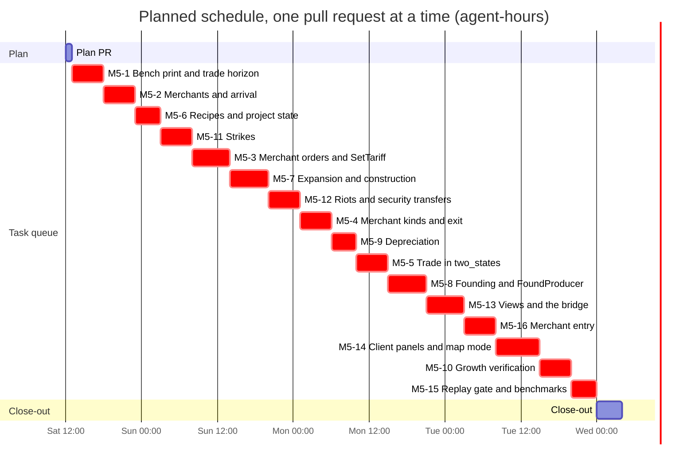
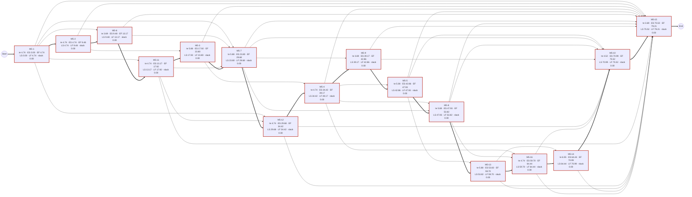

# Baseline Project Plan: Milestone 5

> [!NOTE]
> **Status: planning record** for the "m5" run, kept by the SDLC workflow (docs/SDLC_WORKFLOW.md). Not binding: the contract wins, and each fact moves to its home as the work lands.

The Baseline Plan stage of the [Project Workbook](README.md): how the run builds [Milestone 5](../../MILESTONE_5.md) from the approved [requirements](03-requirements-specification.md) and [design](04-system-specification.md). It fixes the scope, argues feasibility, names the risks, and gives the task queue, [`tasks.json`](tasks.json), with its schedule. The user and technical documentation each task writes is outlined in [06-user-and-technical-documentation.md](06-user-and-technical-documentation.md). Everything on this page is *planned*. Code is cited at `aa2133a`, which the plan's commits don't change; the workflow at `f911fa7` on the unmerged `sdlc-workflow` branch, as the [README](README.md#run-rules) links it.

This is the whole-plan revision, round 5, the final one: the panel returned round 4 (`7f13e6c`) with five major findings, and no panel round follows, so every finding is resolved here, in the plan; how each is handled is in the [review log](README.md#whole-plan-panel-round-4-findings). In short:
- the M5 tick order gets one home, D4: M5-2 replaces the data model's "Tick order (M5)" section with a note that points at D4 and lists D4's three refinements of it (S2, C13, C19), and the pull requests that land them list them for the maintainer (B17);
- a resume now deals with the local branch of a task left `failed` or `blocked-on-decision`, deleted by default and kept only on purpose, and says how the maintainer's answer reaches the run: a rule's change in DECISIONS.md on `main`, anything else as a numbered run decision ([Schedule](#schedule), step 7; B15, R19);
- ARCHITECTURE.md's game loop is named in the documentation item of every task that changes a D4 row, M5-4, M5-8, M5-9 and M5-16 among them;
- R-N24 is a named `extremes.rs` case at the price ceiling in each of the five tasks whose products can leave `Fixed`'s range, and an inspection with its reason in the four whose products can't (B16);
- the Trade tab's sandbox chooser re-subscribes, and its sliders follow only the chosen nation's tariffs, which the smoke test now checks (B18).

The tasks, their dependencies and their estimates are unchanged (79.21 expected hours, every task critical): each addition is a test or a documentation line within its task's size class.

Round 4 had made D13's budget a pass/fail test of every task that adds daily or month-end work (B13, R3), counted the task left in flight at each window's stop and recommended one long window ([Schedule](#schedule), R20), and made `fill_new_views` follow the chain (B14) ([review log](README.md#whole-plan-panel-round-3-findings)). Round 3 had given the close-out an interim contract that keeps the plan loadable (B12), split the maintainer's checkpoints by kind of park, named every task's planned deferrals (B11), and traced R-N16's and R-F42's tests ([review log](README.md#whole-plan-panel-round-2-findings)). Round 2 had made the task DAG a chain in the queue's order (B2), split the riot budget by `allocate` (C17), read D27's founders literally (C14), given M5-7 the month end's fresh layout (B8) and each result-changing task its levers (B9), traced the crafted-row and milestone checks (B10), specified the resume, and rebuilt the estimates step by step ([review log](README.md#whole-plan-panel-round-1-findings)).

## Introduction and project scope statement

### The problem

Today every market is an island, capacity is fixed at load, militancy has no consequences, and players can't see or steer trade or investment. The [System Service Request](01-system-service-request.md#what-happens-today) gives the evidence: buyers are producers and nations only (`crates/pax_engine/src/systems/market.rs:175-181`), no system changes a capacity (`crates/pax_engine/src/world.rs:287`), a labour pool supplies its whole size (`crates/pax_engine/src/systems/labor.rs:57`), and the only commands set a nation's three rates (`crates/pax_engine/src/command.rs:17-25`). In `two_states` the 12 goods' price gaps never close and real GDP is flat at about 4,202.5 a day over years 16-20.

### Objectives

The charter's objectives are the run's ([O1 to O10](02-project-charter.md#objectives)). This plan serves them as follows:
- **O1 and O2,** an approved plan on `main` with the decisions recorded exactly: the plan PR, the Gantt chart's first bar. D17, D27 and D28 were recorded in `bd08ee6` (run decision 5).
- **O3 to O7,** what M5 does: the sixteen tasks below, each one pull request, traced to the definition of done in [Acceptance criteria](#acceptance-criteria).
- **O8 and O9,** clean and documented merges: the run rules, the critic and the documentation duty, in every task's contract.
- **O10,** an honest record: the run report, and the [schedule verdict](#schedule) below.

### Deliverables

| Deliverable | Where | By |
|---|---|---|
| The approved plan | this workbook (`docs/workbooks/m5/`), with `bd08ee6`'s records of D17, D27 and D28 | the plan PR |
| Trade between markets | `pax_engine` (`horizon.rs`, `systems/trade.rs`, the `Merchants`, `Cargo` and `RouteGaps` tables, tariffs), `pax_data` (links, routes, merchants), `two_states`' route | M5-1 to M5-5, M5-16 |
| Investment and capacity growth | `systems/investment.rs`, the `Projects`, `ProjectNeeds` and `FoundingRequests` tables, two producer columns, recipes in `data/production.toml` | M5-6 to M5-10 |
| Strikes and riots | `systems/unrest.rs`, the wage split among working members, the riot budget split by `allocate` | M5-11, M5-12 |
| Commands | `SetTariff` and `FoundProducer`, end to end: engine, command logs and saves, wire, server | M5-3, M5-8 |
| Views and client | `TradeRouteView`, `InvestmentLedgerView`, `StaticData.routes`, the `TradeFlow` map mode; the bridge's encoders and decoders; the Trade and Construction tabs | M5-13, M5-14 |
| Measures | `bench`'s month-end print and `--warmup`, `report --market` and its new columns, `DayReport`'s new figures | M5-1, M5-5, M5-7, and each figure's task |
| Tests | 6 new test files and the cases of [Design 8](04-system-specification.md#8-test-design), each with its task | every task |
| Documents | DECISIONS.md's amended texts ([Design 2.3](04-system-specification.md#23-amended-decision-texts-proposed)) and every document [the outline](06-user-and-technical-documentation.md) names | every task |
| The close-out | MILESTONE_5's status against its definition of done; this workbook made final; before the last task, an interim status that keeps the plan loadable ([The close-out](#the-close-out)) | the close-out PR, interim after each early halt of a resumed run |

### Functional boundaries

Sharper than the [charter's scope](02-project-charter.md#scope-summary), from the choices the analysis and design made.

**In:**
- **Routes are one link each** (C1): a route ships over the link joining its two markets in its direction, which must be a best path of that horizon pair; the horizon is computed at load to check routes and then dropped (R-N20).
- **Tariffs per importing nation and good** (C2), 0 at load, assessed at purchase and paid on landing (C3), never within one nation or into a stateless market (R-F17).
- **Merchants of three kinds** (D17), Private and Commercial founded by dynamic entry, Chartered only by scenario seeding ([SSR](01-system-service-request.md#initial-assessment), item 3); dividends untaxed (C7).
- **Investment for every producer type `data/` gives a recipe** (M5-6 gives all of them one): expansion from retained earnings; founding by the market's capitalists, `investment.founder`, of the types they own (C14), and by the state's `FoundProducer` of any type with a recipe; and depreciation, each switched off by `investment.enabled = false` except running projects and the state's requests (C20).
- **Strikes and riots as D28 and run decisions 3 and 4 say**: strikers forgo wages; each rioting province receives its part of one security budget split by `allocate` (C17), which relieves militancy only through life needs.
- **Views capped** at 20 routes of 10 goods and 16 rows a ledger list, each with the count it leaves out (S28).
- **Both scenarios:** `two_states` changes on purpose and is re-recorded by the tasks of [Golden hashes impact](#golden-hashes-impact); `mini_valley` never changes (R-N8, R-F59).

**Out:** the [Exclusions](#exclusions) below.

### Acceptance criteria

The milestone's [definition of done](../../MILESTONE_5.md#-definition-of-done), mapped to requirements, tasks and tests, with the two checks the milestone's task rows add and the two rules the requirements add for stored files (R-N16, R-N17). Every must-have requirement is in some task's list in [`tasks.json`](tasks.json), which the workflow checks; the won't-haves R-F60 to R-F62 are in none (the workflow refuses a task that traces one) and are checked by inspection where the table says.

| Definition of done | Requirements | Tasks | Decisive tests |
|---|---|---|---|
| 1. Price gaps converge towards the friction margin in `two_states` | R-F20, R-F21 | M5-5, M5-3 | `trade_narrows_gaps_and_both_markets_gain`, `prices_converge_to_the_friction_band` |
| 1. Tariffs reduce volume and the importing treasury gets 100% | R-F17 to R-F19, R-F10 | M5-3, M5-2 | `a_higher_tariff_cuts_the_flow_and_the_treasury_gets_it_all`, `tariffs_reach_the_importing_treasury` |
| 1. Merchants enter on persistent gaps and exit when loss-making, money conserved | R-F15, R-F16, R-N3 | M5-4, M5-16 | `a_loss_maker_winds_up_and_returns_its_cash`, `a_persistent_gap_founds_a_merchant`, `money_conserved_through_trade` |
| 1. The money invariant holds every tick with random routes and high volumes | R-N1, R-N3, R-N4 | M5-2, M5-3, M5-4, M5-16 | the daily assert; `money_conserved_through_trade`, `goods_are_accounted_exactly` |
| 2. Capacity and real GDP rise over 20 years, unemployment in its band | R-F33, R-F24 to R-F31, R-N22 | M5-7 to M5-10 | `investment_grows_two_states`, `owners_found_only_the_types_they_own` |
| 2. Sustained demand for tools, timber and steel | R-F25, R-F33 | M5-7, M5-10 | `a_project_orders_every_day_until_delivered`, `investment_grows_two_states` |
| 3. Militancy above `strike_threshold` reduces output | R-F34 to R-F36 | M5-11 | `strikes_cut_labour_and_output`, `strikers_get_no_wage` |
| 3. Above `riot_threshold`, stock destruction and treasury payouts | R-F37 to R-F40 | M5-12, M5-11 | `riots_destroy_output_stock_never_money`, `the_security_transfer_is_exactly_what_the_treasury_pays`, `when_every_province_riots_the_treasury_pays_the_whole_budget`, `a_high_tax_causes_riots_that_end_when_it_falls` |
| 4. Players view routes, set tariffs, inspect construction and found factories from the client | R-F44 to R-F53 | M5-13, M5-14 | CI's client smoke test (R-F53), `trade_route_view_matches_the_day`, `investment_ledger_view_matches_the_world` |
| 4. Commands validated by `World::validate`, stamped and replayed identically | R-F18, R-F29, R-F42, R-F43, R-N7, R-D13 | M5-3, M5-8, M5-15 | `set_tariff_is_validated`, `found_producer_is_validated`, `new_commands_are_checked_in_order`, `command_logs_take_the_new_commands` and `new_commands_round_trip_through_a_save` (each created by M5-3 and extended by M5-8), `a_saved_session_replays_to_the_servers_final_state` |
| 5. Identical results at 1, 2, 3 and 8 threads | R-N5, R-N6 | M5-12, M5-5, M5-15 | `a_world_that_trades_invests_and_riots_is_independent_of_thread_count` |
| 5. 1M POP rows within 100 ms/day on 8 threads | R-N10, R-N26, R-N27, R-N11 | M5-2 to M5-5, M5-7 to M5-9, M5-11, M5-12 and M5-16, each for its own work; M5-15 for the finished tick | Design [8.4](04-system-specification.md#84-performance-d13)'s budget rule: each task's median of five `pax_cli bench` runs at most 100 ms/day, or the task is blocked on a decision and doesn't merge (B13); CI's Benchmark regression |
| M5-9's row: "verify inventory stability"; M5-11's row: "wage floor consistency" | R-F31, R-F35 (B10) | M5-9, M5-11 | `a_shrink_leaves_stocks_stable`, `wages_keep_their_floor_while_workers_strike` |
| A restored snapshot is refused when crafted (R-N17), for every new `check_tables` rule | R-N17, R-D3, R-D8, R-D9, R-D12, R-D16 | M5-2 to M5-4, M5-6, M5-8, M5-16 | `crafted_merchants_and_projects_are_refused`, each task adding its rule's case ([Design 8.1](04-system-specification.md#81-tests-by-task)) |
| A snapshot or save of another format is refused by name, before anything else is read (R-N16), through the seven snapshot and two save format changes | R-N16 | M5-2, M5-3; every later task that raises a format | `a_snapshot_of_another_format_is_refused_by_name` (M5-2), `another_format_is_refused_by_name` (M5-3) |
| The tick runs in D4's order as amended, stated once, in D4, and mirrored row for row by ARCHITECTURE.md's game loop and `tick.rs`'s module table (docs/README.md:12) | R-F41, R-N23 | M5-2 (the data model's note, B17), and each task that lands a D4 row: M5-2, M5-3, M5-4, M5-7, M5-8, M5-9, M5-11, M5-12, M5-16 | inspection in each pull request, its documentation item naming the rows; the R-F tests that depend on the order (arrival before labour, riots after politics); `python3 scripts/check_docs.py` |
| Overflow still panics, and no value at the price ceiling leaves `Fixed`'s range (D3) | R-N24 | M5-3, M5-4, M5-7, M5-8, M5-16; by inspection M5-1, M5-2, M5-11, M5-12 (B16) | `merchants_trade_at_the_price_ceiling`, `merchant_dividends_at_the_price_ceiling`, `construction_at_the_price_ceiling`, `founding_at_the_price_ceiling`, `entry_at_the_price_ceiling`, in `crates/pax_engine/tests/extremes.rs` |
| Won't have: a charter command, multi-link routes, taxed merchant dividends | R-F60, R-F61, R-F62 | inspected in M5-16, M5-1 and M5-4 | no such command in `command.rs` or `schemas/common.fbs`; every route is one link (R-D2); `TRADE.md`'s tax line marked planned |

### Exclusions

The [charter's out-of-scope list](02-project-charter.md#out-of-scope) stands: Milestones 6 and 7; a command that charters merchants; multi-hop merchants, per-route transit days, customs unions, wear of capacity in use and a repression command; changing `mini_valley`; and the work in flight outside the run (PR #69, the `sdlc-workflow` branch, M4's rate-limit question, the miners' famine calibration, the playtest). Also out, each because it needs a decision that isn't accepted ([Design 2.2](04-system-specification.md#22-no-decision-is-missing)): income tax on merchant dividends (C7), a share registry, firm failure, and D1's adaptive step as the default. Owners don't found producer types that the market's capitalists don't own: D27 names the capitalists as the funders, so those types grow by expansion or by `FoundProducer` (C14). A task that finds it needs a decision stops and reports blocked on it.

### Constraints and assumptions

- **The contract:** [AGENTS.md](../../../AGENTS.md) and [DECISIONS.md](../../DECISIONS.md), as the [charter lists them](02-project-charter.md#constraints); the critic judges every PR against `main`'s copies ([AGENTS.md §9](../../../AGENTS.md#9-critic-feedback)).
- **The run rules** and the maintainer's run decisions, quoted in the [README](README.md#run-rules).
- **One pull request at a time, in one order.** The run's `parallel` is 1, the workflow's default (`.claude/workflows/sdlc-overnight.js:91` at `f911fa7`), and every task depends on the one before it in the queue (B2), so whatever `parallel` is, only one task is ever ready and the queue's order is the DAG's only topological order.
- **At most 16 tasks,** the run's `maxTasks`, so the milestone's sixteen ids stay one task each: nothing is split, and nothing merged. This run was started with 16, and a run that resumes the plan must pass 16 again ([charter](02-project-charter.md#assumptions) A10, [Schedule](#schedule)).
- **Assumptions:** the charter's A1 to A11 ([charter](02-project-charter.md#assumptions)), and two of this stage's: the stop time passed before the plan was approved (A12, [Schedule](#schedule)), and a later run resumes the approved queue with `fromPlan`, with the arguments and preconditions that [Schedule](#schedule) lists: in one long window, the recommended mode, which ends early only at a halt, with an interim close-out; or in windows, each ending at its stop time or with an interim close-out, with the maintainer finishing each window's in-flight pull request before the next (A13; [The close-out](#the-close-out)). *Restated in the whole-plan revision, round 4.*

## System description

### The chosen design

The [system specification](04-system-specification.md) in brief:
- **Trade (D17):** scenarios declare links and one-link routes; merchants are rows of a `Merchants` table with their goods in a sparse `Cargo` table keyed by merchant, good and stage; they buy in the origin through ordinary D1 orders, ship for one day, lose the iceberg share at arrival (D4's new step 0), pay the tariff assessed at purchase, and sell in the destination at landed cost plus margin. Settlement moves all the step's money and hands goods to `trade.rs` by key, never by row (S5, S6). Merchants pay dividends to their owners by kind, wind up after months of realized loss (C28), and are founded on routes whose gap persists (PL-7).
- **Investment (D27):** projects buy their recipe's construction goods through D1 orders from cash above the day's needs (C24) and add capacity at the month end that follows delivery; the market's capitalists found the types they own, and the state any type with a recipe, where unclaimed unemployed workers wait (PL-8, PL-12, PL-13, C14); idle capacity shrinks without touching stocks (PL-14). All of it in one month-end step, 6c, in C19's order, on the fresh layout M5-7 adds (B8).
- **Unrest (D28):** working members, computed per POP, set labour supply and the wage split, and D6's wage rule runs on the employed who work (PL-15); riots at month end destroy output stock, and each rioting province receives its part of its nation's security budget, split once by `allocate` (PL-16, C17).
- **Commands, views and client:** `SetTariff` and `FoundProducer` land with their wire, file and server forms (C27); the two views are capped (S28), and the client asks for the trade view only on its tab (S30).
- **Determinism and money:** no new parallel pass; every split by `alloc::allocate`; merchant cash in `World::total_money`; new state hashed only where it holds something, so `mini_valley`'s golden file stands (PL-18).

### Alternatives considered

| Alternative | Why it lost |
|---|---|
| **Merchant goods as dense per-good columns on `Merchants`** (M5-2's row text; `docs/TRADE.md:39-41`) | 72 MB at D13's long-term scale, the matrix D17 avoids (C4); a sparse `Cargo` table keyed by (merchant, good, stage) grows with what is actually shipped |
| **Routes that carry their own iceberg share and capacity, no links** (`docs/TRADE.md:97-108`) | Run decision 2 gives a route its bottleneck link's capacity, which presupposes links distinct from routes (C1); one-link routes keep that rule exact until multi-link routes, which the charter excludes |
| **Holding `SetTariff` and `FoundProducer` back to M5-13**, as the milestone's row has it | The server's and `pax_data`'s exhaustive matches over the engine's commands wouldn't compile, and the tariff column and founding requests would be writable only by tests until then (C27) |
| **Splitting the largest tasks** (M5-3, M5-8, M5-13) into parts, freeing ids by merging smaller rows | The run's bound is 16 tasks, the milestone's 16 ids; merging rows would lose ids the milestone document keeps. Each large task instead splits into commits by layer (documents; engine; data and formats; wire and server), each building and testing alone (Risk R11) |
| **Keeping only the dependencies the code needs**, with every clause that depends on landing order made conditional (the panel's other option) | A task whose dependencies have merged starts from `main` (`.claude/workflows/sdlc-overnight.js:1632-1645`), so a refused merge or a parked PR earlier in the queue would let the next tasks edit `world.rs`, `snapshot.rs`, `bench.rs` and `tests/common/mod.rs` from a `main` without it, and leave the maintainer conflicting pull requests; and four tasks with unmerged dependencies on separate branches would be blocked outright (`:1642-1644`). The chain costs nothing in a run that builds one pull request at a time (B2) |
| **A parallel schedule** (`parallel` above 1) | The chain leaves nothing to run in parallel, and before it the tasks that could overlap edited the same files, which the workflow would have had to order anyway (`:695`) |
| **Leaving the close-out to the workflow's own summary**, "the workbook final" (`:1657`), whenever it runs | In a resumed run it runs at every early halt, since the tasks ticked on `main` count as merged (`:1633`, `:1652-1653`); a final register would make the next resume throw (`:1108`, `:1112`), and a status written against the definition of done would read as finished while tasks remain. B12 gives it an interim case ([The close-out](#the-close-out)) |
| **Founding every producer type from its own owner profession** (C14 before the whole-plan revision, round 2) | It reads D27's "funded by the market's capitalists" more broadly than its words, which the critic judges against `main`; with the literal reading the farms still grow, by expansion (C14's measurements) |

## Plan choices

Choices this stage makes within the contract, for the maintainer to check, continuing the analysis's C1 to C29 and the design's S1 to S30. None needs a new or amended decision; like those, they go into the plan PR's description and this workbook, never into DECISIONS.md. Round 2 of the whole-plan revision restated two of the analysis's choices, C14 (D27's founders, read literally) and C17 (the riot budget, split by `allocate`), and added B8 to B10; round 3 added B11 and B12, round 4 B13 and B14, and round 5 adds B15 to B18 and restates S30.

| # | Choice | Why |
|---|---|---|
| B1 | **M5-10 lands after every task that changes `two_states`' results** (M5-5, M5-7, M5-8, M5-9, M5-11, M5-12, M5-16) | Its growth test, and any recalibration within R-D5 and R-D7, then measure the economy M5 delivers, and no later task can invalidate them; otherwise trade (M5-5) or merchant entry (M5-16) landing later would have to recalibrate investment, which isn't theirs. S27 made it follow M5-9 for the same reason |
| B2 | **The DAG is a chain in the queue's order:** besides the dependencies the code needs, every task depends on the task before it, M5-1, M5-2, M5-6, M5-11, M5-3, M5-7, M5-12, M5-4, M5-9, M5-5, M5-8, M5-13, M5-16, M5-14, M5-10, M5-15, so this is the DAG's only topological order and every task is on the critical path. *Restated in the whole-plan revision, round 2* (panel round 1's finding 3): round 1 relied on the workflow's own tie-breaks for this order | The workflow starts a task whose dependencies have merged from `main`, stacks it on its one unmerged dependency whose branch holds the others, and blocks it otherwise (`.claude/workflows/sdlc-overnight.js:1632-1645`). With the chain, every task starts from a `main` that holds every earlier task, or, after a refused merge or a `needs-waiver` park, stacked on the branch of the task before it, which holds them all; so the values that depend on landing order (`SNAPSHOT_FORMAT` 2 to 8, `SAVE_FORMAT` 2 and 3, protocol 1.7 to 1.10, `CommandError` 8 to 12), the replica tests' tables and the "before it in the chain" clauses of `tasks.json` hold whatever happens to a merge. The cost: when a task is parked `needs-human`, fails or is blocked, every later task waits for it, and when it is parked `needs-waiver` or its merge is refused, every later task in the window is built stacked and unpushed (R11, R13, R18, R22) |
| B3 | **M5-8 follows M5-4, and so M5-3** | Both commands go through the same path (engine, `CommandText`, saves, wire, server), and M5-4 adds `option_u32s`, which M5-8 uses; the design's order-dependent clauses (S11's error values, the D6 ownership bullet's two parts) name one task each. The chain (B2) orders them anyway; the month end's fresh layout, which round 1 gave M5-4, is M5-7's (B8) |
| B4 | **S30's guarantee is restated, not extended:** a founding's outcome reaches the client in the month-end day's update only, so an update skipped by D23's window or by D24's cap for a remote session above four days a second (`crates/pax_server/src/throttle.rs:1-10`) loses it; the client still sees the request leave the pending list and, if founded, its project appear, so only a drop's reason is lost | Design round 3's minor finding 4. The fix considered, keeping the last month end's foundings in the server and sending them with later updates, would build a view from an earlier day's report; D22 builds views from `ProvinceStats` and the day's report (`docs/DECISIONS.md:415`), and no Amends line covers widening that, so it would need a decision. The loss is a reason, under heavy throttling, which a later decision can add back |
| B5 | **Tests that add trade topology to a loaded `two_states`** (M5-1's replica test, M5-2's snapshot round trip) **push a link and route only when `route_between` finds none** | Design round 3's minor finding 2: from M5-5 the scenario has its own link, and `push_link` panics on a duplicate key |
| B6 | **`fill_new_views` is a `#[cfg(test)] pub(crate)` function at `view.rs`'s module level** | Design round 3's minor finding 1: inside the private `mod tests`, `game.rs`'s `remote_bandwidth_budget` can't call it (E0603) |
| B7 | **`server_day_budget` subscribes both views on its stepped world, unfilled** | Design round 3's minor finding 3: it times ticks, and the filled world is a fixture no tick runs on; `view_building_budget` and `remote_bandwidth_budget` measure the views at their caps |
| B8 | **The month end's fresh layout lands with M5-7:** `tick.rs` takes one `World::pop_layout()` after politics and passes it to `investment::run_month_end`; M5-12 inserts `unrest::riot` between the two, and M5-4's `trade::run_month_end` and M5-8's founding reuse that layout | Panel round 1's finding 7: M5-7 is the first task in the queue whose step-6c function takes a layout, and at `aa2133a` the only layout in scope after politics is the tick's opening one, stale once mobility, migration or retraining has appended rows (`crates/pax_engine/src/tick.rs:96-104`). Riots move cash between existing rows only, so the layout stays valid through them (Design 1.3) |
| B9 | **Levers:** a task that changes `two_states`' results may tune, when its own scenario test or one already on `main` fails, only these values, within their data rules: M5-11 the strike keys (R-D6); M5-7 `investment.profit_margin` (R-D5); M5-12 the riot keys (R-D6); M5-9 `slack` and `idle_months_before_shrink` (R-D5); M5-5 its route's `margin` and `k`, its link's `capacity` and its merchants' `cash` (R-D1 to R-D3); M5-8 `investor_reserve_days` (R-D5), never `founder`; M5-16 `entry_months` (R-D4); M5-10 the investment keys but `founder`, and the recipes (R-D5, R-D7). Any of them may also retune the unrest keys within R-D6 if R-F40's window breaks, and move a band of `economic_bands.rs` under the bands clause with its reason (R-N22). Nothing else moves: R-F20's, R-F33's and R-F40's bounds and `content_stability.rs` are never relaxed, and a task whose levers can't keep every scenario test green reports blocked-on-decision, naming the bound, the values tried and what each gave | Panel round 1's finding 6: round 1 fixed M5-5's values and gave the later tasks no lever but blocking, while its estimate text allowed recalibrating. Each lever is a value the task's own requirements introduce, so tuning it is the task's own work, M5-10's recalibration excepted (B1); the unrest keys are the exception because R-F40's window is the one scenario bound that every later change to prices and life needs can move (R18) |
| B10 | **The milestone's "verify inventory stability" (M5-9) and "wage floor consistency" (M5-11) are restated in R-F31 and R-F35, each with its test** (`a_shrink_leaves_stocks_stable`, `wages_keep_their_floor_while_workers_strike`), and the crafted-row refusals of R-N17 are listed by task (Design 8.1) | Panel round 1's findings 8 and 9. No requirement is added: the workflow checks each task's requirements against those approved at Analysis and refuses an unknown id (`.claude/workflows/sdlc-overnight.js:668-675`, `:1063`), so each obligation joins the requirement it belongs to. Each task's row tick names the test of each check its row asks for |
| B11 | **Every task's contract names its planned deferrals:** the work a later task in the chain does, with that task (a "Planned deferrals" item in each task's `provides` in `tasks.json`). The worker labels each *planned*, naming its task and the decision it implements, wherever the task's documents mention it, as [AGENTS.md §8](../../../AGENTS.md#8-documentation-maintenance) asks of unbuilt work, and the pull request's Why lists them, from the contract the publisher is given (`.claude/workflows/sdlc-overnight.js:1353-1374`). A critic DEBT finding about a deferral is answered in the same pull request, by that label (added where the finding points, if it is missing) and the plan's row, as M3's #49 and M4's #58 answered theirs by recording a follow-up (`out/m3-run/LOG.md`, 22:22; `out/m4-run/LOG.md`, 01:28 and 01:37), so it is fixed, not left. A DEBT whose fix lies in the task's own files is fixed there. Only a finding that asks for a later task's work itself is left, naming that task, and that parks the pull request `needs-waiver` (R22) | Panel round 2's finding 2. A `needs-waiver` park lets every later task in the window build stacked and unpushed (`:1487-1492`, `:1607`, `:1641-1645`), and the chain splits features across tasks on purpose (merchant columns in M5-2 and M5-4, entry in M5-16, recipes before projects), which gives a remediation agent ready reasons to leave a DEBT as a later task's ([AGENTS.md §9](../../../AGENTS.md#9-critic-feedback) allows one left for a concrete reason). The CI critic reviews the diff and sees no PR conversation but waivers (`.github/workflows/critic.yml:134-136`, `:155-158`), so the scope has to be in the diff's own documents: the planned labels put it there, the pull request's Why tells the maintainer and the remediation agent, and the remediation agent has the answer M3 and M4 used. A waiver stays the maintainer's alone |
| B12 | **An interim close-out keeps the plan loadable:** when the workflow's close-out runs while MILESTONE_5 has a row not ticked on `main`, it records an interim status (the tasks merged so far, where the chain halted, the actual bars so far) and leaves every planning deliverable's status in the register starting with "approved"; only the close-out after the last task makes the workbook final ([The close-out](#the-close-out)) | Panel round 2's finding 1. In a resumed run the close-out runs at every early halt, since the tasks ticked on `main` count as merged (`:1633`, `:1652-1666`), and its built-in summary asks for "the workbook final" (`:1657`); a final register would make the next resume throw, because loading the plan requires the register to mark the planning deliverables approved (`:1108`, `:1112`). The workflow can't be changed by the run, so the contract goes where its refresh reads (`:1139`) and its worker is pointed (`:1194`) |
| B13 | **D13's budget is a pass/fail acceptance test** of every task that adds daily or month-end work (M5-2 to M5-5, M5-7 to M5-9, M5-11, M5-12, M5-16) and of M5-15: on the task's finished branch, on the run's machine, the median of five runs of each of its checks (R-N10's 29-day mean, R-N26's 30-day mean, R-N27's warmed mean) is at most 100 ms/day; over it, the task optimises within its own rules; still over, it reports blocked-on-decision (D13's budget, or D1's adaptive step as the default) with its measurements, and doesn't merge; a review round's fix can't cross it either ([Design 8.4](04-system-specification.md#84-performance-d13)'s budget rule, stated there once) | Panel round 3's contract finding. D13 is binding ([AGENTS.md §5](../../../AGENTS.md#5-performance-over-flexibility)), but the contracts only recorded measurements, so one worker would have merged an engine over the budget with a note and another stopped; and CI's Benchmark regression is relative, at most 20% against each pull request's base (D13), so rises under 20% each could carry the tick past 100 ms with every check green. The rule uses what the workflow already has: a worker that reports `blocked-on-decision` is never published (`.claude/workflows/sdlc-overnight.js:1524`), and a disputed or left finding parks the pull request (`:1482-1492`). Five runs, because single runs of the means spread over about 4.5 ms (R-N10); the run's machine, because M5-1's baseline is taken there and D13's M2-content row names threads, not a machine |
| B14 | **`fill_new_views` follows the chain:** M5-13 writes it to empty only the trade tables on `main` when it lands (`network`, `merchants`, `cargo`) and to assert `World::check_tables` on the filled world; M5-16, which adds `route_gaps` after it in the queue, owns `crates/pax_server/src/view.rs` too and extends the helper to empty that table, so the routes it pushes have one gap row each ([Design 8.4](04-system-specification.md#84-performance-d13)) | Panel round 3's traceability finding. Design 8.4 had M5-13 empty `route_gaps`, a table that doesn't exist until M5-16, and M5-16's `push_route` would then have left gap rows for `two_states`' own routes beside the forty pushed, against R-N17's one row per route. Of the panel's two options this is the second: the first, a `World` method that clears the trade tables, would be public engine API that only a server test calls, since `#[cfg(test)]` doesn't reach across crates. The `check_tables` assertion makes any later table the helper misses fail, by name, in the gate of the task that adds it |
| B15 | **A failed or blocked task's branch is deleted before a resume, unless kept on purpose, and a halt's answer reaches the run by DECISIONS.md or a numbered run decision** (resume step 7): the maintainer deletes the task's `m5/<id>` locally, and on origin if a failed publish pushed it, so the task is rebuilt from `main`; or keeps a never-pushed one on purpose, rebased onto `origin/main` and named in a run decision. An answer that changes or adds a rule is an accepted DECISIONS.md change merged to `main`; any other is a run decision numbered 7, 8 and on, appended to the `decisions` argument and quoted in the README's run rules | The panel's round 4 feasibility finding. Those tasks are never published (`.claude/workflows/sdlc-overnight.js:1514-1537`), and the next worker takes an existing branch before it branches from `main` (`:234`), so a leftover branch would be built on silently. Deleting is the default because the branch holds an attempt nobody reviewed, often one that failed its gate or its budget; keeping it is a choice the maintainer makes, with a record the run reads. The answer's route follows what each agent reads: the refresh unblocks only on an accepted decision or a run decision (`:1141`), the run decisions reach the planners, workers, publishers and remediation agents with the run rules (`:130-132`, `:158-163`), the refresh's reviewer sees only the workbook (`:1153-1166`), hence the README quote, and the critic judges against `main`'s DECISIONS.md ([AGENTS.md §9](../../../AGENTS.md#9-critic-feedback)), hence a rule's change there |
| B16 | **R-N24 is a named case at the price ceiling in each task whose products can leave `Fixed`'s range** (M5-3, M5-4, M5-7, M5-8, M5-16, each owning `crates/pax_engine/tests/extremes.rs`), **and an inspection, with its reason, in the four whose products are bounded** (M5-1, M5-2, M5-11, M5-12); `investment::project_reserve` returns `Option<Fixed>` and `founding_cost`'s `None` also covers a cost beyond the range, so no money value beyond it is formed, compared or saturated ([Design 8.1](04-system-specification.md#81-tests-by-task)) | The panel's round 4 traceability finding. Design 8.1 had every task extend `extremes.rs`, which only two owned, and M5-16, whose entry prices a link's capacity, didn't trace R-N24, though at the ceiling of 1,000,000 a capacity of 10^7 units a day is already beyond the range. Of the panel's two options this is the first, for the tasks that have such products, and the second, stated per task, for the others. `Option` rather than a capped value, because R-N24 and [AGENTS.md §4](../../../AGENTS.md#4-strict-determinism-d3) forbid saturating to avoid a panic, and no agent's cash can reach a value beyond the range, so `None` means "more than anyone can pay": no dividend, no project, no founding |
| B17 | **The M5 tick order's one home is D4 from M5-2 on:** M5-2 replaces the data model's "Tick order (M5)" section, keeping its heading for D17's Amends line, with a note that the order lives in D4 and lists D4's three refinements of it (S2, C13, C19, each with its task), points the data model's D4 amendment rows and MILESTONE_5's "Tick order" bullet at D4, and lists the refinements among its decisions; M5-7 and M5-4 list C13 and C19, which they land, and the plan PR's description all three ([Design 2.3](04-system-specification.md#d4-tick-schedule-and-goods-persistence)'s D4 preamble) | The panel's round 4 contract finding. docs/README.md gives the tick order one home, D4, which ARCHITECTURE.md mirrors (`docs/README.md:12`); from M5-2's first D4 amendment the data model would otherwise hold a second, different order, the one D17's Amends line names. Each refinement is within the contract (S2, C13, C19), but the critic judges against `main`'s D17, so each pull request that lands one names it for the maintainer to confirm |
| B18 | **The Trade tab's sandbox chooser re-subscribes**, and its sliders follow only an update for the nation chosen: `trade_panel.gd` gains `tariff_nation_changed`, `tariff_nation()` and `choose_nation()`, `main.gd` calls `_subscribe()` on that signal as well as on the Trade tab's entry and exit, a province click and a change of map mode, and the smoke test chooses nation 1 and waits for its tariffs (S30 restated; [Design 4.6](04-system-specification.md#46-pax_godot-and-the-client), 6, 8.6) | The panel's round 4 traceability finding. The trade view carries one nation's tariffs (C22), so, unlike the nation panel, whose `NationTable` carries every nation, a change of nation needs a new `Subscribe`; S30's "only when the Trade tab is entered or left" left the chooser no route to the server, and the smoke test, setting nation 0's tariff only, couldn't tell the two clients apart |

## Feasibility

### Economic

**One-time cost.** The [PERT estimates](#estimates) give 79.2 expected agent-hours for the sixteen tasks (most likely 64.25, optimistic 28.15, pessimistic 190.1), plus 1.25 for the plan PR and 3.69 for the final close-out, which runs every agent a small task's cycle does and is estimated as one (1.2 / 2.85 / 9.55; [The close-out](#the-close-out)): **84.2 agent-hours**. Each early halt of a resumed run adds an interim close-out of the same estimate: at the planning figures' two early halts ([Schedule](#schedule)), about 7.4 hours more. How the run is resumed adds the rest ([Schedule](#schedule)'s model): nothing more in one long window, the recommended mode, but for a stacking park's unreviewed work until the maintainer stops the run (about 6 hours); about 11.5 hours of the maintainer's attended remediation in eight-hour windows, finishing each window's in-flight pull request; and about 87 hours thrown away if each of those pull requests were closed and its task rebuilt instead, which the plan no longer does. If the errors are independent, the standard deviation is 7.0 hours; the step times are modelled the same way for every task, so their errors may share one bias, and then it is up to 28.8 hours, the sum of the standard deviations ([How the estimates were made](#how-the-estimates-were-made)). Within each task's estimate, review time (the local critic, the review rounds and the last watch) is about half. The planning already spent is about 8.5 hours of wall time (`out/m5-run/LOG.md`, 01:01 to about 09:30).

**Recurring cost: the tick (D13).** D13's budget is 100 ms a day at 1M POP rows on 8 threads, measured as the mean day (PERFORMANCE.md). On the run's machine `aa2133a` takes 69.0 to 74.2 ms a day over the 29 cold days and a median of 105.7 ms on the first month-end day (R-N10, R-N26). PERFORMANCE.md records about 91 ms on M4-11's machine (`docs/PERFORMANCE.md:15`), so the headroom is machine-relative and small. What M5 adds, estimated for the benchmark's world (1,500 copies of `two_states`: 3,000 markets, 6,000 provinces, 36,000 producers, about 990,000 POP rows, 3,000 routes):

| Work | Where | Size at that scale | Estimated cost |
|---|---|---|---|
| Arrival | D4 step 0 (M5-2) | at most 72,000 cargo rows, one linear pass | under 1 ms a day |
| Merchant orders and offers | discovery and settlement (M5-3) | up to 36,000 orders and 36,000 offers if every good is open both ways; with the measured gaps (8 goods open from Highland, 3 from Lowland) about 16,500 of each, against about 69,000 orders and offers today (per copy, 14 input orders, 24 producers' offers and about 8 government orders) | the largest item: about 5 to 15 ms a day, if discovery's cost grows with its order rows (`clear_markets` dominates today, `docs/PERFORMANCE.md:22`) |
| Strikes and the wage split | labour and firms (M5-11) | one threshold test per POP row, a share only above it | about 1 to 3 ms a day |
| Merchant dividends, construction orders | firms, market (M5-4, M5-7) | per merchant and per project | under 1 ms a day |
| Investment, riots, merchant month end | month end (M5-7 to M5-9, M5-12, M5-16) | one pass over POP rows for available workers, one grouping of POP rows by province, 72,000 founding tests | about 6 to 12 ms on the month-end day |

So the cold days are estimated at about 80 to 90 ms on the run's machine and the 30-day mean at about 85 to 95: within the budget, with little to spare. These are estimates, not measurements. Each task that adds work measures its own change against M5-1's baseline (R-N10, R-N26, R-N27), and passes only if the median of its five runs is at most 100 ms/day; a task that can't get there by optimising within its own rules is blocked on a decision and doesn't merge ([Design 8.4](04-system-specification.md#84-performance-d13)'s budget rule, B13, Risk R3). M5-15 applies the same test to the finished tick and records it in PERFORMANCE.md.

**Recurring cost: CI and maintenance.** The new release-only scenario tests run about 40,000 simulated days of `two_states` in all; a 7,200-day run takes 0.38 s in release on the run's machine (measured 07:26), so they add seconds. The whole gate runs in about 3 minutes there (measured 08:36). The maintenance surface grows by four engine modules (`horizon.rs`, `systems/trade.rs`, `systems/investment.rs`, `systems/unrest.rs`), seven new `World` fields holding eight tables (links and routes together in `network`), three columns on existing tables, two commands, two views, two client panels, about sixteen rules keys, a snapshot format raised seven times and a save format twice, and protocol 1.10.

**Benefits.** Tangible: the definition of done (trade with tariffs, investment that grows the economy, strikes and riots, the client's controls), and the measures that check it (`bench`'s month-end time and warm-up, `report --market`, the new report columns). M6 builds directly on M5 (`docs/MILESTONE_6.md:8`). Intangible: an economy that can grow and respond to policy, and a second milestone built by the workflow.

**Verdict: feasible.** About 84 agent-hours, plus about 3.7 for each interim close-out, run in one long window (or in windows whose in-flight pull requests the maintainer finishes, about an hour each); no new dependency; a tick cost estimated within D13 and held there by each task's pass/fail test; and seconds of CI.

### Technical

| Area | Size and structure | Familiarity | Risk |
|---|---|---|---|
| Engine tables and systems (M5-1, M5-2, M5-4, M5-6, M5-9, M5-11, M5-12, M5-16) | New struct-of-arrays tables and plain system functions, the patterns of `Pops`, `Producers` and `systems/` (D8) | High: the code's own patterns, documented in ONBOARDING.md's recipes | **Low to medium**: the money path is guarded by the daily assert and a conservation case per flow |
| Settlement's new buyers and sellers (M5-3, M5-7) | Changes inside `market.rs`'s settlement (`market.rs:666-852`), the tick's hottest code | Medium: the sequence is written out (Design 4.1) | **Medium**: a wrong row or a missed debit breaks conservation (caught at once) or the hand-off order (S5's test) |
| The D13 budget | Every task that adds work, each with a pass/fail test (B13) | Measured baselines exist (R-N10, R-N26) | **High**: small headroom, see [Economic](#economic); a task that crosses it is blocked, which halts the chain (R3) |
| Calibration (M5-5, M5-7 to M5-12, M5-16) | Data values tuned against scenario tests | Medium: measured at `aa2133a` (Design 3.7, with the 08:36 probe) | **Medium to high**: each result-changing task has only its own levers (B9), and in the chain one that can't keep a test green stops every later task (R18) |
| Protocol, server and bridge (M5-3, M5-8, M5-13) | Append-only schema, generated code, exhaustive conversions | High: M3 and M4 added six minor versions this way | **Low** |
| Client (M5-14) | Two GDScript panels and a headless smoke test | Medium: GDScript, slow to iterate | **Medium** |

**Verdict: feasible, medium risk overall.** Sixteen pull requests touch 96 paths besides the shared documents, in six of the eight crates (not `pax_content` or `pax_map`), with no new boundary, dependency or tool (Design 7).

### Operational

- **Players:** two new tabs and a map mode; nothing is removed. Saves and snapshots written before a format change are refused by name (R-N16), and every scenario-content change already refuses older saves (D23's content hash), so a game saved before M5 can't be loaded after it.
- **Hosts:** a 1.6 client still plays on a 1.10 server without the new views (R-N15); a newer client on an older server gets `Malformed` for the new commands (Design 3.6). `protocol_major` doesn't change, so HOSTING.md's rule stands. No new server setting.
- **Scenario authors and modders:** new optional scenario entries; `data/professions.toml` gains `merchant`, appended so every id keeps its index; `rules.toml` gains required sections and keys (C20), so a data directory of one's own must add `[trade]`, `[investment]` (with `founder`, the profession of the market's capitalists, C14) and the five `[politics]` keys, and a missing one is a load error naming it. DATA_FORMAT.md documents each with its task.
- **Operators of CI:** no new job; the client smoke test gains its steps (R-F53); the Benchmark regression job sees trade once `two_states` has it (R-N12, Risk R4).
- **Operators of the run:** a resumed run needs the arguments and the seven steps before it of [Schedule](#schedule), and is best run as one long window, with the run report read at least morning and evening; in windows, each window's in-flight pull request is finished by hand before the next resume (step 3); a window whose chain halts before its stop time ends with an interim close-out pull request, which the next resume checks ([The close-out](#the-close-out)); and a `needs-waiver` park or a refused merge leaves stacked local branches to publish or delete (R13, R22).
- **Verdict: feasible,** with the save break stated in the release notes the close-out writes.

### Schedule

**Does it fit before the stop time, 2026-10-10T07:00:00+08:00? No.** The Baseline plan stage started at 07:08, after the stop time, so no task can start in this run:
- the workflow checks the clock at the start of every task's cycle and returns "not-started" past the stop time (`.claude/workflows/sdlc-overnight.js:1510` at `f911fa7`);
- planning doesn't check it, and the plan PR, once the panel approves it, is published and watched: it merges if its first watch finds every check green and the critic passing, and is left in flight otherwise, since the stop has passed (`shepherd`, `:1426-1456`, its clock checks at `:1436` and `:1454`; the plan PR is published after the panel and the seal, `:1587-1597`). Resume step 1 then finishes it.

**What the queue needs.** One pull request at a time, in the chain's order (B2), the queue takes the sum of the tasks' times, which with the chain is also its critical path: **84.2 expected agent-hours** with the plan PR and the final close-out, and 88 hours on the [Gantt chart](#gantt-chart), whose bars are rounded to whole hours, from 2026-10-10 12:00 to 2026-10-14 04:00: about three and two-thirds days of continuous running. Its spread: 77.2 to 91.1 hours (one standard deviation) if the errors are independent, 55.4 to 113.0 if they share one bias, and 29.9 to 202.7 from every optimistic to every pessimistic value. Interim close-outs, and whatever the windows lose, come on top (below).

**The close-out in a resumed run.** After the queue, the workflow runs its close-out whenever the run has `merge`, the plan PR is merged and any task's status is "merged" (`:1650-1653`). In a resumed run every task already ticked on `main` counts, since `startTask` records it as merged without running it (`:1633`), so from the first merge on, every resumed run qualifies. The close-out is a full cycle on the branch `m5/closeout` from `origin/main` (`:1654-1665`): the clock check (`:1510`), a refresh, a worker, the full gate, the local critic, the commit audit, publish, the watch and its rounds, and an auto-merge when green. Because of that clock check, a run that reaches its stop time doesn't run one. A run whose chain halts first does: a task parked `needs-human`, failed or blocked on a decision blocks every later task at once (`:1636-1638`), `Promise.all` over the queue returns (`:1648`), and the close-out starts with time left. So **every window that halts early ends with an interim close-out, which auto-merges if green**, while MILESTONE_5 still has rows to tick; so does a window in which every remaining task has been built stacked before the stop (R22). The workflow's own summary for the close-out describes only the final one ("the workbook final (register, ...)", `:1657`), and a final register would make the next resume throw (`loadPlan`, `:1108`, `:1112`). Its contract is therefore [The close-out](#the-close-out), which its refresh reads (`:1139`) and its worker is pointed to (`:1194`), as B12 says; resume step 6 checks it, and R21 registers the risk. It is estimated as a small task, 1.2 / 2.85 / 9.55 hours (te 3.69), and counted in the windows below. When every task has merged, the same cycle is the final close-out, the Gantt chart's last bar.

**Windows: what a stop does to the task running at it.** A run with a `stopAt` starts no task after it (`:1510`), and looks at the clock again only after a watch that doesn't end in a merge (`:1436`, `:1454`); a green watch merges without looking (`:1440-1453`). So the task running at the stop, the *straddler*, runs its refresh, build, gate, local critic, audit and publish to the end, and then merges only if the first watch it reaches after the stop is green. Otherwise the run leaves its pull request in flight and ends. In the plan's own round model that watch is green only if it closes the task's last round with findings, and every medium or large task has at least one such round (1 / 2 / 5 and 1 / 3 / 5; a small task has none in 12% of builds). So **16% of straddlers merge and 84% are left in flight**. With M3's and M4's first reviews instead, green in 6 of 28 (#35, #42, #43, #47, #51 and #62; `out/m3-run/LOG.md`, `out/m4-run/LOG.md`), 30% would merge. A pull request left in flight holds most of its task's work. Round 3's count of about twelve windows assumed that work survived, but resume step 3 as it then stood closed the pull request and had the next run rebuild the task from `main`, which throws it away. *Corrected in the whole-plan revision, round 4* (the panel's feasibility finding, [review log](README.md#whole-plan-panel-round-3-findings)).

**A model of the windows.** An uncommitted probe outside the repository (20,000 replications of the queue and its final close-out, in Python 3.11) replays those clock rules on the plan's own step model ([How the estimates were made](#how-the-estimates-were-made)):
- every step of a cycle is drawn from a PERT-beta distribution with that table's o / m / p, and its rounds with findings from that table's counts;
- each round starts with its watch, 0.03 / 0.1 / 0.4 hours from CI's and the critic's times;
- each task's mean is its te in `tasks.json`;
- `stopAt` is three hours before each window's end, and each window starts with a fresh clock check.

| How the run is resumed | Windows: mean (10% to 90%) | Agent-hours the windows spend, of them thrown away | The maintainer's attended hours | Tasks the run merges in a window, the last window aside |
|---|---|---|---|---|
| **One long window, no stop near** (recommended) | 1 | 82.9, none | none | — |
| Eight-hour windows, each in-flight pull request **finished** by the maintainer before the next resume (step 3 now) | 11.6 (11 to 13) | 71.5, none | 11.5, about one an eight-hour window | 0.73, and the straddler that the maintainer finishes |
| Eight-hour windows, each in-flight pull request **closed** and its task rebuilt (step 3 as it stood) | 27.2 (21 to 35) | 163.0, of them 86.6 | none | 0.61 |
| Twelve-hour windows, finished / closed | 7.6 / 12.1 | 74.4 / 117.3, of them 36.0 | 8.5 / none | 1.43 / 1.39 |
| Sixteen-hour windows, finished / closed | 5.8 / 7.6 | 76.9 / 103.1, of them 21.1 | 6.0 / none | 2.29 / 2.24 |

In eight-hour windows three in four end with a task in flight. With M3's and M4's first-review rate the closed case would still need 19.8 windows (16 to 25), throwing away 52.9 agent-hours, and the finished case 10.9. Thirteen per cent of eight-hour windows run past their end, 4% by more than an hour, the worst by about five hours; the three-hour margin covers most.

**Parks** come on top. The plan's planning figures for the whole queue are **two early halts and one stacking park**. They are judgments: M3's and M4's single agent needed the maintainer on one of their 28 pull requests (#45) and left DEBT only on that one (`out/m3-run/REPORT.md`, "How the run went"; `out/m4-run/REPORT.md`). This workflow's agents are cold, its tasks larger and its review rounds capped at six, so the plan takes one task in eight to halt early and one in sixteen to park stacked; the model draws them so.
- An **early halt** (a task parked `needs-human`, failed, or blocked on a decision, D13's budget included; R3, R11, R18) ends its window. The chain behind it is blocked, the run runs an interim close-out (3.69 hours expected, up to 9.55; R21) and returns, and the maintainer finishes the parked pull request or decides, then resumes: a failed or blocked task leaves its unpublished branch, which resume step 7 deletes or keeps on purpose, and the answer reaches the run as that step says.
- A **stacking park** (`needs-waiver`, or a refused merge; R13, R22) lets the run build the later tasks stacked on it and never pushed, about 2.4 hours each (a medium task's likely time from refresh to audit, with no review rounds), until the stop. That work is kept only if the maintainer publishes the branches (resume step 4); deleted, it is rebuilt later.
- With them, eight-hour windows with the straddler finished take 12.3 windows (11 to 14). One long window takes 3.9 runs (2 to 6), a new one after each halt: 96.3 agent-hours, of which 6.0 are stacked work thrown away, for a maintainer who stops the run at their next checkpoint, at most 12 hours after a stacking park.

**The recommendation: one long window.** Resume with `stopAt` about five days after the start. The queue's 84.2 expected hours, plus the 28.8 of a bias shared by every task, make 113 hours, 4.7 days ([How the estimates were made](#how-the-estimates-were-made)). No task is then left in flight at a stop, unless the estimates are worse than that. Each early halt ends the run with an interim close-out; the maintainer finishes the parked pull request, or decides, and resumes, which starts a new long window. What the mode risks is a stacking park with no stop near: the run would go on building every later task stacked and unreviewed (R13, R22). So in it the maintainer reads the run report at least morning and evening, and stops the run at a pull request labelled `needs-waiver`, or one left green and unmerged ("ready", R13). Windows of a night or a working day remain possible, with step 3 below: about twelve of eight hours, each with about an hour of the maintainer's remediation on its in-flight pull request before the next resume.

**Resuming.** The approved plan is what a later run continues from (`fromPlan`, SDLC_WORKFLOW.md "Running it"), as the [charter's target dates](02-project-charter.md#target-dates) expected (A13). It is started with these arguments:

| Argument | Value | Why |
|---|---|---|
| `fromPlan` | `true` | Loads this workbook's plan instead of planning again (`:1565`, `:1102-1115`) |
| `milestone` | `"docs/MILESTONE_5.md"` | Gives the slug `m5` (`:79`) and the list of tasks already done, the rows ticked in the milestone on `main` (`:1108`), which the run skips (`:1633`) |
| `maxTasks` | `16` | Loading re-runs the automatic checks with the run's bound, 12 by default (`:95`, `:660`, `:1113-1114`), and the queue has 16 tasks |
| `parallel` | `1` | The default (`:91`); with the chain any value runs one task at a time |
| `merge` | `true` | Auto-merge when every required check is green (`:90`, `:1440-1453`), the maintainer's authorisation given again: run decision 6 was given "for this M5 run". It also lets the close-out run, and merge when green, at the end of a run whose chain halts before its stop time (`:1653`; [The close-out](#the-close-out)) |
| `decisions` | run decisions 1 to 6, as quoted in the [README](README.md#run-rules), given again, followed by any the maintainer adds to answer a halt, numbered 7, 8 and on, each also quoted in the README (step 7) | Every planner, worker, publisher and remediation agent reads the maintainer's decisions from it with the run rules (`:130-132`, `:158-163`), and the refresh unblocks a task only on a decision that is accepted or among them (`:1141`); 1 to 5 are recorded in DECISIONS.md once the plan PR merges (`bd08ee6`), and 6 holds the run rules. An answer that changes a rule can't be a run decision: it goes into DECISIONS.md on `main` (step 7) |
| `stopAt` | a new ISO 8601 time with its offset: about five days after the start for one long window (recommended), or about three hours before a window must end | Without it the run has no stop (`:86`, `:1126`). A stop far away leaves no task in flight unless the queue runs late; a near one leaves the task running at it in flight five times in six, which step 3 then finishes ([Windows](#schedule), above) |

Before a resume, the maintainer:
1. **merges the plan PR**, after its critic verdict on `bd08ee6` (R1). This run left it in flight unless its first watch was green, so if the critic has findings the maintainer finishes it as step 3 says. If it were still open, the resumed run would find `tasks.json` only on `m5/plan` and publish that branch again (`:1589-1597`), and a second `gh pr create` for a branch that has a pull request fails;
2. **merges every green `m5/*` pull request**, so its row is ticked on `main` and the run skips it; an interim close-out's (`m5/closeout`) only if its register still marks every planning deliverable approved (step 6);
3. **finishes every other open `m5/*` pull request and merges it** before resuming. The one the stop left in flight (status `in-flight` in the run report; at most one, since one task runs at a time) is finished in the maintainer's own session with `/critic-followup` ([AGENTS.md §9](../../../AGENTS.md#9-critic-feedback)), the remediation the workflow would have run, pushed, and merged once every required check is green: about an hour of attended work an eight-hour window in the model above, against about 87 agent-hours thrown away over the queue if each were closed instead (R20). A pull request parked `needs-human` is finished the same way, or decided; a `needs-waiver` one by the maintainer's waiver on it, or by the fix (R22). Only a pull request the maintainer decides not to finish (an interim close-out not merged among them, step 6) is **closed, with its branch deleted on origin and locally**: the resumed run then rebuilds that task on `m5/<id>` from `main`, and pushing over a remote branch with other commits would need the force-push the run rules forbid. *Restated in the whole-plan revision, round 4:* this step had closed the in-flight pull request by default;
4. **deletes every local stacked branch** (`m5/<id>`, status "stacked", built on an unmerged task), or rebases it onto `main` and publishes it once its base merges, for the same reason; the run report lists each with the commands to finish it (`:1552`);
5. **detaches or removes any leftover agent worktree that holds an `m5/*` branch** (`git worktree list`), so the run can check the branch out;
6. **checks the close-out of the last window:** `gh pr list --head m5/closeout --state all` shows whether there was one. After steps 2 and 3 the maintainer deletes `m5/closeout` on origin and locally if either is left, since the next close-out's worker takes an existing branch before it branches from `main` (`git switch m5/closeout 2>/dev/null || git switch -c ...`, `:234`), and confirms that the register on `main` still marks every planning deliverable approved, which loading the plan requires (`:1108`, `:1112`). If a merged close-out replaced the word, the maintainer restores it in a pull request before resuming ([The close-out](#the-close-out), R21);
7. **deals with the branch of every task the run left `failed` or `blocked-on-decision`,** after step 5 has freed any worktree that holds it, and **gives the run the answer** to what blocked it (B15). *Added in the whole-plan revision, round 5* (the panel's feasibility finding, [review log](README.md#whole-plan-panel-round-4-findings)).
   - **Why a branch is left.** Such a task is never published: each of those statuses returns before `shepherd` (`:1514-1537`), so its `m5/<id>` exists only locally, holding whatever its worker and gate-fix agents committed, a worker that reports blocked having first committed what is sound (Design 8.4, rule 3). A publish that fails (`:1428`) may also leave it pushed without a pull request. The chain halts at the first such task (`:1636-1638`), so a window leaves at most one. The run report shows its status; `git branch --list 'm5/*'` and `git ls-remote --heads origin 'm5/*'` show the branch.
   - **By default the maintainer deletes it,** locally (`git branch -D m5/<id>`) and on origin if it is there (`git push origin --delete m5/<id>`), so the resumed run rebuilds the task from `main`. Left in place, it would be taken silently: the next worker's checkout takes an existing branch before it branches from `main` (`git switch m5/<id> 2>/dev/null || git switch -c m5/<id> origin/main`, `:234`), and would build on commits it didn't write, an engine over D13's budget or a gate that already failed its fix attempts.
   - **The maintainer keeps it only on purpose,** when the answer makes its commits worth continuing (a task blocked on D13's budget whose optimisations stand, say), and only if it was never pushed. They rebase it onto `origin/main` (allowed, since none of its commits was pushed), and say so in a run decision that names the task, the branch and its head commit, so the refresh and the worker read it. The resumed worker continues from it, and the task's pull request (its Why) and the run report say that it did.
   - **How the answer reaches the run.** An answer that changes or adds a rule (D13's budget, D1's adaptive step as the default, a new decision) is an accepted change to DECISIONS.md, in the maintainer's own pull request merged to `main` before the resume, with the `contract-change` label where it relaxes a rule ([AGENTS.md §9](../../../AGENTS.md#9-critic-feedback)): the critic judges every pull request against `main`'s DECISIONS.md, and a run decision can't change a rule. Any other answer (a scenario bound's value beyond a task's levers, B9 and R18; keeping a branch) is a further run decision, numbered 7, 8 and on after the six quoted in the [README](README.md#run-rules), dated, appended to the `decisions` argument, and quoted under the README's run rules in a pull request the maintainer merges before the resume, since the refresh's reviewer reads the workbook on `main` but is given no run rules (`:1153-1166`). Given anywhere else, an answer never reaches the refresh, which unblocks a task only on an accepted decision or a run decision (`:1141`), so the task would block again on the same question.

**Verdict: not feasible before the stop time; feasible as a resumed run.** Best as one long window: about 83 expected agent-hours of continuous running once the plan PR has merged (84.2 with it), three and a half days; or about four runs and 96 agent-hours with the planning figures' parks, plus the time the maintainer takes to answer each halt. In eight-hour windows, about twelve, provided the maintainer finishes each window's in-flight pull request before the next resume; closing those pull requests instead would take about 27 windows. Each task is buildable from this workbook and `main` once the task before it merges, and the run report lists the queue.

### Legal and contractual

- **Licences:** nothing new (Design 7). The workspace's pinned dependencies (rayon, serde, toml, FlatBuffers through flatc 24.3.25, godot-rust 0.5.5) and the pinned mermaid-cli stay as they are.
- **The contract:** no change to AGENTS.md, DECISIONS.md's rules or critic.md, which the run can't make (no `contract-change` label). Every amendment M5 needs is named by an accepted decision's Amends line and lands with its code ([Design 2.3](04-system-specification.md#23-amended-decision-texts-proposed), S1); D6's founding bullet names D27's funders in D27's words (C14); D19 changes only its status sentence (run decision 4, S20).
- **D28's Amends line** still names a D19 amendment that won't happen; run decision 5 keeps it as written, so it stays the maintainer's ([SSR](01-system-service-request.md#initial-assessment), item 4; charter A11).
- **Verdict: feasible.**

## Management issues

### Agents and roles

The workflow's roles are the [charter's](02-project-charter.md#key-stakeholders-and-roles): scouts, the planner, a reviewer per stage and the three-lens panel, then per task a refresh (planner and reviewer), a worker, the gate and gate-fix agents, the local critic, the commit auditor, publish, watch, remediation, merge, and the reporter, with a clock agent before every task and round. The maintainer is away until the morning (A6).

### The maintainer's checkpoints

| When | What they decide or check | Where |
|---|---|---|
| The plan PR | Whether its critic verdict on `bd08ee6`'s acceptance of D17, D27 and D28 stands; if CRITICAL, the PR is parked for them (A11, Risk R1); and whether D4's three refinements of the order D17's Amends line names, S2, C13 and C19, which its description lists, are confirmed (B17) | the PR, labelled `needs-human` if parked |
| Each checkpoint: the morning, and in one long window the evening too | Every task's outcome, the decisions to check, drafted waivers, what remains; and, in a long window, whether a pull request is labelled `needs-waiver` or left green and unmerged, at which they stop the run, since what follows is unreviewed (R13, R22; [Schedule](#schedule)) | `out/m5-run/REPORT.md` |
| Choices within the contract | C1 to C29 (C14 and C17 restated in the whole-plan revision, round 2), S1 to S30 (S30 restated in round 5), B1 to B18, and each task's `Decisions:` lines, among them D4's three refinements of the order D17's Amends line names (S2, C13, C19; B17) | this workbook, the plan PR's description, each PR, the report |
| Parks that stop the later tasks | A pull request parked `needs-human`: a disputed CRITICAL finding (`.claude/workflows/sdlc-overnight.js:1482-1485`), six remediation rounds without green (`:1455-1458`), a gate that still fails after its fix attempts (`:1493-1497`), fixes that can't be pushed (`:1498-1502`), or a watch that returns nothing or stays pending (`:1433`, `:1437`); and a task that fails or is blocked on a decision. Every later task becomes blocked (`:1636-1638`), the run ends early with an interim close-out ([The close-out](#the-close-out)), and the maintainer finishes or closes the pull request, or decides, then resumes; a failed or blocked task has no pull request, and its local branch is deleted or kept on purpose (resume step 7) (R11, R18, R19, R21) | PRs labelled `needs-human`; the report |
| Parks that let the later tasks build stacked, unpushed | A pull request parked `needs-waiver` (every remaining finding is DEBT left with a reason, `:1487-1492`) and a refused merge (`ready`, `:1452`): every later task in the window is built, gated and audited on a branch stacked on it, and never pushed (`:1607`, `:1641-1645`, `:1539-1541`). The maintainer waives the DEBT on the pull request (a `critic-waive` comment is theirs alone, never an agent's) or asks for the fix, merges it, then publishes the stacked branches in order or deletes them (resume step 4); or, seeing the label during a run, stops the run, since what follows is unreviewed (R13, R22) | PRs labelled `needs-waiver`, or left green and unmerged; the report's stacked branches and drafted waivers |
| A task blocked on a decision | The decision it names: none is expected (Design 2.2), except a scenario bound that a task's levers can't meet (B9, R18), or D13's budget where a task's median stays above 100 ms/day after it optimises within its own rules, with D1's adaptive step as the default as the other way out (B13, R3). The answer reaches the run as resume step 7 says: a change of rule as an accepted DECISIONS.md change merged to `main`, anything else as a run decision numbered 7, 8 and on, in the `decisions` argument and the README's run rules; and the task's branch is deleted, or kept on purpose and named in that run decision (B15) | the report, with the task's measurements; DECISIONS.md or the `decisions` argument and the README |
| An interim close-out | Its pull request, if still open at the resume: merged only if its register still says approved, else closed; the branch deleted (resume step 6) | the `m5/closeout` pull request |
| Resuming | The arguments and the seven steps before it, in [Schedule](#schedule): above all, finishing and merging the pull request the last stop left in flight (step 3), deleting the local branch of a task left failed or blocked or keeping it by a run decision, and giving the answer to a halt as a DECISIONS.md change on `main` or a numbered run decision (step 7), and choosing one long window or windows (`stopAt`) | the workflow's arguments; GitHub; `/critic-followup`; `git worktree list` |
| The playtest | A look at the Trade and Construction tabs and the map mode (R-F49 to R-F52) | the report's "what remains" |
| D28's Amends line | Whether to edit it | DECISIONS.md |

### Communication

- **The workbook:** the correspondence log (dated entries for each round, PR and decision), change requests (a task contract changed after approval), the review log, and each task's actual bar in the schedule; an interim close-out adds the window's entry and the bars so far ([The close-out](#the-close-out)).
- **Pull requests:** the workflow's description template (summary, why, what changed, documents, test evidence as a table, golden hashes, decisions to check, review rounds), a triage table comment per remediation round, and the critic's own comment.
- **The plan PR's description,** which the workflow's publisher writes from the branch's commits (`.claude/workflows/sdlc-overnight.js:1363`), quotes run decisions 1 to 5 and names D28's Amends line (charter A11), and lists, among the decisions to check, D4's three refinements of the order D17's Amends line names (the data model's "Tick order (M5)"): S2's step numbers, C13's delivery at settlement and C19's merchants' month end. This round's commit carries them in its `Decisions:` line so that the publisher has them, and M5-2's, M5-7's and M5-4's pull requests list them again where they land (B17).
- **Commits:** the five fields (Why, What, Evidence, Docs, Decisions), checked by the commit auditor before every push.
- **The run directory** (`out/m5-run/`, git-ignored): `LOG.md`, one timestamped line per event; `PLAN.md`, written when the plan is sealed; `REPORT.md`, rewritten after every task.

### Standards

The contract ([AGENTS.md](../../../AGENTS.md), [DECISIONS.md](../../DECISIONS.md)); the critic's rules ([critic.md](../../../.claude/commands/critic.md)), run locally before each push and by CI; the local gate, CI's commands that need no Godot, bench runner or fuzzer, plus `scripts/check_docs.py` and `scripts/render-mermaid.sh`; the commit shape; and the documentation duty: documents before code, rustdoc with code, the milestone row and workbook at the end.

## Resource allocation

Every task owns the files its `owns` list in [`tasks.json`](tasks.json) names, in full in the [work breakdown](#the-task-queue); `docs/DECISIONS.md`, `docs/MILESTONE_5.md`, this workbook and `Cargo.lock` are shared by design. Every task depends on the one before it (B2), so it starts from a `main` that holds every earlier task, or, after a refused merge or a `needs-waiver` park, stacked on the branch of the task before it, which holds them all: no two tasks edit a file from different bases. The files most tasks touch are `crates/pax_engine/tests/common/mod.rs` (11 tasks), `crates/pax_data/src/lib.rs`, `schema.rs` and `tests/validation.rs`, `crates/pax_engine/src/tick.rs`, `crates/pax_cli/src/report.rs` and `data/rules.toml` (10 each), `crates/pax_engine/src/world.rs`, `defs.rs` and `crates/pax_data/src/bench.rs` (9 each), and `crates/pax_data/src/snapshot.rs`, `crates/pax_data/tests/economic_bands.rs`, `crates/pax_engine/tests/conservation.rs`, `scenarios/two_states/golden.hashes` and `scenarios/mini_valley/defs/rules.toml` (8 each), each task extending its own part; `crates/pax_engine/tests/extremes.rs` is the five price-ceiling tasks' (B16).

Every task meets the same reviewers: the refresh reviewer on its contract against `main` as it then is, the local critic, CI's Critic, the commit auditor, and CI's required checks. The table names where a task meets them hardest.

| Task | Files | Reviewer touchpoints that bite |
|---|---|---|
| M5-1 | 23 | Benchmark regression reading the new print (`bench_has_one_ms_per_day_line`); the critic on D14 rule 5's text |
| M5-2 | 19 | The critic on money (D5's holders, the daily assert); `check_docs.py` on `systems/trade.rs` in ARCHITECTURE.md and BACKEND_SCHEMA.md; the critic on the tick order's one home, D4, with the data model's section replaced and S2, C13 and C19 listed for the maintainer (B17) |
| M5-3 | 41 | The critic on settlement's money path and C27's cross-crate change; CI's generated-code check, fuzzing (hostile `SetTariff`), session replay on three platforms; D13's budget rule on discovery's new orders (B13); `merchants_trade_at_the_price_ceiling` (B16) |
| M5-4 | 28 | The critic on D6's merchants' dividends and the ownership bullet, and on C19 against D17's Amends line (B17); the crafted-row cases for `owner_nation`; `merchant_dividends_at_the_price_ceiling` (B16) |
| M5-5 | 17 | Golden re-record explained (D11); Benchmark regression with trade in the head only (Risk R4) and D13's budget rule with trade in `two_states` (B13); the bands clause and its levers (B9) |
| M5-6 | 18 | The critic on derived data (no `project_budget`, D7) |
| M5-7 | 29 | The critic on settlement and the dividend reserve (D6, D27), and on C13 against D17's Amends line (B17); the fresh layout (B8); D13's budget rule on all three checks, R-N10, R-N26 and R-N27 (B13); `construction_at_the_price_ceiling` and `project_reserve`'s `None` (B16); golden re-record |
| M5-8 | 45 | The critic on D27's founders (C14) and D21's validation-only-in-`validate` rule and D24's conflict text; fuzzing; session replay; the protocol check; `founding_at_the_price_ceiling` (B16) |
| M5-9 | 25 | Hash rule for a new column (`a_new_column_is_hashed_once_it_differs`); the stocks test (B10) |
| M5-10 | 8 | The bands clause and any recalibration's reasons; release tests in CI |
| M5-11 | 31 | The critic on run decision 3's D6 text and D19's sentence (run decision 4); the wage-floor test (B10); golden re-record |
| M5-12 | 25 | The critic on the riot transfer's split (D3, D5, D28, C17); determinism test on four thread counts |
| M5-13 | 31 | The bandwidth and size budgets (R-N14); the crate-boundary check (D12); the critic on D22's views |
| M5-14 | 21 | CI's client smoke test (headless Godot), with the sandbox chooser's re-subscription (B18); the maintainer's look in the morning |
| M5-15 | 5 | Session replay on Windows and macOS; D13's budget rule on the finished tick, which blocks rather than optimises (B13); PERFORMANCE.md's numbers |
| M5-16 | 27 | The critic on entry's funding (D17, D27's funding rule) and "never chartered"; `fill_new_views`' `check_tables` assertion in the server's unit tests (B14); `entry_at_the_price_ceiling` (B16) |

## Risk register

| Id | Risk | Likelihood | Impact | Mitigation | Owner | Trigger |
|---|---|---|---|---|---|---|
| R1 | The plan PR's critic reads `bd08ee6`'s acceptance of D17, D27 and D28 as an agent's contract change, judged against `main`'s Proposed entries | Medium | High: every task branches from `main` after the plan | The description quotes run decisions 1-5 verbatim and names D28's Amends line (A11); a CRITICAL finding is disputed and the PR parked for the maintainer, never worked around | Plan PR's remediation; the maintainer | Critic check red on DECISIONS.md |
| R2 | The stop time passed before the plan was approved | Certain | High for this run: nothing is built | The queue resumes from the approved plan with the arguments and the seven steps of [Schedule](#schedule) (A13), best as one long window; each task stands on the one before it and this workbook; the report lists the queue | The maintainer, on resuming | The first task's clock check |
| R3 | M5's daily or month-end work takes the 1M-row tick over 100 ms a day | Medium | High: D13, DoD 5. Under the budget rule the task that crosses it doesn't merge, so the chain halts there: an early halt, with an interim close-out (R21) | [Design 8.4](04-system-specification.md#84-performance-d13)'s budget rule (B13), which every task's contract cites: each task that adds daily or month-end work, and M5-15, passes only if the median of five runs of each of its checks (R-N10, R-N26, R-N27) is at most 100 ms/day on the run's machine. Over it, the task optimises within its own rules (no orders for goods without a gap, no strike arithmetic below the threshold, month-end passes that skip idle rows). Still over, it commits what is sound and reports blocked-on-decision, naming D13's budget, or D1's adaptive step as the default, with its measurements; it is never published, so it doesn't merge. A review round's fix that would cross the line isn't made, and the finding is left or disputed with the measurements, which parks the pull request. A rise over 20% against the task's "before" or M5-1's baseline is explained in the PR (R-N26). CI's relative gate can't hold the line alone: rises under 20% each pass it | The worker of each task that adds work; M5-15; the maintainer for the decision | A median over 100 ms/day, or a median rise over 20% |
| R4 | CI's Benchmark regression compares each side's own `two_states` (`.github/workflows/ci.yml:154-163`), so tasks that add content to it (M5-5, M5-7, M5-11, M5-16) give the head more work than the base | Medium | High: a required check | Run `scripts/bench-compare.sh` locally with both binaries before pushing; keep added work proportional to what the content trades; if the regression is the content's own work and within D13, the PR says so and is parked for the maintainer, never by weakening the gate (charter A7) | The worker | Benchmark regression red |
| R5 | A later task changes `two_states` and breaks an earlier task's scenario test (trade, unrest, growth, bands, content stability) | Medium | Medium | Every gate runs `cargo test --all --release`; M5-10 lands last among result-changing tasks (B1); the breaking task tunes only its own levers, or the unrest keys for R-F40's window, and moves a band only under the bands clause (B9); a bound is never relaxed (Design 8.5); what its levers can't fix is R18 | The later task's worker | A release scenario test fails in the gate |
| R6 | Design 3.7's investment values don't meet R-F33 (capacity, real GDP +0.1%, construction goods, unemployment), for example because depreciation shrinks the peaks' mines by about 5,000 slots, or because owners found little once they are the capitalists only (C14) | Medium | Medium | Growth doesn't wait on founding: the farms, vineyards and three workshops pass PL-9's expansion test on `aa2133a`'s engine (Design 3.7, 08:36); M5-10 recalibrates within R-D5 and R-D7 and re-records with the reason; its pessimistic estimate allows it (12.55 hours) | M5-10 | `investment_grows_two_states` fails |
| R7 | A new money flow isn't conserved, or a split doesn't sum to its total | Low | High: every tick panics, or the critic finds a split without `allocate` (CRITICAL) | One function moves settlement's money (S6); every split by `alloc::allocate`, the riot budget's included (C17); a conservation case per flow through the shared `random_world` (R-N3) | The worker | The daily assert, a conservation test, or a critic finding |
| R8 | Results depend on the thread count or the platform | Low | High: D3, D11 | No new parallel pass (Design 1.4); explicit tie-breaks; the thread-count test on R-F40's world (R-N6); CI's Windows and macOS verify and replay | The worker; M5-12, M5-15 | `determinism.rs` or a cross-platform job fails |
| R9 | A golden file changes where the plan says it doesn't, `mini_valley`'s especially | Low | Medium | PL-18 hashes new state only where it holds something; [Golden hashes impact](#golden-hashes-impact) names every planned change; an unplanned one is a bug to explain, never re-recorded | The worker | `pax_cli verify` fails |
| R10 | A format change misreads an older save, snapshot or client | Low | Medium | Each layout change raises its format and the reader checks it first (R-N16, S15); the schema only appends (R-N15); `a_1_6_client_reads_every_later_update` | M5-2 to M5-4, M5-6, M5-8, M5-9, M5-13, M5-16 | `saves.rs`, `snapshot.rs` or `roundtrip.rs` fails |
| R11 | A large task (M5-3, M5-7, M5-8, M5-13, M5-14) doesn't get green within the workflow's six review rounds | Medium | High: parked `needs-human`, and every later task in the chain is blocked (`.claude/workflows/sdlc-overnight.js:1636-1638`) until the maintainer finishes it and resumes the run; the window ends early with an interim close-out (R21) | Commits split by layer, each building alone; contracts refreshed and reviewed before the build; the local critic before the PR; pessimistic estimates of 13 to 15 hours | Worker and remediation; the maintainer | Round 6 not green |
| R12 | The headless client test fails for Godot-specific reasons, slowly | Medium | Medium: DoD 4 | The smoke test's steps are scripted in Design 8.6 and go through the client's own paths; the Rust side is tested in `pax_godot` first | M5-14 | CI's client-smoke red |
| R13 | `gh pr merge` is refused by GitHub or the permission classifier, as has happened (SDLC_WORKFLOW.md, "Merge authorisation") | Medium | High for the run: the pull request stays "ready", and every later task is built, gated and audited locally, stacked on the branch of the task before it, and never pushed (`.claude/workflows/sdlc-overnight.js:1539-1541`, `:1607`, `:1640-1645`), so nothing more reaches review until the maintainer acts | The chain makes every later task stack on the one before it rather than branch from a `main` without it (B2), so the stacked branches hold no conflict; the report lists them with the commands to finish them (`:1552`). The maintainer merges the ready PR, then either publishes the stacked branches in order, each rebased onto `main` once the one before it merges, or deletes them and resumes the run, which rebuilds them for review ([Schedule](#schedule)); or stops the run at the first refused merge, since what follows is unreviewed. In one long window, the recommended mode, their checkpoints, at least morning and evening, bound that to about half a day. A `needs-waiver` park has the same consequence (R22); the model counts one such park ([Schedule](#schedule)) | The merge agent; the maintainer | The merge agent reports "merged false" |
| R14 | The new views push a remote client past 100 KB/s or an update past 128 KB | Low | Medium | The caps (S28): 82.4 KB/s and 107,272 bytes measured at them; the budget tests fill past every cap | M5-13 | `remote_bandwidth_budget` or `size_budget.rs` fails |
| R15 | A task needs a decision that isn't accepted (taxing merchant dividends, a charter command, the adaptive step) | Low | Medium | Design 2.2's check found none; the task stops and reports blocked on it (C7, R-F60) | The worker; the maintainer | The worker reports blocked-on-decision |
| R16 | PR #69 merges during the run and changes `DATA_MODEL_M5_M6.md`, which tasks update; or it stays open while M5-2 replaces the "Tick order (M5)" section whose flowchart #69 rewrites (B17), so the two conflict there | Low | Low | The refresh step takes its changes in as change requests (A3); M5-2 makes its note from whichever version is on `main`, and its pull request says that the note supersedes #69's flowchart, so whichever merges second keeps the note; the run never edits #69 | The planner at refresh; M5-2; the maintainer for #69 | #69 merged, or M5-2 merged with #69 open |
| R17 | The estimates are wrong, all in one direction: the step times are modelled, since no task cycle of this workflow has run yet | Medium | Medium: the count of windows is wrong | The model is laid out step by step with its evidence ([How the estimates were made](#how-the-estimates-were-made)); the spread is given both for independent errors (6.8 hours for the tasks, 7.0 with the plan PR and close-out) and for one shared bias (27.0, or 28.8); the planning figures for parks are stated as judgments beside their evidence ([Schedule](#schedule)); the first tasks' actual times, which the workers report (`started_at`, `finished_at`, `:1526`), recalibrate the rest, and the report keeps the queue current | The maintainer | The first two tasks' actual times outside their o to p range, or more than 30% from te |
| R18 | A task that changes `two_states`' results can't meet a scenario test with its levers (B9) | Medium | High: it reports blocked-on-decision, every later task waits, and the window ends early with an interim close-out (R21). Every task is on the critical path (B2), and the earlier the task, the more it holds up: M5-11 (4th in the queue) twelve tasks, M5-7 (6th) ten, M5-12 (7th) nine, M5-5 (10th) six | Levers start from measured values (Design 3.7; the 08:36 probe); R-F40's window has room both ways (province means 0.175 on day 2520 and 0.433 on day 1800 against a threshold of 0.3); the bands clause lets a band move with its reason; the task reports the values it tried and what each gave, so the maintainer's decision is one reading | The task's worker; the maintainer | The worker reports blocked-on-decision naming a scenario bound |
| R19 | A resumed run meets the last run's leftovers: an open plan PR, an open `m5/*` pull request (an interim close-out's included), a branch `m5/<id>` or `m5/closeout` on origin or locally, or a worktree holding one; among them the local `m5/<id>` of a task left `failed` or `blocked-on-decision`, never published (`:1514-1537`), or pushed without a pull request by a failed publish (`:1428`); or a halt's answer given where the run can't read it | High in windows: three in four eight-hour windows end with a pull request in flight ([Schedule](#schedule)); Medium in one long window, after a halt: the planning figures' two early halts are failures or blocks, each leaving such a branch | High: the plan PR is published again and `gh pr create` fails, or a task's push is refused, and in the chain every later task is blocked; a stale `m5/closeout` makes the next close-out start from it (`:234`); a failed or blocked task's leftover branch makes the next worker build, unknowing, on commits it didn't write (`:234`), an engine over D13's budget or a gate that failed its fix attempts; and an answer outside DECISIONS.md and the `decisions` argument leaves the task blocked again on the same question (`:1141`) | The seven steps before a resume ([Schedule](#schedule)): step 7 deletes a failed or blocked task's branch by default, locally and on origin, or keeps it only on purpose, rebased and named in a run decision, and gives the answer as a DECISIONS.md change merged to `main` (a rule) or a numbered run decision in the `decisions` argument and the README (anything else) (B15); the report lists every open pull request, stacked branch and task status, and `git branch --list 'm5/*'` the rest. *Extended in the whole-plan revision, round 5* | The maintainer | A resume with any of them present; `git branch --list 'm5/*'` listing a branch whose task the report shows `failed` or `blocked-on-decision` |
| R20 | At a window's stop the task running then, the straddler, is left in flight unless the first watch it reaches after the stop is green (`.claude/workflows/sdlc-overnight.js:1454`, `:1436`), which the plan's round model gives 16% of straddlers (30% at M3's and M4's first-review rate); closing its pull request at the resume throws its work away. It, or an interim close-out, also runs past the stop | High in windows: three in four eight-hour windows end with a task in flight; Low in one long window, where only a stop reached before the queue ends leaves one ([Schedule](#schedule)'s model) | High if each in-flight pull request is closed and its task rebuilt: eight-hour windows would need about 27, not 12, and throw away about 87 agent-hours, more than the queue's 79. Low if it is finished: about an hour of the maintainer's attended remediation an eight-hour window, 11.5 in all. The overrun: 13% of eight-hour windows run past their end, 4% by more than an hour, the worst by about five hours | One long window as the recommended mode (`stopAt` about five days away). In windows, resume step 3 has the maintainer finish the in-flight pull request (`/critic-followup` in their own session, then the merge once green) before the next resume, so the next window starts after it; longer windows need fewer (12 hours: 7.6; 16 hours: 5.8). `stopAt` about three hours before a window must end covers most overruns. *Re-rated in the whole-plan revision, round 4:* it was Low impact, against step 3's rebuild | The maintainer | A window's stop passing while a task is before or in its review rounds (status `in-flight` in the report) |
| R21 | The workflow's close-out runs at the end of a resumed window whose chain halts before its stop time, or once every remaining task is stacked (`:1633`, `:1650-1665`), and makes the workbook "final" as its own summary asks (`:1657`), or marks MILESTONE_5 done, while tasks remain | Medium: an interim close-out is expected to run, after each of the planning figures' two early halts ([Schedule](#schedule)), and its own summary asks for the workbook final (`:1657`), against which only this workbook's contract stands | High: a merged close-out whose register no longer says approved makes the next resume throw (`:1108`, `:1112`); a status that says done misleads the maintainer. Its time, 3.69 hours expected, is counted in [Schedule](#schedule)'s model | B12 and [The close-out](#the-close-out): while MILESTONE_5 has a row not ticked on `main`, the close-out records an interim status and keeps every planning deliverable's status starting with "approved"; its refresh reads the workbook (`:1139`) and records the interim contract as a change request; resume step 6 deletes `m5/closeout` and checks the register on `main`, restoring the word in a pull request if needed | The close-out's refresh and worker; the maintainer at the resume | A window's chain halting before its stop time (a task `needs-human`, failed or blocked on a decision), or every remaining task stacked |
| R22 | A task is parked `needs-waiver`: every remaining finding is DEBT that the remediation agent left with a reason (`:1487-1492`), which its instructions allow for "the plan's scope" or a fix that "belongs in a separate change" (`:1339`) | Medium: the CI critic found DEBT in the first review of 21 of M3's and M4's 28 pull requests, though only one left a DEBT finding (#45, an approved contract change) and two answered a finding about later work by recording it (#49, #58; `out/m3-run/LOG.md`, `out/m4-run/LOG.md`); M5 splits features across tasks on purpose, and its remediation agents are cold. The model counts one such park ([Schedule](#schedule)) | High for the window: every later task in it is built, gated and audited on a branch stacked on the parked one, and never pushed (`:1607`, `:1641-1645`, `:1539-1541`), so nothing more reaches review; with a `stopAt` days away and nobody looking, every remaining task is built so, and an interim close-out follows (R21) | B11: every contract names its planned deferrals, labelled planned in its documents and listed under its PR's Why, so a DEBT about one is answered by documentation and fixed, not left, and a DEBT within the task's own files is fixed there. The maintainer, at the `needs-waiver` label, waives the DEBT (their `critic-waive` comment; agents only draft waivers into the report) or asks for the fix, merges, then publishes the stacked branches in order or deletes them (resume step 4); or stops the run at the first such park, since what follows is unreviewed. In one long window, the recommended mode, their checkpoints, at least morning and evening, bound the unreviewed work (about 6 agent-hours thrown away on average in [Schedule](#schedule)'s model); in windows, the stop bounds it to the rest of one window | The remediation agent; the maintainer | A pull request labelled `needs-waiver` |

## Work breakdown

### The task queue

The tasks of [`tasks.json`](tasks.json), in the milestone's order, each with its place in the queue (B2). Requirements are in ranges; the owned files are grouped by crate, "(new)" marking the task that creates a file; the acceptance tests are named, and `tasks.json` says what each asserts. Each contract there also names the task's planned deferrals, the work a later task does (B11), and every task that adds daily or month-end work, and M5-15, has D13's budget rule as a pass/fail acceptance test (B13). No task is blocked on a decision. The workflow's close-out, which is not a task of the queue, follows the table ([The close-out](#the-close-out)).

| Task (queue position) | Title | Depends on | Requirements | Owns | Acceptance tests | o / m / p | Blocked on a decision |
|---|---|---|---|---|---|---|---|
| M5-1 (1) | Bench's month-end timing, then the route loader and the trade horizon | none | R-F1 to R-F4, R-F56, R-F57, R-F59, R-N5, R-N8, R-N11 to R-N13, R-N17 to R-N20, R-N23, R-N24, R-N26, R-D1, R-D2, R-D4, R-D14 | cli: main.rs; engine: horizon.rs (new), lib.rs, world.rs, defs.rs; engine tests: trade.rs (new), common/mod.rs; data: schema.rs, lib.rs, snapshot.rs, bench.rs; data tests: validation.rs; content: rules.toml; scenarios: mini_valley/defs/rules.toml; docs: DECISIONS, DATA_FORMAT, BACKEND_SCHEMA, MAP_AND_LOGISTICS, TRADE, DATA_MODEL_M5_M6, ONBOARDING, MILESTONE_5, workbooks/m5 | `bench_times_the_first_month_end_day`, `bench_has_one_ms_per_day_line`, `horizon_matches_a_hand_computed_one`, `horizon_is_independent_of_link_order`, `a_route_takes_its_links_retention_and_whole_capacity`, `horizon_build_at_scale`, `links_load_both_ways`, `routes_load_with_their_tuning`, `bad_links_are_refused`, `bad_routes_are_refused`, `trade_rules_are_checked`, `a_restored_world_has_the_scenarios_routes`, `replicas_copy_the_trade_and_investment_tables`; R-N24 by inspection (B16) | 1.8 / 3.8 / 11.45 | none |
| M5-2 (2) | Merchants and Cargo tables and the arrival phase | M5-1 | R-F5, R-F10, R-F41, R-F54, R-F67, R-N1, R-N3 to R-N5, R-N8, R-N10 to R-N12, R-N16 to R-N19, R-N23, R-N24, R-D9, R-D10, R-D15 | engine: systems/trade.rs (new), systems/mod.rs, world.rs, hash.rs, tick.rs; engine tests: trade.rs, conservation.rs, common/mod.rs; data: snapshot.rs, bench.rs; cli: report.rs; docs: DECISIONS, ARCHITECTURE, BACKEND_SCHEMA, TRADE, DATA_MODEL_M5_M6, ONBOARDING, MILESTONE_5, workbooks/m5 | `cargo_lands_next_day_less_the_iceberg_share`, `tariffs_reach_the_importing_treasury`, `merchant_tables_keep_their_invariants`, `merchant_rows_are_stable`, `market_figures_sum_their_routes`, `a_new_table_is_hashed_once_it_has_rows`, `a_snapshot_restores_the_exact_state_and_it_runs_on_identically`, `a_snapshot_of_another_format_is_refused_by_name`, `crafted_merchants_and_projects_are_refused`, `money_conserved_through_trade`, `goods_are_accounted_exactly`, `new_columns_follow_todays`, `replicas_copy_the_trade_and_investment_tables`; the D13 budget rule, pass/fail (B13); R-N24 by inspection (B16); the tick order stated once, in D4 (inspection, B17) | 1.8 / 3.8 / 11.45 | none |
| M5-3 (5) | Merchant market orders, arbitrage and SetTariff | M5-2, M5-11 | R-F7 to R-F9, R-F11 to R-F13, R-F17 to R-F19, R-F21, R-F41 to R-F44, R-F54, R-F67, R-N2 to R-N5, R-N7, R-N8, R-N10 to R-N12, R-N15 to R-N18, R-N21, R-N23, R-N24, R-D8, R-D9, R-D13 | engine: systems/market.rs, systems/trade.rs, world.rs, command.rs, tick.rs; engine tests: trade.rs, commands.rs, conservation.rs, extremes.rs, common/mod.rs; data: schema.rs, lib.rs, save.rs, snapshot.rs, bench.rs; data tests: saves.rs, validation.rs; cli: report.rs; schemas: common.fbs; protocol: src/generated, src/lib.rs, tests/roundtrip.rs; server: request.rs, commands.rs, hostile.rs; server tests: common/mod.rs, session.rs, session_replay.rs; client: pax_keys.gd; docs: DECISIONS, ARCHITECTURE, BACKEND_SCHEMA, DATA_FORMAT, NETWORK_PROTOCOL, ECONOMY_SYSTEM, TRADE, DATA_MODEL_M5_M6, ONBOARDING, HOSTING, MILESTONE_5, workbooks/m5 | `export_orders_follow_the_flow_rule`, `imports_are_offered_at_landed_cost_plus_margin`, `exporters_and_locals_get_the_same_fraction`, `settlement_books_purchases_and_sales`, `a_merchant_never_owes_more_than_its_cash`, `capacity_binds_however_many_merchants`, `equal_prices_mean_no_trade_and_no_entry`, `tariffs_apply_only_between_nations`, `a_higher_tariff_cuts_the_flow_and_the_treasury_gets_it_all`, `prices_converge_to_the_friction_band`, `market_figures_sum_their_routes`, `set_tariff_is_validated`, `new_commands_round_trip_through_a_save`, `another_format_is_refused_by_name`, `command_logs_take_the_new_commands`, `new_commands_are_checked_in_order`, `set_tariff`, `a_snapshot_restores_the_exact_state_and_it_runs_on_identically`, `crafted_merchants_and_projects_are_refused`, `replicas_copy_the_trade_and_investment_tables`, `money_conserved_through_trade`, `goods_are_accounted_exactly`, `merchants_trade_at_the_price_ceiling` (B16), `new_columns_follow_todays`; the D13 budget rule, pass/fail (B13) | 2.15 / 5.05 / 12.95 | none |
| M5-4 (8) | Merchant kinds, dividends, seeding and winding up | M5-3, M5-12 | R-F5, R-F6, R-F14, R-F15, R-F41, R-F57, R-F59, R-F63, R-F67, R-N2, R-N3, R-N5, R-N8, R-N10 to R-N12, R-N16, R-N17, R-N19, R-N23 to R-N26, R-D3, R-D4, R-D9, R-D15 | engine: systems/trade.rs, world.rs, hash.rs, tick.rs, defs.rs; engine tests: trade.rs, conservation.rs, extremes.rs, common/mod.rs; data: schema.rs, lib.rs, snapshot.rs, bench.rs; data tests: validation.rs, content_stability.rs; cli: report.rs; content: professions.toml, rules.toml; scenarios: mini_valley/defs/rules.toml; docs: DECISIONS, ARCHITECTURE, BACKEND_SCHEMA, DATA_FORMAT, ECONOMY_SYSTEM, TRADE, ONBOARDING, MILESTONE_5, workbooks/m5 | `each_kind_pays_its_owner`, `a_loss_maker_winds_up_and_returns_its_cash`, `an_idle_merchant_is_never_wound_up`, `settlement_books_purchases_and_sales`, `merchants_seed_by_route_and_kind`, `bad_merchants_are_refused`, `trade_rules_are_checked`, `money_conserved_through_trade`, `crafted_merchants_and_projects_are_refused`, `replicas_copy_the_trade_and_investment_tables`, `a_replica_of_one_region_hashes_like_its_base`, `merchant_dividends_at_the_price_ceiling` (B16), `new_columns_follow_todays`; the D13 budget rule, pass/fail (B13) | 1.8 / 3.8 / 11.45 | none |
| M5-5 (10) | Trade in two_states and the comparative-advantage test | M5-4, M5-9 | R-F20, R-F55, R-F58, R-F64, R-N6, R-N9 to R-N11, R-N22, R-N23 | scenarios: two_states/scenario.toml, two_states/golden.hashes; content: rules.toml; engine: systems/market.rs, tick.rs; engine tests: market_properties.rs; data tests: trade_two_states.rs (new), determinism.rs, economic_bands.rs; cli: main.rs, report.rs; docs: BACKEND_SCHEMA, TRADE, ECONOMY_SYSTEM, ONBOARDING, MILESTONE_5, workbooks/m5 | `trade_narrows_gaps_and_both_markets_gain`, `spending_by_market_sums_to_the_totals`, `report_shows_a_market_on_its_own`, `a_world_that_trades_invests_and_riots_is_independent_of_thread_count`; the D13 budget rule, pass/fail (B13) | 1.8 / 3.8 / 13.45 | none |
| M5-6 (3) | Construction recipes and project state | M5-1, M5-2 | R-F22, R-F23, R-F32, R-F57, R-F59, R-N5, R-N8, R-N11, R-N12, R-N16, R-N17, R-N19, R-N23, R-D7, R-D11 | engine: defs.rs, world.rs; engine tests: investment.rs (new), common/mod.rs, demographics.rs, mobility.rs; data: schema.rs, lib.rs, snapshot.rs, bench.rs; data tests: validation.rs; content: production.toml; docs: DATA_FORMAT, BACKEND_SCHEMA, INVESTMENT, DATA_MODEL_M5_M6, MILESTONE_5, workbooks/m5 | `expansion_recipes_load`, `bad_recipes_are_refused`, `one_project_per_producer`, `producer_rows_are_stable`, `crafted_merchants_and_projects_are_refused`, `replicas_copy_the_trade_and_investment_tables` | 1.2 / 2.85 / 9.55 | none |
| M5-7 (6) | Producer expansion and construction clearing | M5-1, M5-6, M5-11, M5-3 | R-F24 to R-F27, R-F32, R-F41, R-F57, R-F59, R-F65, R-F67, R-N2 to R-N5, R-N9 to R-N11, R-N18, R-N20, R-N22 to R-N27, R-D5 | engine: systems/investment.rs (new), systems/mod.rs, systems/market.rs, systems/firms.rs, tick.rs, defs.rs; engine tests: investment.rs, conservation.rs, extremes.rs, common/mod.rs; data: schema.rs, lib.rs, bench.rs; data tests: validation.rs, economic_bands.rs; cli: main.rs, report.rs; content: rules.toml; scenarios: mini_valley/defs/rules.toml, two_states/golden.hashes; docs: DECISIONS, ARCHITECTURE, BACKEND_SCHEMA, DATA_FORMAT, INVESTMENT, ECONOMY_SYSTEM, ONBOARDING, MILESTONE_5, workbooks/m5 | `no_project_without_profit`, `no_project_without_spare_workers`, `no_project_for_strikers`, `no_project_without_cash`, `a_project_starts_when_all_hold`, `a_project_orders_every_day_until_delivered`, `delivery_then_month_end_adds_capacity`, `dividends_leave_the_project_reserve`, `construction_leaves_inputs_and_wages`, `investment_rules_are_checked`, `a_replica_of_one_region_hashes_like_its_base`, `money_conserved_through_investment`, `goods_are_accounted_exactly`, `construction_at_the_price_ceiling` (B16), `new_columns_follow_todays`; the D13 budget rule, pass/fail (B13) | 2.15 / 5.05 / 12.95 | none |
| M5-8 (11) | Founding new producers, and FoundProducer | M5-4, M5-7, M5-5 | R-F28 to R-F30, R-F32, R-F41 to R-F44, R-F57, R-F59, R-F65, R-F67, R-N2, R-N3, R-N5, R-N7 to R-N9, R-N11, R-N12, R-N15 to R-N19, R-N21 to R-N26, R-D5, R-D12, R-D13, R-D16 | engine: systems/investment.rs, systems/firms.rs, world.rs, command.rs, defs.rs, tick.rs; engine tests: investment.rs, commands.rs, conservation.rs, extremes.rs, common/mod.rs; data: schema.rs, lib.rs, save.rs, snapshot.rs, bench.rs; data tests: saves.rs, validation.rs, economic_bands.rs; cli: report.rs; schemas: common.fbs; protocol: src/generated, src/lib.rs, tests/roundtrip.rs; server: request.rs, commands.rs, hostile.rs; server tests: common/mod.rs, session.rs, session_replay.rs; client: pax_keys.gd; content: rules.toml; scenarios: mini_valley/defs/rules.toml, two_states/golden.hashes; docs: DECISIONS, ARCHITECTURE, BACKEND_SCHEMA, DATA_FORMAT, NETWORK_PROTOCOL, INVESTMENT, DATA_MODEL_M5_M6, ECONOMY_SYSTEM, ONBOARDING, MILESTONE_5, workbooks/m5 | `found_producer_is_validated`, `owners_found_a_producer_where_workers_wait`, `owners_found_only_the_types_they_own`, `founding_moves_exactly_its_cost`, `a_request_founds_at_the_month_end_when_funded`, `an_unfunded_request_is_dropped`, `state_producers_pay_their_treasury`, `requests_are_answered_at_the_month_end`, `a_founding_logged_with_a_full_treasury_loads`, `new_commands_round_trip_through_a_save`, `command_logs_take_the_new_commands`, `investment_rules_are_checked`, `crafted_merchants_and_projects_are_refused`, `replicas_copy_the_trade_and_investment_tables`, `a_replica_of_one_region_hashes_like_its_base`, `new_commands_are_checked_in_order`, `found_producer`, `money_conserved_through_investment`, `founding_at_the_price_ceiling` (B16); the D13 budget rule, pass/fail (B13) | 2.15 / 5.05 / 12.95 | none |
| M5-9 (9) | Capacity depreciation | M5-7, M5-4 | R-F31, R-F32, R-F41, R-F57, R-F59, R-F65, R-F67, R-N8, R-N9, R-N11, R-N12, R-N16, R-N17, R-N22, R-N23, R-N25, R-N26, R-D5, R-D12 | engine: systems/investment.rs, world.rs, defs.rs, tick.rs; engine tests: investment.rs, common/mod.rs; data: schema.rs, lib.rs, snapshot.rs, bench.rs; data tests: validation.rs, economic_bands.rs; cli: report.rs; content: rules.toml; scenarios: mini_valley/defs/rules.toml, two_states/golden.hashes; docs: DECISIONS, ARCHITECTURE, BACKEND_SCHEMA, DATA_FORMAT, INVESTMENT, DATA_MODEL_M5_M6, ONBOARDING, MILESTONE_5, workbooks/m5 | `idle_capacity_shrinks`, `capacity_in_use_never_does`, `a_shrink_leaves_stocks_stable`, `a_new_column_is_hashed_once_it_differs`, `investment_rules_are_checked`; the D13 budget rule, pass/fail (B13) | 1.2 / 2.85 / 9.55 | none |
| M5-10 (15) | Growth verification on the complete M5 economy | M5-5, M5-7, M5-8, M5-9, M5-12, M5-16, M5-14 | R-F33, R-N9, R-N22, R-N23 | data tests: growth.rs (new), economic_bands.rs; content: production.toml, rules.toml; scenarios: two_states/golden.hashes; docs: INVESTMENT, MILESTONE_5, workbooks/m5 | `investment_grows_two_states` | 1.2 / 3.35 / 12.55 | none |
| M5-11 (4) | Deterministic strikes | M5-1, M5-6 | R-F34 to R-F36, R-F40, R-F41, R-F57, R-F59, R-F67, R-N2, R-N3, R-N5, R-N9 to R-N11, R-N18, R-N20, R-N22 to R-N24, R-D6 | engine: systems/unrest.rs (new), systems/mod.rs, systems/labor.rs, systems/firms.rs, world.rs, defs.rs, tick.rs; engine tests: unrest.rs (new), labour_report.rs, conservation.rs, common/mod.rs; data: schema.rs, lib.rs; data tests: validation.rs, economic_bands.rs, unrest_two_states.rs (new); cli: report.rs; content: rules.toml; scenarios: mini_valley/defs/rules.toml, two_states/golden.hashes; docs: DECISIONS, ARCHITECTURE, BACKEND_SCHEMA, DATA_FORMAT, POLITICS_SYSTEM, POP_SYSTEM, ECONOMY_SYSTEM, REBELLIONS, ONBOARDING, MILESTONE_5, workbooks/m5 | `strikes_cut_labour_and_output`, `strikers_get_no_wage`, `wages_keep_their_floor_while_workers_strike`, `strikers_are_neither_employed_nor_unemployed`, `unrest_rules_are_checked`, `a_high_tax_causes_riots_that_end_when_it_falls`, `money_conserved_through_unrest`, `new_columns_follow_todays`; the D13 budget rule, pass/fail (B13); R-N24 by inspection (B16) | 1.8 / 3.8 / 11.45 | none |
| M5-12 (7) | Monthly riots and security transfers | M5-1, M5-11, M5-7 | R-F37 to R-F41, R-F57, R-F59, R-F66, R-F67, R-N2 to R-N6, R-N9, R-N11, R-N18, R-N22 to R-N24, R-N26, R-D6 | engine: systems/unrest.rs, tick.rs, defs.rs; engine tests: unrest.rs, conservation.rs, common/mod.rs; data: schema.rs, lib.rs; data tests: validation.rs, unrest_two_states.rs, determinism.rs, economic_bands.rs; cli: report.rs; content: rules.toml; scenarios: mini_valley/defs/rules.toml, two_states/golden.hashes; docs: DECISIONS, ARCHITECTURE, BACKEND_SCHEMA, DATA_FORMAT, POLITICS_SYSTEM, REBELLIONS, ONBOARDING, MILESTONE_5, workbooks/m5 | `riots_destroy_output_stock_never_money`, `the_security_transfer_is_exactly_what_the_treasury_pays`, `a_stateless_province_riots_without_a_transfer`, `the_riot_transfer_has_no_direct_relief`, `when_every_province_riots_the_treasury_pays_the_whole_budget`, `unrest_rules_are_checked`, `money_conserved_through_unrest`, `goods_are_accounted_exactly`, `a_high_tax_causes_riots_that_end_when_it_falls`, `a_world_that_trades_invests_and_riots_is_independent_of_thread_count`; the D13 budget rule, pass/fail (B13); R-N24 by inspection (B16) | 1.8 / 3.8 / 11.45 | none |
| M5-13 (12) | Trade and investment views on the wire, and the bridge | M5-5, M5-8 | R-F44 to R-F46, R-F48, R-N14, R-N15, R-N18, R-N20, R-N21, R-N23 | engine: views.rs, systems/investment.rs; engine tests: views.rs; schemas: client.fbs, server.fbs; protocol: src/generated, src/lib.rs, tests/roundtrip.rs, tests/size_budget.rs, tests/common/mod.rs; server: view.rs, game.rs, sim.rs, request.rs, encode.rs, hostile.rs; server tests: views.rs, common/mod.rs; bridge: src/encode.rs, src/connection.rs, src/decode.rs, src/keys.rs, src/lib.rs, tests/client.rs; client: pax_keys.gd; docs: DECISIONS, NETWORK_PROTOCOL, BACKEND_SCHEMA, PERFORMANCE, MILESTONE_5, workbooks/m5 | `trade_route_view_matches_the_day`, `investment_ledger_view_matches_the_world`, `subscriptions_naming_missing_ids_are_refused`, `the_new_views_keep_their_caps_and_count_the_rest`, `a_subscribe_naming_no_nation_says_goodbye`, `a_1_6_client_reads_every_later_update`, `update_with_every_view_fits_its_budget` | 2.15 / 5.05 / 12.95 | none |
| M5-14 (14) | Godot trade and construction panels and the trade flow map mode | M5-13, M5-16 | R-F44, R-F47, R-F49 to R-F53, R-N15, R-N18, R-N23 | engine: views.rs; server: view.rs; schemas: common.fbs; protocol: src/generated, src/lib.rs, tests/roundtrip.rs; bridge: src/keys.rs, tests/client.rs; client: pax_keys.gd, main.gd, smoke.gd, ui/trade_panel.gd (new), ui/construction_panel.gd (new), ui/map_modes.gd, ui/map_colors.gd, README.md; docs: NETWORK_PROTOCOL, BACKEND_SCHEMA, ONBOARDING, MILESTONE_5, workbooks/m5 | `every_map_mode_has_one_value_per_province`, `trade_flow_is_sales_less_purchases_by_value`; CI's client smoke test, the sandbox chooser's re-subscription to nation 1 among its checks (B18) | 2.15 / 5.55 / 14.95 | none |
| M5-15 (16) | Replay gate, benchmarks and performance record | M5-1, M5-2, M5-3, M5-4, M5-5, M5-6, M5-7, M5-8, M5-9, M5-10, M5-11, M5-12, M5-13, M5-14, M5-16 | R-N6, R-N7, R-N9 to R-N11, R-N13, R-N23, R-N26, R-N27 | server tests: session_replay.rs; data tests: determinism.rs; docs: PERFORMANCE, MILESTONE_5, workbooks/m5 | `a_world_that_trades_invests_and_riots_is_independent_of_thread_count`; the D13 budget rule, pass/fail (B13) | 1.2 / 2.85 / 9.55 | none |
| M5-16 (13) | Dynamic merchant entry | M5-4, M5-8, M5-13 | R-F13, R-F16, R-F41, R-F57, R-F59, R-F63, R-F67, R-N2, R-N3, R-N8, R-N9, R-N11, R-N12, R-N16, R-N17, R-N19, R-N22 to R-N26, R-D4 | engine: systems/trade.rs, world.rs, defs.rs, tick.rs; engine tests: trade.rs, conservation.rs, extremes.rs, common/mod.rs; data: schema.rs, lib.rs, snapshot.rs, bench.rs; data tests: validation.rs, economic_bands.rs; cli: report.rs; server: view.rs; content: rules.toml; scenarios: mini_valley/defs/rules.toml, two_states/golden.hashes; docs: DECISIONS, ARCHITECTURE, BACKEND_SCHEMA, DATA_FORMAT, TRADE, ONBOARDING, MILESTONE_5, workbooks/m5 | `a_persistent_gap_founds_a_merchant`, `entry_never_charters`, `equal_prices_mean_no_trade_and_no_entry`, `money_conserved_through_trade`, `trade_rules_are_checked`, `crafted_merchants_and_projects_are_refused`, `replicas_copy_the_trade_and_investment_tables`, `a_replica_of_one_region_hashes_like_its_base`, `the_new_views_keep_their_caps_and_count_the_rest` (B14), `entry_at_the_price_ceiling` (B16); the D13 budget rule, pass/fail (B13) | 1.8 / 3.8 / 11.45 | none |

### The close-out

The workflow's last cycle, not a task of `tasks.json`: branch `m5/closeout` from `origin/main`, owning this workbook and MILESTONE_5 only, through every step of a task's cycle (refresh, worker, the full gate, the local critic, the commit audit, publish, the watch and its rounds, and the merge when green; `.claude/workflows/sdlc-overnight.js:1654-1665`, `:1507-1543`, `:1426-1504`). It runs at the end of any run started with `merge` whose plan PR is merged and in which a task is merged, a task ticked on `main` counting as merged (`:1633`, `:1650-1653`), if the stop time hasn't passed when it starts (`:1510`): in a resumed run, after every early halt and once every remaining task is stacked, and at the very end ([Schedule](#schedule)). It is estimated as a small task, 1.2 / 2.85 / 9.55 hours (te 3.69), since it runs every agent one does; the workflow's own figure, 1 / 1 / 2 (`:1662`), isn't used.

**Its contract.** The workflow's summary of it, "the workbook final (register, actual Gantt bars with PR numbers, review log)" (`:1657`), is the final case. Its refresh, which reads this workbook (`:1139`), takes the case that applies from this table and records it as a change request with this reason (B12):

| | Interim: MILESTONE_5 has a task row not ticked on `main` | Final: every task row is ticked |
|---|---|---|
| MILESTONE_5 | The status line says **Active** ([docs/README.md](../../README.md#milestone-lifecycle)), naming the tasks merged so far and the task the chain halted at, with its status and pull request. No definition-of-done item is marked met unless every task it maps to ([Acceptance criteria](#acceptance-criteria)) is ticked; the task rows stay as their own pull requests ticked them | The status against the definition of done, item by item, as M4's close-out wrote MILESTONE_4's (#61), and the release notes for players and hosts under it (the new controls, protocol 1.10's compatibility, the save break); **Closed** stays the maintainer's, after the playtest ([charter](02-project-charter.md#stays-the-maintainers)) |
| The [deliverable register](README.md#deliverable-register) | Every planning deliverable's status keeps "approved" as its first word, with "; interim close-out, <date>" appended, so the next resume still loads the plan (`:1108`, `:1112`) | "final", with the close-out's commit |
| The [Gantt chart](#gantt-chart) | An "Actual" section with each merged task's bar and pull request so far | Every task's actual bar with its pull request |
| The correspondence and review logs | A dated entry for the window: what merged, where the chain halted and why, the critic suggestions left open (each with the task whose files it touches); the merged tasks' review rounds | Complete |
| [06](06-user-and-technical-documentation.md) | Stays planned; the rows whose tasks merged are marked written | Final, linking every finished document, with any row its task didn't write listed as a follow-up |
| Leftover critic suggestions | None applied: they may touch the files of tasks still to come | The cheap ones applied, within the files it owns |
| Anything else | Nothing outside this workbook and MILESTONE_5 | Nothing outside this workbook and MILESTONE_5 |

**Before the next resume,** resume step 6 deletes `m5/closeout` and checks the register on `main` ([Schedule](#schedule), R21).

### How the estimates were made

In agent-hours: the time from a task's clock check to its merge and report, while the workflow runs one agent at a time. No task cycle of this workflow has run yet, so each task's time is modelled from the agents the workflow runs for it (`.claude/workflows/sdlc-overnight.js` at `f911fa7`), with each step's time taken from what was measured: this run's own agents (`out/m5-run/LOG.md`), the gate on this machine, CI and the critic on M3's and M4's pull requests, and M3's and M4's review rounds.

| Step | The workflow's agents | Evidence | o / m / p hours |
|---|---|---|---|
| Start and refresh | the clock (`:1510`); a planner (effort high) then a reviewer (medium), up to two rounds (`:1128-1177`) | This run's planner revisions took 17 to 23 minutes and its reviews 4 to 19, median 8 (LOG.md, 01:41 to 08:08); a refresh revises one task's contract, not a stage | 0.25 / 0.45 / 1.2 |
| Build | the worker, which runs the gate itself, retried once if it fails (`:1179-1212`, `:1517-1522`) | M4's single agent built twelve pull requests of 13 to 1,730 added lines in 4 hours 22 minutes, keeping its context and building the next while the last was in review (`out/m4-run/LOG.md`; `gh pr list`); a cold worker first reads its brief, the design and the code, as this run's first drafts did (32 to 50 minutes a stage), and runs the gate two to four times | small 0.45 / 0.75 / 2; medium 0.65 / 1.1 / 3; large 1 / 1.75 / 4.5 |
| Gate | the gate agent, then up to three gate-fix agents (`:1214-1249`) | The full gate (`gate.full`) took 3 minutes 6 seconds on this machine with the run's shared build cache; unchanged, the tests take 30 s in debug and 19 s in release (08:36) | 0.07 / 0.12 / 0.75 |
| Local critic | the critic (effort high), a remediation agent and the gate, up to two rounds, then the gate again (`:1287-1311`, `:1530-1535`) | The CI critic found DEBT in the first review of nearly every M3 and M4 code pull request (their logs); a review like this run's and a fix like a revision | 0.2 / 0.55 / 1.1 |
| Audit and publish | the commit auditor, up to two rewords, and the publisher (`:1251-1279`, `:1353-1374`) | Copying and formatting agents | 0.1 / 0.15 / 0.4 |
| A review round with findings | the watcher, the clock, a remediation agent (which runs the gate), the gate agent, the auditor and the pusher (`:1376-1411`, `:1426-1503`) | CI took 0.8 to 6.4 minutes and the Critic 1.3 to 5.4 on M3's and M4's pull requests (`gh run list`), CI once 13.8 and once 22.7; the fix and the two gate runs as above | 0.4 / 0.6 / 0.9 each |
| How many such rounds | — | M4's twelve pull requests needed 0 to 5 rounds with findings, median 2, and M3's 0 to 4 (their logs); M5's larger tasks touch more of the contract | small 0 / 1 / 4; medium 1 / 2 / 5; large 1 / 3 / 5 |
| The last round and the merge | the watcher and the merge agent (`:1440-1453`), and an update agent if the branch is behind (`:1459-1471`) | CI and critic times as above | 0.08 / 0.15 / 0.35 |
| Report | the reporter (`:1545-1563`) | — | 0.05 / 0.08 / 0.15 |

Summed, a **small** task (M5-6, M5-9, M5-15: one table, column or record, a few tests, no wire) takes 1.2 / 2.85 / 9.55 hours; a **medium** one (M5-1, M5-2, M5-4, M5-11, M5-12, M5-16) 1.8 / 3.8 / 11.45; a **large** one crossing engine, formats, wire and server or client (M5-3, M5-7, M5-8, M5-13) 2.15 / 5.05 / 12.95. Three tasks carry more: M5-5's pessimistic value 2 hours more, for tuning its route within its levers (13.45, B9); M5-10's likely value half an hour more and its pessimistic 3, for recalibrating investment (3.35 / 12.55); M5-14's half an hour and 2 hours more, for the headless Godot test (5.55 / 14.95). The plan PR is estimated at 0.5 / 1 / 3 hours: it has no refresh, worker or local critic, only the documentation gate, the audit and the pull request's rounds (`:1587-1597`). The close-out, interim or final, runs every agent of a small task's cycle, so it is estimated as one, 1.2 / 2.85 / 9.55 (*changed in the whole-plan revision, round 3,* from the workflow's own 1 / 1 / 2, `:1662`, which the steps above don't support).

**Why a task takes hours when an M4 pull request took minutes.** An M4 pull request took 4 to 54 minutes from opening to merge, median about 23 (`gh pr list`), with review rounds 5 to 10 minutes apart. That run was one agent: it kept its context from task to task, built the next task while CI ran on the last (M4-3 was committed locally while #52 was in review, `out/m4-run/LOG.md`, 22:55), and fixed a finding itself. This workflow runs separate agents one after another, and nothing overlaps: one task is ever ready (B2).

| | An M4 pull request | A task cycle here (medium, likely) |
|---|---|---|
| Before the pull request | the build, overlapped with the last task's review | refresh 0.45 h, build 1.1 h, gate 0.12 h, local critic 0.55 h, audit and publish 0.15 h |
| A review round | 5 to 10 minutes: fix and push | about 36 minutes: the watch, a cold remediation agent that runs the gate, the gate agent, the auditor and the pusher |
| Rounds | 0 to 5, median 2 | 2, plus the last watch and the merge |
| In all | 4 to 54 minutes, median about 23 | 3.8 hours |

So a task cycle is modelled at about ten times an M4 pull request, from the agents the workflow runs and the time each was seen to take. **If those times are off, they are off for every task at once:** the standard deviation of 6.8 hours for the sixteen tasks (7.0 with the plan PR and the final close-out) assumes the errors are independent, which a bias in a shared step time breaks; with one bias for all, the queue's standard deviation is up to 27.0 hours (28.8), and its range, with the plan PR and close-out, from 29.9 to 202.7 (R17). The first tasks' actual times, which each worker reports and each pull request adds to the Gantt chart, are the correction.

## Gantt chart

The bars are the planned schedule, **one pull request at a time** in the chain's order (B2): each starts after its dependencies in `tasks.json`, the last of which is always the task before it in the queue. Durations are each task's PERT expected time rounded to whole hours, halves up (6.55 to 7, 5.88 to 6, 5.08 and 4.74 and 4.52 to 5, 3.69 to 4; the plan PR's 1.25 to 1, and the final close-out's 3.69, a small task's, to 4); `crit` marks the critical path of the [PERT/CPM network](#pertcpm-network), which the chain makes every task. The schedule starts at the hour this revision began, 2026-10-10 12:00 (`date '+%F %H:00'`), after the stop time ([Schedule](#schedule)), and ends on 2026-10-14 at 04:00, 88 hours later; a resumed run moves every bar by its own start. The bars are continuous time, which one long window, the recommended mode, follows; the gaps between windows, if the run is resumed in windows, and the interim close-out after each early halt aren't drawn ([Schedule](#schedule), [The close-out](#the-close-out)). Each task's pull request adds its actual bar to an actual section here at the end of the task, and an interim close-out adds the bars so far.

## PERT/CPM network

One node per task with its expected time (te), earliest start and finish (ES, EF), latest start and finish (LS, LF) and slack, all in hours from the start; the critical path is drawn with thick edges and outlined nodes. The chain (B2) makes it the whole queue: every task's slack is 0, and the thin edges are the dependencies the code needs, each of which the chain already implies.

### Estimates

te = (o + 4m + p) ÷ 6 and variance = ((p − o) ÷ 6)², computed as the workflow computes them (`sdlc-overnight.js:582-583`); bold rows are on the critical path, which is every row.

| Task | o | m | p | te | Variance | ES | EF | LS | LF | Slack |
|---|---|---|---|---|---|---|---|---|---|---|
| **M5-1** | 1.8 | 3.8 | 11.45 | 4.74 | 2.59 | 0.00 | 4.74 | 0.00 | 4.74 | 0.00 |
| **M5-2** | 1.8 | 3.8 | 11.45 | 4.74 | 2.59 | 4.74 | 9.48 | 4.74 | 9.48 | 0.00 |
| **M5-6** | 1.2 | 2.85 | 9.55 | 3.69 | 1.94 | 9.48 | 13.17 | 9.48 | 13.17 | 0.00 |
| **M5-11** | 1.8 | 3.8 | 11.45 | 4.74 | 2.59 | 13.17 | 17.92 | 13.17 | 17.92 | 0.00 |
| **M5-3** | 2.15 | 5.05 | 12.95 | 5.88 | 3.24 | 17.92 | 23.80 | 17.92 | 23.80 | 0.00 |
| **M5-7** | 2.15 | 5.05 | 12.95 | 5.88 | 3.24 | 23.80 | 29.68 | 23.80 | 29.68 | 0.00 |
| **M5-12** | 1.8 | 3.8 | 11.45 | 4.74 | 2.59 | 29.68 | 34.42 | 29.68 | 34.42 | 0.00 |
| **M5-4** | 1.8 | 3.8 | 11.45 | 4.74 | 2.59 | 34.42 | 39.17 | 34.42 | 39.17 | 0.00 |
| **M5-9** | 1.2 | 2.85 | 9.55 | 3.69 | 1.94 | 39.17 | 42.86 | 39.17 | 42.86 | 0.00 |
| **M5-5** | 1.8 | 3.8 | 13.45 | 5.08 | 3.77 | 42.86 | 47.93 | 42.86 | 47.93 | 0.00 |
| **M5-8** | 2.15 | 5.05 | 12.95 | 5.88 | 3.24 | 47.93 | 53.82 | 47.93 | 53.82 | 0.00 |
| **M5-13** | 2.15 | 5.05 | 12.95 | 5.88 | 3.24 | 53.82 | 59.70 | 53.82 | 59.70 | 0.00 |
| **M5-16** | 1.8 | 3.8 | 11.45 | 4.74 | 2.59 | 59.70 | 64.44 | 59.70 | 64.44 | 0.00 |
| **M5-14** | 2.15 | 5.55 | 14.95 | 6.55 | 4.55 | 64.44 | 70.99 | 64.44 | 70.99 | 0.00 |
| **M5-10** | 1.2 | 3.35 | 12.55 | 4.52 | 3.58 | 70.99 | 75.52 | 70.99 | 75.52 | 0.00 |
| **M5-15** | 1.2 | 2.85 | 9.55 | 3.69 | 1.94 | 75.52 | 79.21 | 75.52 | 79.21 | 0.00 |
| **Total** | 28.15 | 64.25 | 190.10 | 79.21 | 46.19 | | | | | |

### Critical path, duration and slack

- **Critical path:** M5-1 → M5-2 → M5-6 → M5-11 → M5-3 → M5-7 → M5-12 → M5-4 → M5-9 → M5-5 → M5-8 → M5-13 → M5-16 → M5-14 → M5-10 → M5-15: every task, in topological order, since each depends on the one before it (B2).
- **Expected duration:** 79.21 hours, the sum of the critical tasks' te, which here is every task's. **Variance** 46.19 (the sum of theirs), **standard deviation** 6.80 hours: about 68% likely within 72.4 to 86.0 hours if the estimates' errors are independent; with one bias shared by every task, the standard deviation is up to 26.99 hours, the sum of the tasks' (R17).
- **Slack:** 0 for every task.
- **With the plan PR and the final close-out** the queue takes 84.15 hours, variance 48.30 and standard deviation 6.95 if the errors are independent ([Schedule](#schedule)); each interim close-out adds 3.69 ([The close-out](#the-close-out)).

## Golden hashes impact

**`results_change` is true:** `two_states`' golden hashes change on purpose; `mini_valley`'s never do. The rule is Design [8.5](04-system-specification.md#85-golden-hashes), here in queue order. A task that tunes one of its levers (B9) re-records with the values it settled on, and says which in its `Evidence:`.

| Queue | Task | `two_states` | `mini_valley` | Why |
|---|---|---|---|---|
| 1 | M5-1 | unchanged | unchanged | Topology isn't state, and no content declares links (S3) |
| 2 | M5-2 | unchanged | unchanged | No content has merchants; empty tables aren't hashed (PL-18) |
| 3 | M5-6 | unchanged | unchanged | Recipes start nothing before M5-7 |
| 4 | M5-11 | **re-recorded** | unchanged | The peaks' starving miners strike in the famine years at 0.3 (S18); `mini_valley`'s threshold is 1 |
| 5 | M5-3 | unchanged | unchanged | No routes in content; tariffs 0 aren't hashed |
| 6 | M5-7 | **re-recorded** | unchanged | Projects start at the first month end (Design 3.7); `investment.enabled = false` in `mini_valley` |
| 7 | M5-12 | unchanged, unless a province riots under `two_states`' own log | unchanged | Province means reach 0.188 at most at 12% tax, against 0.3 (S18); re-measured on the economy as it then is |
| 8 | M5-4 | unchanged | unchanged | The `merchant` profession has no POPs and no producer hires it |
| 9 | M5-9 | **re-recorded** if anything shrinks, as expected | unchanged | The half-empty peaks mines shrink (Design 3.7) |
| 10 | M5-5 | **re-recorded** | unchanged | The route and its two merchants trade from day 1 |
| 11 | M5-8 | unchanged, unless anything is founded, which the measurements don't expect | unchanged | The market's capitalists found only the types they own (C14), expansion claims the waiting workers first (C19), the lowland capitalists can't fund their types, and the log has no `FoundProducer` (Design 3.7, 8.5) |
| 12 | M5-13 | unchanged | unchanged | Protocol and server views only |
| 13 | M5-16 | **re-recorded** | unchanged | Route gaps are hashed from day 0 |
| 14 | M5-14 | unchanged | unchanged | Client and map mode only |
| 15 | M5-10 | unchanged, unless it recalibrates data | unchanged | The growth test verifies; a recalibration says why |
| 16 | M5-15 | unchanged | unchanged | The gate itself; an unrecorded earlier change would be a bug |

Each re-record is `pax_cli record scenarios/two_states`, after everything else passes, with its reason in the commit's `Evidence:` and the pull request (D11, R-N9), keeping the bands clause (R-N22) and `content_stability.rs`.
