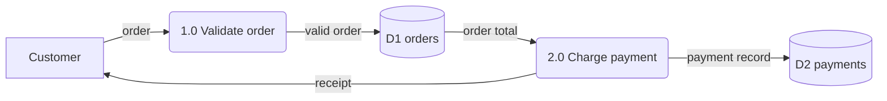
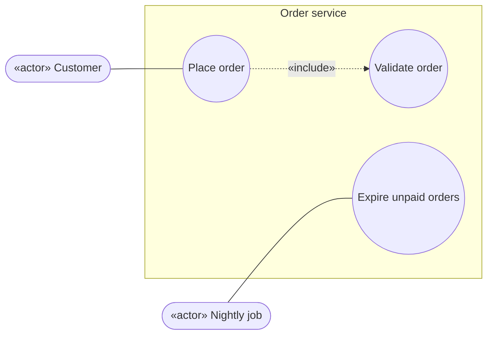
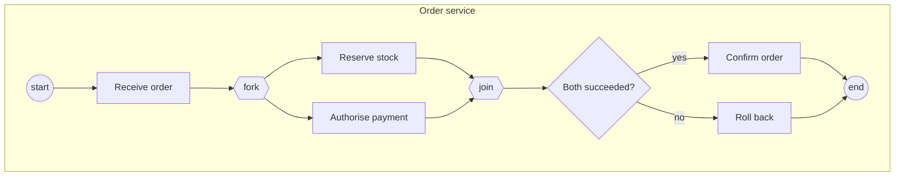
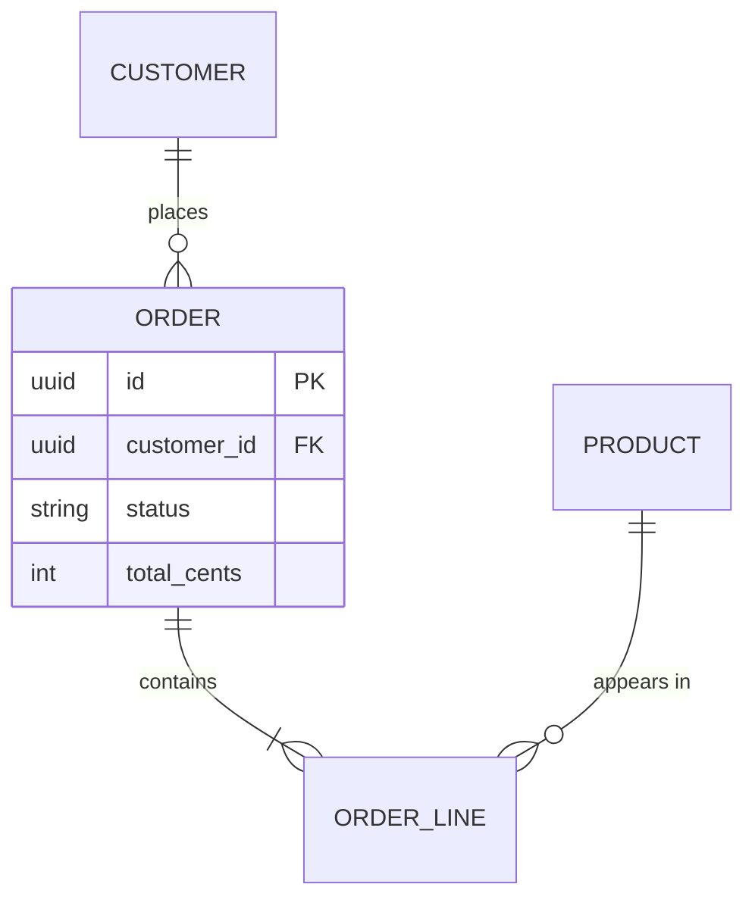
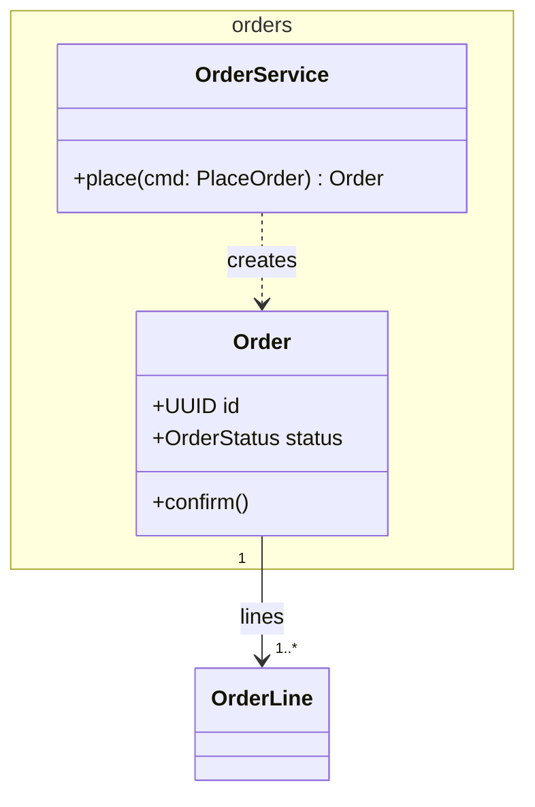
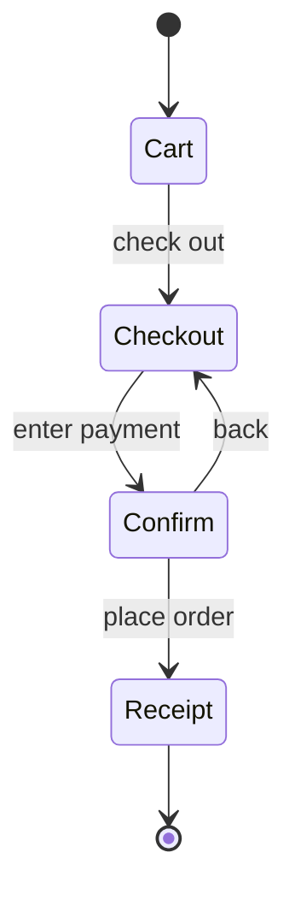
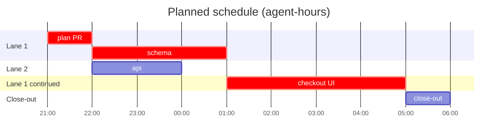
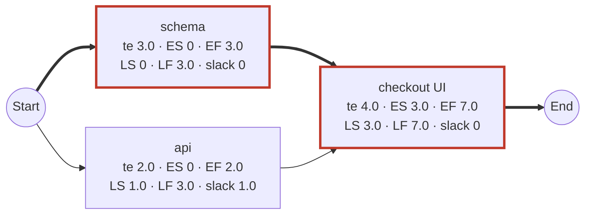

# SDLC Workflow

This repository uses **sdlc-overnight**, a Claude Code workflow that runs a milestone, feature or issue unattended. It goes through a reviewed plan, then one pull request per task, the local gate, CI and the critic, and merges when the maintainer has authorised it. The documentation is kept current at every step, and every commit explains why it exists. The repository's settings are in `.claude/sdlc-overnight.json`.

This page holds the conventions the agents follow and the reviewers check. How the workflow works, how to install it and every setting are in the template's own guide, the `README.md` and `config-reference.md` of the `sdlc-overnight` template.

## Running it

Ask Claude Code to run the `sdlc-overnight` workflow with arguments, for example:

```text
run the sdlc-overnight workflow with {"milestone": "docs/milestones/M3.md", "stopAt": "2026-10-11T07:00:00+02:00", "merge": true}
run the sdlc-overnight workflow with {"issue": 42, "planOnly": true}
```

`/workflows` shows progress. The run directory (`runDir` in the settings) holds `PLAN.md`, a timestamped `LOG.md` and the morning `REPORT.md`.

## The Project Workbook

The planner writes each run's planning record in `<workbookDir>/<slug>/`. Every page opens with a status banner: the workbook records the plan but binds nothing, and the contract wins any conflict.

| File | Deliverable | Diagrams |
|---|---|---|
| `README.md` | Project Workbook: deliverable register, correspondence log, change requests, review log, run rules | |
| `01-system-service-request.md` | System Service Request: requester, problem statement, service requirements, urgency, sponsorship | |
| `02-project-charter.md` | Project Charter: objectives, scope, stakeholders, assumptions, target dates, authorisation | |
| `03-requirements-specification.md` | Requirements (`R-F`, `R-N`, `R-D`), process logic | context and level-0 DFDs, use case, activity, ERD |
| `04-system-specification.md` | Architecture, decisions, physical data design, interface specifications, technology acquisition, test design | class, dialogue |
| `05-baseline-project-plan.md` | Scope statement, feasibility, management, resources, risks, work breakdown | Gantt, PERT/CPM |
| `tasks.json` | The task queue: one pull request per task | |
| `06-user-and-technical-documentation.md` | Where each user and technical document lives, finished by the close-out | |

## Documentation duty

The documents describe the system at every commit, not at the end:
1. **Before code:** the documents that describe the intended behaviour are updated and committed first.
2. **With code:** doc comments on every new or changed public item, with the why.
3. **At the end of a task:** the milestone row is ticked with a sentence on what was done. The workbook gets a correspondence-log entry, any change request, and the task's actual schedule.
4. **On every fix:** every document the fix makes stale is updated, and the round goes into the workbook's review log.

One home per fact: link to it, don't restate it.

## Commit messages

Each commit is one logical step that builds and passes its own tests: documents first, then tests with the code that makes them pass. Every message has this shape, and a separate auditor checks every commit before it is pushed:

```text
<area>: <imperative summary, at most 72 characters, no full stop>

Why: <the task id, requirement ids, decisions, or the review finding it answers>
What: <what changed, by file or module, and how>
Evidence: <tests added or run and their result; gate commands; measurements>
Docs: <documents updated, or "none, because <reason>">
Decisions: <choices made within the contract for the maintainer to check, or "none">

Co-Authored-By: ...
```

## Pull-request descriptions

Sections, in order: Summary; Why; What changed; Documentation updated; Test evidence (the gate as a table); the regression baseline, if the project has one; Decisions made within the contract (please check); Review rounds (one line per round: CI result, critic verdict, what was fixed or left and why). Every push after review updates the description.

## Diagram conventions

Every diagram is Mermaid in its own fenced block under its own heading.

| Diagram | Mermaid type | Rules |
|---|---|---|
| Data flow (context, level 0, level 1) | `flowchart LR` | External entity `["name"]`, process `("1.0 name")`, data store `[("D1 name")]`. Every process has an input and an output; no flow joins two stores or two entities; every flow is labelled; levels balance |
| Use case | `flowchart LR` | Actor `(["«actor» name"])`, use case `(("name"))` inside a `subgraph` system boundary, include/extend as labelled dotted edges |
| Activity / BPMN | `flowchart TD` | Start and end `(( ))`, decision `{ }`, fork and join `{{ }}`, swimlanes as subgraphs |
| Entity–relationship | `erDiagram` | Entities, attributes with keys, relationships with cardinality; business rules as a numbered list below |
| Class | `classDiagram` | Classes or types with attributes and operations, modules as namespaces, real inheritance only |
| Dialogue | `stateDiagram-v2` | Screens or prompts as states, user actions as transitions; an ASCII wireframe per screen beside it |
| Gantt | `gantt` | `dateFormat YYYY-MM-DD HH:mm`, hours, `after` for dependencies, `crit` on the critical path; actual bars added as tasks finish |
| PERT/CPM | `flowchart LR` | Start and End nodes, one node per task with te, ES–EF, LS–LF and slack; critical edges `==>` and class `crit` |

A label must not start with a number followed by a full stop and a space (`"1. Load"`): Mermaid reads it as a Markdown list. Write `"1.0 Load"` or `"Step 1: Load"`.
















